# Build a server side application using OAuth confidential clients with AD FS 2016 or later


AD FS 2016 and later releases provide support for clients capable of maintaining their own secret, such as an app or service running on a web server.  These clients are known as confidential clients.
Below is a schematic of a web application running on a web server and serving as a confidential client to AD FS:  

## Pre-requisites  
The following are a list of pre-requisites that are required prior to completing this document. This document assumes that AD FS has been installed.  

-   GitHub client tools  

-   AD FS in Windows Server 2016 TP4 or later  

-   Visual Studio 2013 or later.  

## Create an Application Group in AD FS 2016 or later
The following section describes how to configure the application group in AD FS 2016 or later.  

#### Create the Application Group  

1.  In AD FS Management, right-click on Application Groups and select **Add Application Group**.  

2.  On the Application Group Wizard, for the **Name** enter **ADFSOAUTHCC** and under **Client-Server applications** select the **Server application accessing a Web API** template.  Click **Next**.  

    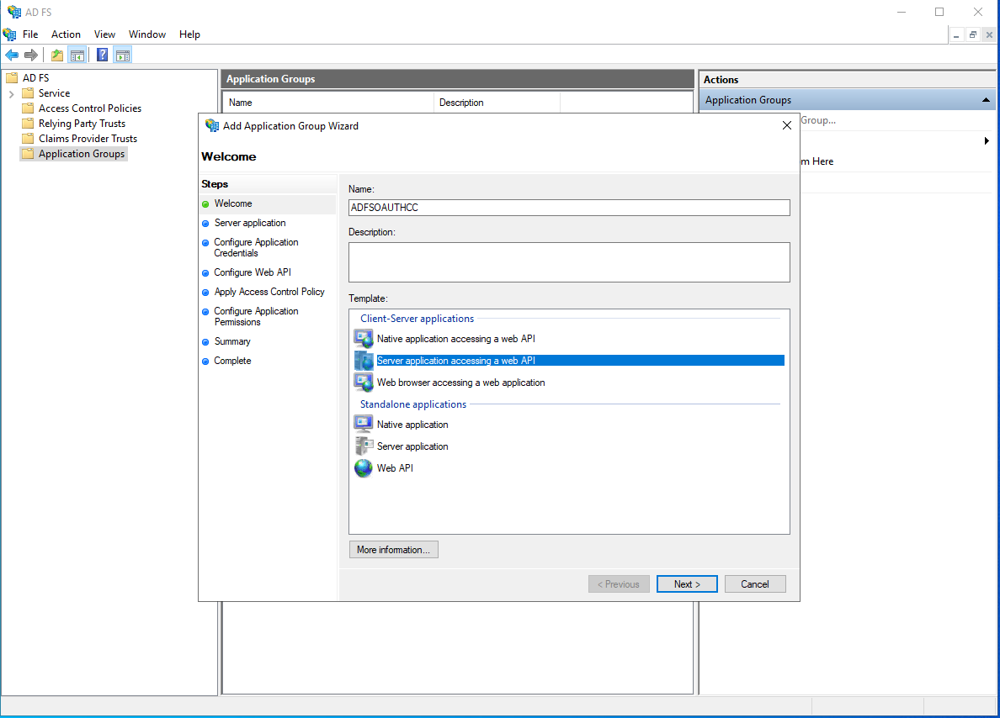  

3.  Copy the **Client Identifier** value.  It will be used later as the value for **ida:ClientId** in the applications web.config file.  

    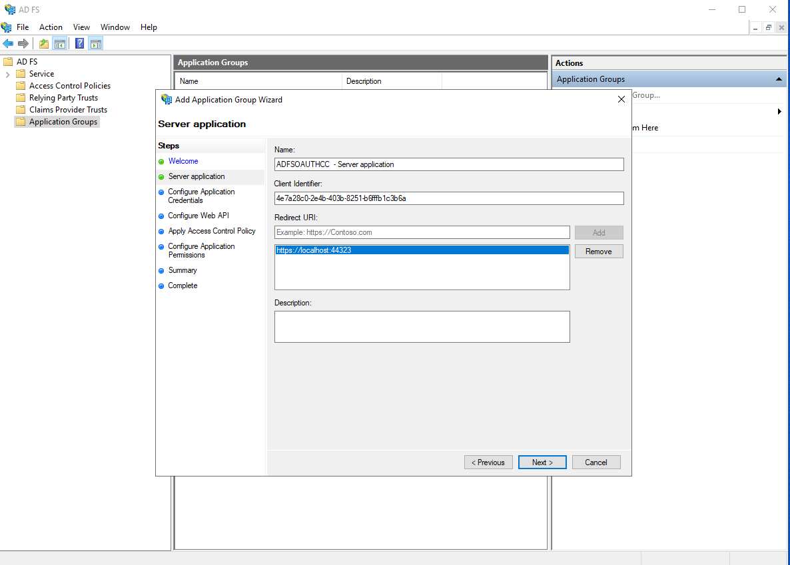  

4.  Enter the following for **Redirect URI:** - **https://localhost:44323**.  Click **Add**. Click **Next**.  

5.  On the **Configure Application Credentials** screen, place a check in **Generate a shared secret** and copy the secret.  This will be used later as the value for **ida:ClientSecret** in the applications web.config file.  Click **Next**.  

    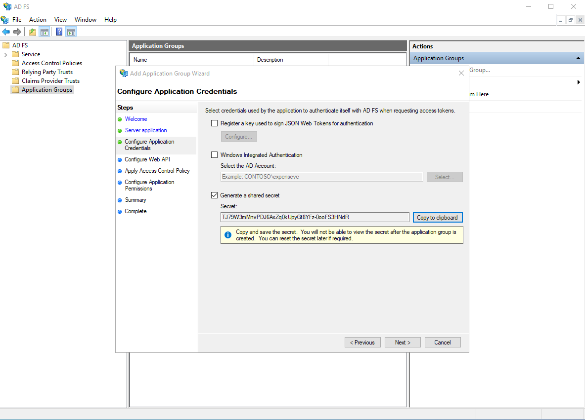   

6. On the **Configure Web API** screen, enter the following for **Identifier** - **https://contoso.com/WebApp**.  Click **Add**. Click **Next**.  This value will be used later for **ida:GraphResourceId** in the applications web.config file.  

    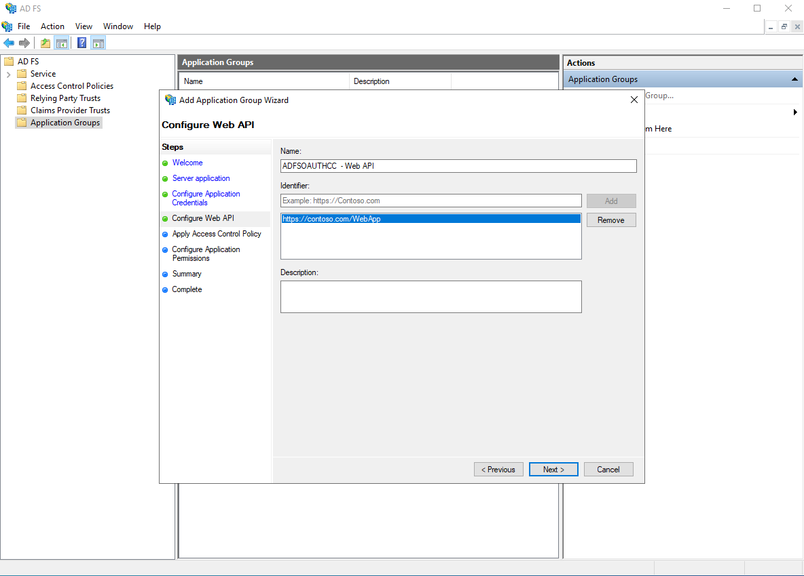  

7. On the **Apply Access Control Policy** screen, select **Permit everyone** and click **Next**.  

    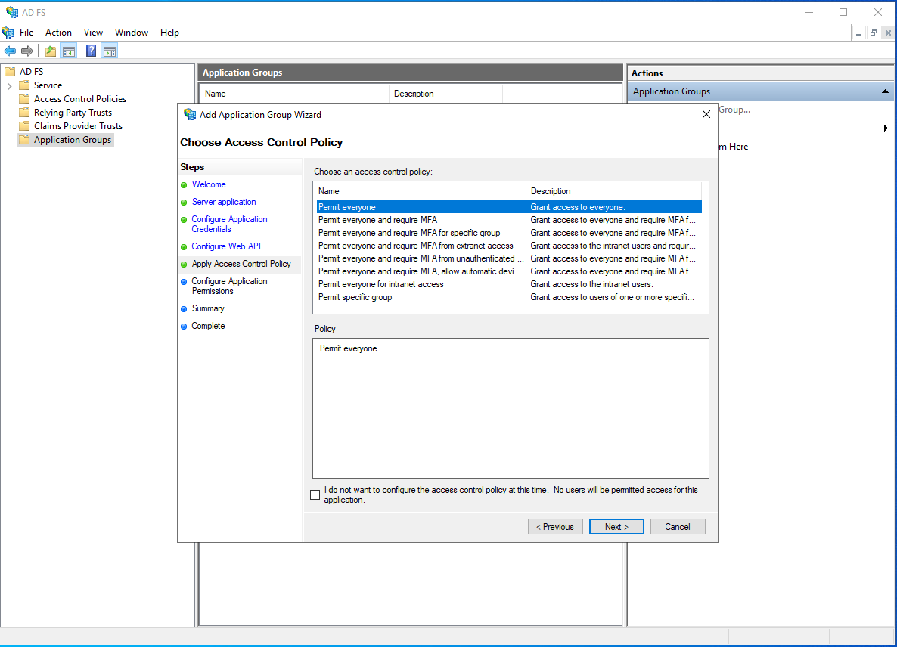  

8. On the **Configure Application Permissions** screen,  make sure **openid** and **user_impersonation** are selected and click **Next**.  

    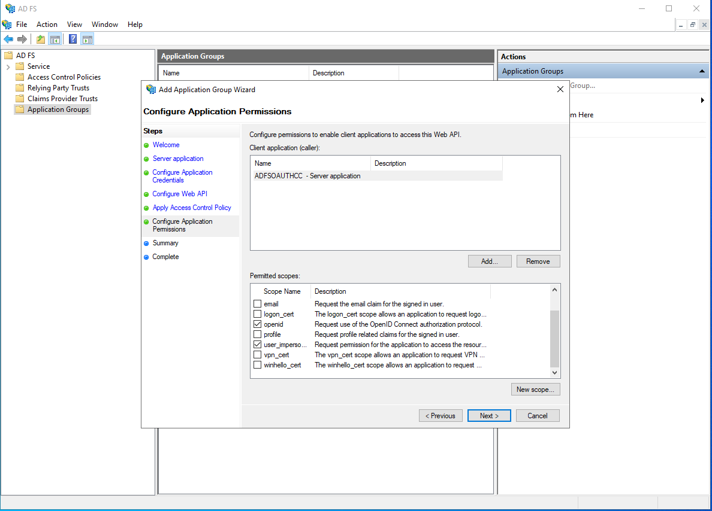  

9. On the **Summary** screen,  click **Next**.  

10. On the **Complete** screen,  click **Close**.  

## Upgrade the database  
Visual Studio 2015 was used in creating this walkthrough.   In order to get the example working with Visual Studio 2015 you will need to update the database file.  Use the following procedure to do this.  

This section discusses how to download the sample Web API and upgrade the database in Visual Studio 2015.   We will be using the Azure AD sample that is [here](https://github.com/Azure-Samples/active-directory-dotnet-webapp-webapi-oauth2-useridentity).  

To download the sample project, use Git Bash and type the following:  

```  
git clone https://github.com/Azure-Samples/active-directory-dotnet-webapp-webapi-oauth2-useridentity.git  
```  

  

#### To upgrade the database file  

1.  Open the project in Visual Studio, there will be a pop-up telling you that the app requires SQL Server 2012 Express or you will need to upgrade the database.  Click Ok.  

      

2.  Next compile the application by selecting Build -> Build Solution at the top.  This will restore all of the NuGet packages.  

    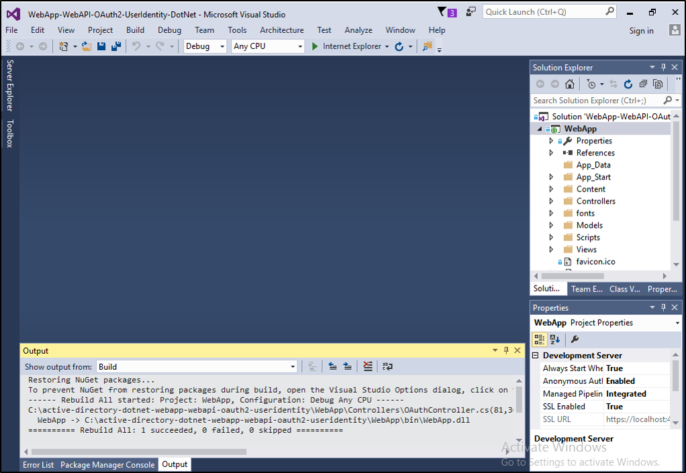  

3.  Now at the top, select **View** -> **Server Explorer**.  Once that opens, under **Data Connections**, right-click **DefaultConnection** and select **Modify Connection**.  

      

4.  On **Modify Connection**, under **Database file name (new or existing)**, select **Browse** and provide **path\filename.mdf**. Click **Yes** on the dialogue box.

    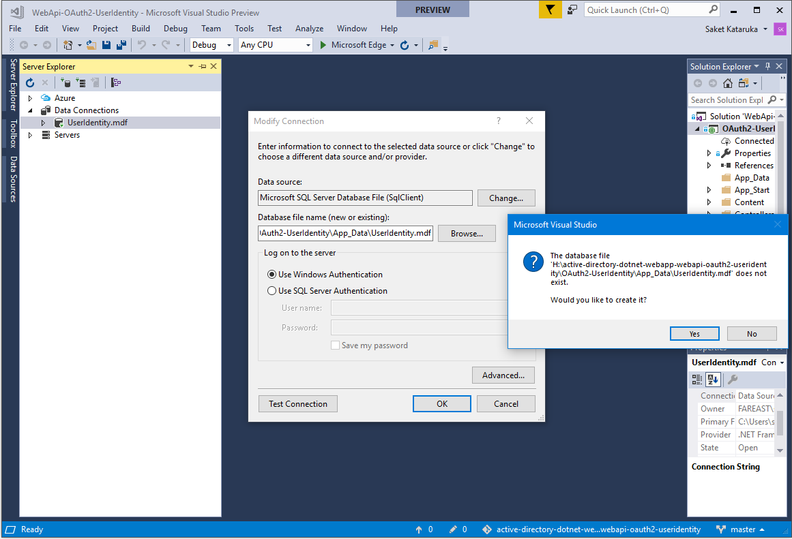

5.  On **Modify Connection**, select **Advanced**.  

    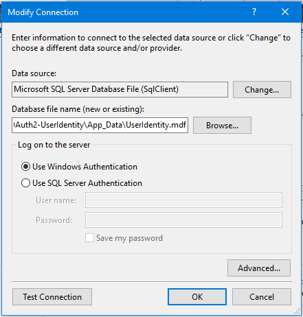  

6.  On the Advanced Properties, locate Data Source and use the drop-down to change it from **(LocalDb\v11.0)** to **(LocalDB)\MSSQLLocalDB**.  

    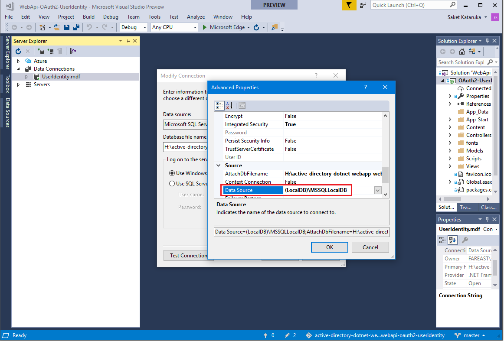  

7.  Click Ok. Click Ok.  Click Yes to upgrade the database.  

    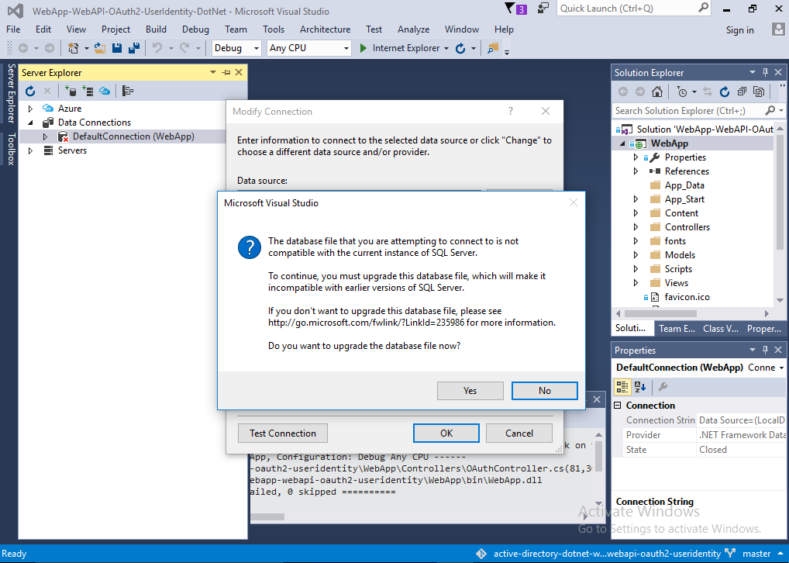  

8.  When this completes, over on the right, copy the value in the box next to **Connection String.**  

    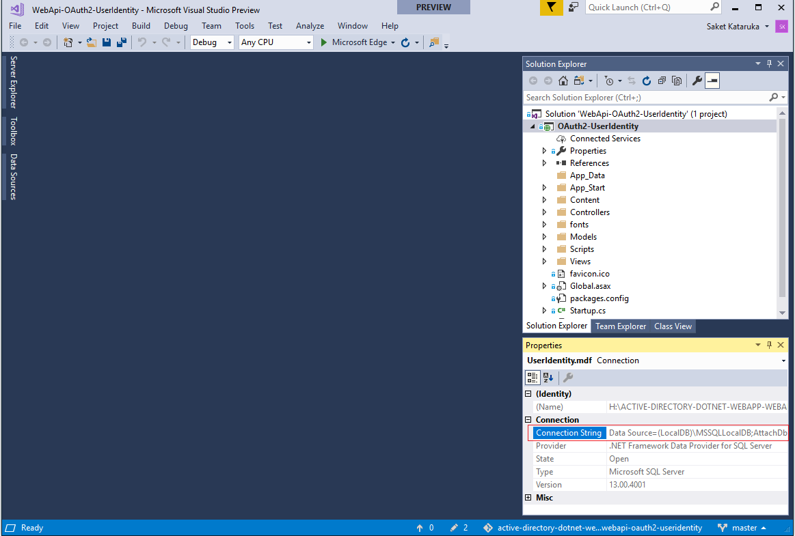  

9.  Now, open the Web.config file and replace the value that is in connectionString with the value you copied above.  Save the Web.config file.  

    > [!NOTE]  
    > The steps above are necessary so that we can get the new connectionString.  Otherwise, when we run Update-Database below it will error out.  

    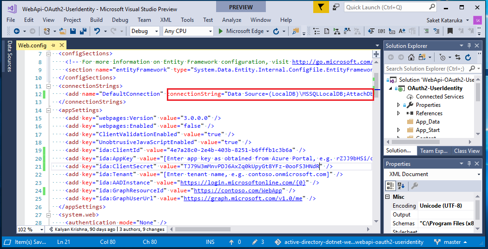  

10. At the top of Visual Studio, select **View** -> **Other Windows** -> **Package Manager Console**.  

    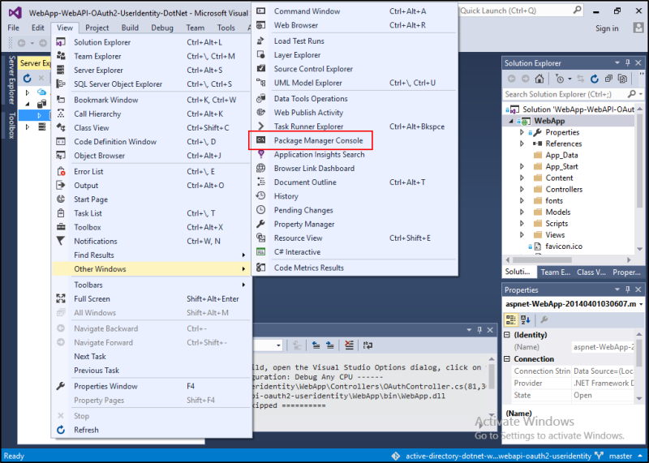  

11. At the bottom, in the Package Manager Console enter:  `Enable-Migrations` and hit enter.  

    > [!NOTE]  
    > If you get an error that says Enable-Migrations is not recognized as a cmdlet, enter Install-Package EntityFramework to update the EntityFramework.  

      

12. At the bottom, in the Package Manager Console enter:  `Add-Migration <anynamehere>` and hit enter.  

      

13. At the bottom, in the Package Manager Console enter:  `Update-Database` and hit enter.  

      

## Modify the WebApi in Visual Studio  

#### To Modify the Sample Web API  

1.  Open the sample using Visual Studio.  

2.  Open the web.config file.  Modify the following values:  

    -   ida:ClientId - enter the value from #3 in Create the Application Group section above.  

    -   ida:ClientSecret - enter the value from #5 in Create the Application Group section above.  

    -   ida:GraphResourceId - enter the value from #6 in Create the Application Group section above.  

    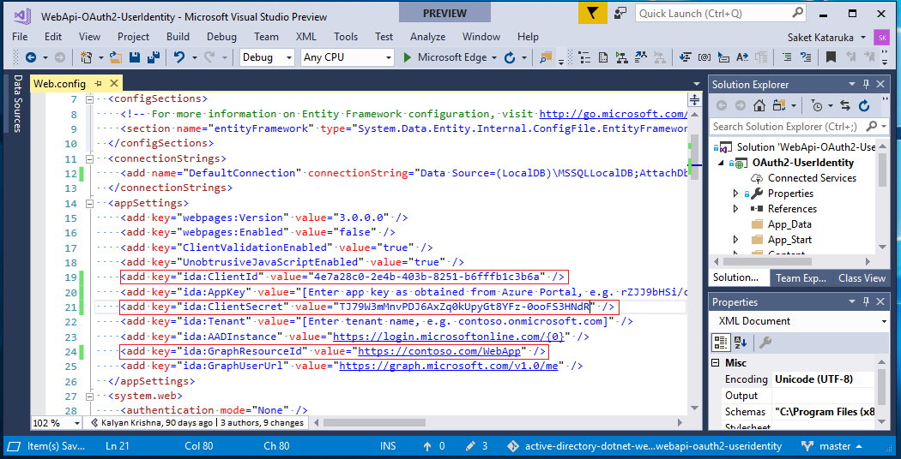  

3.  Open the Startup.Auth.cs file under App_Start and make the following changes:  

    -   Comment out the following lines:  

        ```  
        //private static string aadInstance = ConfigurationManager.AppSettings["ida:AADInstance"];  
        //private static string tenant = ConfigurationManager.AppSettings["ida:Tenant"];  
        //public static readonly string Authority = String.Format(CultureInfo.InvariantCulture, aadInstance, tenant);  
        ```  

    -   Add the following in it's place:  

        ```  
        public static readonly string Authority = "https://<your_fsname>/adfs";  
        ```  

        where <your_fsname> is replaced with the DNS portion of your federation service url, for example adfs.contoso.com  

        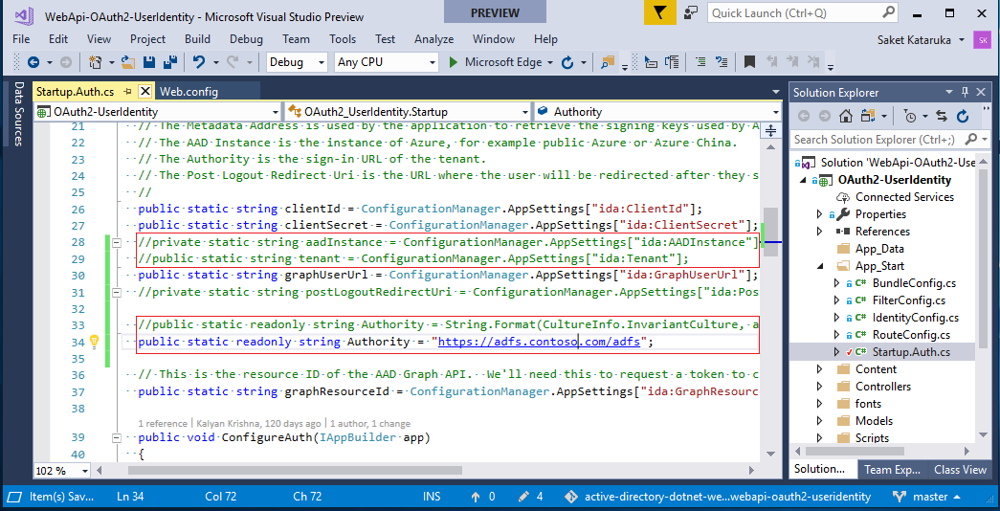  

4.  Open the UserProfileController.cs file and make the following changes:  

    -   Comment out the following:  

        ```  
        //authContext = new AuthenticationContext(Startup.Authority, new TokenDbCache(userObjectID));  
        ```  

    -   Replace both occurrences with the following:  

        ```  
        authContext = new AuthenticationContext(Startup.Authority, false, new TokenDbCache(userObjectID));  
        ```  

          

    -   Comment out the following:  

        ```  
        //authContext = new AuthenticationContext(Startup.Authority);  
        ```  

    -   Replace both occurrences with the following:  

        ```  
        authContext = new AuthenticationContext(Startup.Authority, false);  
        ```  

          

    -   Now comment out all instances of the following:  

        ```  
        Uri redirectUri = new Uri(Request.Url.GetLeftPart(UriPartial.Authority).ToString() + "/OAuth");  
        ```  

    -   Replace all occurrences with the following:  

        ```  
        Uri redirectUri = new Uri(Request.Url.GetLeftPart(UriPartial.Authority).ToString());  
        ```  

          

## Test the Solution  
In this section we will test the confidential client solution.  Use the following procedure to test the solution.  

#### Testing the confidential client solution  

1. At the top of Visual Studio, make sure Internet Explorer is selected and click the green arrow.  

     

2. Once the ASP.Net page comes up, click on **Register** on top right of the page.  Enter a username and password and then click **Register** button.  This creates a local account in the SQL database.  

   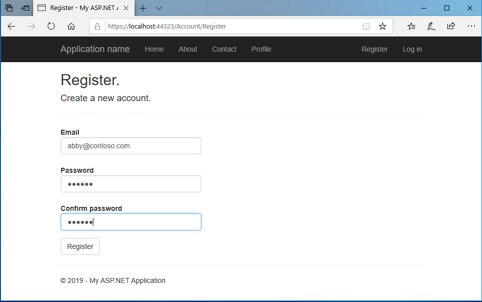  

3. Notice now, the ASP.NET site says Hello abby@contoso.com!.  Click **Profile**.  

   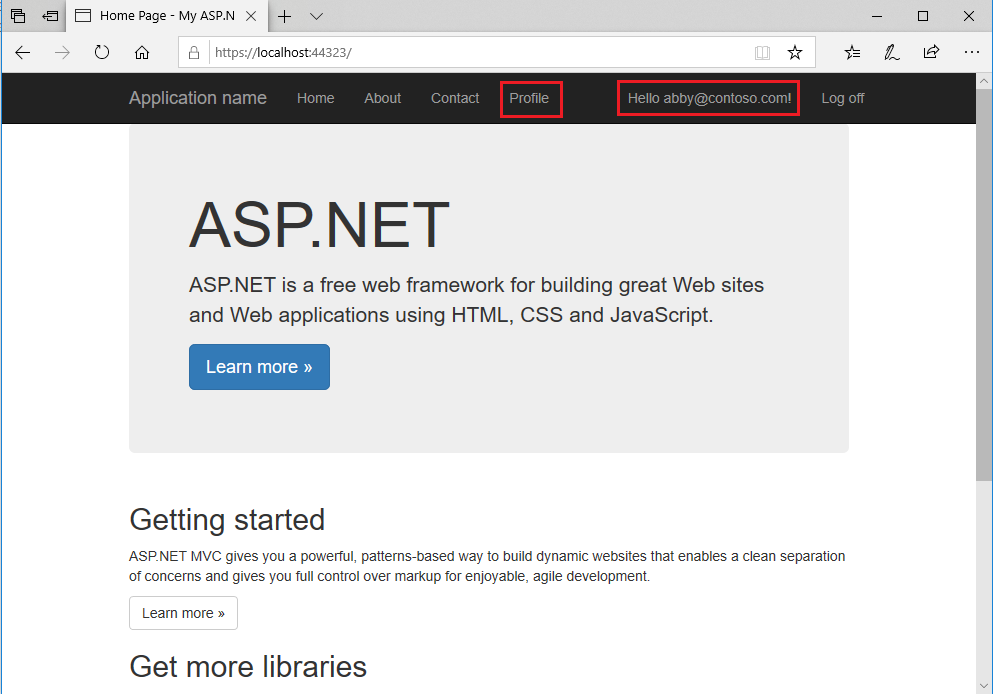  

4. This brings up a page without any information and says that we must click here to sign-in.  Click **here**.  

   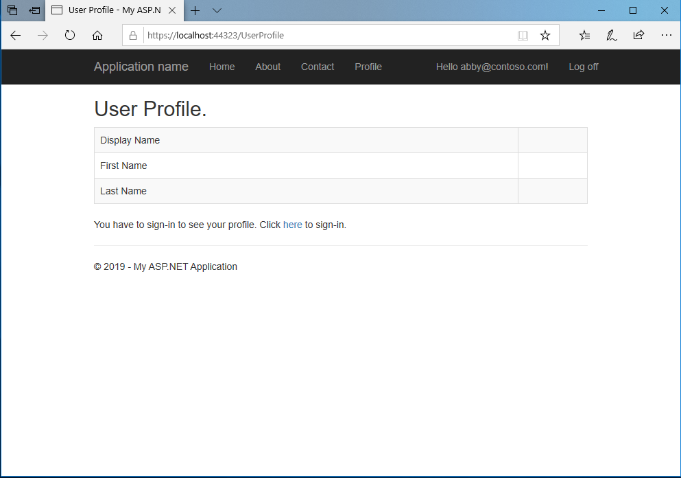  

5. You will now be prompted to sign-in to AD FS.  

   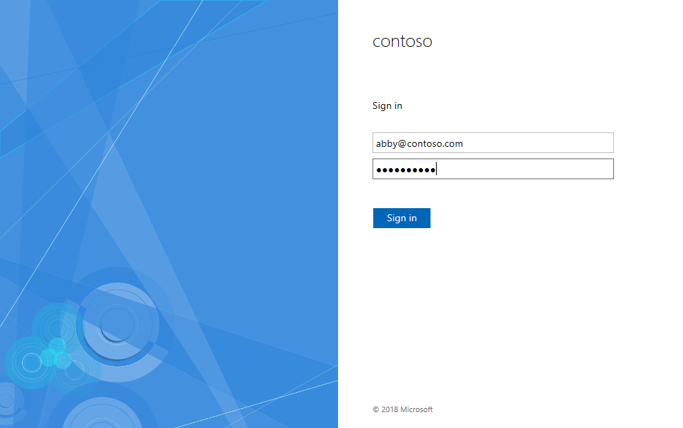  

## Next Steps
[AD FS Development](../../ad-fs/AD-FS-Development.md)  
