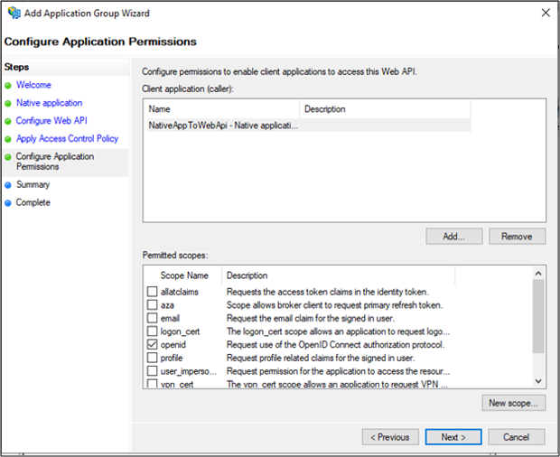
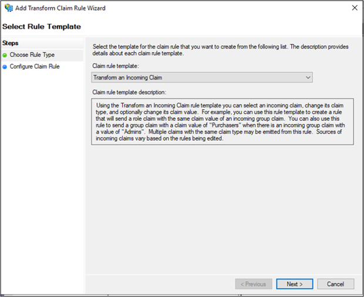
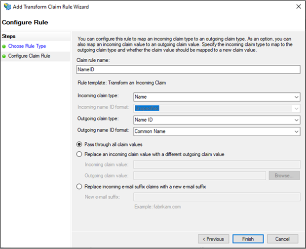
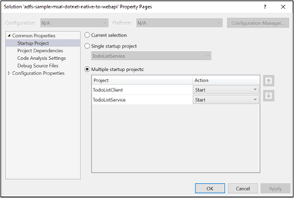

# Scenario: Native App calling Web API
>Applies to: Windows Server 2022, Windows Server 2019, AD FS 2019 and later

Learn how to build a native app signing-in users authenticated by AD FS 2019 and acquiring tokens using [MSAL library](https://github.com/AzureAD/microsoft-authentication-library-for-dotnet/wiki)  to call web APIs.

Before reading this article, you should be familiar with the [AD FS concepts](../ad-fs-openid-connect-oauth-concepts.md) and [Authorization code grant flow](../../overview/ad-fs-openid-connect-oauth-flows-scenarios.md#authorization-code-grant-flow)

## Overview

 

In this flow you add authentication to your Native App (public client), which can therefore sign in users and calls a Web API. To call a Web API from a Native App that signs in users, you can use MSAL's [AcquireTokenInteractive](/dotnet/api/microsoft.identity.client.ipublicclientapplication.acquiretokeninteractive#Microsoft_Identity_Client_IPublicClientApplication_AcquireTokenInteractive_System_Collections_Generic_IEnumerable_System_String__) token acquisition method. To enable this interaction, MSAL leverages a web browser.

To better understand how to configure a Native App in AD FS to acquire access token interactively, let's use a sample available [here](https://github.com/microsoft/adfs-sample-msal-dotnet-native-to-webapi) and walkthrough the app registration and code configuration steps.

## Pre-requisites

- GitHub client tools
- AD FS 2019 or later configured and running
- Visual Studio 2013 or later

## App Registration in AD FS
This section shows how to register the Native App as a public client and Web API as a Relying Party (RP) in AD FS

  1. In **AD FS Management**, right-click on **Application Groups** and select **Add Application Group**.

  2. On the Application Group Wizard, for the **Name** enter **NativeAppToWebApi** and under **Client-Server applications** select the **Native application accessing a Web API** template. Click **Next**.

      

  3. Copy the **Client Identifier** value. It will be used later as the value for **ClientId** in the application's **App.config** file. Enter the following for **Redirect URI:** https://ToDoListClient. Click **Add**. Click **Next**.

     

  4. On the Configure Web API screen, enter the **Identifier:** https://localhost:44321/. Click **Add**. Click **Next**. This value will be used later in the application's **App.config** and **Web.config** files.

     

  5. On the Apply Access Control Policy screen, select **Permit everyone** and click **Next**.

     

  6. On the Configure Application Permissions screen, make sure **openid** is selected and click **Next**.

     

  7. On the Summary screen, click **Next**.

  8. On the Complete screen, click **Close**.

  9. In AD FS Management, click on **Application Groups** and select **NativeAppToWebApi**         application group. Right-click and select **Properties**.

      

  10. On NativeAppToWebApi properties screen, select **NativeAppToWebApi – Web API** under **Web API** and click **Edit…**

      

  11. On NativeAppToWebApi – Web API Properties screen, select **Issuance Transform Rules** tab and click **Add Rule…**

      

  12. On Add Transform Claim Rule Wizard, select **Transform an Incoming Claim** from the **Claim rule template:** dropdown and click **Next**.

      

  13. Enter **NameID** in **Claim rule name:** field. Select **Name** for **Incoming claim type:**, **Name ID** for **Outgoing claim type:** and **Common Name** for **Outgoing name ID format:**. click **Finish**.

      

  14. Click OK on NativeAppToWebApi – Web API Properties screen and then NativeAppToWebApi Properties screen.

## Code Configuration
This section shows how to configure a Native App to sign-in user and retrieve token to call the Web API

1. Download the sample from [here](https://github.com/microsoft/adfs-sample-msal-dotnet-native-to-webapi)

2. Open the sample using Visual Studio

3. Open the App.config file. Modify the following:
   - ida:Authority - enter h`ttps://[your AD FS hostname]/adfs`
   - ida:ClientId - enter the **Client Identifier** value from #3 in App Registration in AD FS section above.
   - ida:RedirectUri - enter the **Redirect URI** value from #3 in App Registration in AD FS section above.
   - todo:TodoListResourceId – enter the **Identifier** value from #4 in App Registration in AD FS section above
   - ida: todo:TodoListBaseAddress - enter the **Identifier** value from #4 in App Registration in AD FS section above.

     

 4. Open the Web.config file. Modify the following:
    - ida:Audience - enter the **Identifier** value from #4 in App Registration in AD FS section above
    - ida: AdfsMetadataEndpoint - enter `https://[your AD FS hostname]/federationmetadata/2007-06/federationmetadata.xml`

      

## Test the sample
This section shows how to test the sample configured above.

  1. Once the code changes are made rebuild the solution

  2. On Visual Studio, right click on solution and select **Set StartUp Projects…**

     

  3. On the Properties pages make sure **Action** is set to **Start** for each of the Projects

     

  4. At the top of Visual Studio, click the green arrow.

     

  5. On the Native App's Main screen, click on **Sign In**.

     

   If you don't see the native app screen, search and remove `*msalcache.bin` files from the folder where project repo is saved on your system.

  1. You will be re-directed to the AD FS sign-in page. Go ahead and sign in.

      

  2. Once signed-in, enter text **Build Native App to Web Api** in the **Create a To Do item**. Click **Add item**.  This will call the **To Do List Service (Web API)** and add the item in the cache.

       

## Next Steps
[AD FS OpenID Connect/OAuth flows and Application Scenarios](../../overview/ad-fs-openid-connect-oauth-flows-scenarios.md)
