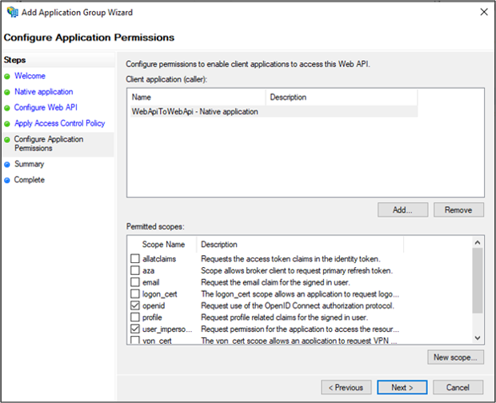
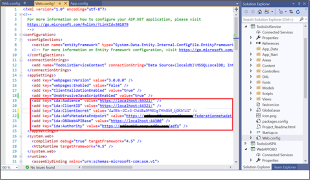

# Scenario: Web API calling Web API (On Behalf Of Scenario) 
> Applies To: AD FS 2019 and later 
 
Learn how to build a Web API calling another Web API On Behalf Of the user.  
 
Before reading this article, you should be familiar with the [AD FS concepts](../ad-fs-openid-connect-oauth-concepts.md) and [On-Behalf_Of flow](../../overview/ad-fs-openid-connect-oauth-flows-scenarios.md#on-behalf-of-flow)

## Overview 

- A client (Web App) - not represented on the diagram below - calls a protected Web API and provides a JWT bearer token in its "Authorization" Http header. 
- The protected Web API validates the token and uses the MSAL [AcquireTokenOnBehalfOf](https://docs.microsoft.com/dotnet/api/microsoft.identitymodel.clients.activedirectory.authenticationcontext.acquiretokenasync?view=azure-dotnet#Microsoft_IdentityModel_Clients_ActiveDirectory_AuthenticationContext_AcquireTokenAsync_System_String_Microsoft_IdentityModel_Clients_ActiveDirectory_ClientCredential_Microsoft_IdentityModel_Clients_ActiveDirectory_UserAssertion_) method to request (from AD FS) another token so that it can, itself, call a second web API (named the downstream web API) on behalf of the user. 
- The protected web API uses this token to call a downstream API. It can also call AcquireTokenSilentlater to request tokens for other downstream APIs (but still on behalf of the same user). AcquireTokenSilent refreshes the token when needed.  
 
     
 
To better understand how to configure on behalf of auth scenario in ADFS, let's use a sample available [here](https://github.com/microsoft/adfs-sample-msal-dotnet-webapi-to-webapi-onbehalfof) and walkthrough the app registration and code configuration steps.  
 
## Pre-requisites 

- GitHub client tools 
- AD FS 2019 or later configured and running 
- Visual Studio 2013 or later 
 
## App Registration in AD FS 

This section shows how to register the Native App as a public client and Web APIs as Relying Parties (RP) in AD FS 

  1. In AD FS Management, right-click on **Application Groups** and select **Add Application Group**.  
  
  2. On the Application Group Wizard, for the **Name** enter **WebApiToWebApi** and under **Client-Server applications** select the **Native application accessing a Web API** template. Click **Next**.

      

  3. Copy the **Client Identifier** value. It will be used later as the value for **ClientId** in the application's **App.config** file. Enter the following for **Redirect URI:** - https://ToDoListClient. Click **Add**. Click **Next**. 
  
      
  
  4. On the Configure Web API screen, enter the **Identifier:** https://localhost:44321/. Click **Add**. Click **Next**. This value will be used later in the application's **App.config** and **Web.Config** files.  
 
      

  5. On the Apply Access Control Policy screen, select **Permit everyone** and click **Next**. 
  
        

  6. On the Configure Application Permissions screen, select **openid** and **user_impersonation**. Click **Next**.  
  
        

  7. On the Summary screen, click **Next**. 

  8. On the Complete screen, click **Close**. 

  9. In AD FS Management, click on **Application Groups** and select **WebApiToWebApi** application group. Right-click and select **Properties**. 
  
        

  10. On WebApiToWebApi properties screen, click **Add application…**. 
  
      

  11. Under Standalone applications, select **Server application**.  
  
      

  12. On Server Application screen, add https://localhost:44321/ as the **Client Identifier** and **Redirect URI**. 
  
      

  13. On Configure Application Credentials screen, select **Generate a shared secret**. Copy the secret for later use.
  
      

  14. On the Summary screen, click **Next**. 

  15. On the Complete screen, click **Close**. 

  16. In AD FS Management, click on **Application Groups** and select **WebApiToWebApi** application group. Right-click and select **Properties**. 
  
      

  17. On WebApiToWebApi properties screen, click **Add application…**. 
  
      

  18. Under Standalone applications, select **Web API**. 
  
        

  19. On Configure Web API, add https://localhost:44300 as the **Identifier**.  
  
      

  20. On the Apply Access Control Policy screen, select **Permit everyone** and click **Next**. 
  
      

  21. On the Configure Application Permissions screen, click **Next**. 
  
      

  22. On the Summary screen, click **Next**.

  23. On the Complete screen, click **Close**.  

  24. Click OK on WebApiToWebApi – Web API 2 Properties screen  

  25. On WebApiToWebApi Properties screen, select **WebApiToWebApi – Web API** and click **Edit…**.  
  
      

  26. On WebApiToWebApi – Web API Properties screen, select **Issuance Transform Rules** tab and click **Add Rule…**. 
  
      

  27. On Add Transform Claim Rule Wizard, select **Send Claims Using a Custom Rule** from dropdown and click **Next**. 
  
      

  28. Enter **PassAllClaims** in **Claim rule name:** field and **x:[] => issue(claim=x);** claim rule in Custom rule: field and click Finish.  
   
      

  29. Click OK on WebApiToWebApi – Web API Properties screen

  30. On WebApiToWebApi Properties screen, select select WebApiToWebApi – Web API 2 and click Edit…  
  

  31. On WebApiToWebApi – Web API 2 Properties screen, select Issuance Transform Rules tab and click Add Rule… 

  32. On Add Transform Claim Rule Wizard, select Send Claims Using a Custom Rule from dopdown and click Next 
  

  33. Enter PassAllClaims in Claim rule name: field and **x:[] => issue(claim=x);** claim rule in **Custom rule:** field and click **Finish**.  
   
      

  34.  Click OK on WebApiToWebApi – Web API 2 Properties screen and then on WebApiToWebApi Properties screen.  
 

## Code Configuration 

This section shows how to configure a Web API to call another Web API 

  1. Download the sample from [here](https://github.com/microsoft/adfs-sample-msal-dotnet-webapi-to-webapi-onbehalfof)  
  
  2. Open the sample using Visual Studio 
  
  3. Open the App.config file. Modify the following: 
       - ida:Authority - enter https://[your AD FS hostname]/adfs/
       - ida:ClientId - enter the value from #3 in App Registration in AD FS section above. 
       - ida:RedirectUri - enter the value from #3 in App Registration in AD FS section above. 
       - todo:TodoListResourceId – enter the Identifier value from #4 in App Registration in AD FS section above 
       - ida: todo:TodoListBaseAddress - enter the Identifier value from #4 in App Registration in AD FS section above. 
      
            

  4. Open the Web.config file under ToDoListService. Modify the following: 
       - ida:Audience - enter the Client Identifier value from #12 in App Registration in AD FS section above
       - ida:ClientId - enter the Client Identifier value from #12 in App Registration in AD FS section above. 
       - Ida: ClientSecret - enter the shared secret copied from #13 in App Registration in AD FS section above.
       - ida:RedirectUri - enter the RedirectUri value from #12 in App Registration in AD FS section above. 
       - ida: AdfsMetadataEndpoint - enter https://[your AD FS hostname]/federationmetadata/2007-06/federationmetadata.xml 
       - ida:OBOWebAPIBase - enter the Identifier value from #19 in App Registration in AD FS section above. 
       - ida:Authority - enter https://[your AD FS hostname]/adfs 
  
           

 5. Open the Web.config file under WebAPIOBO. Modify the following: 
       - ida: AdfsMetadataEndpoint - enter https://[your AD FS hostname]/federationmetadata/2007-06/federationmetadata.xml 
       - ida:Audience - enter the Client Identifier value from #12 in App Registration in AD FS section above 
 
          
 
## Test the sample 

This section shows how to test the sample configured above. 

Once the code changes are made rebuild the solution 
 
  1. On Visual Studio, right click on solution and select **Set StartUp Projects…** 
      
      

  2. On the Properties pages make sure **Action** is set to **Start** for each of the Projects, except TodoListSPA.  
  
      
  
  3. At the top of Visual Studio, click the green arrow.  
  
      

  4. On the Native App's Main Screen, click on **Sign In**. 
  
      

     If you don't see the native app screen, search and remove *msalcache.bin files from the folder where project repo is saved on your system. 
  
  5. You will be re-directed to the AD FS sign-in page. Go ahead and sign in. 
  
      

  6. Once signed-in, enter text Web Api to Web Api Call in the **Create a To Do item**. Click **Add item**.  This will call the Web API (To Do List Service) which then calls Web API 2 (WebAPIOBO) and adds the item in the cache.  
 
      
 
 ## Next Steps
[AD FS OpenID Connect/OAuth flows and Application Scenarios](../../overview/ad-fs-openid-connect-oauth-flows-scenarios.md)
 
 
