# Scenario: Web app (server app) calling web APIs 
>Applies To: AD FS 2019 or later 
 
Learn how to build a web app signing-in users authenticated by AD FS 2019 and acquiring tokens using [MSAL library](https://github.com/AzureAD/microsoft-authentication-library-for-dotnet/wiki) to call web APIs.  
 
Before reading this article, you should be familiar with the [AD FS concepts](adfs-modern-auth-concepts.md)
 
## Overview 
 

You add authentication to your Web App, which can therefore sign in users and calls a web API. From the Web App, to call the Web API on behalf of the user, use MSAL’s AcquireTokenByAuthorizationCode token acquisition method. You'll use the Authorization code flow, storing the acquired token in the token cache. Then the controller will acquire tokens silently from the cache when needed. MSAL refreshes the token if needed. 

Web Apps that calls Web APIs: 

- are confidential client applications. 
- that's why they've registered a secret (application shared secret, certificate or AD account) with AD FS. This secret is passed-in during the call to AD FS to get a token.  

> [!NOTE] 
> Adding sign-in to a Web App does not use the MSAL libraries as this is about protecting the Web App. Protecting libraries is achieved by libraries named Middleware.  
>
> When calling web APIs from a Web App, you will need to get access tokens for these web APIs. You can use MSAL libraries to acquire these tokens.  
 
To better understand how to register a Web App in ADFS and to configure it to acquire tokens to call a Web API, let’s use a sample Web App available here Add github link and walkthrough the app registration and code configuration steps.  
 
## Pre-requisites 

- GitHub client tools 
- AD FS 2019 or later configured and running 
- Visual Studio 2013 or later 
 
## App Registration in AD FS 
This section shows how to register the Web App as a confidential client and Web API as a Relying Party (RP) in AD FS. 

  1. In AD FS Management, right-click on **Application Groups** and select **Add Application Group**.  
  2. On the Application Group Wizard, for the Name enter WebAppToApi and under Client-Server applications select the Server application accessing a Web API template. Click Next.  
  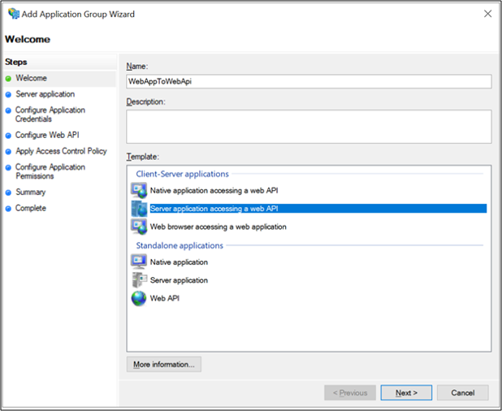
  
  3. Copy the Client Identifier value. It will be used later as the value for ida:ClientId in the applications web.config file. Enter the following for Redirect URI: - https://localhost:44326. Click Add. Click Next. 
  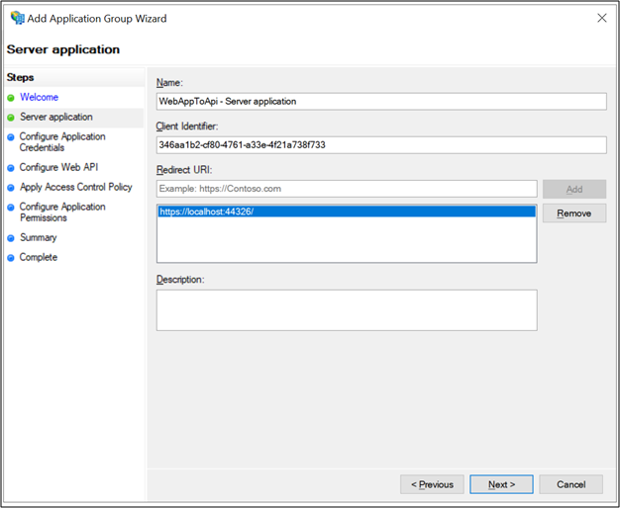
  
  4. On the Configure Application Credentials screen, place a check in Generate a shared secret and copy the secret. This will be used later as the value for ida:ClientSecret in the applications web.config file. Click Next.  
  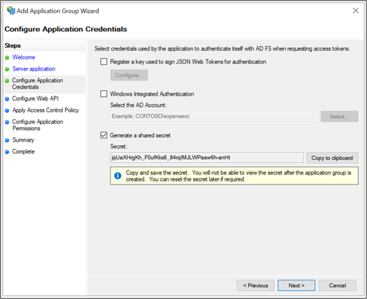
  
  5. On the Configure Web API screen, enter the Identifier - https://webapi. Click Add. Click Next. This value will be used later for ida:GraphResourceId in the applications web.config file. 
  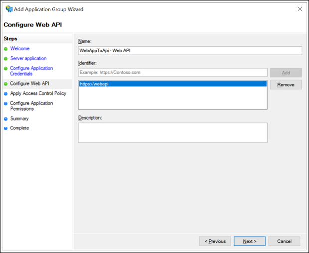
  
  6. On the Apply Access Control Policy screen, select Permit everyone and click Next. 
  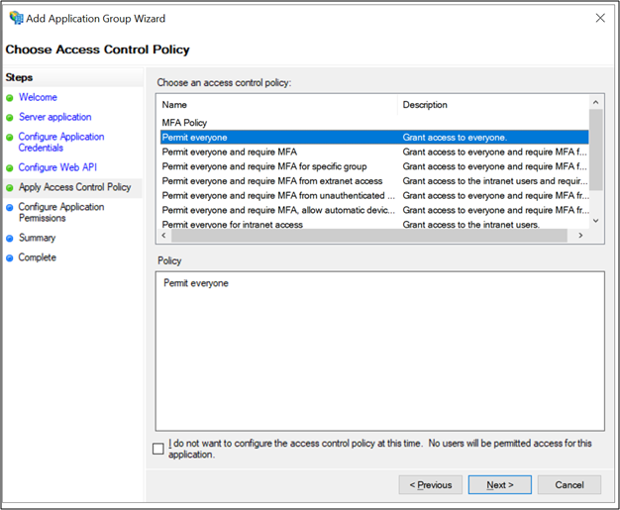
  
  7. On the Configure Application Permissions screen, make sure openid and user_impersonation are selected and click Next. 
  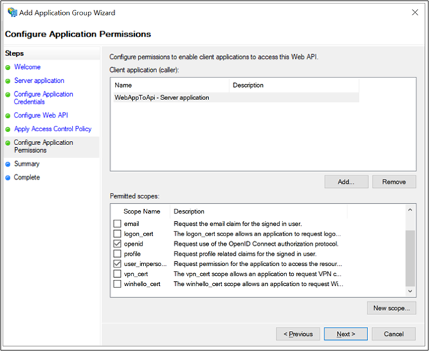
  
  8. On the Summary screen, click Next. 
  9. On the Complete screen, click Close.

## Code Configuration 
This section shows how to configure a ASP.NET Web App to sign-in user and retrieve token to call the Web API 

  1. Download the sample from here Add link  
  2. Open the sample using Visual Studio 
  3. Open the web.config file. Modify the following: 
   - ida:ClientId - enter the value from #3 in App Registration in AD FS section above. 
   - ida:ClientSecret - enter the value from #4 in App Registration in AD FS section above. 
   - ida:RedirectUri - enter the value from #3 in App Registration in AD FS section above. 
   - ida:Authority - enter https://[your AD FS hostname]/adfs. E.g., https://adfs.contoso.com/adfs 
   - ida:Resource - enter the value from #5 in App Registration in AD FS section above. 
  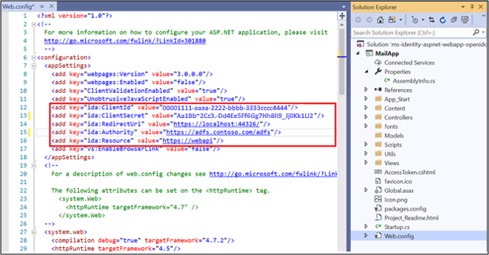
 
 
### Test the sample 
This section shows how to test the sample configured above. 

  1. Once the code changes are made rebuild the solution 
  2. At the top of Visual Studio, make sure Internet Explorer is selected and click the green arrow. 
  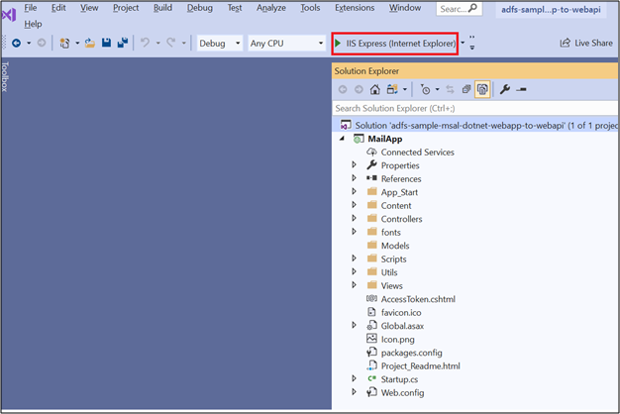

  3. On Home Page, click on Sign-in. 
  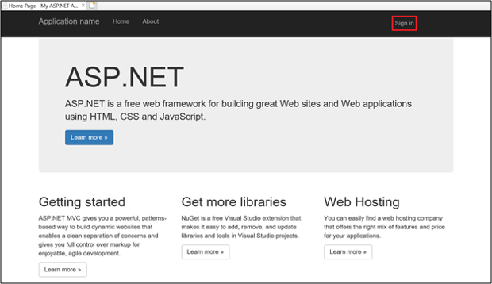

  4. You will be re-directed to the AD FS sign-in page. Go ahead and sign in. 
  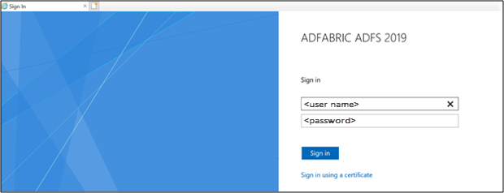

  5. Once signed-in, click on Access Token.  
  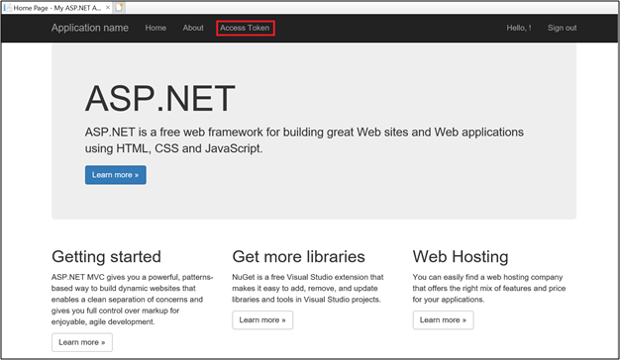

  6. Clicking on Access Token will get the access token info by calling the Web API 
  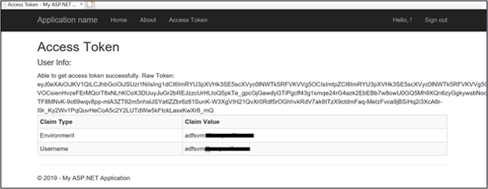
 
 
 