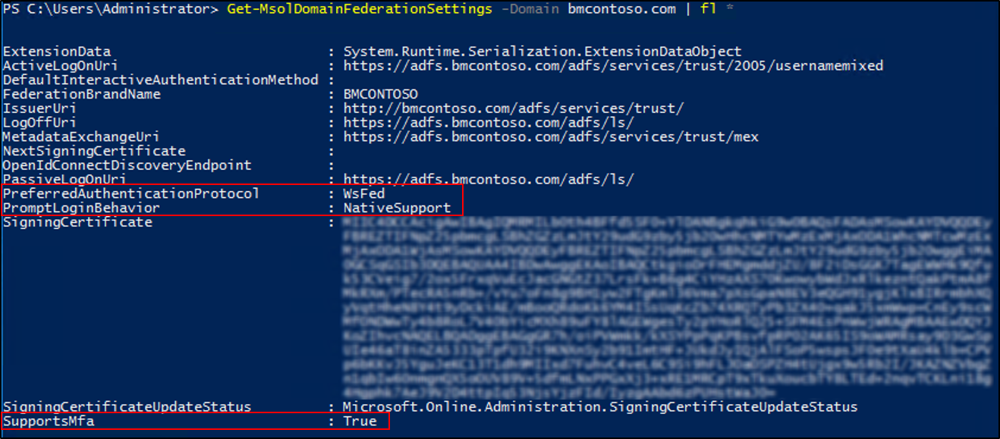

# Active Directory Federation Services prompt=login parameter support

The following document describes the native support for the prompt=login parameter that is available in AD FS.

## What is prompt=login?

When applications need to request fresh authentication from Azure AD, meaning that they need Azure AD to re-authenticate the user even if the user has already been authenticated, they can send the `prompt=login` parameter to Azure AD as part of the authentication request.

When this request is for a federated user, Azure AD needs to inform the IdP, like AD FS, that the request is for fresh authentication.

By default, Azure AD translates `prompt=login` to `wfresh=0` and `wauth=https://schemas.microsoft.com/ws/2008/06/identity/authenticationmethod/password` when sending this type of authentication requests to the federated IdP.

These parameters mean:

- `wfresh=0`: do fresh authentication
- `wauth=https://schemas.microsoft.com/ws/2008/06/identity/authenticationmethod/password`: use username/password for the fresh authentication request

This can cause problems with corporate intranet and multi-factor authentication scenarios in which an authentication type other than username and password, as  requested by the `wauth` parameter, is desired.  

AD FS in Windows Server 2012 R2 with the July 2016 update rollup introduced native support for the `prompt=login` parameter. This means that now Azure AD can send this parameter as-is to AD FS service as part of Azure AD and Office 365 authentication requests.

## AD FS versions that support prompt=login

The following is a list of AD FS versions that support the `prompt=login` parameter.

- AD FS in Windows Server 2012 R2 with the July 2016 update rollup
- AD FS in Windows Server 2016

## How to configure a federated domain to send prompt=login to AD FS

Use the Azure AD PowerShell module to configure the setting.

> [!NOTE]
> The `prompt=login` capability (enabled by the `PromptLoginBehavior` property) is currently available only in the [version 1.0 of the Azure AD Powershell module](https://connect.microsoft.com/site1164/Downloads/DownloadDetails.aspx?DownloadID=59185), in which the cmdlets have names that include “Msol”, such as Set-MsolDomainFederationSettings.  It is not currently available via ‘version 2.0' of the Azure AD PowerShell module, whose cmdlets have names like “Set-AzureAD\*”.

1. First obtain the current values of `PreferredAuthenticationProtocol`, `SupportsMfa`, and `PromptLoginBehavior` for the federated domain by running the following PowerShell command:

```powershell
    Get-MsolDomainFederationSettings -DomainName <your_domain_name> | Format-List *
```

> [!NOTE]
> The output of `Get-MsolDomainFederationSettings` by default does not display certain properties in the console. To view all the properties you should pipe (`|`) its output to `Format-List *` to force the output of all the properties of the object.



> [!NOTE]
> If the value of the property `PromptLoginBehavior` is empty (`$null`) the behavior of `TranslateToFreshPasswordAuth` is used.

2. Configure the desired value of `PromptLoginBehavior` by running the following command:

```powershell
    Set-MsolDomainFederationSettings –DomainName <your_domain_name> -PreferredAuthenticationProtocol <current_value_from_step1> -SupportsMfa <current_value_from_step1> -PromptLoginBehavior <TranslateToFreshPasswordAuth|NativeSupport|Disabled>
```

Following are the possible values of `PromptLoginBehavior` parameter and their meaning:

- **TranslateToFreshPasswordAuth**: means the default Azure AD behavior of translating `prompt=login` to `wauth=https://schemas.microsoft.com/ws/2008/06/identity/authenticationmethod/password` and `wfresh=0`.
- **NativeSupport**: means that the `prompt=login` parameter will be sent as is to AD FS. This is the recommended value if AD FS is in Windows Server 2012 R2 with the July 2016 update rollup or higher.
- **Disabled**: means that only `wfresh=0` is sent to AD FS.
