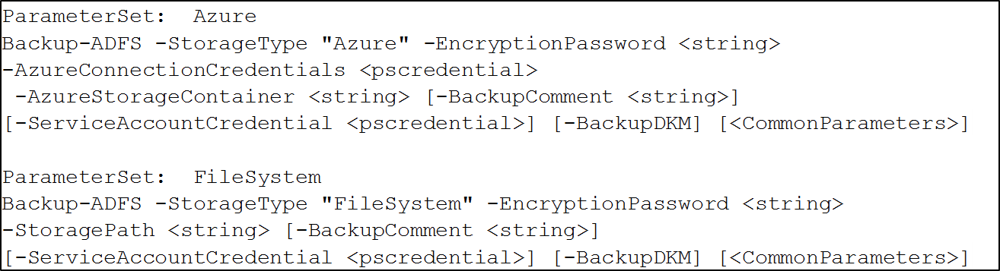
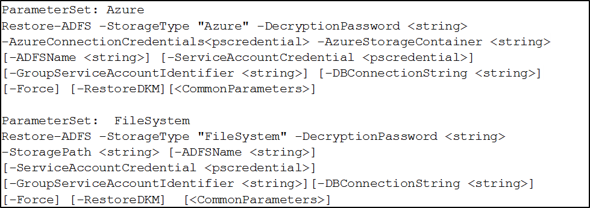

# AD FS Rapid Restore Tool

## Overview
Today AD FS is made highly available by setting up an AD FS farm. Some organizations would like a way to have a single server AD FS deployment, eliminating the need for multiple AD FS servers and network load balancing infrastructure, while still having some assurance that service can be restored quickly if there is a problem.
The new AD FS Rapid Restore tool provides a way to restore AD FS data without requiring a full backup and restore of the operating system or system state. You can use the new tool to export AD FS configuration either to Azure or to an on-premises location.  Then you can apply the exported data to a fresh AD FS installation, re-creating or duplicating the AD FS environment. 

## Scenarios
The AD FS Rapid Restore tool can be used in the following scenarios:

1. Quickly restore AD FS functionality after a problem
	- Use the tool to create a cold standby installation of AD FS that can be quickly deployed in place of the online AD FS server
2. Deploy identical test and production environments
	- Use the tool to quickly create an accurate copy of the production AD FS in a test environment, or to quickly deploy a validated test configuration to production

>[!NOTE] 
>If you are using SQL Merge Replication or Always on Availablity Groups, the Rapid Restore tool is not supported. We recommend using SQL based backups and a backup of the SSL certificate as an alternative.

## What is backed up
The tool backs up the following AD FS configuration
	
- AD FS configuration database (SQL or WID)
- Configuration file (located in AD FS folder)
- Automatically generated token signing and decrypting certificates and private keys (from the Active Directory DKM container)
- SSL certificate and any externally enrolled certificates (token signing, token decryption and service communication) and corresponding private keys (note: private keys must be exportable and the user running the script must have permissions to access them)
- A list of the custom authentication providers, attribute stores, and local claims provider trusts that are installed.

## How to use the tool
First, [download](https://go.microsoft.com/fwlink/?LinkId=825646) and install the MSI to your AD FS server.  

Run the following command from a PowerShell prompt:

```powershell
import-module 'C:\Program Files (x86)\ADFS Rapid Recreation Tool\ADFSRapidRecreationTool.dll'
```

>[!NOTE] 
>If you are using the Windows Integrated Database (WID), then this tool needs to be run on the primary AD FS server.  You can use the `Get-AdfsSyncProperties` PowerShell cmdlet to determine whether or not the server you are on is the primary server.

### System requirements

- This tool works for AD FS in Windows Server 2012 R2 and later. 
- The required .NET framework is at least 4.0. 
- The restore must be done on an AD FS server of the same version as the backup and that uses the same Active Directory account as the AD FS service account.

## Create a backup
To create a backup, use the Backup-ADFS cmdlet. This cmdlet backs up the AD FS configuration, database, SSL certificates, etc. 

The user has to be at least a local admin to run this cmdlet. 
To backup the Active Directory DKM container (required in the default AD FS configuration), the user either has to be domain admin, needs to pass in the AD FS service account credentials, or has access to the DKM container.  If you are using a gMSA account, the user must be domain admin or have permissions to the container; you cannot provide the gMSA credentials. 

The backup will be named according to the pattern "adfsBackup_ID_Date-Time". It will contain the version number, date and time that the backup was done.
The cmdlet takes the following parameters:
	
Parameter Sets



### Detailed description

- **BackupDKM** -  Backs up the Active Directory DKM container that contains the AD FS keys in the default configuration (automatically generated token signing and decrypting certificates). This uses an AD Tool  'ldifde' to export the AD Container and all its subtrees.

- -**StorageType &lt;string&gt;** - The type of storage the user wants to use. 
"FileSystem" indicates that the user wants to store it in a folder locally or in the network
"Azure" indicates the user wants to store it in the Azure Storage Container
When the user performs the backup, they select the backup location, either the File System or in the cloud. 
For Azure to be used, Azure Storage Credentials should be passed to the cmdlet. The storage credentials contains the account name and key. In addition to this, a container name must also be passed in. If the container doesn’t exist, it is created during the backup. 
For the file system to be used, a storage path must be given. In that directory, a new directory will be created for each backup. Each directory created will contain the backed up files. 

- **EncryptionPassword &lt;string&gt;** - The password that is going to be used to encrypt all the backed up files before storing it

- **AzureConnectionCredentials &lt;pscredential&gt;** - The account name and key for the Azure storage account

- **AzureStorageContainer &lt;string&gt;** - The storage container where the backup will be stored in Azure

- **StoragePath &lt;string&gt;** - The location the backups will be stored in

- **ServiceAccountCredential &lt;pscredential&gt;** - specifies the service account being used for the AD FS Service running currently. This parameter is only needed if the user would like to backup the DKM and is not domain admin or does not have access to the container's contents. 

- **BackupComment &lt;string[]&gt;** - An informational string about the backup that will be displayed during the restore, similar to the concept of Hyper-V checkpoint naming. The default is an empty string

 
## Backup examples
The following are backup examples for using the AD FS Rapid Restore Tool.

### Backup the AD FS configuration, with the DKM, to the File System, and has access to the DKM container contents (either domain admin or delegated)

```powershell
Backup-ADFS -StorageType "FileSystem" -StoragePath "C:\Users\administrator\testExport\" -EncryptionPassword "password" -BackupComment "Clean Install of ADFS (FS)" -BackupDKM
```
 
### Backup the AD FS configuration, with the DKM, to the file system with the service account credential, running as local admin

```powershell
Backup-ADFS -StorageType "FileSystem" -StoragePath "C:\Users\administrator\testExport\" -EncryptionPassword "password" -BackupComment "Clean Install of ADFS (FS)" -BackupDKM -ServiceAccountCredential $cred
```

### Backup the AD FS configuration without the DKM to the Azure Storage Container.

```powershell
Backup-ADFS -StorageType "Azure" -AzureConnectionCredentials $cred -AzureStorageContainer "adfsbackups"  -EncryptionPassword "password" -BackupComment "Clean Install of ADFS"
```

### Backup the AD FS configuration without the DKM to the File System

```powershell 	
Backup-ADFS -StorageType "FileSystem" -StoragePath "C:\Users\administrator\testExport\" -EncryptionPassword "password" -BackupComment "Clean Install of ADFS (FS)"
```

## Restore from backup
To apply a configuration created using Backup-ADFS to a new AD FS installation, use the Restore-ADFS cmdlet.

This cmdlet creates a new AD FS farm using the cmdlet `Install-AdfsFarm` and restores the AD FS configuration, database, certificates, etc.  If the AD FS role has not been installed on the server, the cmdlet will install it.  The cmdlet checks the restore location for existing backups and prompts the user to choose an appropriate backup based on the date/time it was taken and any backup comment that the user might have attached to the backup. If there are multiple AD FS configurations with different federation service names, then the user is prompted to first choose the appropriate AD FS configuration.
The user has to be both local and domain admin to run this cmdlet.


>[!NOTE] 
>Before using the AD FS Rapid Recovery Tool, ensure that the server is joined to the domain prior to restoring the backup. 

The cmdlet takes the following parameters: 



### Detailed description

- **StorageType &lt;string&gt;** - The type of storage the user wants to use.
 "FileSystem" indicates that the user wants to store it in a folder locally or in the network
"Azure" indicates the user wants to store it in the Azure Storage Container

- **DecryptionPassword &lt;string&gt;** - The password that was used to encrypt all the backed up files 

- **AzureConnectionCredentials &lt;pscredential&gt;** - The account name and key for the Azure storage account

- **AzureStorageContainer &lt;string&gt;** - The storage container where the backup will be stored in Azure

- **StoragePath &lt;string&gt;** - The location the backups will be stored in

- **ADFSName &lt; string &gt;** - The name of the federation that was backed up and is going to be restored. If this is not provided and there is only one federation service name then that will be used. If there is more than one federation service backed up to the location, then the user is prompted to choose one of the backed up Federation Services.

- **ServiceAccountCredential &lt; pscredential &gt;** - specifies the service account that will be used for the new AD FS Service being restored 

- **GroupServiceAccountIdentifier &lt;string&gt;** - The GMSA that the user wants to use for the new AD FS Service being restored. By default, if neither is provided then the backed up account name is used if it was GMSA, else the user is prompted to put in a service account

- **DBConnectionString &lt;string&gt;** - If the user would like to use a different DB for the restore, then they should pass the SQL Connection String or type in WID for WID.

- **Force &lt;bool&gt;** - Skip the prompts that the tool might have once the backup is chosen

- **RestoreDKM &lt;bool&gt;** - Restore the DKM Container to the AD, should be set if going to a new AD and the DKM was backed up initially.

## Restore examples

### Restore the AD FS configuration without the DKM from the Azure Storage Container

```powershell
Restore-ADFS -StorageType "Azure" -AzureConnectionCredential $cred -DecryptionPassword "password" -AzureStorageContainer "adfsbackups"
```

### Restore the AD FS configuration without the DKM from the File System
 
```powershell
Restore-ADFS -StorageType "FileSystem" -StoragePath "C:\uSERS\administrator\testExport\" -DecryptionPassword "password"
```

### Restore the AD FS configuration with the DKM to the File System 
 
```powershell
Restore-ADFS -StorageType "FileSystem" -StoragePath "C:\uSERS\administrator\testExport\" -DecryptionPassword "password" -RestoreDKM
```

### Restore the AD FS Configuration to WID

```powershell
Restore-ADFS -StorageType "FileSystem" -StoragePath "C:\uSERS\administrator\testExport\" -DecryptionPassword "password" -DBConnectionString "WID"
``` 

### Restore the AD FS Configuration to SQL

```powershell
Restore-ADFS -StorageType "FileSystem" -StoragePath "C:\uSERS\administrator\testExport\" -DecryptionPassword "password" -DBConnectionString "Data Source=TESTMACHINE\SQLEXPRESS; Integrated Security=True"
```

### Restores the AD FS Configuration with the specified GMSA

```powershell
Restore-ADFS -StorageType "FileSystem" -StoragePath "C:\uSERS\administrator\testExport\" -DecryptionPassword "password" -GroupServiceAccountIdentifier "mangupd1\adfsgmsa$"
```
### Restore the AD FS Configuration with the specified service account creds

```powershell
Restore-ADFS -StorageType "FileSystem" -StoragePath "C:\uSERS\administrator\testExport\" -DecryptionPassword "password" -ServiceAccountCredential $cred
```

## Encryption information
All backup data is encrypted before pushing it to the cloud or storing it in the file system.  

Each document that is created as part of the backup is encrypted using AES-256. The password passed into the tool is used as a pass phrase to generate a new password using the Rfc2898DeriveBytes Class. 

RngCryptoServiceProvider is used to generate the salt used by AES and the Rfc2898DeriveBytes Class. 

## Log Files
Every time a backup or restore is performed a log file is created. These can be found at the following location:

- **%localappdata%\ADFSRapidRecreationTool**

>[!NOTE]
> When performing a restore a PostRestore_Instructions file might be created containing an overview of the additional authentication providers, attribute stores and local claims provider trusts to be installed manually before starting the AD FS service.

## Version Release History

### Version 1.0.82.0
Release: July 2019

**Fixed issues:**
- Bug fix for AD FS service account names that contain LDAP escape characters


### Version: 1.0.81.0
Release: April 2019

**Fixed issues:**


- Bug fixes for certificate backup and restore
- Additional trace information to the log file


### Version: 1.0.75.0
Release: August 2018

**Fixed issues:**
* Update Backup-ADFS when using the -BackupDKM switch.  The tool will determine if the current context has access to the DKM container.  If so, it will not require either Domain Admin privileges or service account credentials.  This allows automated backups to happen without explicitly providing credentials or running as a Domain Administrator account.

### Version: 1.0.73.0
Release: August 2018

**Fixed issues:**
* Update the encryption algorithms so that the application is FIPS compliant
	
	>[!NOTE]
	> Old backups will not work with the new version due to changes in encryption algorithms as per FIPS compliance
	
* Add support for SQL clusters that use merge replication

### Version: 1.0.72.0
Release: July 2018

**Fixed issues:**

   - Bug fix: Fixed the .MSI installer to support in-place upgrades 

### 1.0.18.0
Release: July 2018

**Fixed issues:**

   - Bug fix: handle service account passwords that have special characters in them (ie, ‘&’)
   - Bug fix: restoration fails because Microsoft.IdentityServer.Servicehost.exe.config is being used by another process


### 1.0.0.0
Released: October 2016

Initial release of AD FS Rapid Restore Tool
