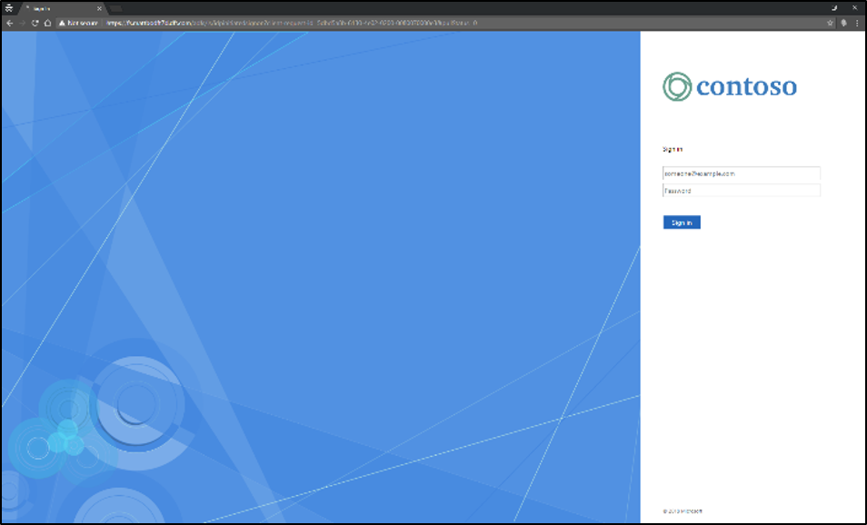
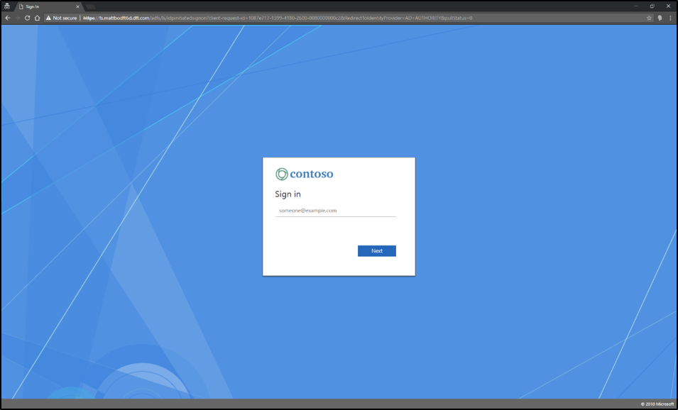
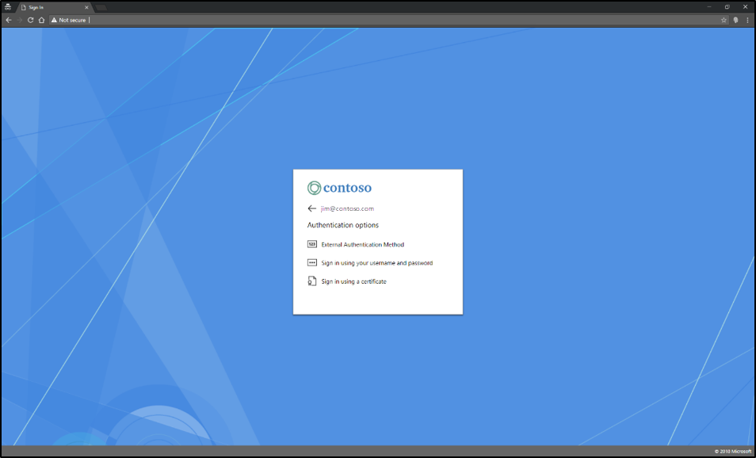

# AD FS paginated sign-in

For AD FS in Windows Server 2019, we’ve redesigned the sign-in UI.  Now, the AD FS sign-in will have the same look and feel of Azure AD.  This will provide users a more consistent sign-in experience, incorporating a centered and paginated user flow.

## What’s changing
In AD FS in Windows Server 2012 R2 and 2016, your sign-in screen looked something like this:

We’re moving away from displaying a single form located on the right side of the screen.

In AD FS in Windows Server 2019, these are the major design changes that you’ll see:

- **A centered UI**. Previously, the sign-in UI existed on the right side of the screen, as shown above. We’ve moved the UI front and center to modernize the experience.
- **Pagination**. Instead of providing you a long form to fill out, we’ve incorporated a new flow that will take you through the sign-in experience step-by-step. Our telemetry shows that with this approach, our customers have more successful sign-ins. It also provides us more flexibility to incorporate various authentication methods, such us phone factor authentication.

On the first page, you’ll be asked to enter your username. You may also select the option to “Keep me signed in” to reduce the frequency of sign-in prompts and remain signed in when it’s safe to do so. (This option is disabled by default.)

On the second page, you’ll be presented with authentication options, configured by your administrator. If allowing external authentication as primary is enabled, this will be included as well.

On the third page, you’ll be asked to enter your password (assuming you selected “Password” as your authentication option).

## How to get the new experience

### New installation of AD FS
If you are a new customer to AD FS, you'll receive the new design by default.

### Upgrading a farm
If you are an existing customer AD FS 2012 R2 or 2016, there are two ways to receive the new design after upgrading servers to AD FS 2019 and enabling the FBL to 2019.

- Allow the new sign-in via Powershell. Run the following command to enable pagination:
 ``Set-AdfsGlobalAuthenticationPolicy -EnablePaginatedAuthenticationPages $true``

 - Enable external authentication as primary, either via Powershell or through the AD FS Server Manager. The new paginated sign in pages will be enabled when this feature is enabled.
If you are a new customer to AD FS, you’ll receive the new design by default. However, if you are an existing customer with AD FS 2012 R2 or 2016, there are several steps you’ll need to take to receive the new design:
``Set-AdfsGlobalAuthenticationPolicy -AllowAdditionalAuthenticationAsPrimary $true``

## Customization
The options for customization will still be applicable for AD FS 2019.
Below are some links to other documents for your reference.

•	For those who do not plan to upgrade their servers to AD FS 2019 but still want the new design: [Using an Azure AD UX Web Theme in Active Directory Federation Services](azure-ux-web-theme-in-ad-fs.md)

•	A central location for customization: [AD FS user sign-in customization](ad-fs-user-sign-in-customization.md)
