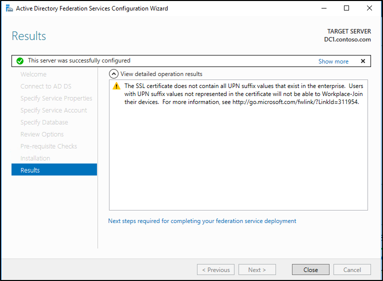
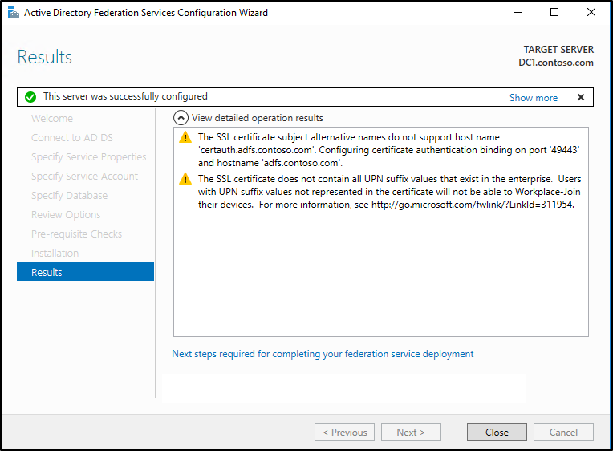

# AD FS support for alternate hostname binding for certificate authentication

On many networks the local firewall policies might not allow traffic through non-standard ports like 49443. This became an issue when trying to accomplish certificate authentication with AD FS prior to AD FS in Windows Server 2016. This is because you could not have different bindings for device authentication and user certificate authentication on the same host. The default port 443 is bound to receive device certificates and cannot be altered to support multiple binding in the same channel. The results were that smart card authentication would not work and users were unaware of what happened since there is no indication of what really happened.  
  
With AD FS in Windows Server 2016 this can be accomplished.
  
In AD FS on Windows Server 2016 this has changed. Now we support two modes, the first uses the same host (i.e. adfs.contoso.com) with different ports (443, 49443). The second used different hosts (adfs.contoso.com and certauth.adfs.contoso.com) with the same port (443). This will require an SSL certificate to support "certauth.<adfs-service-name>" as an alternate subject name. This can be done at the time of the farm creation or later via PowerShell.  
  
## How to configure alternate host name binding for certificate authentication  
There are two ways that you can add the alternate host name binding for certificate authentication. The first is when setting up a new AD FS farm with AD FS for Windows Server 2016, if the certificate contains a subject alternative name (SAN), then it will automatically be setup to use the second method mentioned above. That is, it will automatically setup two different hosts (sts.contoso.com and certauth.sts.contoso.com with the same port. If the certificate does not contain a SAN, then you will see a warning telling you that certificate subject alternative names does not support certauth.*. See the screenshots below. The first one shows an installation where the certificate had a SAN and the second one shows a certificate that did not.  
  
  
  
  
  
Likewise, once AD FS in Windows Server 2016 has been deployed you can use the PowerShell cmdlet: Set-AdfsAlternateTlsClientBinding.
  
```powershell
Set-AdfsAlternateTlsClientBinding -Member DC1.contoso.com -Thumbprint '<thumbprint of cert>'
```

When prompted, click Yes to confirm.  And that should  be it.


## Additional references

* [Managing SSL Certificates in AD FS and WAP in Windows Server 2016](../operations/Manage-SSL-Certificates-AD-FS-WAP-2016.md)
