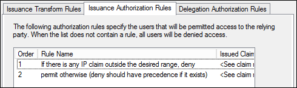
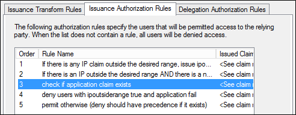
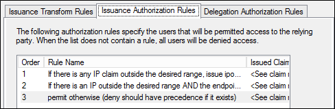
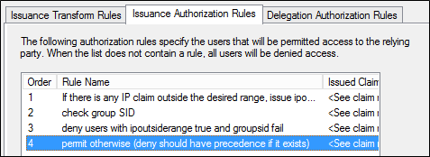

# Access Control Policies in Windows Server 2012 R2 and Windows Server 2012 AD FS


The policies described in this article make use of two kinds of claims  

1.  Claims AD FS creates based on information the AD FS and Web Application proxy can inspect and verify, such as the IP address of the client connecting directly to AD FS or the WAP.  

2.  Claims AD FS creates based on information forwarded to AD FS by the client as HTTP headers  

>**Important**:
>The policies as documented below will block Windows 10 domain join and sign on scenarios that require access to the following additional endpoints

AD FS endpoints required for Windows 10 Domain Join and sign on
- [federation service name]/adfs/services/trust/2005/windowstransport
- [federation service name]/adfs/services/trust/13/windowstransport
- [federation service name]/adfs/services/trust/2005/usernamemixed
- [federation service name]/adfs/services/trust/13/usernamemixed 
- [federation service name]/adfs/services/trust/2005/certificatemixed
- [federation service name]/adfs/services/trust/13/certificatemixed

>**Important**:
>/adfs/services/trust/2005/windowstransport and /adfs/services/trust/13/windowstransport endpoints should only be enabled for intranet access as they are meant to be intranet facing endpoints that use WIA binding on HTTPS. Exposing them to extranet could allow requests against these endpoints to bypass lockout protections. These endpoints should be disabled on the proxy (i.e. disabled from extranet) to protect AD account lockout. 

To resolve, update any policies that deny based on the endpoint claim to allow exception for the endpoints above.

For example, the rule below:

`c1:[Type == "http://custom/ipoutsiderange", Value == "true"] && c2:[Type == "https://schemas.microsoft.com/2012/01/requestcontext/claims/x-ms-endpoint-absolute-path", Value != "/adfs/ls/"] => issue(Type = "https://schemas.microsoft.com/authorization/claims/deny", Value = " DenyUsersWithClaim");`  

would be updated to:

`c1:[Type == "http://custom/ipoutsiderange", Value == "true"] && c2:[Type == "https://schemas.microsoft.com/2012/01/requestcontext/claims/x-ms-endpoint-absolute-path", Value != "(/adfs/ls/)|(/adfs/services/trust/2005/windowstransport)|(/adfs/services/trust/13/windowstransport)|(/adfs/services/trust/2005/usernamemixed)|(/adfs/services/trust/13/usernamemixed)|(/adfs/services/trust/2005/certificatemixed)|(/adfs/services/trust/13/certificatemixed)"] => issue(Type = "https://schemas.microsoft.com/authorization/claims/deny", Value = " DenyUsersWithClaim");`


> [!NOTE]
>  Claims from this category should only be used to implement business policies and not as security policies to protect access to your network.  It is possible for unauthorized clients to send headers with false information as a way to gain access.  

The policies described in this article should always be used with another authentication method, such as username and password or multi factor authentication.  

## Client Access Policies Scenarios  

|**Scenario**|**Description**| 
| --- | --- | 
|Scenario 1: Block all external access to Office 365|Office 365 access is allowed from all clients on the internal corporate network, but requests from external clients are denied based on the IP address of the external client.|  
|Scenario 2: Block all external access to Office 365 except Exchange ActiveSync|Office 365 access is allowed from all clients on the internal corporate network, as well as from any external client devices, such as smart phones, that make use of Exchange ActiveSync. All other external clients, such as those using Outlook, are blocked.|  
|Scenario 3: Block all external access to Office 365 except browser-based applications|Blocks external access to Office 365, except for passive (browser-based) applications such as Outlook Web Access or SharePoint Online.|  
|Scenario 4: Block all external access to Office 365 except for designated Active Directory groups|This scenario is used for testing and validating client access policy deployment. It blocks external access to Office 365 only for members of one or more Active Directory group. It can also be used to provide external access only to members of a group.|  

## Enabling Client Access Policy  
 To enable client access policy in AD FS in Windows Server 2012 R2, you must update the Microsoft Office 365 Identity Platform relying party trust. Choose one of the example scenarios below to configure the claim rules on the **Microsoft Office 365 Identity Platform** relying party trust that best meets the needs of your organization.  

###  <a name="scenario1"></a> Scenario 1: Block all external access to Office 365  
 This client access policy scenario allows access from all internal clients and blocks all external clients based on the IP address of the external client. You can use the following procedures to add the correct Issuance Authorization rules to the Office 365 relying party trust for your chosen scenario.  

##### To create rules to block all external access to Office 365  

1.  From **Server Manager**, click **Tools**, then click **AD FS Management**.  

2.  In the console tree, under **AD FS\Trust Relationships**, click **Relying Party Trusts**, right-click the **Microsoft Office 365 Identity Platform** trust, and then click **Edit Claim Rules**.  

3.  In the **Edit Claim Rules** dialog box, select the **Issuance Authorization Rules** tab, and then click **Add Rule** to start the Claim Rule Wizard.  

4.  On the **Select Rule Template** page, under **Claim rule template**, select **Send Claims Using a Custom Rule**, and then click **Next**.  

5.  On the **Configure Rule** page, under **Claim rule name**, type the display name for this rule, for example “If there is any IP claim outside the desired range, deny”. Under **Custom rule**, type or paste the following claim rule language syntax (replace the value above for “x-ms-forwarded-client-ip” with a valid IP expression):  
`c1:[Type == "https://schemas.microsoft.com/ws/2012/01/insidecorporatenetwork", Value == "false"] && c2:[Type == "https://schemas.microsoft.com/2012/01/requestcontext/claims/x-ms-forwarded-client-ip", Value =~ "^(?!192\.168\.1\.77|10\.83\.118\.23)"] => issue(Type = "https://schemas.microsoft.com/authorization/claims/deny", Value = " DenyUsersWithClaim");` </br>
6.  Click **Finish**. Verify that the new rule appears in the Issuance Authorization Rules list before to the default **Permit Access to All Users** rule (the Deny rule will take precedence even though it appears earlier in the list).  If you do not have the default permit access rule, you can add one at the end of your list using the claim rule language as follows:  </br>

    `c:[] => issue(Type = "https://schemas.microsoft.com/authorization/claims/permit", Value = "true"); ` 

7.  To save the new rules, in the **Edit Claim Rules** dialog box, click **OK**. The resulting list should look like the following.  

       

###  <a name="scenario2"></a> Scenario 2: Block all external access to Office 365 except Exchange ActiveSync  
 The following example allows access to all Office 365 applications, including Exchange Online, from internal clients including Outlook. It blocks access from clients residing outside the corporate network, as indicated by the client IP address, except for Exchange ActiveSync clients such as smart phones.  

##### To create rules to block all external access to Office 365 except Exchange ActiveSync  

1.  From **Server Manager**, click **Tools**, then click **AD FS Management**.  

2.  In the console tree, under **AD FS\Trust Relationships**, click **Relying Party Trusts**, right-click the **Microsoft Office 365 Identity Platform** trust, and then click **Edit Claim Rules**.  

3.  In the **Edit Claim Rules** dialog box, select the **Issuance Authorization Rules** tab, and then click **Add Rule** to start the Claim Rule Wizard.  

4.  On the **Select Rule Template** page, under **Claim rule template**, select **Send Claims Using a Custom Rule**, and then click **Next**.  

5.  On the **Configure Rule** page, under **Claim rule name**, type the display name for this rule, for example “If there is any IP claim outside the desired range, issue ipoutsiderange claim”. Under **Custom rule**, type or paste the following claim rule language syntax (replace the value above for “x-ms-forwarded-client-ip” with a valid IP expression):  

    `c1:[Type == "https://schemas.microsoft.com/ws/2012/01/insidecorporatenetwork", Value == "false"] && c2:[Type == "https://schemas.microsoft.com/2012/01/requestcontext/claims/x-ms-forwarded-client-ip", Value =~ "^(?!192\.168\.1\.77|10\.83\.118\.23)"] => issue(Type = "http://custom/ipoutsiderange", Value = "true");`  

6.  Click **Finish**. Verify that the new rule appears in the **Issuance Authorization Rules** list.  

7.  Next, in the **Edit Claim Rules** dialog box, on the **Issuance Authorization Rules** tab, click **Add Rule** to start the Claim Rule Wizard again.  

8.  On the **Select Rule Template** page, under **Claim rule template**, select **Send Claims Using a Custom Rule**, and then click **Next**.  

9. On the **Configure Rule** page, under **Claim rule name**, type the display name for this rule, for example “If there is an IP outside the desired range AND there is a non-EAS x-ms-client-application claim, deny”. Under **Custom rule**, type or paste the following claim rule language syntax:  


~~~
`c1:[Type == "http://custom/ipoutsiderange", Value == "true"] && c2:[Type == "https://schemas.microsoft.com/2012/01/requestcontext/claims/x-ms-client-application", Value != "Microsoft.Exchange.ActiveSync"] => issue(Type = "https://schemas.microsoft.com/authorization/claims/deny", Value = "DenyUsersWithClaim");`  
~~~

10. Click **Finish**. Verify that the new rule appears in the **Issuance Authorization Rules** list.  

11. Next, in the **Edit Claim Rules** dialog box, on the **Issuance Authorization Rules** tab, click **Add Rule** to start the Claim Rule Wizard again.  

12. On the **Select Rule Template** page, under **Claim rule template,** select **Send Claims Using a Custom Rule**, and then click **Next**.  

13. On the **Configure Rule** page, under **Claim rule name**, type the display name for this rule, for example “check if application claim exists”. Under **Custom rule**, type or paste the following claim rule language syntax:  

   ```  
   NOT EXISTS([Type == "https://schemas.microsoft.com/2012/01/requestcontext/claims/x-ms-client-application"]) => add(Type = "http://custom/xmsapplication", Value = "fail");  
   ```  

14. Click **Finish**. Verify that the new rule appears in the **Issuance Authorization Rules** list.  

15. Next, in the **Edit Claim Rules** dialog box, on the **Issuance Authorization Rules** tab, click **Add Rule** to start the Claim Rule Wizard again.  

16. On the **Select Rule Template** page, under **Claim rule template,** select **Send Claims Using a Custom Rule**, and then click **Next**.  

17. On the **Configure Rule** page, under **Claim rule name**, type the display name for this rule, for example “deny users with ipoutsiderange true and application fail”. Under **Custom rule**, type or paste the following claim rule language syntax:  

`c1:[Type == "http://custom/ipoutsiderange", Value == "true"] && c2:[Type == "http://custom/xmsapplication", Value == "fail"] => issue(Type = "https://schemas.microsoft.com/authorization/claims/deny", Value = "DenyUsersWithClaim");`</br>  
18. Click **Finish**. Verify that the new rule appears immediately below the previous rule and before to the default Permit Access to All Users rule in the Issuance Authorization Rules list (the Deny rule will take precedence even though it appears earlier in the list).  </br>If you do not have the default permit access rule, you can add one at the end of your list using the claim rule language as follows:</br></br>      `c:[] => issue(Type = "https://schemas.microsoft.com/authorization/claims/permit", Value = "true");`</br></br>
19. To save the new rules, in the **Edit Claim Rules** dialog box, click OK. The resulting list should look like the following.  

      

###  <a name="scenario3"></a> Scenario 3: Block all external access to Office 365 except browser-based applications  

##### To create rules to block all external access to Office 365 except browser-based applications  

1.  From **Server Manager**, click **Tools**, then click **AD FS Management**.  

2.  In the console tree, under **AD FS\Trust Relationships**, click **Relying Party Trusts**, right-click the **Microsoft Office 365 Identity Platform** trust, and then click **Edit Claim Rules**.  

3.  In the **Edit Claim Rules** dialog box, select the **Issuance Authorization Rules** tab, and then click **Add Rule** to start the Claim Rule Wizard.  

4.  On the **Select Rule Template** page, under **Claim rule template**, select **Send Claims Using a Custom Rule**, and then click **Next**.  

5.  On the **Configure Rule** page, under **Claim rule name**, type the display name for this rule, for example “If there is any IP claim outside the desired range, issue ipoutsiderange claim”. Under **Custom rule**, type or paste the following claim rule language syntax(replace the value above for “x-ms-forwarded-client-ip” with a valid IP expression):  </br>
`c1:[Type == "https://schemas.microsoft.com/ws/2012/01/insidecorporatenetwork", Value == "false"] && c2:[Type == "https://schemas.microsoft.com/2012/01/requestcontext/claims/x-ms-forwarded-client-ip", Value =~ "^(?!192\.168\.1\.77|10\.83\.118\.23)"] => issue(Type = "http://custom/ipoutsiderange", Value = "true");`   
6.  Click **Finish**. Verify that the new rule appears in the **Issuance Authorization Rules** list.  

7.  Next, in the **Edit Claim Rules** dialog box, on the **Issuance Authorization Rules** tab, click **Add Rule** to start the Claim Rule Wizard again.  

8.  On the **Select Rule Template** page, under **Claim rule template,** select **Send Claims Using a Custom Rule**, and then click **Next**.  

9. On the **Configure Rule** page, under **Claim rule name**, type the display name for this rule, for example “If there is an IP outside the desired range AND the endpoint is not /adfs/ls, deny”. Under **Custom rule**, type or paste the following claim rule language syntax:  


~~~
`c1:[Type == "http://custom/ipoutsiderange", Value == "true"] && c2:[Type == "https://schemas.microsoft.com/2012/01/requestcontext/claims/x-ms-endpoint-absolute-path", Value != "/adfs/ls/"] => issue(Type = "https://schemas.microsoft.com/authorization/claims/deny", Value = " DenyUsersWithClaim");`  
~~~

10. Click **Finish**. Verify that the new rule appears in the Issuance Authorization Rules list before to the default **Permit Access to All Users** rule (the Deny rule will take precedence even though it appears earlier in the list).  </br></br> If you do not have the default permit access rule, you can add one at the end of your list using the claim rule language as follows:  

   `c:[] => issue(Type = "https://schemas.microsoft.com/authorization/claims/permit", Value = "true");`

11. To save the new rules, in the **Edit Claim Rules** dialog box, click **OK**. The resulting list should look like the following.  

      

###  <a name="scenario4"></a> Scenario 4: Block all external access to Office 365 except for designated Active Directory groups  
 The following example enables access from internal clients based on IP address. It blocks access from clients residing outside the corporate network that have an external client IP address, except for those individuals in a specified Active Directory Group.Use the following steps to add the correct Issuance Authorization rules to the **Microsoft Office 365 Identity Platform** relying party trust using the Claim Rule Wizard:  

##### To create rules to block all external access to Office 365, except for designated Active Directory groups  

1.  From **Server Manager**, click **Tools**, then click **AD FS Management**.  

2.  In the console tree, under **AD FS\Trust Relationships**, click **Relying Party Trusts**, right-click the **Microsoft Office 365 Identity Platform** trust, and then click **Edit Claim Rules**.  

3.  In the **Edit Claim Rules** dialog box, select the **Issuance Authorization Rules** tab, and then click **Add Rule** to start the Claim Rule Wizard.  

4.  On the **Select Rule Template** page, under **Claim rule template**, select **Send Claims Using a Custom Rule**, and then click **Next**.  

5.  On the **Configure Rule** page, under **Claim rule name**, type the display name for this rule, for example “If there is any IP claim outside the desired range, issue ipoutsiderange claim.” Under **Custom rule**, type or paste the following claim rule language syntax(replace the value above for “x-ms-forwarded-client-ip” with a valid IP expression):  


~~~
`c1:[Type == "https://schemas.microsoft.com/2012/01/requestcontext/claims/x-ms-forwarded-client-ip", Value =~ "^(?!192\.168\.1\.77|10\.83\.118\.23)"] && c2:[Type == "https://schemas.microsoft.com/ws/2012/01/insidecorporatenetwork", Value == "false"] => issue(Type = "http://custom/ipoutsiderange", Value = "true");`  
~~~

6. Click **Finish**. Verify that the new rule appears in the **Issuance Authorization Rules** list.  

7. Next, in the **Edit Claim Rules** dialog box, on the **Issuance Authorization Rules** tab, click **Add Rule** to start the Claim Rule Wizard again.  

8. On the **Select Rule Template** page, under **Claim rule template,** select **Send Claims Using a Custom Rule**, and then click **Next**.  

9. On the **Configure Rule** page, under **Claim rule name**, type the display name for this rule, for example “check group SID”. Under **Custom rule**, type or paste the following claim rule language syntax (replace "groupsid" with the actual SID of the AD group you are using):  

    `NOT EXISTS([Type == "https://schemas.microsoft.com/ws/2008/06/identity/claims/groupsid", Value == "S-1-5-32-100"]) => add(Type = "http://custom/groupsid", Value = "fail");`  

10. Click **Finish**. Verify that the new rule appears in the **Issuance Authorization Rules** list.  

11. Next, in the **Edit Claim Rules** dialog box, on the **Issuance Authorization Rules** tab, click **Add Rule** to start the Claim Rule Wizard again.  

12. On the **Select Rule Template** page, under **Claim rule template,** select **Send Claims Using a Custom Rule**, and then click **Next**.  

13. On the **Configure Rule** page, under **Claim rule name**, type the display name for this rule, for example “deny users with ipoutsiderange true and groupsid fail”. Under **Custom rule**, type or paste the following claim rule language syntax:  

   `c1:[Type == "http://custom/ipoutsiderange", Value == "true"] && c2:[Type == "http://custom/groupsid", Value == "fail"] => issue(Type = "https://schemas.microsoft.com/authorization/claims/deny", Value = "DenyUsersWithClaim");`  

14. Click **Finish**. Verify that the new rule appears immediately below the previous rule and before to the default Permit Access to All Users rule in the Issuance Authorization Rules list (the Deny rule will take precedence even though it appears earlier in the list).  </br></br>If you do not have the default permit access rule, you can add one at the end of your list using the claim rule language as follows:  

   `c:[] => issue(Type = "https://schemas.microsoft.com/authorization/claims/permit", Value = "true");`  

15. To save the new rules, in the **Edit Claim Rules** dialog box, click OK. The resulting list should look like the following.  

       

##  <a name="buildingip"></a> Building the IP address range expression  
 The x-ms-forwarded-client-ip claim is populated from an HTTP header that is currently set only by Exchange Online, which populates the header when passing the authentication request to AD FS. The value of the claim may be one of the following:  

> [!NOTE]
>  Exchange Online currently supports only IPV4 and not IPV6 addresses.  

-   A single IP address: The IP address of the client that is directly connected to Exchange Online  

> [!NOTE]
> - The IP address of a client on the corporate network will appear as the external interface IP address of the organization's outbound proxy or gateway.  
>   -   Clients that are connected to the corporate network by a VPN or by Microsoft DirectAccess (DA) may appear as internal corporate clients or as external clients depending upon the configuration of VPN or DA.  

-   One or more IP addresses: When Exchange Online cannot determine the IP address of the connecting client, it will set the value based on the value of the x-forwarded-for header, a non-standard header that can be included in HTTP-based requests and is supported by many clients, load balancers, and proxies on the market.  

> [!NOTE]
> 1. Multiple IP addresses, indicating the client IP address and the address of each proxy that passed the request, will be separated by a comma.  
>    2. IP addresses related to Exchange Online infrastructure will not on the list.  

### Regular Expressions  
 When you have to match a range of IP addresses, it becomes necessary to construct a regular expression to perform the comparison. In the next series of steps, we will provide examples for how to construct such an expression to match the following address ranges (note that you will have to change these examples to match your public IP range):  

- 192.168.1.1 – 192.168.1.25  

- 10.0.0.1 – 10.0.0.14  

  First, the basic pattern that will match a single IP address is as follows: \b###\\.###\\.###\\.###\b  

  Extending this, we can match two different IP addresses with an OR expression as follows: \b###\\.###\\.###\\.###\b&#124;\b###\\.###\\.###\\.###\b  

  So, an example to match just two addresses (such as 192.168.1.1 or 10.0.0.1) would be: \b192\\.168\\.1\\.1\b&#124;\b10\\.0\\.0\\.1\b  

  This gives you the technique by which you can enter any number of addresses. Where a range of address need to be allowed, for example 192.168.1.1 – 192.168.1.25, the matching must be done character by character: \b192\\.168\\.1\\.([1-9]&#124;1[0-9]&#124;2[0-5])\b  

  Please note the following:  

- The IP address is treated as string and not a number.  

- The rule is broken down as follows: \b192\\.168\\.1\\.  

- This matches any value beginning with 192.168.1.  

- The following matches the ranges required for the portion of the address after the final decimal point:  

  -   ([1-9] Matches addresses ending in 1-9  

  -   &#124;1[0-9] Matches addresses ending in 10-19  

  -   &#124;2[0-5]) Matches addresses ending in 20-25  

- Note that the parentheses must be correctly positioned, so that you don't start matching other portions of IP addresses.  

- With the 192 block matched, we can write a similar expression for the 10 block: \b10\\.0\\.0\\.([1-9]&#124;1[0-4])\b  

- And putting them together, the following expression should match all the addresses for “192.168.1.1～25” and “10.0.0.1～14”: \b192\\.168\\.1\\.([1-9]&#124;1[0-9]&#124;2[0-5])\b&#124;\b10\\.0\\.0\\.([1-9]&#124;1[0-4])\b  

### Testing the Expression  
 Regex expressions can become quite tricky, so we highly recommend using a regex verification tool. If you do an internet search for “online regex expression builder”, you will find several good online utilities that will allow you to try out your expressions against sample data.  

 When testing the expression, it's important that you understand what to expect to have to match. The Exchange online system may send many IP addresses, separated by commas. The expressions provided above will work for this. However, it's important to think about this when testing your regex expressions. For example, one might use the following sample input to verify the examples above:  

 192.168.1.1, 192.168.1.2, 192.169.1.1. 192.168.12.1, 192.168.1.10, 192.168.1.25, 192.168.1.26, 192.168.1.30, 1192.168.1.20  

 10.0.0.1, 10.0.0.5, 10.0.0.10, 10.0.1.0, 10.0.1.1, 110.0.0.1, 10.0.0.14, 10.0.0.15, 10.0.0.10, 10,0.0.1  

## Claim Types  
 AD FS in Windows Server 2012 R2 provides request context information using the following claim types:  

### X-MS-Forwarded-Client-IP  
 Claim type: `https://schemas.microsoft.com/2012/01/requestcontext/claims/x-ms-forwarded-client-ip`  

 This AD FS claim represents a “best attempt” at ascertaining the IP address of the user (for example, the Outlook client) making the request. This claim can contain multiple IP addresses, including the address of every proxy that forwarded the request.  This claim is populated from an HTTP. The value of the claim can be one of the following:  

-   A single IP address - The IP address of the client that is directly connected to Exchange Online  

> [!NOTE]
>  The IP address of a client on the corporate network will appear as the external interface IP address of the organization's outbound proxy or gateway.  

-   One or more IP addresses  

    -   If Exchange Online cannot determine the IP address of the connecting client, it will set the value based on the value of the x-forwarded-for header, a non-standard header that can be included in HTTP based requests and is supported by many clients, load balancers, and proxies on the market.  

    -   Multiple IP addresses indicating the client IP address and the address of each proxy that passed the request will be separated by a comma.  

> [!NOTE]
>  IP addresses related to Exchange Online infrastructure will not be present in the list.  

> [!WARNING]
>  Exchange Online currently supports only IPV4 addresses; it does not support IPV6 addresses.  

### X-MS-Client-Application  
 Claim type: `https://schemas.microsoft.com/2012/01/requestcontext/claims/x-ms-client-application`  

 This AD FS claim represents the protocol used by the end client, which corresponds loosely to the application being used.  This claim is populated from an HTTP header that is currently only set by Exchange Online, which populates the header when passing the authentication request to AD FS. Depending on the application, the value of this claim will be one of the following:  

-   In the case of devices that use Exchange Active Sync, the value is Microsoft.Exchange.ActiveSync.  

-   Use of the Microsoft Outlook client may result in any of the following values:  

    -   Microsoft.Exchange.Autodiscover  

    -   Microsoft.Exchange.OfflineAddressBook  

    -   Microsoft.Exchange.RPCMicrosoft.Exchange.WebServices  

    -   Microsoft.Exchange.RPCMicrosoft.Exchange.WebServices  

-   Other possible values for this header include the following:  

    -   Microsoft.Exchange.Powershell  

    -   Microsoft.Exchange.SMTP  

    -   Microsoft.Exchange.Pop  

    -   Microsoft.Exchange.Imap  

### X-MS-Client-User-Agent  
 Claim type: `https://schemas.microsoft.com/2012/01/requestcontext/claims/x-ms-client-user-agent`  

 This AD FS claim provides a string to represent the device type that the client is using to access the service. This can be used when customers would like to prevent access for certain devices (such as particular types of smart phones).  Example values for this claim include (but are not limited to) the values below.  

 The below are examples of what the x-ms-user-agent value might contain for a client whose x-ms-client-application is “Microsoft.Exchange.ActiveSync”  

- Vortex/1.0  

- Apple-iPad1C1/812.1  

- Apple-iPhone3C1/811.2  

- Apple-iPhone/704.11  

- Moto-DROID2/4.5.1  

- SAMSUNGSPHD700/100.202  

- Android/0.3  

  It is also possible that this value is empty.  

### X-MS-Proxy  
 Claim type: `https://schemas.microsoft.com/2012/01/requestcontext/claims/x-ms-proxy`  

 This AD FS claim indicates that the request has passed through the Web Application proxy.  This claim is populated by the Web Application proxy, which populates the header when passing the authentication request to the back end Federation Service. AD FS then converts it to a claim.  

 The value of the claim is the DNS name of the Web Application proxy that passed the request.  

### InsideCorporateNetwork  
 Claim type: `https://schemas.microsoft.com/ws/2012/01/insidecorporatenetwork`  

 Similar to the above x-ms-proxy claim type, this claim type indicates whether the request has passed through the web application proxy. Unlike x-ms-proxy, insidecorporatenetwork is a boolean value with True indicating a request directly to the federation service from inside the corporate network.  

### X-MS-Endpoint-Absolute-Path (Active vs Passive)  
 Claim type: `https://schemas.microsoft.com/2012/01/requestcontext/claims/x-ms-endpoint-absolute-path`  

 This claim type can be used for determining requests originating from “active” (rich) clients versus “passive” (web-browser-based) clients. This enables external requests from browser-based applications such as the Outlook Web Access, SharePoint Online, or the Office 365 portal to be allowed while requests originating from rich clients such as Microsoft Outlook are blocked.  

 The value of the claim is the name of the AD FS service that received the request.  

## See Also  
 [AD FS Operations](../../ad-fs/AD-FS-2016-Operations.md)
