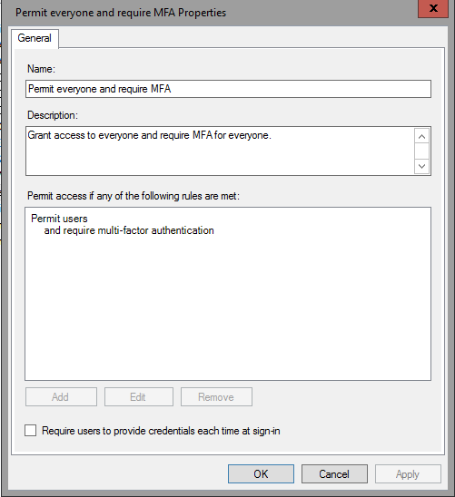
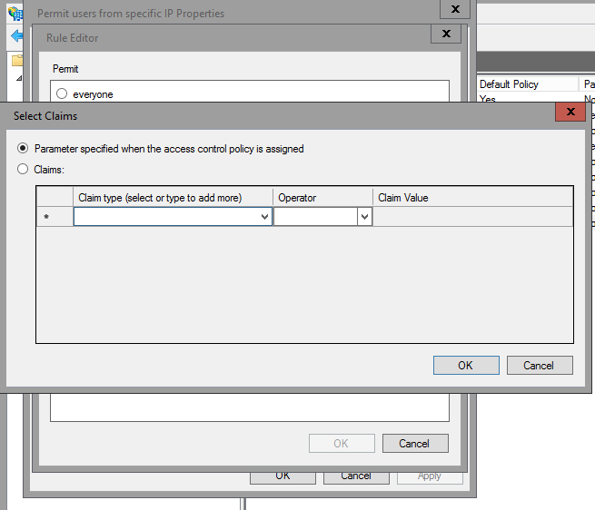
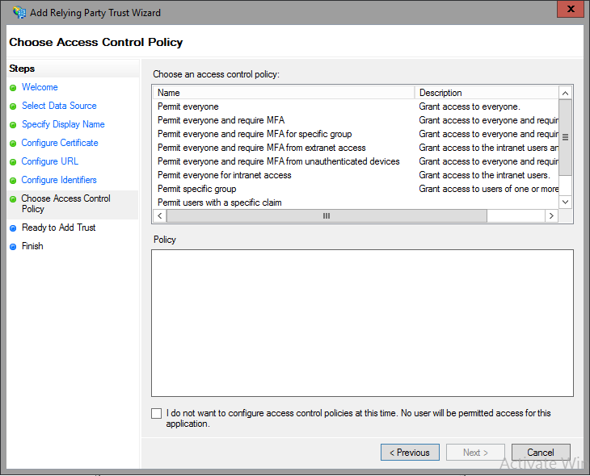
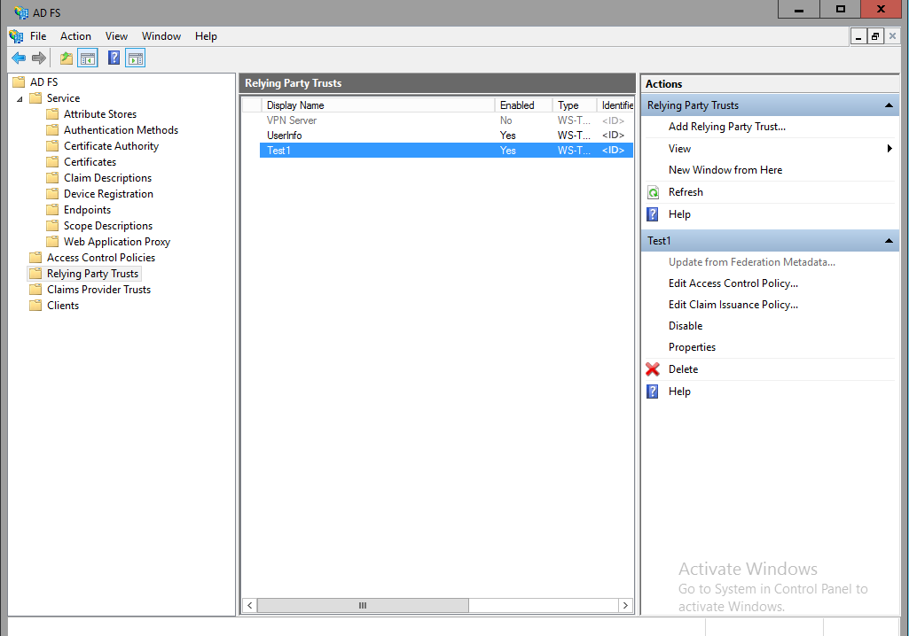

# Access Control Policies in Windows Server 2016 AD FS

  
## Access Control Policy Templates in AD FS  
Active Directory Federation Services now supports the use of access control policy templates.  By using access control policy templates, an administrator can enforce policy settings by assigning the policy template to a group of relying parties (RPs). Administrator can also make updates to the policy template and the changes will be applied to the relying parties automatically if there is no user interaction needed.  
  
## What are Access Control Policy Templates?  
The AD FS core pipeline for policy processing has three phases: authentication, authorization and claim issuance. Currently, AD FS administrators have to configure a policy for each of these phases separately.  This also involves understanding the implications of these policies and if these policies have inter-dependency. Also, administrators have to understand the claim rule language and author custom rules to enable some simple/common policy (ex. block external access).  
  
What access control policy templates do is replace this old model where administrators have to configure Issuance Authorization Rules using claims language.  The old PowerShell cmdlets of issuance authorization rules still apply but it is mutually exclusive of the new model. Administrators can choose either to use the new model or the old model.  The new model allows administrators to control when to grant access, including enforcing multi-factor authentication.  
  
Access control policy templates use a permit model.  This means by default, no one has access and that access must be explicitly granted.  However, this is not just an all or nothing permit.  Administrators can add exceptions to the permit rule.  For example, an administrator may wish to grant access based on a specific network by selecting this option and specifying the IP address range.  But the administrator may add and exception, for instance, the administrator may add an exception from a specific network and specify that IP address range.  
  
  
  
## Built-in access control policy templates vs custom access control policy templates  
AD FS includes several built-in access control policy templates.  These target some common scenarios which have the same set of policy requirements, for example client access policy for Office 365.  These templates cannot be modified.  
  
  
  
To provide increased flexibility to address your business needs, administrators can create their own access policy templates.  These can be modified after creation and changes to custom policy template will apply to all the RPs which are controlled by those policy templates.  To add a custom policy template simply click Add Access Control Policy from within AD FS management.  
  
To create a policy template, an administrator needs to first specify under which conditions a request will be authorized for token issuance and/or delegation. Condition and action options are shown in the table below.   Conditions in bold can be further configured by the administrator with different or new values. Admin can also specify exceptions if there is any. When a condition is met, a permit action will not be triggered if there is an exception specified and the incoming request matches the condition specified in the exception.  
  
|Permit Users|Except| 
| --- | --- | 
 |From **specific** network|From **specific** network  From **specific** groups  From devices with **specific** trust levels  With **specific** claims in the request|  
|From **specific** groups|From **specific** network  From **specific** groups  From devices with **specific** trust levels  With **specific** claims in the request|  
|From devices with **specific** trust levels|From **specific** network  From **specific** groups  From devices with **specific** trust levels  With **specific** claims in the request|  
|With **specific** claims in the request|From **specific** network  From **specific** groups  From devices with **specific** trust levels  With **specific** claims in the request|  
|And require multi-factor authentication|From **specific** network  From **specific** groups  From devices with **specific** trust levels  With **specific** claims in the request|  
  
If an administrator selects multiple conditions, they are of **AND** relationship. Actions are mutually exclusive and for one policy rule you can only choose one action. If admin selects multiple exceptions, they are of an **OR** relationship. A couple of policy rule examples are shown below:  
  
|**Policy**|**Policy rules**|
| --- | --- |  
|Extranet access requires MFA  All users are permitted|**Rule #1**  from **extranet**  and with MFA  Permit  **Rule#2**  from **intranet**  Permit|  
|External access are not permitted except non-FTE  Intranet access for FTE on workplace joined device are permitted|**Rule #1**  From **extranet**  and from **non-FTE** group  Permit  **Rule #2**  from **intranet**  and from **workplace joined** device  and from **FTE** group  Permit|  
|Extranet access requires MFA except "service admin"  All users are permitted to access|**Rule #1**  from **extranet**  and with MFA  Permit  Except **service admin group**  **Rule #2**  always  Permit|  
|non-work place joined device accessing from extranet requires MFA  Permit AD fabric for intranet and extranet access|**Rule #1**  from **intranet**  And from **AD Fabric** group  Permit  **Rule #2**  from **extranet**  and from **non-workplace joined** device  and from **AD Fabric** group  and with MFA  Permit  **Rule #3**  from **extranet**  and from **workplace joined** device  and from **AD Fabric** group  Permit|  
  
## Parameterized policy template vs non-parameterized policy template  
Access control policies can be  
  
A parameterized policy template is a policy template that has parameters. An Administrator needs to input the value for those parameters when assigning this template to RPs.An administrator cannot make changes to parameterized policy template after it has been created.  An example of a parameterized policy is the built-in policy, Permit specific group.  Whenever this policy is applied to an RP, this parameter needs to be specified.  
  
  
  
A non-parameterized policy template is a policy template that does not have parameters. An administrator can assign this template to RPs without any input needed and can make changes to a non-parameterized policy template after it has been created.  An example of this is the built-in policy, Permit everyone and require MFA.  
  
  
  
## How to create a non-parameterized access control policy  
To create a non-parameterized access control policy use the following procedure  
  
#### To create a non-parameterized access control policy  
  
1.  From AD FS Management on the left select Access Control Policies and on the right click Add Access Control Policy.  
  
2.  Enter a name and a description.  For example:  Permit users with authenticated devices.  
  
3.  Under **Permit access if any of the following rules are met**, click **Add**.  
  
4.  Under permit, place a check in the box next to **from devices with specific trust level**  
  
5.  At the bottom, select the underlined **specific**  
  
6.  From the window that pops-up, select **authenticated** from the drop-down.  Click **Ok**.  
  
      
  
7.  Click **Ok**. Click **Ok**.  
  
      
  
## How to create a parameterized access control policy  
To create a parameterized access control policy use the following procedure  
  
#### To create a parameterized access control policy  
  
1.  From AD FS Management on the left select Access Control Policies and on the right click Add Access Control Policy.  
  
2.  Enter a name and a description.  For example:  Permit users with a specific claim.  
  
3.  Under **Permit access if any of the following rules are met**, click **Add**.  
  
4.  Under permit, place a check in the box next to **with specific claims in the request**  
  
5.  At the bottom, select the underlined **specific**  
  
6.  From the window that pops-up, select **Parameter specified when the access control policy is assigned**.  Click **Ok**.  
  
      
  
7.  Click **Ok**. Click **Ok**.  
  
      
  
## How to create a custom access control policy with an exception  
To create a access control policy with an exception use the following procedure.  
  
#### To create a custom access control policy with an exception  
  
1.  From AD FS Management on the left select Access Control Policies and on the right click Add Access Control Policy.  
  
2.  Enter a name and a description.  For example:  Permit users with authenticated devices but not managed.  
  
3.  Under **Permit access if any of the following rules are met**, click **Add**.  
  
4.  Under permit, place a check in the box next to **from devices with specific trust level**  
  
5.  At the bottom, select the underlined **specific**  
  
6.  From the window that pops-up, select **authenticated** from the drop-down.  Click **Ok**.  
  
7.  Under except, place a check in the box next to **from devices with specific trust level**  
  
8.  At the bottom under except, select the underlined **specific**  
  
9. From the window that pops-up, select **managed** from the drop-down.  Click **Ok**.  
  
10. Click **Ok**. Click **Ok**.  
  
      
  
## How to create a custom access control policy with multiple permit conditions  
To create a access control policy with multiple permit conditions use the following procedure  
  
#### To create a parameterized access control policy  
  
1.  From AD FS Management on the left select Access Control Policies and on the right click Add Access Control Policy.  
  
2.  Enter a name and a description.  For example:  Permit users with a specific claim and from specific group.  
  
3.  Under **Permit access if any of the following rules are met**, click **Add**.  
  
4.  Under permit, place a check in the box next to **from a specific group** and **with specific claims in the request**  
  
5.  At the bottom, select the underlined **specific** for the first condition, next to groups  
  
6.  From the window that pops-up, select **Parameter specified when the policy is assigned**.  Click **Ok**.  
  
7.  At the bottom, select the underlined **specific** for the second condition, next to claims  
  
8.  From the window that pops-up, select **Parameter specified when the access control policy is assigned**.  Click **Ok**.  
  
9. Click **Ok**. Click **Ok**.  
  
  
  
## How to assign an access control policy to a new application  
Assigning an access control policy to a new application is pretty straight forward and has now been integrated into the wizard for adding an RP.  From the Relying Party Trust Wizard you can select the access control policy that you wish to assign.  This is a requirement when creating a new relying party trust.  
  
  
  
## How to assign an access control policy to an existing application  
Assigning an access control policy to a existing application simply select the application from Relying Party Trusts and on the right click **Edit Access Control Policy**.  
  
  
  
From here you can select the access control policy and apply it to the application.  
  
  
  
## See Also  
[AD FS Operations](../../ad-fs/AD-FS-2016-Operations.md) 

