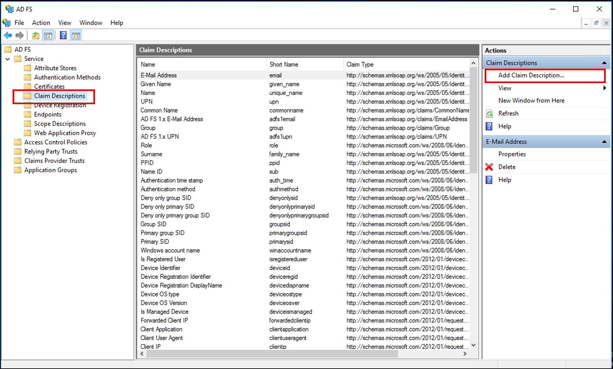
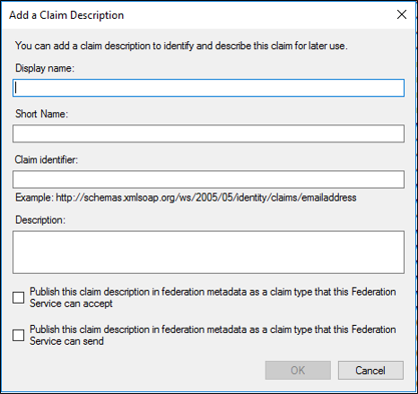

# Add a Claim Description

In an account partner organization, administrators create claims to represent a user's membership in a group or role or to represent some data about a user, for example, a user's employee identification number.

In a resource partner organization, administrators create corresponding claims to represent groups and users that can be recognized as resource users. Because outgoing claims in the account partner organization map to incoming claims in the resource partner organization, the resource partner is able to accept the credentials that the account partner provides. 

You can use the following procedure to add a claim.

Membership in **Administrators**, or equivalent, on the local computer is the minimum required to complete this procedure.  Review details about using the appropriate accounts and group memberships at [Local and Domain Default Groups](https://go.microsoft.com/fwlink/?LinkId=83477).

## To add a claim description

1. In Server Manager, click **Tools**, and then select **AD FS Management**. 

2. Expand **Service** and on the right click **Add Claim Description**.
   

3. On the Add a Claim Description dialog box, in **Display name**, type a unique name that identifies the group or role for this claim.

4. Add a **Short Name**.

5. In **Claim identifier**, type a URI that is associated with the group or role of the claim that you will be using.

6. Under **Description**, type text that best describes the purpose of this claim.

7. Depending on the needs of your organization, select either of the following check boxes, as appropriate, to publish this claim into federation metadata:

~~~
- To publish this claim to make partners aware that this server can accept this claim, click **Publish this claim in federation metadata as a claim type that this Federation Service can accept**.
- To publish this claim to make partners aware that this server can issue this claim, click **Publish this claim in federation metadata as a claim type that this Federation Service can send**.
~~~

8. Click **OK**.

## See Also  
[AD FS Operations](../../ad-fs/AD-FS-2016-Operations.md) 
