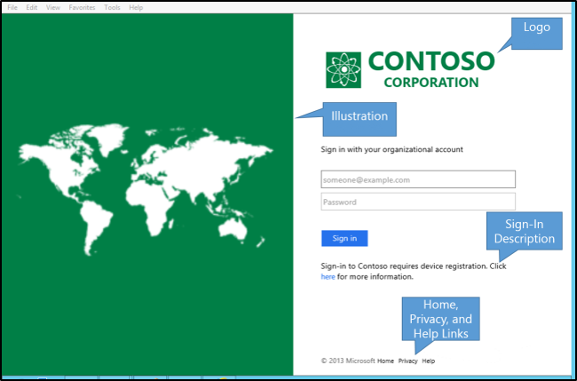

# Add sign\-in page description

## To Add sign\-in page description  
To add a sign\-in page description to the sign\-in page, use the following Windows PowerShell cmdlet and syntax.  

    Set-AdfsGlobalWebContent -SignInPageDescriptionText "
Sign-in to Contoso requires device registration. Click <A href='http://fs1.contoso.com/deviceregistration/'>here</A> for more information.
" 
 
  
> [!IMPORTANT]  
> The string for the `SignInPageDescriptionText` parameter supports both pure HTML with the tags and without. Therefore, you can also run the following cmdlet without using the &lt;p&gt; tag.  `Set-AdfsGlobalWebContent -SignInPageDescriptionText "Sign-in to Contoso requires device registration. Click <A href='http://fs1.contoso.com/deviceregistration/'>here</A> for more information." ` 

After the sign\-in page is customized, the customization takes precedence; therefore, you should customize for all languages that you want to support. All customized content takes a locale parameter. When you configure localized content, it should be configured with a country\-less locale first, for example, "en", before you configure country and region\-specific locale such as "en\-us".  

## Additional references 
[AD FS User Sign-in Customization](AD-FS-user-sign-in-customization.md)  
