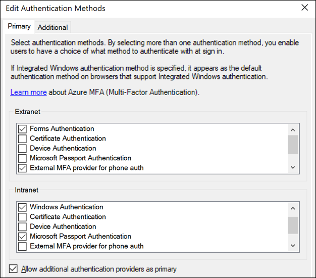

# Configure third party authentication providers as primary authentication in AD FS 2019

Organizations are experiencing attacks that attempt to brute force, compromise, or otherwise lock out user accounts by sending password based authentication requests.  To help protect organizations from compromise, AD FS has introduced capabilities such as extranet “smart” lockout, and IP address based blocking.

However, these mitigations are reactive.  To provide a proactive way, to reduce the severity of these attacks,  AD FS has the ability to prompt for other factors prior to collecting the password.

For example, AD FS 2016 introduced Microsoft Entra multifactor authentication as primary authentication so that OTP codes from the Authenticator App could be used as the first factor. Beginning with AD FS 2019 you can configure external authentication providers as primary authentication factors.

There are two key scenarios this enables:

## Scenario 1: protect the password

Protect password-based sign in from brute-force attacks and lockouts by prompting for an additional, external factor first.  A password prompt is only seen when the external authentication is successfully completed.  This eliminates a convenient way attackers have been trying to compromise or disable accounts.

This scenario consists of two components:

- Prompting for Microsoft Entra multifactor authentication (available in AD FS 2016 onwards) or an external authentication factor as primary authentication
- Username and password as additional authentication in AD FS

## Scenario 2: password-free

Eliminate passwords entirely but completing a strong, multifactor authentication using entirely non password based methods in AD FS

- Microsoft Entra multifactor authentication with Authenticator app
- Windows 10 Hello for Business
- Certificate authentication
- External authentication providers

## Concepts

What **primary authentication** really means is that it's the method the user is prompted for first, prior to additional factors.  Previously the only primary methods available in AD FS were built in methods for Active Directory or Microsoft Entra multifactor authentication, or other LDAP authentication stores.  External methods could be configured as “additional” authentication, which takes place after primary authentication has successfully completed.

In AD FS 2019, the external authentication as primary capability means that any external authentication providers registered on the AD FS farm (using Register-AdfsAuthenticationProvider) become available for primary authentication and “additional” authentication. They can be enabled the same way as the built-in providers such as Forms Authentication and Certificate Authentication, for intranet and/or extranet use.



Once an external provider is enabled for extranet, intranet, or both, it becomes available for users to use.  If more than one method is enabled, users see a choice page and be able to choose a primary method, just as they do for additional authentication.

## Prerequisites

Before configuring external authentication providers as primary, ensure you have the following prerequisites in place.

- The AD FS farm behavior level (FBL) has been raised to ‘4' (This value translates to AD FS 2019.)
  - This is the default FBL value for new AD FS 2019 farms.
  - For AD FS farms based on Windows Server 2012 R2 or 2016, the FBL can be raised using the PowerShell commandlet Invoke-AdfsFarmBehaviorLevelRaise. For more information on upgrading an AD FS farm, see the farm upgrade article for SQL farms or WID farms
  - You can check the FBL value using the cmdlet Get-AdfsFarmInformation.
- The AD FS 2019 farm is configured to use the new 2019 ‘paginated' user facing pages.
  - This is the default behavior for new AD FS 2019 farms.
  - For AD FS farms upgraded from Windows Server 2012 R2 or 2016, the paginated flows are enabled automatically when external authentication as primary (the feature described in this document) is enabled as described in the next section of this article.

## Enable external authentication methods as primary

After you have verified the prerequisites, there are two ways to configure AD FS additional authentication providers as primary: PowerShell, or the AD FS Management console.

### Using PowerShell

```powershell
PS C:\> Set-AdfsGlobalAuthenticationPolicy -AllowAdditionalAuthenticationAsPrimary $true
```

The AD FS service must be restarted after enabling or disabling additional authentication as primary.

### Using the AD FS Management console

In the AD FS Management console, under **Service** -> **Authentication Methods**, under **Primary Authentication Methods**, select **Edit**

Select the checkbox for **Allow additional authentication providers as primary**.

The AD FS service must be restarted after enabling or disabling additional authentication as primary.

## Enable username and password as additional authentication

To complete the “protect the password” scenario, enable username and password as additional authentication using either PowerShell or the AD FS Management console. Examples are provided for both methods.

### Enable username and password as additional authentication using PowerShell

```powershell
PS C:\> $providers = (Get-AdfsGlobalAuthenticationPolicy).AdditionalAuthenticationProvider

PS C:\>$providers = $providers + "FormsAuthentication"

PS C:\>Set-AdfsGlobalAuthenticationPolicy -AdditionalAuthenticationProvider $providers
```

### Enable username and password as additional authentication using AD FS Management console

In the AD FS Management console, under **Service** -> **Authentication Methods**, under **Additional Authentication Methods**, select **Edit**

Select the checkbox for **Forms Authentication** to enable username and password as additional authentication.
