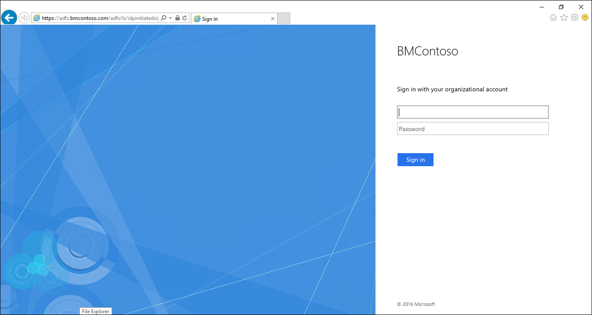
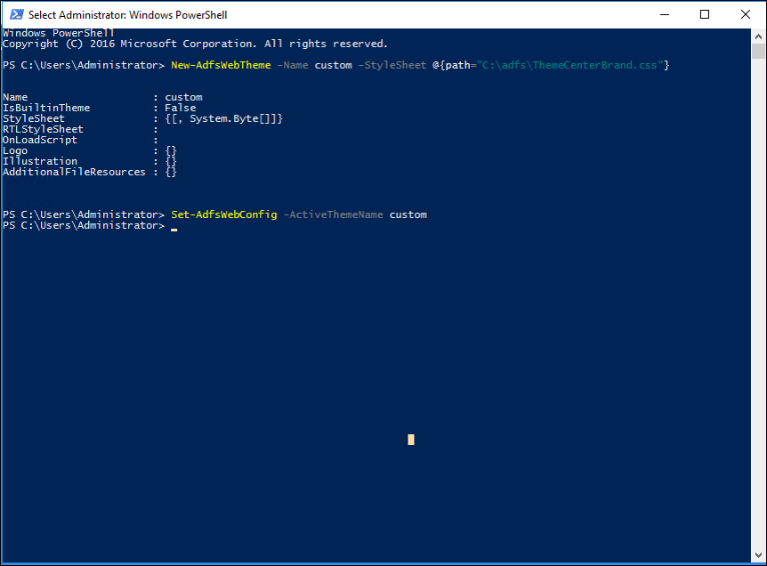
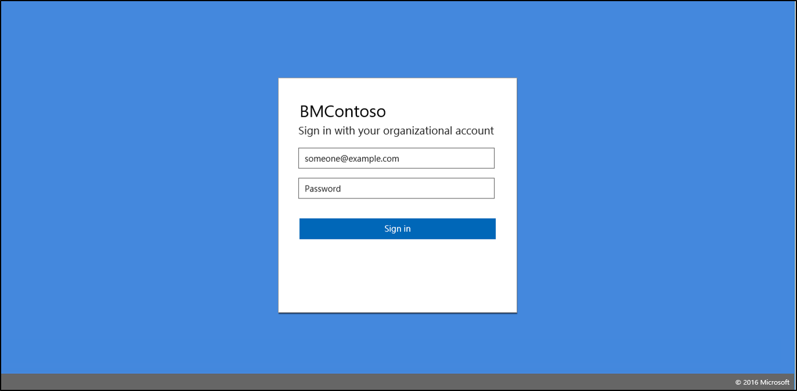

# Using an Azure AD UX Web Theme in Active Directory Federation Services
The AD FS forms sign in currently does not mirror the Azure/O365 sign-in experience.  To provide a more uniform and seamless experience for end-users, we have released the follow cascading style sheet web theme which can be applied to your AD FS servers.  Currently, the forms sign-in for AD FS on Windows Server 2016 looks like following:

With the new style sheet, the user experience will look more like the Azure and Office 365 sign-in experiences.

## Download the CSS style sheet
You can download the web theme from the following Github [location](https://github.com/Microsoft/adfsWebCustomization/tree/master/centeredUi).

## Enabling the new web theme
To enable the new web theme use the following procedure:

### To enable the new Azure AD UX web theme in AD FS
1. Start PowerShell as an Administrator
2. Create a new web theme using PowerShell:  `New-AdfsWebTheme –Name custom –StyleSheet @{path="c:\NewTheme.css"}`
3. Set the new theme as the active theme using PowerShell:  `Set-AdfsWebConfig -ActiveThemeName custom`
   
4. Test the sign-in by going to https://<AD FS name.domain>/adfs/ls/idpinitiatedsignon.htm
   

> ![NOTE]
> You need to ensure that idpinitiatedsignon has been enabled.  It is not enabled by default.  To enable idpinitiatedsignon use the following PowerShell command:  `Set-AdfsProperties –EnableIdpInitiatedSignonPage $True`

## Image Recommendations
Enabling the centered UI enables you to use the same images for background and logo that you might already have for Azure Active Directory company branding. Generally, the same recommendations for size, ratio, and format do apply.

### Logo

Description | Constraints | Recommendations
------- | ------- | ----------
The logo is displayed on top of the login panel. | Transparent JPG or PNG Max height: 36 px Max width: 245 px | Use your organization's logo here. Use a transparent image. Don't assume that the background will be white. Do not add padding around your logo in the image or your logo will look disproportionately small.

### Background

Description | Constraints | Recommendations
------- | ------- | ----------
This option appears in the background of the sign-in page, is anchored to the center of the viewable space, and scales and crops to fill the browser window.     On narrow screens such as mobile phones, this image is not shown. A black mask with 0.55 opacity is applied over this image when the page is loaded. | JPG or PNG Image dimensions: 1920x1080 px File size: &lt; 300 KB |  Use images where there isn't a strong subject focus. The opaque sign-in form appears over the center of this image and can cover any part of the image, depending on the size of the browser window. Keep the file size small to ensure quick load times.

## Next Steps
- [AD FS Customization in Windows Server 2016](AD-FS-Customization-in-Windows-Server-2016.md)
- [Advanced Customization](Advanced-Customization-of-AD-FS-Sign-in-Pages.md)
- [Custom web themes](Custom-Web-Themes-in-AD-FS.md)
