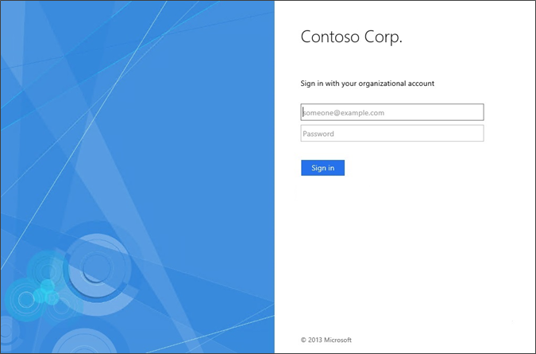

# Change the company name on the AD FS sign-in page
 
To change the name of the company that is displayed on the sign\-in page, use the following Windows PowerShell cmdlet and syntax. This value is set by default by using the value from the Federation Service display name that you entered during setup.  

  
  
    Set-AdfsGlobalWebContent –CompanyName "Contoso Corp"  
 
  
> [!NOTE]  
> You can also use the Windows PowerShell Integrated Scripting Environment \(ISE\) to change the company name. By using the Windows PowerShell ISE, you can display content in a Unicode\-compliant environment. For additional information, see [Introducing the Windows PowerShell ISE](https://technet.microsoft.com/library/dd315244.aspx).  

## Additional references 
[AD FS User Sign-in Customization](AD-FS-user-sign-in-customization.md)  
  
