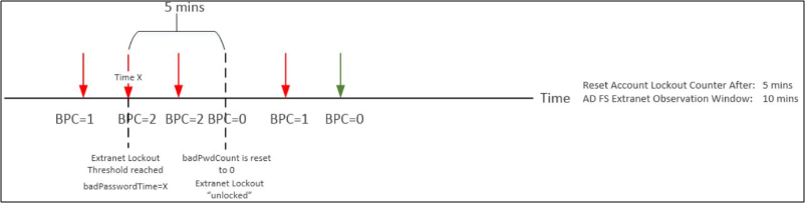
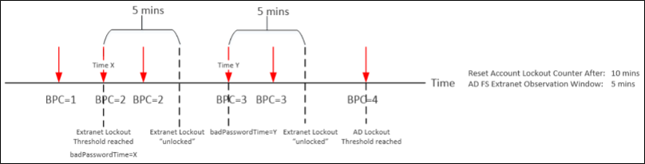

#AD FS Extranet Lockout

# Overview

>Applies To: Windows Server 2016, Windows Server 2012 R2

In AD FS on Windows Server 2012 R2, we introduced a security feature called Extranet Lockout.  With this feature, AD FS will "stop" authenticating the "malicious" user account from outside for a period of time.  This prevents your user accounts from being locked out in Active Directory.  In addition to protecting your users from an AD account lockout, AD FS extranet lockout also protects against brute force password guessing attacks.

In March 2018, AD FS on Windows Server 2016 introduced Extranet Smart Lockout (ESL).  ESL enables AD FS to differentiate between sign-in attempts that look like they're from the valid user and sign-ins from what may be an attacker. As a result, AD FS can lock out attackers while letting valid users continue to use their accounts. This prevents denial-of-service on the user and protects against targeted attacks against known user accounts.  
ESL is only available for AD FS in Windows Server 2016. 

> [!NOTE]
> This feature only works for the **extranet scenario** where the authentication requests come through the Web Application Proxy and only applies to **username and password authentication**.

## Advantages of Extranet Lockout
Extranet lockout provides the following key advantages:
- It protects your user accounts from **brute force attacks** where an attacker tries to guess a user's password by continuously sending authentication requests. In this case, AD FS will lock out the malicious user account for extranet access
- It protects your user accounts from **malicious account lockout** where an attacker wants to lock out a user account by sending authentication requests with wrong passwords. In this case, although the user account will be locked out by AD FS for extranet access, the actual user account in AD is not locked out and the user can still access corporate resources within the organization. This is known as a **soft lockout**.

## Advantages of Extranet Smart Lockout
- takes advantage of all of the features of extranet lockout and extends these to the cloud.  Azure AD tenants that use AD FS will be able to use ESL natively in AD FS in Windows Server 2016
- has a log only mode so that you can log all of the activity without disabling any accounts

## How it Works
There are 3 settings in AD FS that you need to configure to enable this feature: 
- **EnableExtranetLockout &lt;Boolean&gt;** set this Boolean value to be True if you want to enable Extranet Lockout.
- **ExtranetLockoutThreshold &lt;Integer&gt;** this defines the maximum number of bad password attempts. Once the threshold is reached, AD FS will immediately rejects the requests from extranet without attempting to contact the domain controller for authentication, no matter whether password is good or bad, until the extranet observation window is passed. This means the value of **badPwdCount** attribute of an AD account will not increase while the account is soft-locked out.
- **ExtranetObservationWindow &lt;TimeSpan&gt;** this determines for how long the user account will be soft-locked out. AD FS will start to perform username and password authentication again when the window is passed. AD FS uses the AD attribute badPasswordTime as the reference for determining whether the extranet observation window has passed or not. The window has passed if current time > badPasswordTime + ExtranetObservationWindow.


> [!NOTE]
> AD FS extranet lockout functions independently from the AD lockout policies. However, we strongly recommend that you set the **ExtranetLockoutThreshold** parameter value to a value that is less than the AD account lockout threshold. Failing to do so would result in AD FS being unable to protect accounts from being locked out in Active Directory. 

An example of enabling Extranet Lockout feature with maximum of 15 number of bad password attempts and 30 mins soft-lockout duration is as follows:

```powershell
Set-AdfsProperties -EnableExtranetLockout $true -ExtranetLockoutThreshold 15 -ExtranetObservationWindow (new-timespan -Minutes 30)
```

These settings will apply to all domains that the AD FS service can authenticate. The way that it works is that when AD FS receives an authentication request, it will access the Primary Domain Controller (PDC) through an LDAP call and perform a lookup for the **badPwdCount** attribute for the user on the PDC. If AD FS finds the value of **badPwdCount** >= ExtranetLockoutThreshold setting and the time defined in the Extranet Observation Window has not passed yet, AD FS will reject the request immediately, which means no matter whether the user enters a good or bad password from extranet, the logon will fail because AD FS does not send the credentials to AD. AD FS does not maintain any state with regard to **badPwdCount** or locked out user accounts. AD FS uses AD for all state tracking. 

> [!warning]
> When AD FS Extranet lockout on Server 2012 R2 is enabled all authentication requests through the WAP are validated by AD FS on the PDC. When the PDC is unavailable, users will be unable to authenticate from the extranet.

Server 2016 offers an the following additional parameters that allows AD FS to fallback to another domain controller when the PDC is unavailable and enable extranet smart lockout.

- **ExtranetLockoutRequirePDC &lt;Boolean&gt;** - When enabled: extranet lockout requires a primary domain controller (PDC). When disabled: extranet lockout will fallback to another domain controller in case the PDC is unavailable.

    You can use the following Windows PowerShell command to configure the AD FS extranet lockout on Server 2016:

    ```powershell
    Set-AdfsProperties -EnableExtranetLockout $true -ExtranetLockoutThreshold 15 -ExtranetObservationWindow (new-timespan -Minutes 30) -ExtranetLockoutRequirePDC $false
    ```
- **ExtranetLockoutMode** was added to `Set-AdfProperties` to support ESL.  If you are using the basic extranet lockout protection, then you do not need to use this parameter.  If you have not installed the lasted update for Windows Server 2016 as of March 2018, this parameter will not be available.  It contains the following 3 values which correspond to the different modes that ESL can run under:

    - **ADPasswordCounter** – This is the legacy ADFS “extranet soft lockout” mode which does not differentiate based on location.  This is the default value.

    - **ADFSSmartLockoutLogOnly** – This is Extranet Smart Lockout, but instead of rejecting authentication requests, AD FS will only write admin and audit events.

    - **ADFSSmartLockoutEnforce** - This is Extranet Smart 
Lockout with full support for blocking unfamiliar requests when the thresholds are reached.
We recommend that you first set the lockout provider to log only by running the following cmdlet:

    ``` powershell
    Set-AdfsProperties -EnableExtranetLockout $true -ExtranetLockoutThreshold 15 -ExtranetObservationWindow (new-timespan -Minutes 30) -ExtranetLockoutRequirePDC $false -ExtranetLockoutMode AdfsSmartlockoutLogOnly
    ```
    In this mode, AD FS performs the analysis but does not block any requests due to lockout counters.  This mode is used to validate that smart lockout is running successfully before enabling “enforce” mode.

    For the new mode to take effect, restart the AD FS service on all nodes in the farm

    ``` powershell
    Restart-service adfssrv
    ```

## Working with the Active Directory Lockout Policy
The Extranet Lockout feature in AD FS works independently from the AD lockout policy. However, you do need to make sure the settings for the Extranet Lockout is properly configured so that it can serve its security purpose with the AD lockout policy.
Let's take a look at AD lockout policy first. There are three settings regarding lockout policy in AD:
- **Account Lockout Threshold**: this setting is similar to the ExtranetLockoutThreshold setting in AD FS. It determines the number of failed logon attempts that will cause a user account to be locked out. In order to protect your user accounts from a malicious account lockout attack, you want to set the value of ExtranetLockoutThreshold in AD FS &lt; the Account Lockout Threshold value in AD
- **Account Lockout Duration**: this setting determines for how long a user account is locked out. This setting does not matter much in this conversation as Extranet Lockout should always happen before AD lockout happens if configured properly
- **Reset Account Lockout Counter After**: this setting determines how much time must elapse from user's last logon failure before **badPwdCount** is reset to 0. In order for Extranet Lockout feature in AD FS to work well with AD lockout policy, you want to make sure the value of ExtranetObservationWindow in AD FS &gt; the Reset Account Lockout Counter After value in AD. The examples below will explain why.  

Let's take a look at two examples and see how **badPwdCount** changes over time based on different settings and states. Let's assume in both examples **Account Lockout Threshold** = 4 and **ExtranetLockoutThreshold** = 2. The **red** arrow represents bad password attempt, the **green** arrow represents a good password attempt. In example #1, **ExtranetObservationWindow** &gt; **Reset Account Lockout Counter After**. In example #2, **ExtranetObservationWindow** &lt; **Reset Account Lockout Counter After**. 

### Example 1


### Example 2


As you can see from the above, there are two conditions when **badPwdCount** will be reset to 0. One is when there is a successful logon. The other is when it is time to reset this counter as defined in **Reset Account Lockout Counter After** setting. When **Reset Account Lockout Counter After** &lt; **ExtranetObservationWindow**, an account does not have any risk of being locked out by AD. However, if **Reset Account Lockout Counter After** &gt; **ExtranetObservationWindow**, there is a chance that an account may be locked out by AD but in a "delayed fashion". It may take a while to get an account locked out by AD depending on your configuration as AD FS will only allow one bad password attempt during its observation window until **badPwdCount** reaches **Account Lockout Threshold**.

For more information, see [Configuring Account Lockout](https://blogs.technet.microsoft.com/secguide/2014/08/13/configuring-account-lockout/). 

## Known Issues
There is a known issue where the AD user account cannot authentication with AD FS because the **badPwdCount** attribute is not replicated to the domain controller that ADFS is querying. See [2971171](https://support.microsoft.com/help/2971171/adfs-authentication-issue-for-active-directory-users-when-extranet-loc) for more details. You can find all AD FS QFEs that have been released so far [here](../deployment/updates-for-active-directory-federation-services-ad-fs.md).

## Key points to remember
- The Extranet Lockout feature only works for the **extranet scenario** where the authentication requests come through the Web Application Proxy
- The Extranet Lockout feature only applies to **username & password authentication**
- AD FS does not keep any track of **badPwdCount** or users that are soft-locked out. AD FS uses AD for all state tracking
- AD FS performs a lookup for the **badPwdCount** attribute through LDAP call for the user on the PDC for every authentication attempt  
- AD FS older than 2016 will fail if it cannot access the PDC. AD FS 2016 introduced improvements that will allow AD FS to fall back to other domain controllers in case of the PDC is not available. 
- AD FS will allow authentication requests from extranet if badPwdCount < ExtranetLockoutThreshold 
- If **badPwdCount** >= **ExtranetLockoutThreshold** AND **badPasswordTime** + **ExtranetObservationWindow** < Current time, AD FS will reject authentication requests from extranet
- To avoid malicious account lockout, you should make sure **ExtranetLockoutThreshold** < **Account Lockout Threshold** AND **ExtranetObservationWindow** > **Reset Account Lockout Counter**

## Manage User Account Activity
AD FS provides 3 cmdlets to manage user account activity data.  These cmdlets automatically connect to the node in the farm which holds the master role (though this behavior can be overridden by passing the -Server parameter)

`Get-ADFSAccountActivity`

Read the current account activity for a user account.  The cmdlet always automatically connects to the farm master using the Account Activity REST endpoint, so all data should always be consistent

``` powershell
Get-ADFSAccountActivity user@contoso.com
```
`
Set-ADFSAccountActivity
`

Update the account activity for a user account.  This can be used to add new familiar locations or erase state for any account

``` powershell
Set-ADFSAccountActivity user@upnsuffix.com -FamiliarLocation “1.2.3.4”
```
`Reset-ADFSAccountLockout`

Resets the lockout counter for a user account

``` powershell
Reset-ADFSAccountLockout user@upnsuffix.com -Familiar
```

## Troubleshooting ESL
The following can assist you with troubleshooting the extranet smart lockout feature.

### Updating database permissions for ESL
If any errors are returned from the `Update-AdfsArtifactDatabasePermission` cmdlet, verify the following

1.	The list of farm nodes is correct.  If a node is in the AD FS farm list but no longer active patch verification will fail.  This can be remedied by running `remove-adfsnode <node name >`
2.	Verify the patch is deployed on all nodes in the farm
3.	Verify the credentials passed to the cmdlet have permission to modify the owner of the ad fs artifact database schema.  

### Logging / Auditing
When an authentication request is rejected because the account exceeds the lockout threshold, AD FS will write an `ExtranetLockoutEvent` to the security audit stream.  

Example event:

An extranet lockout event has occurred. See XML for failure details. 

**Activity ID: 172332e1-1301-4e56-0e00-0080000000db**

```
Additional Data 
XML: <?xml version="1.0" encoding="utf-16"?>
<AuditBase xmlns:xsd="http://www.w3.org/2001/XMLSchema" xmlns:xsi="http://www.w3.org/2001/XMLSchema-instance" xsi:type="ExtranetLockoutAudit">
  <AuditType>ExtranetLockout</AuditType>
  <AuditResult>Failure</AuditResult>
  <FailureType>ExtranetLockoutError</FailureType>
  <ErrorCode>AccountRestrictedAudit</ErrorCode>
  <ContextComponents>
    <Component xsi:type="ResourceAuditComponent">
      <RelyingParty>http://contoso.com/adfs/services/trust</RelyingParty>
      <ClaimsProvider>N/A</ClaimsProvider>
      <UserId>TQDFTD\Administrator</UserId>
    </Component>
    <Component xsi:type="RequestAuditComponent">
      <Server>N/A</Server>
      <AuthProtocol>WSFederation</AuthProtocol>
      <NetworkLocation>Intranet</NetworkLocation>
      <IpAddress>4.4.4.4</IpAddress>
      <ForwardedIpAddress />
      <ProxyIpAddress>1.2.3.4</ProxyIpAddress>
      <NetworkIpAddress>1.2.3.4</NetworkIpAddress>
      <ProxyServer>N/A</ProxyServer>
      <UserAgentString>Mozilla/5.0 (Windows NT 10.0; Win64; x64) AppleWebKit/537.36 (KHTML, like Gecko) Chrome/63.0.3239.132 Safari/537.36</UserAgentString>
      <Endpoint>/adfs/ls</Endpoint>
    </Component>
    <Component xsi:type="LockoutConfigAuditComponent">
      <CurrentBadPasswordCount>5</CurrentBadPasswordCount>
      <ConfigBadPasswordCount>5</ConfigBadPasswordCount>
      <LastBadAttempt>02/07/2018 21:47:44</LastBadAttempt>
      <LockoutWindowConfig>00:30:00</LockoutWindowConfig>
    </Component>
  </ContextComponents>
</AuditBase>

```

## Uninstall ESL
SQL farms can uninstall the patch using the Settings app with no issues.

WID farms must follow a set of steps due to the updated WID database verification binary.

1.	Run uninstall psh script which stops the service and drops the account activity table

```
Stop-Service adfssrv -ErrorAction Stop 

$doc = new-object Xml
$doc.Load("$env:windir\ADFS\Microsoft.IdentityServer.Servicehost.exe.config")
$connString = $doc.configuration.'microsoft.identityServer.service'.policystore.connectionString

if ( -not $connString -like "*##wid*" )
{
    Write-Error "SQL installs do not require DB updates, skipping DB table drop"
}
else
{
	$connString = "Data Source=np:\\.\pipe\microsoft##wid\tsql\query;Initial Catalog=AdfsArtifactStore;Integrated Security=True"
	stop-service adfssrv
	$cli = new-object System.Data.SqlClient.SqlConnection
	$cli.ConnectionString = $connString
	$cli.Open()
	try
	{    
        $cmd = new-object System.Data.SqlClient.SqlCommand
        $cmd.CommandText = "IF  EXISTS (SELECT * FROM sys.objects WHERE object_id = OBJECT_ID(N'[ArtifactStore].[AccountActivity]') AND type in (N'U')) DROP TABLE [ArtifactStore].[AccountActivity]"
        $cmd.Connection = $cli
        $cmd.ExecuteNonQuery() 
    }
    finally
    {
        $cli.CLose()
    }

	write-warning "Finish removing the patch using the Settings app and then restart the complete to complete the uninstall"
} 

```

2.	Uninstall patch using settings app
3.	Restart machine


## Detailed Database change information for ESL
When smart lockout is enabled, AD FS will create a new table in the AD FS artifact DB in which it will store lockout counters and a set of familiar locations.  

This table is created automatically once the feature is enabled.  The table exists on each node in the farm and is not replicated.  Instead of replicating the data, each node in the farm will communicate with the User Activity master to read and write the results of each password authentication.


## Additional references  
[Best practices for securing Active Directory Federation Services](../../ad-fs/deployment/best-practices-securing-ad-fs.md)

[Set-AdfsProperties](https://technet.microsoft.com/en-us/itpro/powershell/windows/adfs/set-adfsproperties)

[AD FS Operations](../../ad-fs/AD-FS-2016-Operations.md)

    
