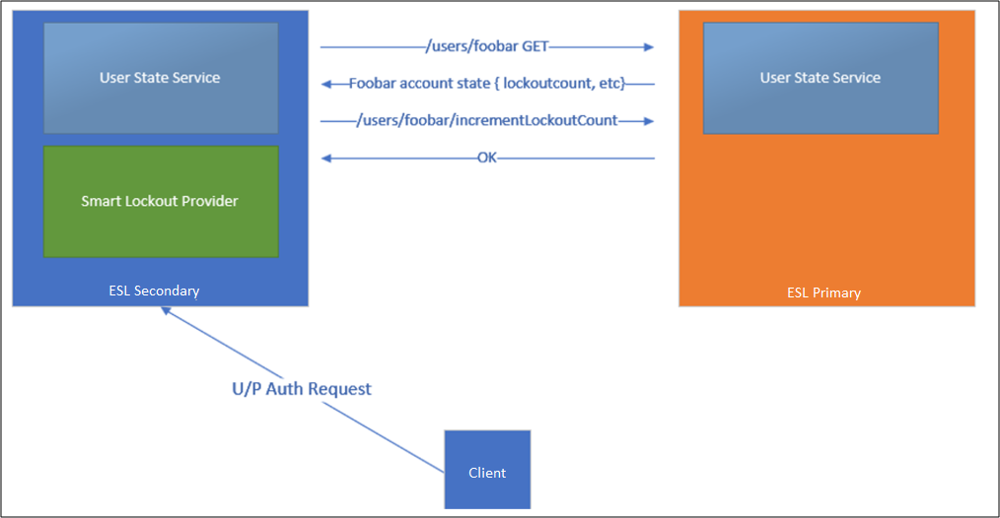
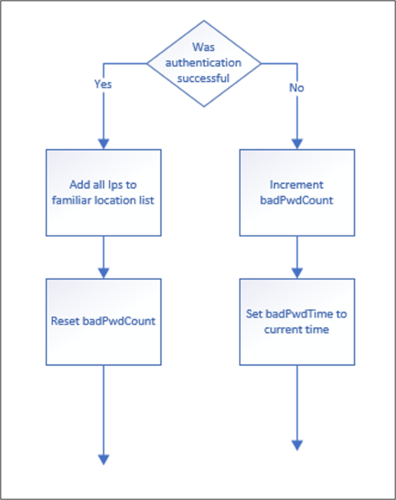

# AD FS Extranet Lockout and Extranet Smart Lockout

## Overview

Extranet Smart Lockout (ESL) protects your users from experiencing extranet account lockout from malicious activity.  

ESL enables AD FS to differentiate between sign-in attempts from a familiar location for a user and sign-in attempts from what may be an attacker. AD FS can lock out attackers while letting valid users continue to use their accounts. This prevents and protects against denial-of-service and certain classes of password spray attacks on the user. ESL is available for AD FS in Windows Server 2016 and is built into AD FS in Windows Server 2019.

ESL is only available for the username and password authentication requests which come through the extranet with the Web Application Proxy or a 3rd party proxy. Any 3rd party proxy must support the MS-ADFSPIP protocol to be used in place of the Web Application Proxy, such as [F5 BIG-IP Access Policy Manager](https://devcentral.f5.com/s/articles/ad-fs-proxy-replacement-on-f5-big-ip-30191). Consult the 3rd party proxy documentation to determine if the proxy supports the MS-ADFSPIP protocol.   

## Additional Features in AD FS 2019
Extranet Smart Lockout in AD FS 2019 adds the following advantages compared to AD FS 2016:
- Set independent lockout thresholds for familiar and unfamiliar locations so that users in known good locations can have more room for error than requests from suspect locations
- Enable audit mode for smart lockout while continuing to enforce previous soft lockout behavior. This allows you to learn about user familiar locations and still be protected by the extranet lockout feature that is available from AD FS 2012R2.  

## How It Works
### Configuration information
When ESL is enabled, a new table in the Artifact database, AdfsArtifactStore.AccountActivity, is created and a node is selected in the AD FS farm as the “User Activity” master. In a WID configuration, this node is always the primary node. In a SQL configuration, one node is selected to be the User Activity master.  

To view the node selected as the User Activity master. Get-AdfsFarmInformation.FarmRoles

All secondary nodes will contact the master node on each fresh login through Port 80 to learn the latest value of the bad password counts and new familiar location values, and update that node after the login is processed.



 If the secondary node cannot contact the master, it will write error events into the AD FS admin log. Authentications will continue to be processed, but AD FS will only write the updated state locally. AD FS will retry contacting the master every 10 minutes and will switch back to the master once the master is available.

### Terminology
- **FamiliarLocation**: During an authentication request, ESL checks all presented IPs. These IPs will be a combination of network IP, forwarded IP, and the optional x-forwarded-for IP. If the request is successful, all of the IPs are added to the Account Activity table as “familiar IPs”. If the request has all the IPs present in the “familiar IPs”, the request will be treated as a “Familiar” location.
- **UnknownLocation**: If a request that comes in has at least one IP not present in the existing “FamiliarLocation” list, then the request will be treated as an “Unknown” location. This is to handle proxying scenarios such as Exchange Online legacy authentication where Exchange Online addresses handle both successful and failed requests.  
- **badPwdCount**: A value representing the number of times an incorrect password was submitted and the authentication was unsuccessful. For each user, separate counters are kept for Familiar Locations and Unknown Locations.
- **UnknownLockout**: A boolean value per user if the user is locked out from accessing from unknown locations. This value is calculated based on the badPwdCountUnfamiliar and ExtranetLockoutThreshold values.
- **ExtranetLockoutThreshold**: This value determines the maximum number of bad password attempts. When the threshold is reached, ADFS will reject requests from the extranet until the observation window has passed.
- **ExtranetObservationWindow**: This value determines the duration that username and password requests from unknown locations are locked out. When the window has passed, ADFS will start to perform username and password authentication from unknown locations again.
- **ExtranetLockoutRequirePDC**: When enabled, extranet lockout requires a primary domain controller (PDC). When disabled, extranet lockout will fallback to another domain controller in case the PDC is unavailable.  
- **ExtranetLockoutMode**: Controls log only vs enforced mode of Extranet Smart Lockout
    - **ADFSSmartLockoutLogOnly**: Extranet Smart Lockout is enabled, but AD FS will only write admin and audit events, but will not reject authentication requests. This mode is intended to initially be enabled for FamiliarLocation to be populated before ‘ADFSSmartLockoutEnforce' is enabled.
    - **ADFSSmartLockoutEnforce**: Full support for blocking unfamiliar authentication requests when thresholds are reached.

IPv4 and IPv6 addresses are supported.

### Anatomy of a transaction
- **Pre-Auth Check**: During an authentication request, ESL checks all presented IPs. These IPs will be a combination of network IP, forwarded IP, and the optional x-forwarded-for IP. In the audit logs, these IPs are listed in the <IpAddress> field in the order of x-ms-forwarded-client-ip, x-forwarded-for, x-ms-proxy-client-ip.

  Based on these IPs, ADFS determines if the request is from a familiar or unfamiliar location and then checks if the respective badPwdCount is less than the set threshold limit OR if the last **failed** attempt is happened longer than the observation window time frame. If one of these conditions is true, ADFS allows this transaction for further processing and credential validation. If both conditions are false, the account is already in a locked out state until the observation window passes. After the observation window passes, the user is allowed one attempt to authenticate. Note that in 2019, ADFS will check against the appropriate threshold limit based on if the IP address matches a familiar location or not.
- **Successful Login**: If the log-in succeeds, then the IPs from the request are added to the user's familiar location IP list.  
- **Failed Login**: If the log-in fails the badPwdCount is increased. The user will go into a lockout state if the attacker sends more bad passwords to the system than the threshold allows. (badPwdCount > ExtranetLockoutThreshold)  



The “UnknownLockout” value will equal to true when the account is locked out. This means that the user's badPwdCount is over than the threshold i.e. someone attempted more passwords than were allowed by the system. In this state, there are 2 ways that a valid user can login.
- The user must wait for the ObservationWindow time to elapse or
- In order to reset the Lockout state, reset the badPwdCount back to zero with ‘Reset-ADFSAccountLockout'.

If no resets occur, the account will be allowed a single password attempt against AD for each observation window. The account will return to the locked out state after that attempt and the observation window will restart. The badPwdCount value will only reset automatically after a successful password login.

### Log-Only mode versus ‘Enforce' mode
The AccountActivity table is populated both during ‘Log-Only' mode and ‘Enforce' mode. If ‘Log-Only' mode is bypassed and ESL is moved directly into ‘Enforce' mode without the recommended waiting period, the familiar IPs of the users will not be known to ADFS. In this case, ESL would behave like ‘ADBadPasswordCounter', potentially blocking legitimate user traffic if the user account is under an active brute force attack. If the ‘Log-Only' mode is bypassed and the user enters a locked out state with “UnknownLockout” = TRUE and attempts to sign in with a good password from an IP that is not in the “familiar” IP list, then they will not be able to sign in. Log-Only mode is recommended for 3-7 days to avoid this scenario. If accounts are actively under attack, a minimum of 24 hours of ‘Log-Only' mode is necessary to prevent lockouts to legitimate users.  

## Extranet Smart Lockout Configuration  

### Prerequisites for AD FS 2016

1. **Install updates on all nodes in the farm**

   First, ensure all Windows Server 2016 AD FS servers are up to date as of the June 2018 Windows Updates and that the AD FS 2016 farm is running at the 2016 farm behavior level.
1. **Verify Permissions**

   Extranet Smart Lockout requires that Windows Remote management be enabled on every AD FS server.
3. **Update artifact database permissions**

   Extranet smart lockout requires the AD FS service account to have permissions to create a new table in the AD FS artifact database. Log in to any AD FS server as an AD FS admin, and then grant this permission by executing the following commands in a PowerShell Command Prompt window:

   ``` powershell
   PS C:\>$cred = Get-Credential
   PS C:\>Update-AdfsArtifactDatabasePermission -Credential $cred
   ```
   >[!NOTE]
   >The $cred placeholder is an account that has AD FS administrator permissions. This should provide the write permissions to create the table.

   The commands above may fail due to lack of sufficient permission because your AD FS farm is using SQL Server, and the credential provided above does not have admin permission on your SQL server. In this case, you can configure database permissions manually in SQL Server Database by running the following command when you're connected to the AdfsArtifactStore database.
    ```  
    # when prompted with “Are you sure you want to perform this action?”, enter Y.

    [CmdletBinding(SupportsShouldProcess=$true,ConfirmImpact = 'High')]
    Param()

    $fileLocation = "$env:windir\ADFS\Microsoft.IdentityServer.Servicehost.exe.config"

    if (-not [System.IO.File]::Exists($fileLocation))
    {
    write-error "Unable to open ADFS configuration file."
    return
    }

    $doc = new-object Xml
    $doc.Load($fileLocation)
    $connString = $doc.configuration.'microsoft.identityServer.service'.policystore.connectionString
    $connString = $connString -replace "Initial Catalog=AdfsConfigurationV[0-9]*", "Initial Catalog=AdfsArtifactStore"

    if ($PSCmdlet.ShouldProcess($connString, "Executing SQL command sp_addrolemember 'db_owner', 'db_genevaservice' "))
    {
    $cli = new-object System.Data.SqlClient.SqlConnection
    $cli.ConnectionString = $connString
    $cli.Open()

    try
    {     

    $cmd = new-object System.Data.SqlClient.SqlCommand
    $cmd.CommandText = "sp_addrolemember 'db_owner', 'db_genevaservice'"
    $cmd.Connection = $cli
    $rowsAffected = $cmd.ExecuteNonQuery()  
    if ( -1 -eq $rowsAffected )
    {
    write-host "Success"
    }
    }
    finally
    {
    $cli.CLose()
    }
    }
    ```

### Ensure AD FS Security Audit Logging is enabled
This feature makes use of Security Audit logs, so auditing must be enabled in AD FS as well as the local policy on all AD FS servers.

### Configuration Instructions
Extranet Smart Lockout uses the ADFS property **ExtranetLockoutEnabled**. This property was previously used to control “Extranet Soft Lockout” in Server 2012R2. If Extranet Soft Lockout was enabled, to view the current property configuration, run ` Get-AdfsProperties` .

### Configuration Recommendations
When configuring the Extranet Smart Lockout, follow best practices for setting thresholds:  

`ExtranetObservationWindow (new-timespan -Minutes 30)`

`ExtranetLockoutThreshold: – 2x AD Threshold Value`

AD value: 20, ExtranetLockoutThreshold: 10

Active Directory lockout works independently from Extranet Smart lockout. However, if Active Directory lockout is enabled, ExtranetLockoutThreshold in AD FS < Account Lockout Threshold in AD

`ExtranetLockoutRequirePDC - $false`

When enabled, extranet lockout requires a primary domain controller (PDC). When disabled and configured as false, extranet lockout will fallback to another domain controller in case the PDC is unavailable.

To set this property run:

``` powershell
Set-AdfsProperties -EnableExtranetLockout $true -ExtranetLockoutThreshold 15 -ExtranetObservationWindow (new-timespan -Minutes 30) -ExtranetLockoutRequirePDC $false
```
### Enable Log-Only Mode

In log only mode, AD FS populates users familiar location information and writes security audit events, but does not block any requests. This mode is used to validate that smart lockout is running and to enable AD FS to “learn” familiar locations for users before enabling “enforce” mode. As AD FS learns, it stores login activity per user (whether in log only mode or enforce mode).
Set the lockout behavior to log only by running the following commandlet.  

`Set-AdfsProperties -ExtranetLockoutMode AdfsSmartlockoutLogOnly`

Log only mode is intended to be a temporary state so that the system can learn login behavior prior to introducing lockout enforcement with the smart lockout behavior. The recommended duration for log-only mode is 3-7 days. If accounts are actively under attack, log-only mode must be run for a minimum of 24 hours.

On AD FS 2016, if 2012R2 ‘Extranet Soft Lockout' behavior is enabled prior to enabling Extranet Smart Lockout, Log-Only mode will disable the ‘Extranet Soft Lockout' behavior. AD FS Smart Lockout will not lock out users in Log-Only mode. However, on-premises AD may lock out the user based on the AD configuration. Please review AD Lockout policies to learn how on-prem AD can lockout users.

On AD FS 2019, an additional advantage is to be able to enable log-only mode for smart lockout while continuing to enforce the previous soft lockout behavior using the below Powershell.

`Set-AdfsProperties -ExtranetLockoutMode 3`

For the new mode to take effect, restart the AD FS service on all nodes in the farm

`Restart-service adfssrv`

Once the mode is configured, you can enable smart lockout using the EnableExtranetLockout parameter

`Set-AdfsProperties -EnableExtranetLockout $true`

### Enable Enforce Mode

After you're comfortable with the lockout threshold and observation window, ESL can be moved to “enforce” mode by using the following PSH cmdlet:

`Set-AdfsProperties -ExtranetLockoutMode AdfsSmartLockoutEnforce`

For the new mode to take effect, restart the AD FS service on all nodes in the farm by using the following command.

`Restart-service adfssrv`

## Manage user account activity
AD FS provides three cmdlets to manage account activity data. These cmdlets automatically connect to the node in the farm that holds the master role.
>[!NOTE]
>Just Enough Administration (JEA) can be used to delegate AD FS commandlets to reset account lockouts. For example, Help Desk personnel can be delegated permissions to use ESL commandlets. For information on delegating permissions for using these cmdlets, see [Delegate AD FS Powershell Commandlet Access to Non-Admin Users](delegate-ad-fs-pshell-access.md)

This behavior can be overridden by passing the -Server parameter.

- Get-ADFSAccountActivity -UserPrincipalName

  Read the current account activity for a user account. The cmdlet always automatically connects to the farm master by using the Account Activity REST endpoint. Therefore, all data should always be consistent.

`Get-ADFSAccountActivity user@contoso.com`

  Properties:
    - BadPwdCountFamiliar: Incremented when an authentication is successful from a known location.
    - BadPwdCountUnknown: Incremented when an authentication is unsuccessful from an unknown location
    - LastFailedAuthFamiliar: If authentication was unsuccessful from a familiar location, LastFailedAuthUnknown is set to time of unsuccessful authentication
    - LastFailedAuthUnknown: If authentication was unsuccessful from an unknown location, LastFailedAuthUnknown is set to time of unsuccessful authentication
    - FamiliarLockout: Boolean value which will be “True” if the “BadPwdCountFamiliar” > ExtranetLockoutThreshold
    - UnknownLockout: Boolean value which will be “True” if the “BadPwdCountUnknown” > ExtranetLockoutThreshold  
    - FamiliarIPs: maximum of 20 IPs which are familiar for the user. When this is exceeded the oldest IP in the list will be removed.
-    Set-ADFSAccountActivity

     Adds new familiar locations. The familiar IP list has a maximum of 20 entries, if this is exceeded, the oldest IP in the list will be removed.

`Set-ADFSAccountActivity user@contoso.com -AdditionalFamiliarIps “1.2.3.4”`

- Reset-ADFSAccountLockout

  Resets the lockout counter for a user account for each Familiar location (badPwdCountFamiliar) or Unfamiliar Location counters (badPwdCountUnfamiliar). By resetting a counter, the “FamiliarLockout” or “UnfamiliarLockout” value will update, as the reset counter will be less than the threshold.  

`Reset-ADFSAccountLockout user@contoso.com -Location Familiar`
`Reset-ADFSAccountLockout user@contoso.com -Location Unknown`

## Event Logging & User Activity Information for AD FS Extranet Lockout

### Connect Health
The recommended way to monitor user account activity is through Connect Health. Connect Health generates downloadable reporting on Risky IPs and bad password attempts. Each item in the Risky IP report shows aggregated information about failed AD FS sign-in activities which exceed designated threshold. Email notifications can be set to alert administrators as soon as this occurs with customizable email settings. For additional information and setup instructions, visit the [Connect Health documentation](https://docs.microsoft.com/azure/active-directory/hybrid/how-to-connect-health-adfs).

### AD FS Extranet Smart Lockout events.
For Extranet Smart Lockout events to be written, ESL must be enabled in ‘log-only' or ‘enforce' mode and ADFS security auditing is enabled.
AD FS will write extranet lockout events to the security audit log:
- When a user is locked out (reaches the lockout threshold for unsuccessful login attempts)
- When AD FS receives a login attempt for a user who is already in lockout state

While in log only mode, you can check the security audit log for lockout events. For any events found, you can check the user state using the Get-ADFSAccountActivity cmdlet to determine if the lockout occurred from familiar or unfamiliar IP addresses, and to double check the list of familiar IP addresses for that user.


|Event ID|Description|
|-----|-----|
|1203|This event is written for each bad password attempt. As soon as the badPwdCount reaches the value specified in ExtranetLockoutThreshold, the account will be locked out on ADFS for the duration specified in ExtranetObservationWindow.</br>Activity ID: %1</br>XML: %2|
|1201|This event is written each time a user is locked out. </br>Activity ID: %1</br>XML: %2|
|557 (ADFS 2019)| An error occured while trying to communicate with the account store rest service on node %1. If this is a WID farm the primary node may be offline. If this is a SQL farm ADFS will automatically select a new node to host the User store master role.|
|562 (ADFS 2019)|An error occurred when communcating with the account store endpoint on server %1.</br>Exception Message: %2|
|563 (ADFS 2019)|An error occurred while calculating extranet lockout status. Due to the value of the %1 setting authentication will be allowed for this user and token issuance will continue. If this is a WID farm the primary node may be offline. If this is a SQL farm ADFS will automatically select a new node to host the User store master role.</br>Account store server name: %2</br>User Id: %3</br>Exception Message: %4|
|512|The account for the following user is locked out. A login attempt is being allowed due to the system configuration.</br>Activity ID: %1 </br>User: %2 </br>Client IP: %3 </br>Bad Password Count: %4  </br>Last Bad Password Attempt: %5|
|515|The following user account was in a locked out state and the correct password was just provided. This account may be compromised.</br>Additional Data </br>Activity ID: %1 </br>User: %2 </br>Client IP: %3 |
|516|The following user account has been locked out due to too many bad password attempts.</br>Activity ID: %1  </br>User: %2  </br>Client IP: %3  </br>Bad Password Count: %4  </br>Last Bad Password Attempt: %5|

## ESL Frequently Asked Questions

**Will an ADFS farm using Extranet Smart Lockout in enforce mode ever see malicious user lockouts?** 

A: If ADFS Smart Lockout is set to ‘enforce' mode then you will never see the legitimate user's account locked out by brute force or denial of service. The only way a malicious account lockout can prevent a user sign in is if the bad actor has the user password or can send requests from a known good (familiar) IP address for that user. 

**What happens ESL is enabled and the bad actor has a user password?** 

A: The typical goal of the brute force attack scenario is to guess a password and successfully sign in.  If a user is phished or if a password is guessed then the ESL feature will not block the access since the sign in will meet “successful” criteria of correct password plus new IP. The bad actors IP would then appear as a “familiar” one. The best mitigation in this scenario is to clear the user's activity in ADFS and to require Multi Factor Authentication for the users. We strongly recommend installing AAD Password Protection that ensures guessable passwords do not get into the system.

**If my user has never signed in successfully from an IP and then tries with wrong password a few times will they be able to login once they finally type their password correctly?** 

A: If a user submits multiple bad passwords (i.e. legitimately mis-typing) and on the following attempt gets the password correct, then the user will immediately succeed to sign in.  This will clear the bad password count and add that IP to the FamiliarIPs list.  However, if they go above the threshold of failed logins from the unknown location, they will enter into lockout state and they will require to wait past the observation window and sign-in with a valid password or require admin intervention to reset their account.  
 
**Does ESL work on intranet too?**

A: If the clients connect directly to the ADFS servers and not via Web Application Proxy servers then the ESL behavior will not apply.  

**I am seeing Microsoft IP addresses in the Client IP field. Does ESL block EXO proxied brute force attacks?**  

A: ESL will work well to prevent Exchange Online or other legacy authentication brute force attack scenarios. A legacy authentication has an “Activity ID” of 00000000-0000-0000-0000-000000000000. In these attacks, the bad actor is taking advantage of Exchange Online basic authentication (also known as legacy authentication) so that the client IP address appears as a Microsoft one. The Exchange online servers in the cloud proxy the authentication verification on behalf of the Outlook client. In these scenarios, the IP address of the malicious submitter will be in the x-ms-forwarded-client-ip and the Microsoft Exchange Online server IP will be in the x-ms-client-ip value.
Extranet Smart Lockout checks network IPs, forwarded IPs, the x-forwarded-client-IP, and the x-ms-client-ip value. If the request is successful, all the IPs are added to the familiar list. If a request comes in and any of the presented IPs are not in the familiar list then the request will be marked as unfamiliar. The familiar user will be able to sign in successfully while requests from the unfamiliar locations will be blocked.  

**Q: Can I estimate the size of the ADFSArtifactStore before enabling ESL?

A: With ESL enabled, AD FS tracks the account activity and known locations for users in the ADFSArtifactStore database. This database scales in size relative to the number of users and known locations tracked. When planning to enable ESL, you can estimate the size for the ADFSArtifactStore database to grow at a rate of up to 1GB per 100,000 users. If the AD FS farm is using the Windows Internal Database (WID), the default location for the database files is C:\Windows\WID\Data\. To prevent filling this drive, ensure you have a minimum of 5GB of free storage before enabling ESL. In addition to disk storage, plan for total process memory to grow after enabling ESL by up to an additional 1GB of RAM for user populations of 500,000 or less.


## Additional references  
[Best practices for securing Active Directory Federation Services](../../ad-fs/deployment/best-practices-securing-ad-fs.md)

[Set-AdfsProperties](https://technet.microsoft.com/itpro/powershell/windows/adfs/set-adfsproperties)

[AD FS Operations](../../ad-fs/AD-FS-2016-Operations.md)
