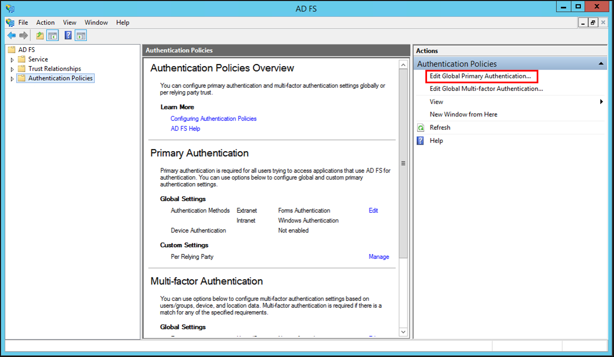
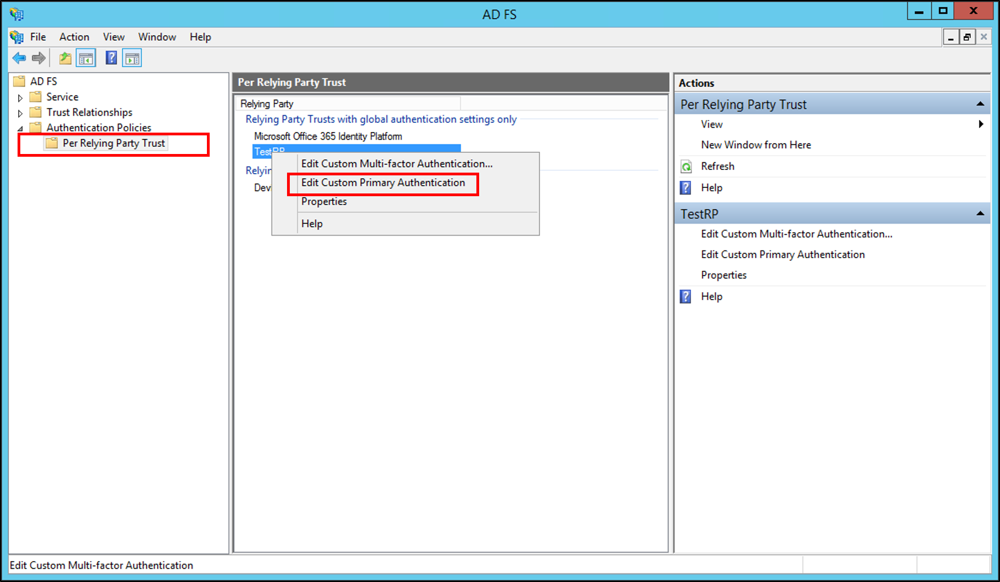
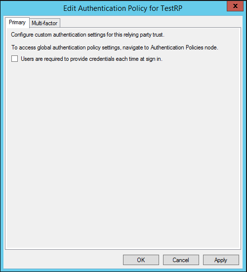
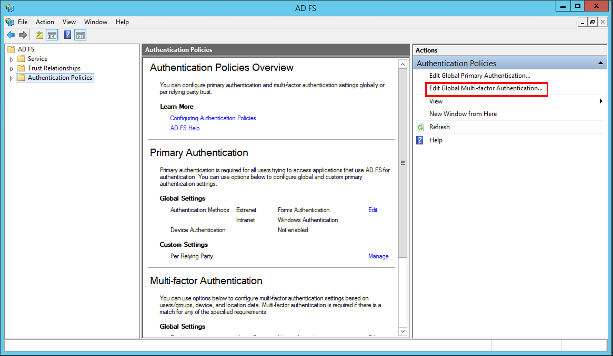

# Configure Authentication Policies

In AD FS, in Windows Server 2012 R2, both access control and the authentication mechanism are enhanced with multiple factors that include user, device, location, and authentication data. These enhancements enable you, either through the user interface or through Windows PowerShell, to manage the risk of granting access permissions to AD FS\-secured applications via multi\-factor access control and multi\-factor authentication that are based on user identity or group membership, network location, device data that is workplace\-joined, and the authentication state when multi\-factor authentication \(MFA\) was performed.  

For more information about MFA and multi\-factor access control in Active Directory Federation Services \(AD FS\) in  Windows Server 2012 R2 , see the following topics:  


-   [Join to Workplace from Any Device for SSO and Seamless Second Factor Authentication Across Company Applications](../../ad-fs/operations/Join-to-Workplace-from-Any-Device-for-SSO-and-Seamless-Second-Factor-Authentication-Across-Company-Applications.md)

-   [Manage Risk with Conditional Access Control](../../ad-fs/operations/Manage-Risk-with-Conditional-Access-Control.md)

-   [Manage Risk with Additional Multi-Factor Authentication for Sensitive Applications](../../ad-fs/operations/Manage-Risk-with-Additional-Multi-Factor-Authentication-for-Sensitive-Applications.md)

## Configure authentication policies via the AD FS Management snap\-in  
Membership in **Administrators**, or equivalent, on the local computer is the minimum requirement to complete these procedures.  Review details about using the appropriate accounts and group memberships at [Local and Domain Default Groups](https://go.microsoft.com/fwlink/?LinkId=83477).   

In AD FS, in Windows Server 2012 R2, you can specify an authentication policy at a global scope that is applicable to all applications and services that are secured by AD FS. You can also set authentication policies for specific applications and services that rely on party trusts and are secured by AD FS. Specifying an authentication policy for a particular application per relying party trust does not override the global authentication policy. If either global or per relying party trust authentication policy requires MFA, MFA is triggered when the user tries to authenticate to this relying party trust. The global authentication policy is a fallback for relying party trusts for applications and services that do not have a specific configured authentication policy. 

## To configure primary authentication globally in Windows Server 2012 R2 

1.  In Server Manager, click **Tools**, and then select **AD FS Management**.  

2.  In AD FS snap\-in, click **Authentication Policies**.  

3.  In the **Primary Authentication** section, click **Edit** next to **Global Settings**. You can also right\-click **Authentication Policies**, and select **Edit Global Primary Authentication**, or, under the **Actions** pane, select **Edit Global Primary Authentication**.  


4.  In the **Edit Global Authentication Policy** window, on the **Primary** tab, you can configure the following settings as part of the global authentication policy:  

    -   Authentication methods to be used for primary authentication. You can select available authentication methods under the **Extranet** and **Intranet**.  

    -   Device authentication via the **Enable device authentication** check box. For more information, see [Join to Workplace from Any Device for SSO and Seamless Second Factor Authentication Across Company Applications](../../ad-fs/operations/Join-to-Workplace-from-Any-Device-for-SSO-and-Seamless-Second-Factor-Authentication-Across-Company-Applications.md).  
  

## To configure primary authentication per relying party trust  

1.  In Server Manager, click **Tools**, and then select **AD FS Management**.  

2.  In AD FS snap\-in, click **Authentication Policies**\\**Per Relying Party Trust**, and then click the relying party trust for which you want to configure authentication policies.  

3.  Either right\-click the relying party trust for which you want to configure authentication policies, and then select **Edit Custom Primary Authentication**, or, under the **Actions** pane, select **Edit Custom Primary Authentication**.  
   

4.  In the **Edit Authentication Policy for <relying\_party\_trust\_name>** window, under the **Primary** tab, you can configure the following setting as part of the **Per Relying Party Trust** authentication policy:  

    -   Whether users are required to provide their credentials each time at sign\-in via the **Users are required to provide their credentials each time at sign\-in** check box.  
 

## To configure multi-factor authentication globally  

1.  In Server Manager, click **Tools**, and then select **AD FS Management**.  

2.  In AD FS snap\-in, click **Authentication Policies**.  

3.  In the **Multi\-factor Authentication** section, click **Edit** next to **Global Settings**. You can also right\-click **Authentication Policies**, and select **Edit Global Multi\-factor Authentication**, or, under the **Actions** pane, select **Edit Global Multi\-factor Authentication**.  
   

4.  In the **Edit Global Authentication Policy** window, under the **Multi\-factor** tab, you can configure the following settings as part of the global multi\-factor authentication policy:  

    -   Settings or conditions for MFA via available options under the **Users\/Groups**, **Devices**, and **Locations** sections.  

    -   To enable MFA for any of these settings, you must select at least one additional authentication method. **Certificate Authentication** is the default available option. You can also configure other custom additional authentication methods, for example, Windows Azure Active Authentication. For more information, see [Walkthrough Guide: Manage Risk with Additional Multi-Factor Authentication for Sensitive Applications](../../ad-fs/operations/Walkthrough-Guide--Manage-Risk-with-Additional-Multi-Factor-Authentication-for-Sensitive-Applications.md).  

> [!WARNING]  
> You can only configure additional authentication methods globally.  
  

## To configure multi\-factor authentication per relying party trust  

1.  In Server Manager, click **Tools**, and then select **AD FS Management**.  

2.  In AD FS snap\-in, click **Authentication Policies**\\**Per Relying Party Trust**, and then click the relying party trust for which you want to configure MFA.  

3.  Either right\-click the relying party trust for which you want to configure MFA, and then select **Edit Custom Multi\-factor Authentication**, or, under the **Actions** pane, select **Edit Custom Multi\-factor Authentication**.  

4.  In the **Edit Authentication Policy for <relying\_party\_trust\_name>** window, under the **Multi\-factor** tab, you can configure the following settings as part of the per\-relying party trust authentication policy:  

    -   Settings or conditions for MFA via available options under the **Users\/Groups**, **Devices**, and **Locations** sections.  

## Configure authentication policies via Windows PowerShell  
Windows PowerShell enables greater flexibility in using various factors of access control and the authentication mechanism that are available in AD FS in  Windows Server 2012 R2  to configure authentication policies and authorization rules that are necessary to implement true conditional access for your AD FS \-secured resources.  

Membership in Administrators, or equivalent, on the local computer is the minimum requirement to complete these procedures.  Review details about using the appropriate accounts and group memberships at [Local and Domain Default Groups](https://go.microsoft.com/fwlink/?LinkId=83477) \(http:\/\/go.microsoft.com\/fwlink\/?LinkId\=83477\).   

### To configure an additional authentication method via Windows PowerShell  

1.  On your federation server, open the Windows PowerShell command window and run the following command.  


~~~
`Set-AdfsGlobalAuthenticationPolicy –AdditionalAuthenticationProvider CertificateAuthentication  `
~~~


> [!WARNING]  
> To verify that this command ran successfully, you can run the `Get-AdfsGlobalAuthenticationPolicy` command.  

### To configure MFA per\-relying party trust that is based on a user's group membership data  

1.  On your federation server, open the Windows PowerShell command window and run the following command:  


~~~
`$rp = Get-AdfsRelyingPartyTrust –Name relying_party_trust`  
~~~


> [!WARNING]  
> Ensure to replace *<relying\_party\_trust>* with the name of your relying party trust.  

2. In the same Windows PowerShell command window, run the following command.  


~~~
$MfaClaimRule = “c:[Type == ‘“https://schemas.microsoft.com/ws/2008/06/identity/claims/groupsid'”, Value =~ ‘“^(?i) <group_SID>$'”] => issue(Type = ‘“https://schemas.microsoft.com/ws/2008/06/identity/claims/authenticationmethod'”, Value ‘“https://schemas.microsoft.com/claims/multipleauthn'”);” 

Set-AdfsRelyingPartyTrust –TargetRelyingParty $rp –AdditionalAuthenticationRules $MfaClaimRule
~~~


> [!NOTE]  
> Ensure to replace <group\_SID> with the value of the security identifier \(SID\) of your Active Directory \(AD\) group.  

### To configure MFA globally based on users' group membership data  

1.  On your federation server, open the Windows PowerShell command window and run the following command.  


~~~
$MfaClaimRule = “c:[Type == ‘" https://schemas.microsoft.com/ws/2008/06/identity/claims/groupsid'", Value == ‘"group_SID'"]  
 => issue(Type = ‘"https://schemas.microsoft.com/ws/2008/06/identity/claims/authenticationmethod'", Value = ‘"https://schemas.microsoft.com/claims/multipleauthn'");”  

Set-AdfsAdditionalAuthenticationRule $MfaClaimRule  
~~~


> [!NOTE]  
> Ensure to replace *<group\_SID>* with the value of the SID of your AD group.  

### To configure MFA globally based on user's location  

1.  On your federation server, open the Windows PowerShell command window and run the following command.  


~~~
$MfaClaimRule = “c:[Type == ‘" https://schemas.microsoft.com/ws/2012/01/insidecorporatenetwork'", Value == ‘"true_or_false'"]  
 => issue(Type = ‘"https://schemas.microsoft.com/ws/2008/06/identity/claims/authenticationmethod'", Value = ‘"https://schemas.microsoft.com/claims/multipleauthn'");”  

Set-AdfsAdditionalAuthenticationRule $MfaClaimRule  
~~~


> [!NOTE]  
> Ensure to replace *<true\_or\_false>* with either `true` or `false`. The value depends on your specific rule condition that is based on whether the access request comes from the extranet or the intranet.  

### To configure MFA globally based on user's device data  

1.  On your federation server, open the Windows PowerShell command window and run the following command.  


~~~
$MfaClaimRule = "c:[Type == ‘" https://schemas.microsoft.com/2012/01/devicecontext/claims/isregistereduser'", Value == ‘"true_or_false"']  
 => issue(Type = ‘"https://schemas.microsoft.com/ws/2008/06/identity/claims/authenticationmethod'", Value = ‘"https://schemas.microsoft.com/claims/multipleauthn'");"  

Set-AdfsAdditionalAuthenticationRule $MfaClaimRule  
~~~


> [!NOTE]  
> Ensure to replace *<true\_or\_false>* with either `true` or `false`. The value depends on your specific rule condition that is based on whether the device is workplace\-joined or not.  

### To configure MFA globally if the access request comes from the extranet and from a non\-workplace\-joined device  

1.  On your federation server, open the Windows PowerShell command window and run the following command.  


~~~
`Set-AdfsAdditionalAuthenticationRule "c:[Type == '"https://schemas.microsoft.com/2012/01/devicecontext/claims/isregistereduser'", Value == '"true_or_false'"] && c2:[Type == '"https://schemas.microsoft.com/ws/2012/01/insidecorporatenetwork'", Value == '" true_or_false '"] => issue(Type = '"https://schemas.microsoft.com/ws/2008/06/identity/claims/authenticationmethod'", Value ='"https://schemas.microsoft.com/claims/multipleauthn'");" ` 
~~~


> [!NOTE]  
> Ensure to replace both instances of *<true\_or\_false>* with either `true` or `false`, which depends on your specific rule conditions. The rule conditions are based on whether the device is workplace\-joined or not and whether the access request comes from the extranet or intranet.  

### To configure MFA globally if access comes from an extranet user that belongs to a certain group  

1.  On your federation server, open the Windows PowerShell command window and run the following command.  


~~~
Set-AdfsAdditionalAuthenticationRule "c:[Type == `"https://schemas.microsoft.com/ws/2008/06/identity/claims/groupsid`", Value == `"group_SID`"] && c2:[Type == `"https://schemas.microsoft.com/ws/2012/01/insidecorporatenetwork`", Value== `"true_or_false`"] => issue(Type = `"https://schemas.microsoft.com/ws/2008/06/identity/claims/authenticationmethod`", Value =`"https://schemas.microsoft.com/claims/
~~~

> [!NOTE]  
> Ensure to replace *<group\_SID>* with the value of the group SID and *<true\_or\_false>* with either `true` or `false`, which depends on your specific rule condition that is based on whether the access request comes from the extranet or intranet.  

### To grant access to an application based on user data via Windows PowerShell  

1.  On your federation server, open the Windows PowerShell command window and run the following command.  

    ```  
    $rp = Get-AdfsRelyingPartyTrust –Name relying_party_trust  

    ```  

> [!NOTE]  
> Ensure to replace *<relying\_party\_trust>* with the value of your relying party trust.  

2. In the same Windows PowerShell command window, run the following command.  

   ```  

     $GroupAuthzRule = "@RuleTemplate = `“Authorization`” @RuleName = `"Foo`" c:[Type == `"https://schemas.microsoft.com/ws/2008/06/identity/claims/groupsid`", Value =~ `"^(?i)<group_SID>$`"] =>issue(Type = `"https://schemas.microsoft.com/authorization/claims/deny`", Value = `"DenyUsersWithClaim`");"  
   Set-AdfsRelyingPartyTrust –TargetRelyingParty $rp –IssuanceAuthorizationRules $GroupAuthzRule  
   ```  

> [!NOTE]  
> > Ensure to replace *<group\_SID>* with the value of the SID of your AD group.  

### To grant access to an application that is secured by AD FS only if this user's identity was validated with MFA  

1.  On your federation server, open the Windows PowerShell command window and run the following command.  


~~~
`$rp = Get-AdfsRelyingPartyTrust –Name relying_party_trust ` 
~~~


> [!NOTE]  
> Ensure to replace *<relying\_party\_trust>* with the value of your relying party trust.  

2. In the same Windows PowerShell command window, run the following command.  

   ```  
   $GroupAuthzRule = "@RuleTemplate = `"Authorization`"  
   @RuleName = `"PermitAccessWithMFA`"  
   c:[Type == `"https://schemas.microsoft.com/claims/authnmethodsreferences`", Value =~ `"^(?i)https://schemas\.microsoft\.com/claims/multipleauthn$`"] => issue(Type = `"https://schemas.microsoft.com/authorization/claims/permit`", Value = ‘“PermitUsersWithClaim'");"  

   ```  

### To grant access to an application that is secured by AD FS only if the access request comes from a workplace\-joined device that is registered to the user  

1.  On your federation server, open the Windows PowerShell command window and run the following command.  

    ```  
    $rp = Get-AdfsRelyingPartyTrust –Name relying_party_trust  

    ```  

> [!NOTE]  
> Ensure to replace *<relying\_party\_trust>* with the value of your relying party trust.  

2. In the same Windows PowerShell command window, run the following command.  


~~~
$GroupAuthzRule = "@RuleTemplate = `"Authorization`"  
@RuleName = `"PermitAccessFromRegisteredWorkplaceJoinedDevice`"  
c:[Type == `"https://schemas.microsoft.com/2012/01/devicecontext/claims/isregistereduser`", Value =~ `"^(?i)true$`"] => issue(Type = `"https://schemas.microsoft.com/authorization/claims/permit`", Value = `"PermitUsersWithClaim`");  
~~~


### To grant access to an application that is secured by AD FS only if the access request comes from a workplace\-joined device that is registered to a user whose identity has been validated with MFA  

1.  On your federation server, open the Windows PowerShell command window and run the following command.  


~~~
`$rp = Get-AdfsRelyingPartyTrust –Name relying_party_trust ` 
~~~


> [!NOTE]  
> Ensure to replace *<relying\_party\_trust>* with the value of your relying party trust.  

2. In the same Windows PowerShell command window, run the following command.  

   ```  
   $GroupAuthzRule = ‘@RuleTemplate = “Authorization”  
   @RuleName = “RequireMFAOnRegisteredWorkplaceJoinedDevice”  
   c1:[Type == `"https://schemas.microsoft.com/claims/authnmethodsreferences`", Value =~ `"^(?i)http://schemas\.microsoft\.com/claims/multipleauthn$`"] &&  
   c2:[Type == `"https://schemas.microsoft.com/2012/01/devicecontext/claims/isregistereduser`", Value =~ `"^(?i)true$”] => issue(Type = "https://schemas.microsoft.com/authorization/claims/permit`", Value = `"PermitUsersWithClaim`");"  

   ```  

### To grant extranet access to an application secured by AD FS only if the access request comes from a user whose identity has been validated with MFA  

1.  On your federation server, open the Windows PowerShell command window and run the following command.  


~~~
`$rp = Get-AdfsRelyingPartyTrust –Name relying_party_trust`  
~~~


> [!NOTE]  
> Ensure to replace *<relying\_party\_trust>* with the value of your relying party trust.  

2. In the same Windows PowerShell command window, run the following command.  


~~~
$GroupAuthzRule = "@RuleTemplate = `"Authorization`"  
@RuleName = `"RequireMFAForExtranetAccess`"  
c1:[Type == `"https://schemas.microsoft.com/claims/authnmethodsreferences`", Value =~ `"^(?i)http://schemas\.microsoft\.com/claims/multipleauthn$`"] &&  
c2:[Type == `"https://schemas.microsoft.com/ws/2012/01/insidecorporatenetwork`", Value =~ `"^(?i)false$`"] => issue(Type = `"https://schemas.microsoft.com/authorization/claims/permit`", Value = `"PermitUsersWithClaim`");"  
~~~

## Additional references  

[AD FS Operations](../../ad-fs/AD-FS-2016-Operations.md)
