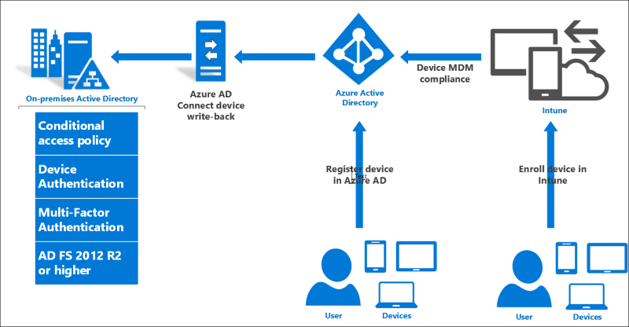
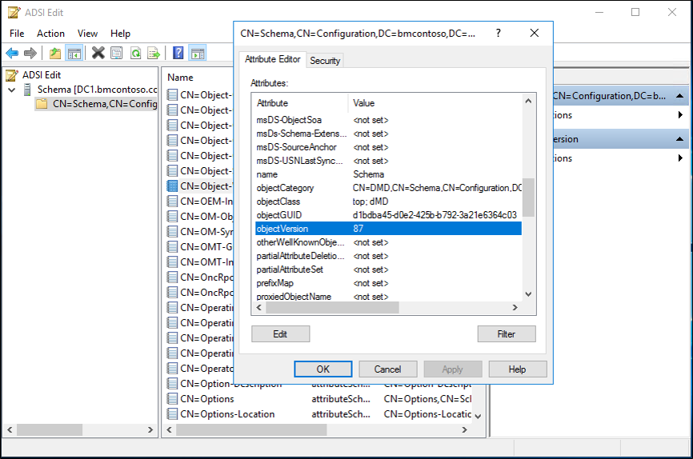
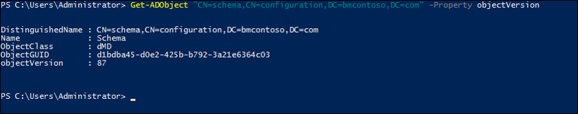

# Configure On-Premises Conditional Access using registered devices


The following document will guide you through installing and configuring on-premises conditional access with registered devices.

  

## Infrastructure pre-requisites
The following per-requisites are required before you can begin with on-premises conditional access. 

|Requirement|Description
|-----|-----
|An Azure AD subscription with Azure AD Premium | To enable device write back for on premises conditional access - [a free trial is fine](https://azure.microsoft.com/trial/get-started-active-directory/)  
|Intune subscription|only required for MDM integration for device compliance scenarios -[a free trial is fine](https://portal.office.com/Signup/Signup.aspx?OfferId=40BE278A-DFD1-470a-9EF7-9F2596EA7FF9&dl=INTUNE_A&ali=1#0)
|Azure AD Connect|November 2015 QFE or later.  Get the latest version [here](https://www.microsoft.com/en-us/download/details.aspx?id=47594).  
|Windows Server 2016|Build 10586 or newer for AD FS  
|Windows Server 2016 Active Directory schema|Schema level 85 or higher is required.
|Windows Server 2016 domain controller|This is only required for Hello For Business key-trust deployments.  Additional information can be found at [here](https://aka.ms/whfbdocs).  
|Windows 10 client|Build 10586 or newer, joined to the above domain is required for Windows 10 Domain Join and Microsoft Passport for Work scenarios only  
|Azure AD user account with Azure AD Premium license assigned|For registering the device  


 
## Upgrade your Active Directory Schema
In order to use on-premises conditional access with registered devices, you must first upgrade your AD schema.  The following conditions must be met:
    - The schema should be version 85 or later
    - This is only required for the forest that AD FS is joined to

> [!NOTE]
> If you installed Azure AD Connect prior to upgrading to the schema version (level 85 or greater) in Windows Server 2016, you will need to re-run the Azure AD Connect installation and refresh the on-premises AD schema to ensure the synchronization rule for msDS-KeyCredentialLink is configured.

### Verify your schema level
To verify your schema level, do the following:

1.  You can use ADSIEdit or LDP and connect to the Schema Naming Context.  
2.  Using ADSIEdit, right-click on "CN=Schema,CN=Configuration,DC=<domain>,DC=<com> and select properties.  Relpace domain and the com portions with your forest information.
3.  Under the Attribute Editor locate the objectVersion attribute and it will tell you, your version.  

  

You can also use the following PowerShell cmdlet (replace the object with your schema naming context information):

``` powershell
Get-ADObject "cn=schema,cn=configuration,dc=domain,dc=local" -Property objectVersion
    
```

 

For additional information on upgrading, see [Upgrade Domain Controllers to Windows Server 2016](../../ad-ds/deploy/Upgrade-Domain-Controllers-to-Windows-Server-2016.md). 

## Enable Azure AD Device Registration  
To configure this scenario, you must configure the device registration capability in Azure AD.  

To do this, follow the steps under [Setting up Azure AD Join in your organization](https://azure.microsoft.com/documentation/articles/active-directory-azureadjoin-setup/)  

## Setup AD FS  
1. Create the a [new AD FS 2016 farm](https://technet.microsoft.com/library/dn486775.aspx).   
2.  Or [migrate](../../ad-fs/deployment/Upgrading-to-AD-FS-in-Windows-Server-2016.md) a farm to AD FS 2016 from AD FS 2012 R2  
4. Deploy [Azure AD Connect](https://azure.microsoft.com/documentation/articles/active-directory-aadconnectfed-whatis/) using the Custom path to connect AD FS to Azure AD.  

## Configure Device Write Back and Device Authentication  
> [!NOTE]
> If you ran Azure AD Connect using Express Settings, the correct AD objects have been created for you.  However, in most AD FS scenarios, Azure AD Connect was run with Custom Settings to configure AD FS, so the below steps are necessary.  

### Create AD objects for AD FS Device Authentication  
If your AD FS farm is not already configured for Device Authentication (you can see this in the AD FS Management console under Service -> Device Registration), use the following steps to create the correct AD DS objects and configuration.  


>Note: The below commands require Active Directory administration tools, so if your federation server is not also a domain controller, first install the tools using step 1 below.  Otherwise you can skip step 1.  

1.  Run the **Add Roles & Features** wizard and select feature **Remote Server Administration Tools** -> **Role Administration Tools** -> **AD DS and AD LDS Tools** -> Choose both the **Active Directory module for Windows PowerShell** and the **AD DS Tools**.


  
2. On your AD FS primary server, ensure you are logged in as AD DS user with Enterprise Admin (EA ) privileges and open an elevated powershell prompt.  Then, execute the following PowerShell commands:  
    
   `Import-module activedirectory`  
   `PS C:\> Initialize-ADDeviceRegistration -ServiceAccountName "<your service account>" ` 
3. On the pop-up window hit Yes.

>Note: If your AD FS service is configured to use a GMSA account, enter the account name in the format "domain\accountname$"

  

The above PSH creates the following objects:  


- RegisteredDevices container under the AD domain partition  
- Device Registration Service container and object under Configuration --> Services --> Device Registration Configuration  
- Device Registration Service DKM container and object under Configuration --> Services --> Device Registration Configuration  

  

4. Once this is done, you will see a successful completion message.

 

###        Create Service Connection Point (SCP) in AD  
If you plan to use Windows 10 domain join (with automatic registration to Azure AD) as described here, execute the following commands to create a service connection point in AD DS  
1.  Open Windows PowerShell and execute the following:
    
	`PS C:>Import-Module -Name "C:\Program Files\Microsoft Azure Active Directory Connect\AdPrep\AdSyncPrep.psm1" ` 

>Note: if necessary, copy the AdSyncPrep.psm1 file from your Azure AD Connect server.  This file is located in Program Files\Microsoft Azure Active Directory Connect\AdPrep

   

2. Provide your Azure AD global administrator credentials  

	`PS C:>$aadAdminCred = Get-Credential`

 

3. Run the following PowerShell command 

   `PS C:>Initialize-ADSyncDomainJoinedComputerSync -AdConnectorAccount [AD connector account name] -AzureADCredentials $aadAdminCred ` 

Where the [AD connector account name] is the name of the account you configured in Azure AD Connect when adding your on-premises AD DS directory.
  
The above commands enable Windows 10 clients to find the correct Azure AD domain to join by creating the serviceConnectionpoint object in AD DS.  

### Prepare AD for Device Write Back   
To ensure AD DS objects and containers are in the correct state for write back of devices from Azure AD, do the following.

1.  Open Windows PowerShell and execute the following:  

    `PS C:>Initialize-ADSyncDeviceWriteBack -DomainName <AD DS domain name> -AdConnectorAccount [AD connector account name] ` 

Where the [AD connector account name] is the name of the account you configured in Azure AD Connect when adding your on-premises AD DS directory in domain\accountname format  

The above command creates the following objects for device write back to AD DS, if they do not exist already, and allows access to the specified AD connector account name  

- RegisteredDevices container in the AD domain partition  
- Device Registration Service container and object under Configuration --> Services --> Device Registration Configuration  

### Enable Device Write Back in Azure AD Connect  
If you have not done so before, enable device write back in Azure AD Connect by running the wizard a second time and selecting **"Customize Synchronization Options"**, then checking the box for device write back and selecting the forest in which you have run the above cmdlets  

### Configure Device Authentication in AD FS  
Using an elevated PowerShell command window, configure AD FS policy by executing the following command  

`PS C:>Set-AdfsGlobalAuthenticationPolicy -DeviceAuthenticationEnabled $true -DeviceAuthenticationMethod All` 

### Check your configuration  
For your reference, below is a comprehensive list of the AD DS devices, containers and permissions required for device write-back and authentication to work
 


- object of type ms-DS-DeviceContainer at CN=RegisteredDevices,DC=&lt;domain&gt;  		
	- read access to the AD FS service account   
	- read/write access to the Azure AD Connect sync AD connector account</br></br>

- Container CN=Device Registration Configuration,CN=Services,CN=Configuration,DC=&lt;domain&gt;  
- Container Device Registration Service DKM under the above container

 
 


- object of type serviceConnectionpoint at CN=&lt;guid&gt;, CN=Device Registration

- Configuration,CN=Services,CN=Configuration,DC=&lt;domain&gt;  
  - read/write access to the specified AD connector account name on the new object</br></br> 


- object of type msDS-DeviceRegistrationServiceContainer at CN=Device Registration Services,CN=Device Registration Configuration,CN=Services,CN=Configuration,DC=&ltdomain>  


- object of type msDS-DeviceRegistrationService in the above container  

### See it work  
To evaluate the new claims and policies, first register a device.  For example, you can Azure AD Join a Windows 10 computer using the Settings app under System -> About, or you can setup Windows 10 domain join with automatic device registration following the additional steps [here](https://azure.microsoft.com/documentation/articles/active-directory-azureadjoin-devices-group-policy/).  For information on joining Windows 10 mobile devices, see the document [here](https://technet.microsoft.com/itpro/windows/manage/join-windows-10-mobile-to-azure-active-directory).  

For easiest evaluation, sign on to AD FS using a test application that shows a list of claims. You will be able to see new claims including isManaged, isCompliant, and trusttype.  If you enable Microsoft Passport for work, you will also see the prt claim.  
 

## Configure Additional Scenarios  
### Automatic Registration for Windows 10 Domain Joined computers  
To enable automatic device registration for Windows 10 domain joined computers, follow steps 1 and 2 [here](https://azure.microsoft.com/documentation/articles/active-directory-azureadjoin-devices-group-policy/).   
This will help you achieve the following:  

1. Ensure your service connection point in AD DS exists and has the proper permissions (we created this object above, but it does not hurt to double check).  
2. Ensure AD FS is configured properly  
3. Ensure your AD FS system has the correct endpoints enabled and claim rules configured   
4. Configure the group policy settings required for automatic device registration of domain joined computers   

### Microsoft Passport for Work   
For information on enabling Windows 10 with Microsoft Passport for Work, see [Enable Microsoft Passport for Work in your organization.](https://azure.microsoft.com/documentation/articles/active-directory-azureadjoin-passport-deployment/)  

### Automatic MDM enrollment   
To enable automatic MDM enrollment of registered devices so that you can use the isCompliant claim in your access control policy, follow the steps [here.](https://blogs.technet.microsoft.com/ad/2015/08/14/windows-10-azure-ad-and-microsoft-intune-automatic-mdm-enrollment-powered-by-the-cloud/)  

## Troubleshooting  
1.  if you get an error on `Initialize-ADDeviceRegistration` that complains about an object already existing in the wrong state, such as "The drs service object has been found without all the required attributes", you may have executed Azure AD Connect powershell commands previously and have a partial configuration in AD DS.  Try deleting manually the objects under **CN=Device Registration Configuration,CN=Services,CN=Configuration,DC=&lt;domain&gt;** and trying again.  
2.  For Windows 10 domain joined clients  
    1. To verify that device authentication is working, sign on to the domain joined client as a test user account. To trigger provisioning quickly, lock and unlock the desktop at least one time.   
    2. Instructions to check for stk key credential link on AD DS object (does sync still have to run twice?)  
3.  If you get an error upon trying to register a Windows computer that the device was already enrolled, but you are unable or have already unenrolled the device, you may have a fragment of device enrollment configuration in the registry.  To investigate and remove this, use the following steps:  
    1. On the Windows computer, open Regedit and navigate to **HKLM\Software\Microsoft\Enrollments**   
    2. Under this key, there will be many subkeys in the GUID form.  Navigate to the subkey which has ~17 values in it and has "EnrollmentType" of  "6" [MDM joined] or "13" (Azure AD joined)  
    3. Modify **EnrollmentType** to **0** 
    4. Try the device enrollment or registration again  

### Related Articles  
* [Securing access to Office 365 and other apps connected to Azure Active Directory](https://azure.microsoft.com/documentation/articles/active-directory-conditional-access/)  
* [Conditional access device policies for Office 365 services](https://azure.microsoft.com/documentation/articles/active-directory-conditional-access-device-policies/)  
* [Setting up on-premises conditional access using Azure Active Directory Device Registration](https://docs.microsoft.com/azure/active-directory/active-directory-device-registration-on-premises-setup)  
* [Connect domain-joined devices to Azure AD for Windows 10 experiences](https://azure.microsoft.com/documentation/articles/active-directory-azureadjoin-devices-group-policy/)  
