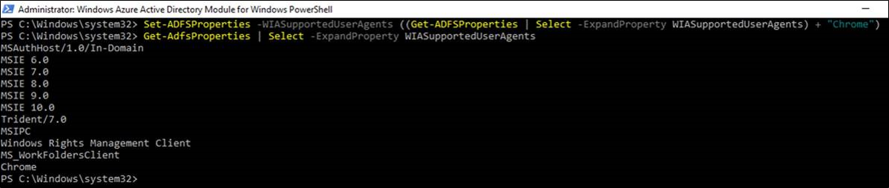

# Configuring intranet forms-based authentication for devices that do not support WIA

By default, Windows Integrated Authentication (WIA) is enabled in Active Directory Federation Services (AD FS) in Windows Server 2012 R2 for authentication requests that occur within the organization’s internal network (intranet) for any application that uses a browser for its authentication. For example, these can be browser-based applications that use WS-Federation or SAML protocols and rich applications that use the OAuth protocol. WIA provides end users with seamless logon to the applications without having to manually entering their credentials. However, some devices and browsers are not capable of supporting WIA and as a result authentication requests from these devices fail. Also, the experience on certain browsers that negotiate to NTLM is not desirable. The recommended approach is to fallback to forms-based authentication for such devices and browsers.

AD FS in Windows Server 2016 and Windows Server 2012 R2 provides the administrators with the ability to configure the list of user agents that support the fallback to forms-based authentication. The fallback is made possible by two configurations:

- The **WIASupportedUserAgentStrings** property of the `Set-ADFSProperties` commandlet
- The **WindowsIntegratedFallbackEnabled** property of the `Set-AdfsGlobalAuthenticationPolicy` commandlet

The **WIASupportedUserAgentStrings** defines the user agents which support WIA. AD FS analyzes the user agent string when performing logins in a browser or browser control. If the component of the user agent string does not match any of the components of the user agent strings that are configured in **WIASupportedUserAgentStrings** property, AD FS will fall back to providing forms-based authentication, provided that the **WindowsIntegratedFallbackEnabled** flag is set to True.

By default, a new AD FS installation has a set of user agent string matches created. However, these may be out of date based on changes to browsers and devices. Particularly, Windows devices have similar user agent strings with minor variations in the tokens. The following Windows PowerShell example provides the best guidance for the current set of devices that are on the market today that support seamless WIA:

    Set-AdfsProperties -WIASupportedUserAgents @("MSIE 6.0", "MSIE 7.0; Windows NT", "MSIE 8.0", "MSIE 9.0", "MSIE 10.0; Windows NT 6", "Windows NT 6.3; Trident/7.0", "Windows NT 6.3; Win64; x64; Trident/7.0", "Windows NT 6.3; WOW64; Trident/7.0", "Windows NT 6.2; Trident/7.0", "Windows NT 6.2; Win64; x64; Trident/7.0", "Windows NT 6.2; WOW64; Trident/7.0", "Windows NT 6.1; Trident/7.0", "Windows NT 6.1; Win64; x64; Trident/7.0", "Windows NT 6.1; WOW64; Trident/7.0", "MSIPC", "Windows Rights Management Client")

The command above will ensure that AD FS only covers the following use cases for WIA:

User Agents|Use cases|
-----|-----|
MSIE 6.0|IE 6.0|
MSIE 7.0; Windows NT|IE 7, IE in intranet zone. The “Windows NT” fragment is sent by desktop operation system.|
MSIE 8.0|IE 8.0 (no devices send this, so need to make more specific)|
MSIE 9.0|IE 9.0 (no devices send this, so no need to make this more specific)|
MSIE 10.0; Windows NT 6|IE 10.0 for Windows XP and newer versions of desktop operating system  Windows Phone 8.0 devices (with preference set to mobile) are excluded because they send  User-Agent: Mozilla/5.0 (compatible; MSIE 10.0; Windows Phone 8.0; Trident/6.0; IEMobile/10.0; ARM; Touch; NOKIA; Lumia 920)|
Windows NT 6.3; Trident/7.0  Windows NT 6.3; Win64; x64; Trident/7.0  Windows NT 6.3; WOW64; Trident/7.0| Windows 8.1 desktop operating system, different platforms|
Windows NT 6.2; Trident/7.0  Windows NT 6.2; Win64; x64; Trident/7.0  Windows NT 6.2; WOW64; Trident/7.0|Windows 8 desktop operating system, different platforms|
Windows NT 6.1; Trident/7.0  Windows NT 6.1; Win64; x64; Trident/7.0  Windows NT 6.1; WOW64; Trident/7.0|Windows 7 desktop operating system, different platforms|
MSIPC| Microsoft Information Protection and Control Client|
Windows Rights Management Client|Windows Rights Management Client|

In order to enable fallback to form based authentication for user agents other than those mentioned in the WIASupportedUserAgents string, set the WindowsIntegratedFallbackEnabled flag to true

    Set-AdfsGlobalAuthenticationPolicy -WindowsIntegratedFallbackEnabled $true

Also ensure that the forms based authentication is enabled for intranet.

## Configuring WIA for Chrome
You can add Chrome or other user agents to the AD FS configuration that supports WIA. This enables seamless logon to applications without having to manually enter credentials when you access resources protected by AD FS. Follow the steps below to enable WIA on Chrome:

In AD FS configuration, add a user agent string for Chrome on Windows-based platforms:

    Set-AdfsProperties -WIASupportedUserAgents ((Get-ADFSProperties | Select -ExpandProperty WIASupportedUserAgents) + "Mozilla/5.0 (Windows NT")

And similarly for Chrome on Apple macOS, add the following user agent string to the AD FS configuration:

    Set-AdfsProperties -WIASupportedUserAgents ((Get-ADFSProperties | Select -ExpandProperty WIASupportedUserAgents) + "Mozilla/5.0 (Macintosh; Intel Mac OS X")

Confirm that the user agent string for Chrome is now set in the AD FS properties:

    Get-AdfsProperties | Select -ExpandProperty WIASupportedUserAgents

(You would need a new screen shot here)
 

>[!NOTE]   
> As new browsers and devices are released, it is recommended that you reconcile the capabilities of those user agents and update the AD FS configuration accordingly to optimize the user’s authentication experience when using said browser and devices. More specifically, it is recommended that you re-evaluate the **WIASupportedUserAgents** setting in AD FS when adding a new device or browser type to your support matrix for WIA.

