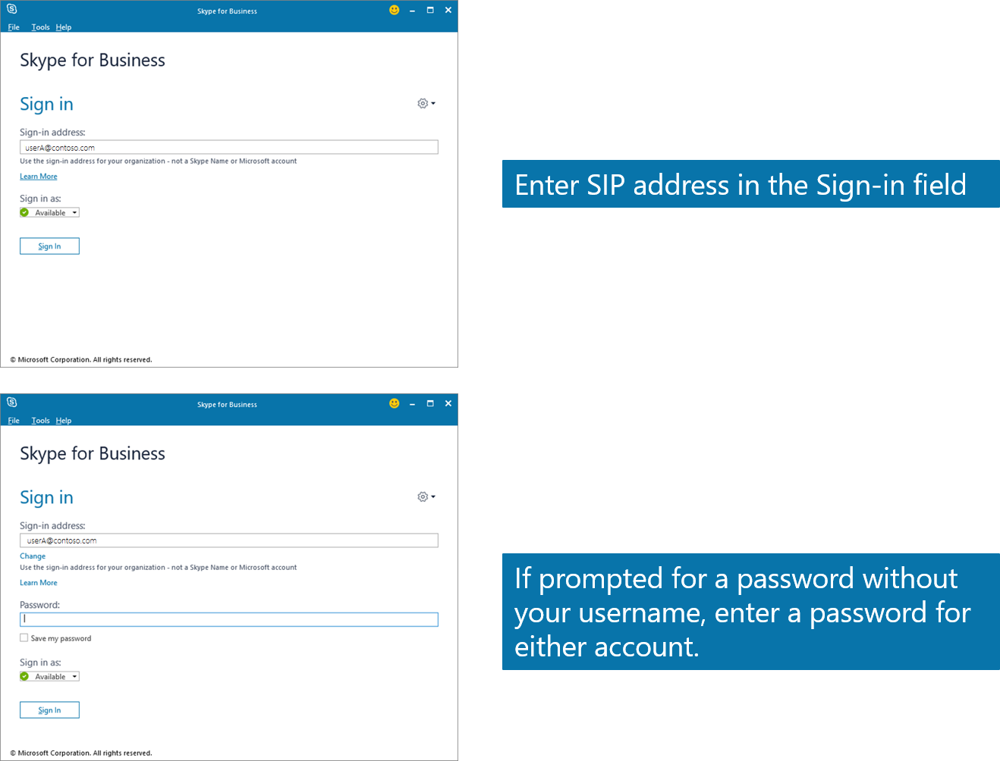
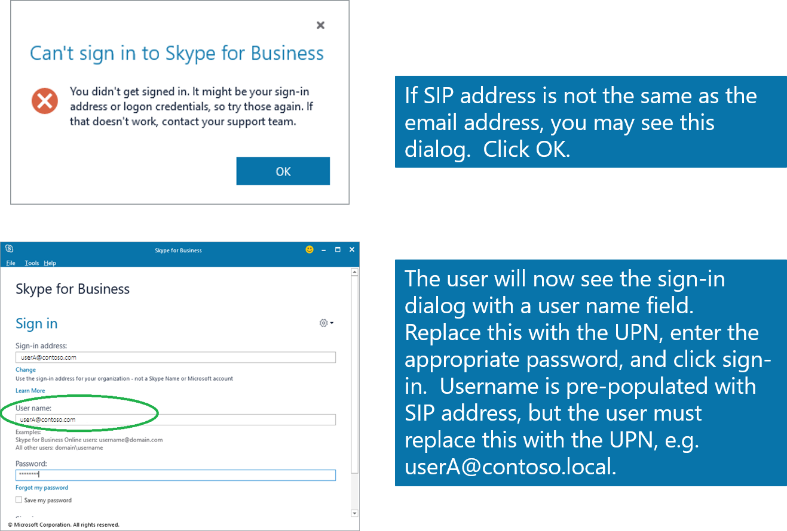
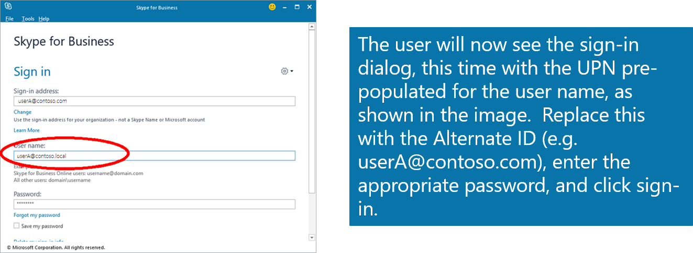

# Configuring Alternate Login ID

>Applies To: Windows Server 2016, Windows Server 2012 R2

Users can sign in to Active Directory Federation Services (AD FS) enabled applications using any form of user identifier that is accepted by Active Directory Domain Services (AD DS). These include User Principal Names (UPNs) (johndoe@contoso.com) or domain qualified sam-account names (contoso\johndoe or contoso.com\johndoe).

In some environments, due to corporate policy or on-premises line-of-business application dependencies, end users may only be aware of their email address and not their UPN or sam-account name. In some cases, the UPN is also non-routable (jdoe@contoso.local) and is only used for authenticating into applications on the corporate network.

Since non-routable domains' (ex. Contoso.local) ownership cannot be verified, Office 365 requires all user login IDs to be fully internet routable. If the on-premises UPN uses a non-routable domain (ex. Contoso.local), or the existing UPN cannot be changed due to local application dependencies, we recommend setting up alternate login ID. Alternate login ID allows you to configure a sign in experience where users can sign in with an attribute other than their UPN, such as mail.

One of the benefits of this feature is that it enables you to adopt SaaS providers, such as Office 365 without modifying your on-premises UPNs. It also enables you to support line-of-business service applications with consumer-provisioned identities.

> [!IMPORTANT]
> Using Alternate ID in hybrid environments with Exchange and/or Skype for Business is supported but not recommended. Using the same set of credentials (e.g. the UPN) for on-premises and online provides the best user experience in a hybrid environment.  Microsoft recommends customers change their UPNs if possible to avoid the need for Alternate ID. Using alternate ID with Lync or Skype for business requires Lync Server 2013 or later. Customers who use Alternate ID should consider enabling [Modern Authentication](https://support.office.com/article/using-office-365-modern-authentication-with-office-clients-776c0036-66fd-41cb-8928-5495c0f9168a) for Exchange in Office 365 for an improved user experience. In addition, customers using Skype for Business with mobile clients must ensure that the SIP address is identical to the user’s mail address (and alternate ID). 

Please refer to the table below for the user experience with Alternate ID using various Office 365 clients with Regular Authentication, Modern Authentication and Certificate Based Authentication (requires enabling Modern Authentication).

|**Client Types**|**Additional Information**|**Support Statement - Regular and Modern Authentication**|**Description**|
|--------------------|------------------------------|------------------------------|------------------------------|
|Outlook|Regular Authentication: You must be on a domain joined machine and connected to the corporate network<br /><br />Modern Authentication: Supported|You can only use Alternate ID in environments that do not allow external access for mailbox users. This means that users can only authenticate to there mailbox in a supported way when they are connected and joined to the corporate network, on a VPN, or connected via Direct Access. If you opt to configure Modern Authentication (Known as ADAL) you can use Outlook from non-domain joined/connected machines, but you will get a couple of extra prompts when configuring your Outlook  profile.<br /><br />See the first image below the table for user experience demo.|[Modern Authentication in Office 2013](https://blogs.office.com/2015/03/23/office-2013-modern-authentication-public-preview-announced/)|
|Hybrid Public Folders|Regular Authentication:  Not supported<br /><br />Modern Authentication: Supported|Hybrid Public Folders will not be able to expand if Alternate ID's are used and therefore should  not be used today with regular authentication methods. If you want to be able to use Public Folder in Hybrid you will have to configure Modern Authentication (Known as ADAL).<br /><br />See the first image below the table for user experience demo.|[Modern Authentication in Office 2013](https://blogs.office.com/2015/03/23/office-2013-modern-authentication-public-preview-announced/)|
|Cross premises Delegation|Not supported|Currently cross premises permissions are not supported in a hybrid configuration, but they also will not work if you use AltID.||
|Archive mailbox access (Mailbox on-premises - archive in the cloud)|Supported|Users will get an extra prompt for credentials when accessing the archive, they will have to provide there alternate ID when prompted.<br /><br />See the first image below the table for user experience demo.||
|Office 365 Pro Plus activation page|Supported - client side registry key recommended|With Alternate ID configured you will see the on-premises UPN is pre-populated In the verification field. This needs to be changed to the alternate Identity that is being used. We recommend to use the client side reg key  noted in the link column.<br /><br />See the second image below the table for user experience demo.|[Office 2013 and Lync 2013 periodically prompt for credentials to SharePoint Online, OneDrive, and Lync Online](https://support.microsoft.com/en-us/kb/2913639)|
|Microsoft Teams|Supported|Microsoft Teams supports AD FS (SAML-P, WS-Fed, WS-Trust, and OAuth) and Modern Authentication.<br/><br/> Core Microsoft Teams such as Channels, chats and files functionalities does work with Altnernate Login ID. </br></br>1st and 3rd party apps have to be separately investigated  by the customer. This is because each application has their own supportability authentication protocols.| 
|Skype for Business/ Lync|Supported (except as noted) but there is a potential for user confusion.  On mobile clients, Alternate Id is supported only if SIP address= email address = Alternate ID.|Users may need to sign-in twice to the Skype for Business desktop client, first using the on-premises UPN and then using the Alternate ID. (Note that the “Sign-in address” is actually the SIP address which may not be the same as the “User name”, though often is).  When first prompted for a User name, the user should enter the UPN, even if it is incorrectly pre-populated with the Alternate ID or SIP address. After the user clicks sign-in with the UPN, the User name prompt will reappear, this time prepopulated with the UPN. This time the user must replace this with the Alternate ID and click Sign in to complete the sign in process. On mobile clients, users should enter the on-premises user ID in the advanced page, using SAM-style format (domain\username), not UPN format.<br /><br />After successful sign-in, if Skype for Business or Lync says "Exchange needs your credentials", you need to provide the credentials that are valid for where the mailbox is located. If the mailbox is in the cloud you need to provide the Alternate ID. If the Mailbox is on-premises you need to provide the on-premises UPN.|[Modern Authentication in Office 2013](https://blogs.office.com/2015/03/23/office-2013-modern-authentication-public-preview-announced/)|
|Outlook Web Access|Supported|||
|Outlook Mobile Apps for Android, IOS, and Windows Phone|Supported|||
|OneDrive for Business|Supported - client side registry key recommended|With Alternate ID configured you will see the on-premises UPN is pre-populated In the verification field. This needs to be changed to the alternate Identity that is being used. We recommend to use the client side reg key  noted in the link column.<br /><br />See the second image below the table for user experience demo.|[Office 2013 and Lync 2013 periodically prompt for credentials to SharePoint Online, OneDrive, and Lync Online](https://support.microsoft.com/en-us/kb/2913639)|
|OneDrive for Business Mobile Client|Supported|||


Below, the following screenshots are an additional example using Skype for Business.  In example the following information is used


- SIP: userA@contoso.com 
- UPN:  userA@contoso.local
- Email: userA@contoso.com
- AltId: userA@contoso.com 

Enter SIP address in Sign-in field.







## To configure alternate login ID
In order to configure alternate login ID, you must perform the following tasks:

Configure your AD FS claims provider trusts to enable alternate login ID

1.  Install [KB2919355](https://go.microsoft.com/fwlink/?LinkID=396590).  You can get it via Windows Update Services or download it directly.

2.  Update the AD FS configuration by running the following PowerShell cmdlet on any of the federation servers in your farm (if you have a WID farm, you must run this command on the primary AD FS server in your farm):

    ```
    Set-AdfsClaimsProviderTrust -TargetIdentifier "AD AUTHORITY" -AlternateLoginID <attribute> -LookupForests <forest domain>

    ```

    **AlternateLoginID** is the LDAP name of the attribute that you want to use for login.

    **LookupForests** is the list of forest DNS that your users belong to.

    To enable alternate login ID feature, you must configure both -AlternateLoginID and -LookupForests parameters with a non-null, valid value.

    In the following example, you are enabling alternate login ID functionality such that your users with accounts in contoso.com and fabrikam.com forests can log in to AD FS-enabled applications with their "mail" attribute.

    ```
    Set-AdfsClaimsProviderTrust -TargetIdentifier "AD AUTHORITY" -AlternateLoginID mail -LookupForests contoso.com,fabrikam.com
    ```

3.  To disable this feature, set the value for both parameters to be null.

    ```
    Set-AdfsClaimsProviderTrust -TargetIdentifier "AD AUTHORITY" -AlternateLoginID $NULL -LookupForests $NULL
    ```

4.  To enable alternate login ID with Azure AD, no additional configurations steps are needed when using Azure AD Connect.   Alternate ID can be configured directly from the wizard.  See uniquely identifying your users under the section [Connect to Azure AD](https://azure.microsoft.com/en-us/documentation/articles/active-directory-aadconnect-get-started-custom/#connect-to-azure-ad).

## Additional Details & Considerations

-   The Alternate login ID feature is only available for federated environments with AD FS deployed.  It is not supported in the following scenarios:
	-   Non-routable domains (e.g. Contoso.local) that cannot be verified by Azure AD.
	-   Managed environments that do not have AD FS deployed.


-   When enabled, the alternate login ID feature is only available for username/password authentication across all the user name/password authentication protocols supported by AD FS (SAML-P, WS-Fed, WS-Trust, and OAuth).


-   When Windows Integrated Authentication (WIA) is performed (for example, when users try to access a corporate application on a domain-joined machine from intranet and AD FS administrator has configured the authentication policy to use WIA for intranet), UPN will be used for authentication. If you have configured any claim rules for the relying parties for alternate login ID feature, you should make sure those rules are still valid in the WIA case.

-   When enabled, the alternate login ID feature requires at least one global catalog server to be reachable from the AD FS server for each user account forest that AD FS supports. Failure to reach a global catalog server in the user account forest will result in AD FS falling back to use UPN. By default all the domain controllers are global catalog servers.

-   When enabled, if the AD FS server finds more than one user object with the same alternate login ID value specified across all the configured user account forests, it will fail the login.

-   When alternate login ID feature is enabled, AD FS will try to authenticate the end user with alternate login ID first and then fall back to use UPN if it cannot find an account that can be identified by the alternate login ID. You should make sure there are no clashes between the alternate login ID and the UPN if you want to still support the UPN login. For example, setting one's mail attribute with the other's UPN will block the other user from signing in with his UPN.

-   If one of the forests that is configured by the administrator is down, AD FS will continue to look up user account with alternate login ID in other forests that are configured. If AD FS server finds a unique user objects across the forests that it has searched, a user will log in successfully.

-   You may additionally want to customize the AD FS sign-in page to give end users some hint about the alternate login ID. You can do it by either adding the customized sign-in page description (for more information, see [Customizing the AD FS Sign-in Pages](https://technet.microsoft.com/library/dn280950.aspx) or customizing "Sign in with organizational account" string above username field (for more information, see [Advanced Customization of AD FS Sign-in Pages](https://technet.microsoft.com/library/dn636121.aspx).

-   The new claim type that contains the alternate login ID value is **http:schemas.microsoft.com/ws/2013/11/alternateloginid**

## Events and Performance Counters
The following performance counters have been added to measure the performance of AD FS servers when alternate login ID is enabled:

-   Alternate Login Id Authentications: number of authentications performed by using alternate login ID

-   Alternate Login Id Authentications/Sec: number of authentications performed by using alternate login ID per second

-   Average Search Latency for Alternate Login ID: average search latency across the forests that an administrator has configured for alternate login ID

The following are various error cases and corresponding impact on a user's sign-in experience with events logged by AD FS:


**Error Cases**|**Impact on Sign-in Experience**|**Event**|
---------|---------|---------
Unable to get a value for SAMAccountName for the user object|Login failure|Event ID 364 with exception message MSIS8012: Unable to find samAccountName for the user: '{0}'.|
The CanonicalName attribute is not accessible|Login failure|Event ID 364 with exception message MSIS8013: CanonicalName: '{0}' of the user:'{1}' is in bad format.|
Multiple user objects are found in one forests|Login failure|Event ID 364 with exception message MSIS8015: Found multiple user accounts with identity '{0}' in forest '{1}' with identities: {2}|
Multiple user objects are found across multiple forests|Login failure|Event ID 364 with exception message MSIS8014: Found multiple user accounts with identity '{0}' in forests: {1}|

## See Also
[AD FS Operations](../../ad-fs/AD-FS-2016-Operations.md)


