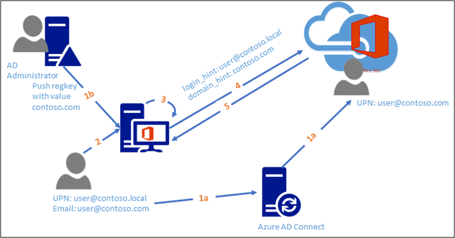

# Configuring Alternate Login ID


## What is Alternate Login ID?

In most scenarios, users use their UPN (User Principal Names) to login to their accounts. However, in some environments due to corporate policies or on-premises line-of-business application dependencies, the users may be using some other form of sign-in.

> [!NOTE]
> Microsoft's recommended best practices are to match UPN to primary SMTP address. This article addresses the small percentage of customers that cannot remediate UPN's to match.

For example, they can use their email ID for sign-in and it can be different from their UPN. This is particularly common in scenarios where their UPN is non-routable. Consider a user Jane Doe with UPN `jdoe@contoso.local` and email address `jdoe@contoso.com`. Jane might not be even aware of the UPN as she has always used her email ID for signing in. Use of any other sign-in method instead of UPN constitutes alternate ID. For more information on how the UPN is created, see [Microsoft Entra UserPrincipalName population](/azure/active-directory/connect/active-directory-aadconnect-userprincipalname).

Active Directory Federation Services (AD FS) enables federated applications using AD FS to sign in using alternate ID. This enables administrators to specify an alternative to the default UPN to be used for sign-in. AD FS already supports using any form of user identifier that is accepted by Active Directory Domain Services (AD DS). When configured for alternate ID, AD FS allows users to sign in using the configured alternate ID value, such as email ID. Using the alternate ID enables you to adopt SaaS providers like Office 365 without modifying your on-premises UPNs. It also enables you to support line-of-business service applications with consumer-provisioned identities.

<a name='alternate-id-in-azure-ad'></a>

## Alternate ID in Microsoft Entra ID

An organization may have to use alternate ID in the following scenarios:
1. The on-premises domain name is non-routable, such as `contoso.local`, and as a result the default user principal name is non-routable (`jdoe@contoso.local`). Existing UPN cannot be changed due to local application dependencies or company policies. Microsoft Entra ID and Office 365 require all domain suffixes associated with Microsoft Entra directory to be fully internet routable.
2. The on-premises UPN is not same as the user's email address and to sign-in to Office 365, users use email address and UPN cannot be used due to organizational constraints.
   In the above-mentioned scenarios, alternate ID with AD FS enables users to sign-in to Microsoft Entra ID without modifying your on-premises UPNs.

## Configure alternate logon ID

Using Microsoft Entra Connect
We recommend using Microsoft Entra Connect to configure alternate logon ID for your environment.

- For new configuration of Microsoft Entra Connect, see Connect to Microsoft Entra ID for detailed instruction on how to configure alternate ID and AD FS farm.
- For existing Microsoft Entra Connect installations, see Changing the user sign-in method for instructions on changing sign-in method to AD FS

When Microsoft Entra Connect is provided details about AD FS environment, it automatically checks for the presence of the right KB on your AD FS and configures AD FS for alternate ID including all necessary right claim rules for Microsoft Entra federation trust. There is no additional step required outside wizard to configure alternate ID.

> [!NOTE]
> Microsoft recommends using Microsoft Entra Connect to configure alternate logon ID.

### Manually configure alternate ID

In order to configure alternate login ID, you must perform the following tasks:

Configure your AD FS claims provider trusts to enable alternate login ID

1.  If you have Windows Server 2012 R2, ensure you have KB2919355 installed on all the AD FS servers. You can get it via Windows Update Services or download it directly.

2.  Update the AD FS configuration by running the following PowerShell cmdlet on any of the federation servers in your farm (if you have a WID farm, you must run this command on the primary AD FS server in your farm):

``` powershell
Set-AdfsClaimsProviderTrust -TargetIdentifier "AD AUTHORITY" -AlternateLoginID <attribute> -LookupForests <forest domain>
```

**AlternateLoginID** is the LDAP name of the attribute that you want to use for login.

**LookupForests** is the list of forest DNS that your users belong to.

To enable alternate login ID feature, you must configure both -AlternateLoginID and -LookupForests parameters with a non-null, valid value.

In the following example, you are enabling alternate login ID functionality such that your users with accounts in contoso.com and fabrikam.com forests can log in to AD FS-enabled applications with their "mail" attribute.

``` powershell
Set-AdfsClaimsProviderTrust -TargetIdentifier "AD AUTHORITY" -AlternateLoginID mail -LookupForests contoso.com,fabrikam.com
```

3. To disable this feature, set the value for both parameters to be null.

``` powershell
Set-AdfsClaimsProviderTrust -TargetIdentifier "AD AUTHORITY" -AlternateLoginID $NULL -LookupForests $NULL
```

## Hybrid Modern Authentication with Alternate ID

> [!IMPORTANT]
> The following has only been tested against AD FS and not third-party identity providers.

### Exchange and Skype for Business

If you are using alternate login ID with Exchange and Skype for Business, the user experience varies depending on whether or not you are using HMA.

> [!NOTE]
> For the best end-user experience, Microsoft recommends using Hybrid Modern Authentication.

or more information see, [Hybrid Modern Authentication Overview](https://support.office.com/article/Hybrid-Modern-Authentication-overview-and-prerequisites-for-using-it-with-on-premises-Skype-for-Business-and-Exchange-servers-ef753b32-7251-4c9e-b442-1a5aec14e58d)

### Pre-requisites for Exchange and Skype for Business

The following are pre-requisites for achieving SSO with alternate ID.

- Exchange Online should have Modern Authentication turned ON.
- Skype for Business (SFB) Online should have Modern Authentication turned ON.
- Exchange on-premises should have Modern Authentication turned ON.  Exchange 2013 CU19 or Exchange 2016 CU18 and up is required on all Exchange servers. No Exchange 2010 in the environment.
- Skype for Business on-premises should have Modern Authentication turned ON.
- You must use Exchange and Skype clients that have Modern Authentication enabled. All servers must be running SFB Server 2015 CU5.
- Skype for Business Clients that are Modern Authentication capable
   - iOS, Android, Windows Phone
   - SFB 2016 (MA is ON by default, but make sure it has not been disabled.)
   - SFB 2013 (MA is OFF by default, so ensure MA has been turned ON.)
   - SFB Mac desktop
- Exchange Clients that are Modern Authentication capable and support AltID regkeys
    - Office Pro Plus 2016 only

#### Supported Office version

Configuring your directory for SSO with Alternate ID

Using Alternate ID can cause extra prompts for authentication if these additional configurations are not completed. Refer to the article for possible impact on user experience with Alternate ID.

With the following additional configuration, the user experience is improved significantly, and you can achieve near zero prompts for authentication for Alternate ID users in your organization.

##### Step 1: Update to required Office version

Office version 1712 (build no 8827.2148) and above have updated the authentication logic to handle the Alternate ID scenario. In order to leverage the new logic, the client machines need to be updated to Office version 1712 (build no 8827.2148) and above.

##### Step 2: Update to required Windows version

Windows version 1709 and above have updated the authentication logic to handle the Alternate ID scenario. In order to leverage the new logic, the client machines need to be updated to Windows version 1709 and above.

##### Step 3: Configure registry for impacted users using group policy

The office applications rely on information pushed by the directory administrator to identify the Alternate ID environment. The following registry keys need to be configured to help office applications authenticate the user with Alternate ID without showing any extra prompts.

|Regkey to add|Regkey data name, type, and value|Windows 7/8|Windows 10|Description|
|-----|-----|-----|-----|-----|
|HKEY_CURRENT_USER\Software\Microsoft\AuthN|DomainHint</br>REG_SZ</br>contoso.com|Required|Required|The value of this regkey is a verified custom domain name in the tenant of the organization. For example, Contoso corp can provide a value of Contoso.com in this regkey if Contoso.com is one of the verified custom domain names in the tenant Contoso.onmicrosoft.com.|
HKEY_CURRENT_USER\Software\Microsoft\Office\16.0\Common\Identity|EnableAlternateIdSupport</br>REG_DWORD</br>1|Required for Outlook 2016 ProPlus|Required for Outlook 2016 ProPlus|The value of this regkey can be 1 / 0 to indicate to Outlook application whether it should engage the improved Alternate ID authentication logic.|
HKEY_CURRENT_USER\Software\Microsoft\Windows\CurrentVersion\Internet Settings\ZoneMap\Domains\contoso.com\sts|&#42;</br>REG_DWORD</br>1|Required|Required|This regkey can be used to set the STS as a trusted Zone in the internet settings. Standard AD FS deployment recommends adding the AD FS namespace to the Local Intranet Zone for Internet Explorer.|

## New authentication flow after additional configuration



1. a: User is provisioned in Microsoft Entra ID using Alternate ID
   </br>b: Directory administrator pushes required regkey settings to impacted client machines
2. User authenticates on the local machine and opens an office application
3. Office application takes the local session credentials
4. Office application authenticates to Microsoft Entra ID using domain hint pushed by administrator and local credentials
5. Microsoft Entra ID successfully authenticates the user by directing to correct federation realm and issue a token

## Applications and user experience after the additional configuration

### Non-Exchange and Skype for Business Clients

|Client|Support statement|Remarks|
| ----- | -----|-----|
|Microsoft Teams|Supported|<li>Microsoft Teams supports AD FS (SAML-P, WS-Fed, WS-Trust, and OAuth) and Modern Authentication.</li><li> Core Microsoft Teams such as Channels, chats and files functionalities does work with Alternate Login ID.</li><li>1st and 3rd party apps must be separately investigated by the customer. This is because each application has their own supportability authentication protocols.</li>|
|OneDrive for Business|Supported - client-side registry key recommended |With Alternate ID configured you see the on-premises UPN is pre-populated In the verification field. This needs to be changed to the alternate identity that is being used. We recommend using the client side registry key noted in this article: Office 2013 and Lync 2013 periodically prompt for credentials to SharePoint Online, OneDrive, and Lync Online.|
|OneDrive for Business Mobile Client|Supported||
|Office 365 Pro Plus activation page|Supported - client-side registry key recommended|With Alternate ID configured you see the on-premises UPN is pre-populated in the verification field. This needs to be changed to the alternate identity that is being used. We recommend using the client-side registry key noted in this article: Office 2013 and Lync 2013 periodically prompt for credentials to SharePoint Online, OneDrive, and Lync Online.|

### Exchange and Skype for Business Clients

|Client|Support Statement - with HMA|Support Statement - without HMA|
| ----- |----- | ----- |
|Outlook|Supported, no extra prompts|Supported</br></br>With **Modern Authentication** for Exchange Online: Supported</br></br>With **regular authentication** for Exchange Online: Supported with following caveats:</br><li>You must be on a domain joined machine and connected to the corporate network </li><li>You can only use Alternate ID in environments that do not allow external access for mailbox users. This means that users can only authenticate to their mailbox in a supported way when they are connected and joined to the corporate network, on a VPN, or connected via Direct Access machines, but you get a couple of extra prompts when configuring your Outlook profile.|
|Hybrid Public Folders|Supported, no extra prompts.|With **Modern Authentication** for Exchange Online: Supported</br></br>With **regular authentication** for Exchange Online: Not Supported</br></br><li>Hybrid Public Folders are not able to expand if Alternate IDs are used and therefore should not be used today with regular authentication methods.|
|Cross premises Delegation|See [Configure Exchange to support delegated mailbox permissions in a hybrid deployment](/exchange/hybrid-deployment/set-up-delegated-mailbox-permissions)|See [Configure Exchange to support delegated mailbox permissions in a hybrid deployment](/exchange/hybrid-deployment/set-up-delegated-mailbox-permissions)|
|Archive mailbox access (Mailbox on-premises - archive in the cloud)|Supported, no extra prompts|Supported - Users get an extra prompt for credentials when accessing the archive, they have to provide their alternate ID when prompted.|
|Outlook Web Access|Supported|Supported|
|Outlook Mobile Apps for Android, IOS, and Windows Phone|Supported|Supported|
|Skype for Business/ Lync|Supported, with no extra prompts|Supported (except as noted) but there is a potential for user confusion.</br></br>On mobile clients, Alternate ID is supported only if SIP address = email address = Alternate ID.</br></br> Users may need to sign-in twice to the Skype for Business desktop client, first using the on-premises UPN and then using the Alternate ID. (Note that the "Sign-in address" is actually the SIP address which may not be the same as the "User name", though often is). When first prompted for a User name, the user should enter the UPN, even if it is incorrectly pre-populated with the Alternate ID or SIP address. After the user clicks sign-in with the UPN, the User name prompt reappears, this time prepopulated with the UPN. This time the user must replace this with the Alternate ID and click Sign in to complete the sign in process. On mobile clients, users should enter the on-premises user ID in the advanced page, using SAM-style format (domain\username), not UPN format.</br></br>After successful sign-in, if Skype for Business or Lync says "Exchange needs your credentials", you need to provide the credentials that are valid for where the mailbox is located. If the mailbox is in the cloud you need to provide the Alternate ID. If the Mailbox is on-premises you need to provide the on-premises UPN.|

## Additional Details and Considerations

- Microsoft Entra ID offers different features related to 'Alternate login ID'
    - The AD FS Alternate Login ID [configuration](/windows-server/identity/ad-fs/operations/configuring-alternate-login-id#manually-configure-alternate-id) feature for Federated<sup>1</sup> identity infrastructure environments described in this article.
    - The Microsoft Entra Connect Sync [configuration](/azure/active-directory/hybrid/how-to-connect-install-custom#azure-ad-sign-in-configuration) that defines which on-premises attribute is used as Microsoft Entra username (userPrincipalName) for Federated<sup>1</sup> OR Managed<sup>2</sup> identity infrastructure environments, which is partially covered in this article.
    - The [Sign-in to Microsoft Entra ID with email as an alternate login ID](/azure/active-directory/authentication/howto-authentication-use-email-signin) feature for Managed<sup>2</sup> identity infrastructure environments.

- The Alternate login ID feature described in this article is available for Federated<sup>1</sup> identity infrastructure environments. It is not supported in the following scenarios:
    - An AlternateLoginID attribute with non-routable domains (e.g. Contoso.local) that cannot be verified by Microsoft Entra ID.
    - Managed environments that do not have AD FS deployed. Please either refer to the Microsoft Entra Connect Sync [documentation](/azure/active-directory/hybrid/how-to-connect-install-custom#azure-ad-sign-in-configuration) or to the [Sign-in to Microsoft Entra ID with email as an alternate login ID](/azure/active-directory/authentication/howto-authentication-use-email-signin) documentation. If you decide to adjust the Microsoft Entra Connect Sync configuration in a Managed<sup>2</sup> identity infrastructure environment, the [Applications and user experience after the additional configuration](/windows-server/identity/ad-fs/operations/configuring-alternate-login-id#applications-and-user-experience-after-the-additional-configuration) section of this article may still be applicable while the specific AD FS configuration is no longer applicable since no AD FS is deployed in a Managed<sup>2</sup> identity infrastructure environment.

- When enabled, the alternate login ID feature is only available for username/password authentication across all the user name/password authentication protocols supported by AD FS (SAML-P, WS-Fed, WS-Trust, and OAuth).

- When Windows Integrated Authentication (WIA) is performed (for example, when users try to access a corporate application on a domain-joined machine from intranet and AD FS administrator has configured the authentication policy to use WIA for intranet), UPN is used for authentication. If you have configured any claim rules for the relying parties for alternate login ID feature, you should make sure those rules are still valid in the WIA case.

- When enabled, the alternate login ID feature requires at least one global catalog server to be reachable from the AD FS server for each user account forest that AD FS supports. Failure to reach a global catalog server in the user account forest results in AD FS falling back to use UPN. By default all the domain controllers are global catalog servers.

- When enabled, if the AD FS server finds more than one user object with the same alternate login ID value specified across all the configured user account forests, it fails the login.

- When alternate login ID feature is enabled, AD FS tries to authenticate the end user with alternate login ID first and then fall back to use UPN if it cannot find an account that can be identified by the alternate login ID. You should make sure there are no clashes between the alternate login ID and the UPN if you want to still support the UPN login. For example, setting one's mail attribute with the other's UPN blocks the other user from signing in with his UPN.

- If one of the forests that is configured by the administrator is down, AD FS continues to look up user account with alternate login ID in other forests that are configured. If AD FS server finds a unique user objects across the forests that it has searched, a user logs in successfully.

- You may additionally want to customize the AD FS sign-in page to give end users some hint about the alternate login ID. You can do it by either adding the customized sign-in page description (for more information, see [Customizing the AD FS Sign-in Pages](/previous-versions/windows/it-pro/windows-server-2012-R2-and-2012/dn280950(v=ws.11)) or customizing "Sign in with organizational account" string above username field (for more information, see [Advanced Customization of AD FS Sign-in Pages](/previous-versions/windows/it-pro/windows-server-2012-R2-and-2012/dn636121(v=ws.11)).

- The new claim type that contains the alternate login ID value is **http:schemas.microsoft.com/ws/2013/11/alternateloginid**

<sup>1</sup> A **Federated** identity infrastructure environment represents an environment with an identity provider such as AD FS or other third-party IDP.

<sup>2</sup> A **Managed** identity infrastructure environment represents an environment with Microsoft Entra ID as the identity provider deployed with either [password hash sync (PHS)](/azure/active-directory/hybrid/whatis-phs) or [pass-through authentication (PTA)](/azure/active-directory/hybrid/how-to-connect-pta).

## Events and Performance Counters

The following performance counters have been added to measure the performance of AD FS servers when alternate login ID is enabled:

- Alternate Login ID Authentications: number of authentications performed by using alternate login ID

- Alternate Login ID Authentications/Sec: number of authentications performed by using alternate login ID per second

- Average Search Latency for Alternate Login ID: average search latency across the forests that an administrator has configured for alternate login ID

The following are various error cases and corresponding impact on a user's sign-in experience with events logged by AD FS:


|                       **Error Cases**                        | **Impact on Sign-in Experience** |                                                              **Event**                                                              |
|--------------------------------------------------------------|----------------------------------|-------------------------------------------------------------------------------------------------------------------------------------|
| Unable to get a value for SAMAccountName for the user object |          Login failure           |                  Event ID 364 with exception message MSIS8012: Unable to find samAccountName for the user: '{0}'.                   |
|        The CanonicalName attribute is not accessible         |          Login failure           |               Event ID 364 with exception message MSIS8013: CanonicalName: '{0}' of the user:'{1}' is in bad format.                |
|        Multiple user objects are found in one forests        |          Login failure           | Event ID 364 with exception message MSIS8015: Found multiple user accounts with identity '{0}' in forest '{1}' with identities: {2} |
|   Multiple user objects are found across multiple forests    |          Login failure           |           Event ID 364 with exception message MSIS8014: Found multiple user accounts with identity '{0}' in forests: {1}            |

## See Also

[AD FS Operations](../ad-fs-operations.md)
