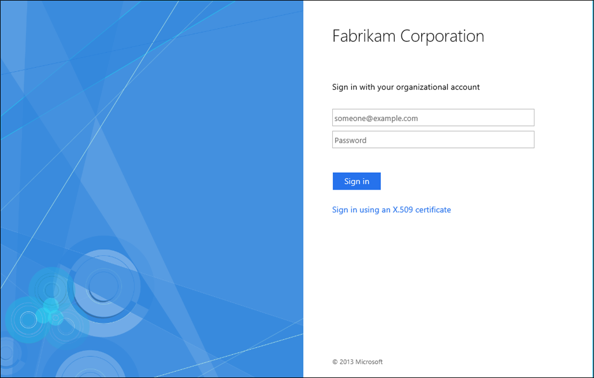
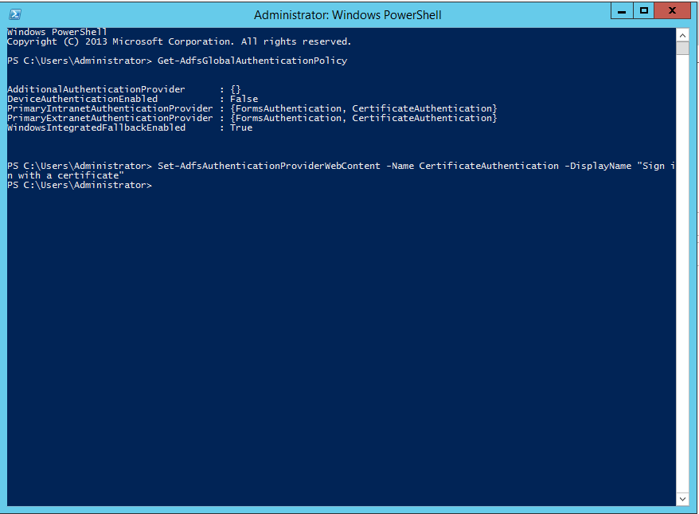

# Customize the display names and descriptions for authentication methods 

To customize the display names and descriptions for authentication methods you can use the `Set-AdfsAuthenticationProviderWebContent` PowerShell cmdlt.  In order to use this cmdlt, you must first obtain the name of the authentication method you wish to customize.  This can be done using `Get-AdfsGlobalAuthenticationPolicy`.  In the example below we see that, on our sign\-in page, the following is displayed:  “Sign in using an X.509 certificate”.  We want to simplify this for our users.  
  
  
  
So first we get the name of the authentication method and then we edit the displayed text.  
  
 
    Get-AdfsGlobalAuthenticationPolicy  
      
    AdditionalAuthenticationProvider  : {}  
    DeviceAuthenticationEnabled   : False  
    PrimaryIntranetAuthenticationProvider : {FormsAuthentication, CertificateAuthentication}  
    PrimaryExtranetAuthenticationProvider : {FormsAuthentication, CertificateAuthentication}  
    WindowsIntegratedFallbackEnabled  : True  
      
    Set-AdfsAuthenticationProviderWebContent -Name CertificateAuthentication -DisplayName "Sign in with a certificate"  
  
  
  
  
Now we see that our display message has changed.  
  
  

## Additional references 
[AD FS User Sign-in Customization](AD-FS-user-sign-in-customization.md) 
