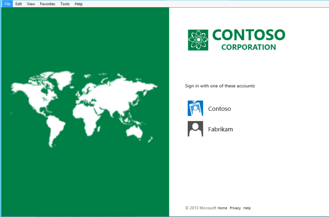

# Home Realm Discovery Customization

When the AD FS client first requests a resource, the resource federation server has no information about the realm of the client. The resource federation server responds to the AD FS client with a **Client Realm Discovery** page, where the user selects the home realm from a list. The list values are populated from the display name property in the Claims Provider Trusts. Use the following Windows PowerShell cmdlets to modify and customize the AD FS Home Realm Discovery experience.  
  
  
  
> [!WARNING]  
> Be aware that the Claims Provider name that shows up for local Active Directory is the federation service display name.  
  

## Configure Identity Provider to use certain email suffixes  
An organization can federate with multiple claims providers. AD FS now provides the in\-box capability for administrators to list the suffixes, for example, @us.contoso.com, @eu.contoso.com, that is supported by a claims provider and enable it for suffix\-based discovery. With this configuration, end users can type in their organizational account, and AD FS automatically selects the corresponding claims provider.  
  
To configure an identity provider \(IDP\), such as `fabrikam`, to use certain email suffixes, use the following Windows PowerShell cmdlet and syntax.  
  

`Set-AdfsClaimsProviderTrust -TargetName fabrikam -OrganizationalAccountSuffix @("fabrikam.com";"fabrikam2.com") ` 
 
>[!NOTE]
> When federating between two AD FS servers, set PromptLoginFederation property on the claims provider trust to ForwardPromptAndHintsOverWsFederation.  This is so that AD FS will forward the login_hint and prompt parmeter to the IDP.  This can be done by running the following PowerShell cmdlet:
>
>`Set-AdfsclaimsProviderTrust -PromptLoginFederation ForwardPromptAndHintsOverWsFederation`

## Configure an identity provider list per relying party  
For some scenarios, an organizations might want end users to only see the claims providers that are specific to an application so that only a subset of claims provider are displayed on the home realm discovery page.  
  
To configure an IDP list per relying party \(RP\), use the following Windows PowerShell cmdlet and syntax.  
  
 
`Set-AdfsRelyingPartyTrust -TargetName claimapp -ClaimsProviderName @("Fabrikam","Active Directory") ` 

  
## Bypass Home Realm Discovery for the intranet  
Most organizations only support their local Active Directory for any user who accesses from inside their firewall. In those cases, administrators can configure AD FS to bypass home realm discovery for the intranet.  
  
To bypass HRD for the intranet, use the following Windows PowerShell cmdlet and syntax.  
  

`Set-AdfsProperties -IntranetUseLocalClaimsProvider $true ` 
 
  
> [!IMPORTANT]  
> Please note that if an identity provider list for a relying party has been configured, even though the previous setting has been enabled and the user accesses from the intranet, AD FS still shows the home realm discovery \(HRD\) page. To bypass HRD in this case, you have to ensure that "Active Directory" is also added to the IDP list for this relying party.  

## Additional references 
[AD FS User Sign-in Customization](AD-FS-user-sign-in-customization.md)  
