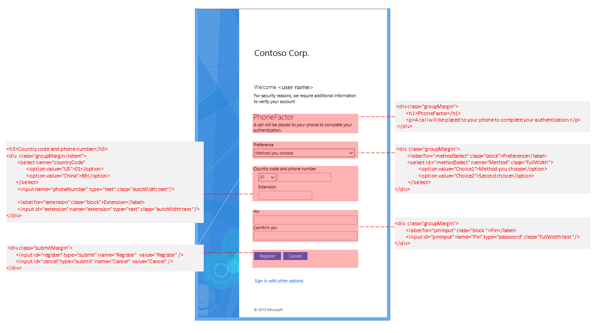
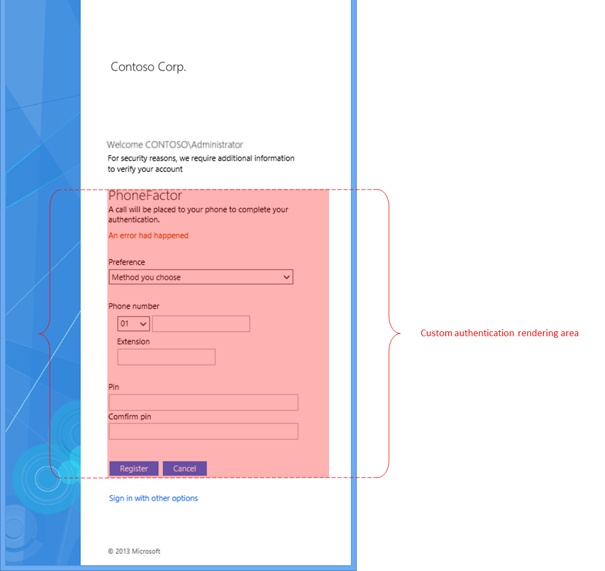

# Multi-factor authentication and external authentication providers customization 

In AD FS, the support for multifactor authentication is provided out\-of\-the\-box. For example, you can configure AD FS to use built\-in Certificate Authentication as the second factor authentication. You can also use external authentication providers. This approach can enable AD FS to integrate with additional services, such as Azure Multi-factor Authentication, or you can develop your own provider. See [Solution Guide: Manage Risk with Multi\-factor Access Control](https://technet.microsoft.com/library/dn280937.aspx) for more information about how to register external authentication provider by using AD FS.  
  
We recommend that an external authentication provider use the classes that are defined in the .css file that AD FS provides to author the authentication UI. You can use the following cmdlet to export the default web theme and inspect the user interface classes and elements that are defined in the .css file. The .css file can be used in the development of the sign\-in user interface of an external authentication provider.  
  

    Export-AdfsWebTheme -Name default -DirectoryPath C:\theme  
 
  
The following is an example of the sign\-in user interface, which is highlighted in RED, by an external authentication provider. The user interface uses the UI classes in the AD FS .css file.  
  
  
  
Before you write a new custom authentication method, we recommend that you study the AD FS theme and style definitions to understand the content authoring requirements.  
  
-   A custom authentication method only authors an HTML segment on the AD FS sign\-in page and not the full page. You should use AD FS's style definition to get the consistent appearance and behavior.  
  
  
  
-   Be aware that AD FS administrators can customize the AD FS styles. . We do not recommend to hardcode your own styles. Instead, we recommend to use AD FS styles whenever possible.  
  
-   Out\-of\-the box, AD FS styles are authored with one left\-to\-right \(LTR\) style and one right\-to\-left \(RTL\). Administrators can customize both, and can provide language\-specific styles through the web theme definition. Each style sheet has three sections with respective comments:  
  
    -   **theme styles** \- These styles should not and cannot be used. These styles are meant to define theme across all pages. They are defined by an element ID purposely so that they are not reused.  
  
    -   **common styles** \- These are the styles that should be used for your content.  
  
    -   **form factor styles** \- These are styles for different form factors. You should understand this section to ensure that your content works with different form factors, for example, phones and tablets.  
  
For additional information, see [Solution Guide: Manage Risk with Multi\-factor Access Control](https://technet.microsoft.com/library/dn280937.aspx) and [Solution Guide: Manage Risk with Additional Multi\-Factor Authentication for Sensitive Applications](https://tnstage.redmond.corp.microsoft.com/library/dn280949.aspx).  

## Additional references 
[AD FS User Sign-in Customization](AD-FS-user-sign-in-customization.md) 
