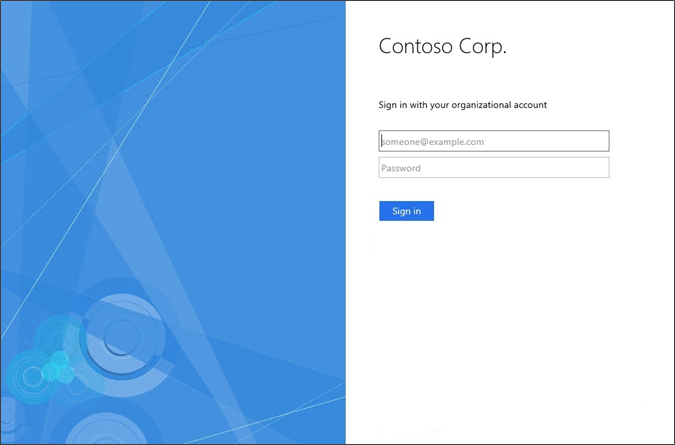

# Remove the Microsoft copyright 


 
By default, the AD FS pages contain the Microsoft copyright. To remove this copyright from your customized pages, you can use the following procedure. 

 
  
## To remove the Microsoft copyright  
  
1. Create a custom theme that is based on the default.

   ```powershell
   New-AdfsWebTheme –Name custom –SourceName default
   ```

2. Export the theme by specifying the output folder.  

   ```powershell
   Export-AdfsWebTheme -Name custom -DirectoryPath C:\CustomWebTheme
   ```

3. Locate the `Style.css` file that is located in the output folder. By using the previous example, the path would be `C:\CustomWebTheme\Css\Style.css.`
  
4. Open the `Style.css` file with an editor, such as Notepad.  
  
5. Locate the `#copyright` portion, and then change it to the following:  

   ```css
   #copyright {color:#696969; display:none;}
   ```

6. Create a custom theme that is based on the new `Style.css` file.  

   ```powershell
   Set-AdfsWebTheme -TargetName custom -StyleSheet @{locale="";path="C:\customWebTheme\css\style.css"}
   ```

7. Activate the new theme.  

   ```powershell
   Set-AdfsWebConfig -ActiveThemeName custom
   ```

Now, you should no longer see the copyright at the bottom of the sign-in page.

 

## Additional references 
[AD FS User Sign-in Customization](AD-FS-user-sign-in-customization.md) 
