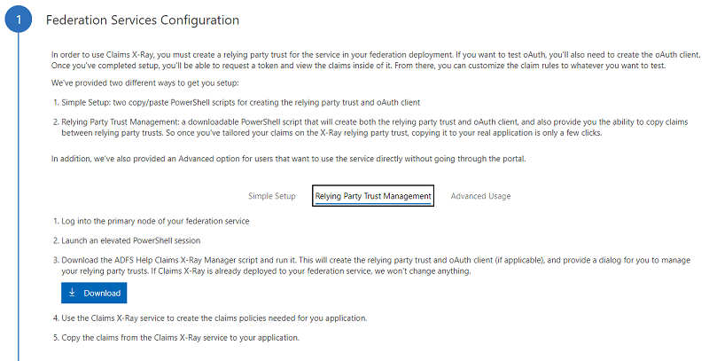
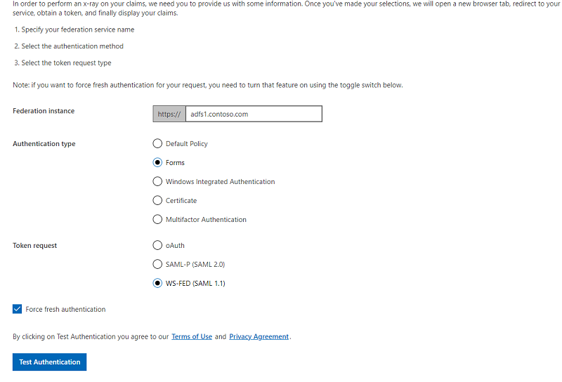

# Set up an AD FS lab environment

This topic outlines the steps to configure a test environment that can be used to complete the walkthroughs in the following walkthrough guides:

-   [Walkthrough: Workplace Join with an iOS Device](Walkthrough--Workplace-Join-with-an-iOS-Device.md)

-   [Walkthrough: Workplace Join with a Windows Device](Walkthrough--Workplace-Join-with-a-Windows-Device.md)

-   [Walkthrough Guide: Manage Risk with Conditional Access Control](Walkthrough-Guide--Manage-Risk-with-Conditional-Access-Control.md)

-   [Walkthrough Guide: Manage Risk with Additional Multi-Factor Authentication for Sensitive Applications](Walkthrough-Guide--Manage-Risk-with-Additional-Multi-Factor-Authentication-for-Sensitive-Applications.md)


To set up this test environment, complete the following steps:

1.  [Step 1: Configure the domain controller (DC1)](../../ad-fs/operations/Set-up-the-lab-environment-for-AD-FS-in-Windows-Server-2012-R2.md#BKMK_1)

2.  [Step 2: Configure the federation server (ADFS1) with Device Registration Service](../../ad-fs/operations/Set-up-the-lab-environment-for-AD-FS-in-Windows-Server-2012-R2.md#BKMK_4)

3.  [Step 3: Configure Claims X-Ray as a sample claims-based application](../../ad-fs/operations/Set-up-the-lab-environment-for-AD-FS-in-Windows-Server-2012-R2.md#BKMK_5)

4.  [Step 4: Configure the client computer (Client1)](../../ad-fs/operations/Set-up-the-lab-environment-for-AD-FS-in-Windows-Server-2012-R2.md#BKMK_10)

## <a name="BKMK_1"></a>Step 1: Configure the domain controller (DC1)
For the purposes of this test environment, you can call your root Active Directory domain **contoso.com** and specify <strong>pass@word1</strong> as the administrator password.

-   Install the AD DS role service and install Active Directory Domain Services (AD DS) to make your computer a domain controller in  Windows Server 2012 R2 . This action upgrades your AD DS schema as part of the domain controller creation. For more information and step-by-step instructions, see[https://technet.microsoft.com/ library/hh472162.aspx](../../ad-ds/deploy/install-active-directory-domain-services--level-100-.md).

### <a name="BKMK_2"></a>Create test Active Directory accounts
After your domain controller is functional, you can create a test group and test user accounts in this domain and add the user account to the group account. You use these accounts to complete the walkthroughs in the walkthrough guides that are referenced earlier in this topic.

Create the following accounts:

- User: **Robert Hatley** with the following credentials: User name: **RobertH** and password: <strong>P@ssword</strong>

- Group: **Finance**

For information about how to create user and group accounts in Active Directory (AD), see [https://technet.microsoft.com/library/cc783323%28v=ws.10%29.aspx](/previous-versions/windows/it-pro/windows-server-2003/cc783323(v=ws.10)).

Add the **Robert Hatley** account to the **Finance** group. For information on how to add a user to a group in Active Directory, see [https://technet.microsoft.com/library/cc737130%28v=ws.10%29.aspx](/previous-versions/windows/it-pro/windows-server-2003/cc737130(v=ws.10)).

### Create a GMSA account
The group Managed Service Account (GMSA) account is required during the Active Directory Federation Services (AD FS) installation and configuration.

##### To create a GMSA account

1.  Open a Windows PowerShell command window and type:

    ```
    Add-KdsRootKey –EffectiveTime (Get-Date).AddHours(-10)
    New-ADServiceAccount FsGmsa -DNSHostName adfs1.contoso.com -ServicePrincipalNames http/adfs1.contoso.com

    ```

## <a name="BKMK_4"></a>Step 2: Configure the federation server (ADFS1) by using Device Registration Service
To set up another virtual machine, install  Windows Server 2012 R2  and connect it to the domain **contoso.com**. Set up the computer after you have joined it to the domain, and then proceed to install and configure the AD FS role.

For a video, see [Active Directory Federation Services How-To Video Series: Installing an AD FS Server Farm](https://channel9.msdn.com/Search?term=Active%20Directory%20Federation%20Services#pubDate=year&ch9Search).

### Install a server SSL certificate
You must install a server Secure Socket Layer (SSL) certificate on the ADFS1 server in the local computer store. The certificate MUST have the following attributes:

-   Subject Name (CN): adfs1.contoso.com

-   Subject Alternative Name (DNS): adfs1.contoso.com

-   Subject Alternative Name (DNS): enterpriseregistration.contoso.com

[Certificate Enrollment Web Service Guidance](/previous-versions/windows/it-pro/windows-server-2012-r2-and-2012/hh831822(v=ws.11)#configure-a-ca-for-the-certificate-enrollment-web-service)

[Active Directory Federation Services How-To Video Series: Updating Certificates](https://channel9.msdn.com/Search?term=Active%20Directory%20Federation%20Services#pubDate=year&ch9Search).

### Install the AD FS server role

##### To install the Federation Service role service

1. Log on to the server by using the domain administrator account administrator@contoso.com.

2. Start Server Manager. To start Server Manager, click **Server Manager** on the Windows **Start** screen, or click **Server Manager** on the Windows taskbar on the Windows desktop. On the **Quick Start** tab of the **Welcome** tile on the **Dashboard** page, click **Add roles and features**. Alternatively, you can click **Add Roles and Features** on the **Manage** menu.

3. On the **Before you begin** page, click **Next**.

4. On the **Select installation type** page, click **Role-based or feature-based installation**, and then click **Next**.

5. On the **Select destination server** page, click **Select a server from the server pool**, verify that the target computer is selected, and then click **Next**.

6. On the **Select server roles** page, click **Active Directory Federation Services**, and then click **Next**.

7. On the **Select features** page, click **Next**.

8. On the **Active Directory Federation Service (AD FS)** page, click **Next**.

9. After you verify the information on the **Confirm installation selections** page, select the **Restart the destination server automatically if required** check box, and then click **Install**.

10. On the **Installation progress** page, verify that everything installed correctly, and then click **Close**.

### Configure the federation server
The next step is to configure the federation server.

##### To configure the federation server

1.  On the Server Manager **Dashboard** page, click the **Notifications** flag, and then click **Configure the federation service on the server**.

    The **Active Directory Federation Service Configuration Wizard** opens.

2.  On the **Welcome** page, select **Create the first federation server in a federation server farm**, and then click **Next**.

3.  On the **Connect to AD DS** page, specify an account with domain administrator rights for the **contoso.com** Active Directory domain that this computer is joined to, and then click **Next**.

4.  On the **Specify Service Properties** page, do the following, and then click **Next**:

    -   Import the SSL certificate that you have obtained earlier. This certificate is the required service authentication certificate. Browse to the location of your SSL certificate.

    -   To provide a name for your federation service, type **adfs1.contoso.com**. This value is the same value that you provided when you enrolled an SSL certificate in Active Directory Certificate Services (AD CS).

    -   To provide a display name for your federation service, type **Contoso Corporation**.

5.  On the **Specify Service Account** page, select **Use an existing domain user account or group Managed Service Account**, and then specify the GMSA account **fsgmsa** that you created when you created the domain controller.

6.  On the **Specify Configuration Database** page, select **Create a database on this server using Windows Internal Database**, and then click **Next**.

7.  On the **Review Options** page, verify your configuration selections, and then click **Next**.

8.  On the **Pre-requisite Checks** page, verify that all prerequisite checks were successfully completed, and then click **Configure**.

9. On the **Results** page, review the results, check whether the configuration has completed successfully, and then click **Next steps required for completing your federation service deployment**.

### Configure Device Registration Service
The next step is to configure Device Registration Service on the ADFS1 server. For a video, see [Active Directory Federation Services How-To Video Series: Enabling the Device Registration Service](https://channel9.msdn.com/).

##### To configure Device Registration Service for Windows Server 2012 RTM

1.  > [!IMPORTANT]
    > **The following step applies to the Windows Server 2012 R2 RTM build.**

    Open a Windows PowerShell command window and type:

    ```
    Initialize-ADDeviceRegistration
    ```

    When you are prompted for a service account, type **contosofsgmsa$**.

    Now run the Windows PowerShell cmdlet.

    ```
    Enable-AdfsDeviceRegistration
    ```

2.  On the ADFS1 server, in the **AD FS Management** console, navigate to **Authentication Policies**. Select **Edit Global Primary Authentication**. Select the check box next to **Enable Device Authentication**, and then click **OK**.

### Add Host (A) and Alias (CNAME) Resource Records to DNS
On DC1, you must ensure that the following Domain Name System (DNS) records are created for Device Registration Service.

|Entry|Type|Address|
|---------|--------|-----------|
|adfs1|Host (A)|IP address of the AD FS server|
|enterpriseregistration|Alias (CNAME)|adfs1.contoso.com|

You can use the following procedure to add a host (A) resource record to corporate DNS name servers for the federation server and Device Registration Service.

Membership in the Administrators group or an equivalent is the minimum requirement to complete this procedure. Review details about using the appropriate accounts and group memberships in the  HYPERLINK "<https://go.microsoft.com/fwlink/?LinkId=83477>" Local and Domain Default Groups (<https://go.microsoft.com/fwlink/p/?LinkId=83477>).

##### To add a host (A) and alias (CNAME) resource records to DNS for your federation server

1.  On DC1, from Server Manager, on the **Tools** menu, click **DNS** to open the DNS snap-in.

2.  In the console tree, expand DC1, expand **Forward Lookup Zones**, right-click **contoso.com**, and then click **New Host (A or AAAA)**.

3.  In **Name,** type the name you want to use for your AD FS farm. For this walkthrough, type **adfs1**.

4.  In **IP address**, type the IP address of the ADFS1 server. Click **Add Host**.

5.  Right-click **contoso.com**, and then click **New Alias (CNAME)**.

6.  In the **New Resource Record** dialog box, type **enterpriseregistration** in the **Alias name** box.

7.  In the Fully Qualified Domain Name (FQDN) of the target host box, type **adfs1.contoso.com**, and then click **OK**.

    > [!IMPORTANT]
    > In a real-world deployment, if your company has multiple user principal name (UPN) suffixes, you must create multiple CNAME records, one for each of those UPN suffixes in DNS.

## <a name="BKMK_5"></a>Step 3: Configure Claims X-Ray as a sample claims-based application

To complete the walkthroughs that were referenced earlier in this topic, you must have a sample application that is secured by your federation server (ADFS1). Here we use the Claims X-Ray as a sample claims-based application. 

You can find Claims X-Ray here ([https://adfshelp.microsoft.com/ClaimsXray/TokenRequest](https://adfshelp.microsoft.com/ClaimsXray/TokenRequest)).

Follow steps below to quickly setup Claims X-Ray on your ADFS server.

1.  On your workstation that has Internet access, navigate to Claims X-Ray [https://adfshelp.microsoft.com/ClaimsXray/TokenRequest](https://adfshelp.microsoft.com/ClaimsXray/TokenRequest). In section 1, select **Relying Party Trust Management** tab, download the ADFS Help Claims X-Ray Manager script.



2.  Copy the downloaded script to your federation server (ADFS1) and run it. You should see a pop up for **ADFS Help Claims X-Ray Manager**, it means the script has been completed successfully. Close the pop up. 

3.  Open **AD FS Management Console** on your federation server (ADFS1), navigate to **Relying Party Trusts**, click on **Refresh** under Actions. Now you should see a new relying party trust **ClaimsXray** has been created.  

4. Right click the **ClaimsXray** relying party trust, select **Edit Claim Issuance Policy**.

5.  On the **Edit Claim Rules** dialog box, you should see a default claim rule called **Issue all claims** has been added automatically (by running the script). If you click **Edit Rule** button, you should see claim rule like below.

    ```
    c:[ ]
    => issue(claim = c);

    ```

6.  Click **OK** to close the dialog box.

## <a name="BKMK_10"></a>Step 4: Configure the client computer (Client1)
Set up another virtual machine and install Windows 8.1. This virtual machine must be on the same virtual network as the other machines. This machine should NOT be joined to the Contoso domain. This machine should have Internet access. 

The client MUST trust the SSL certificate that is used for the federation server (ADFS1), which you set up in [Step 2: Configure the federation server (ADFS1) with Device Registration Service](../../ad-fs/deployment/Set-up-the-lab-environment-for-AD-FS-in-Windows-Server-2012-R2.md#BKMK_4). It must also be able to validate certificate revocation information for the certificate.

Open a browser on the client machine (Client1), navigate to the Claims X-Ray [https://adfshelp.microsoft.com/ClaimsXray/TokenRequest](https://adfshelp.microsoft.com/ClaimsXray/TokenRequest). Go to section 2, follow below steps to provide information for testing.

1.  In **Federation Instance** field, type your federation service name (adfs1.contoso.com).

2.  In **Authentication type** field, select **Forms**. 

3.  In **Token Request** field, select **SAML-P (SAML 2.0)** or **WS-FED (SAML 1.1)**.

4.  Check the box **Force fresh authentication**.

5.  Click on **Test Authentication** button. Now a new browser tab should be opened and you should be redirected to ADFS login page.



6. Type your **username** (UPN or domain\name format) and **password** on the ADFS login page. 

7. After successful authentication, you should be redirected back to Claims X-Ray page which will display all your claims. 

## See Also
[Active Directory Federation Services How-To Video Series: Installing an AD FS Server Farm](https://channel9.msdn.com/Search?term=Active%20Directory%20Federation%20Services#pubDate=year&ch9Search)
[Active Directory Federation Services How-To Video Series: Updating Certificates](https://channel9.msdn.com/Search?term=Active%20Directory%20Federation%20Services#pubDate=year&ch9Search)
[Active Directory Federation Services How-To Video Series: Add a Relying Party Trust](https://channel9.msdn.com/Search?term=Active%20Directory%20Federation%20Services#pubDate=year&ch9Search)
[Active Directory Federation Services How-To Video Series: Enabling the Device Registration Service](https://channel9.msdn.com/)
[Active Directory Federation Services How-To Video Series: Installing the Web Application Proxy](https://channel9.msdn.com/Search?term=Active%20Directory%20Federation%20Services#pubDate=year&ch9Search)

