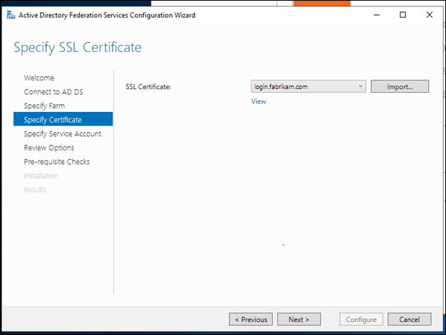
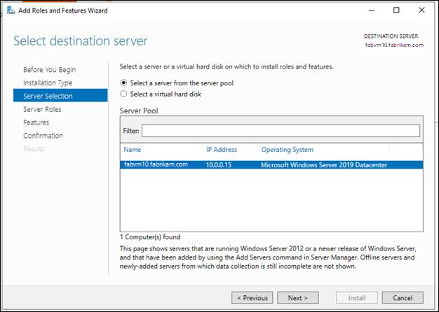
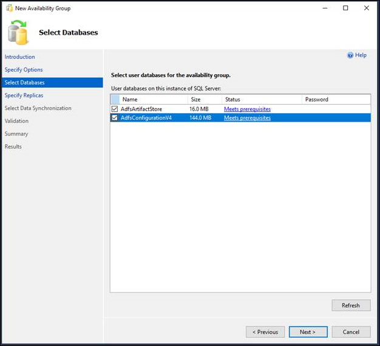
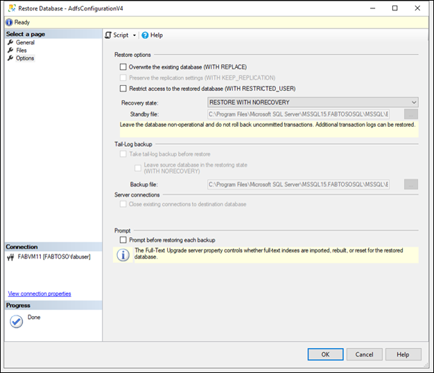

# Setting up an AD FS Deployment with AlwaysOn Availability Groups
A highly available geo-distributed topology provides:
* Elimination of a single point of failure: With failover capabilities, you can achieve a highly available ADFS infrastructure even if one of the data centers in a part of a globe goes down.
* Improved performance: You can use the suggested deployment to provide a high-performance ADFS infrastructure

AD FS can be configured for a highly available geo-distributed scenario.
The following guide will walk through an overview of AD FS with SQL Always on Availability Groups and provide deployment considerations and guidance.

## Overview - AlwaysOn Availability Groups

For more information on AlwaysOn Availability groups, see [Overview of AlwaysOn Availability Groups (SQL Server)](https://technet.microsoft.com/library/ff877884.aspx)

From the perspective of the nodes of an AD FS SQL Server farm, the AlwaysOn Availability group replaces the single SQL Server instance as the policy / artifact database.  The availability group listener is what the client (the AD FS security token service) uses to connect to SQL.
The following diagram shows an AD FS SQL Server Farm with AlwaysOn Availability group.


An Always On Availability Group (AG) is a one or more user databases that fail over together. An availability group consists of a primary availability replica and one to four secondary replicas that are maintained through SQL Server log-based data movement for data protection without the need for shared storage. Each replica is hosted by an instance of SQL Server on a different node of the WSFC. The availability group and a corresponding virtual network name are registered as resources in the WSFC cluster.

An availability group listener on the primary replica's node responds to incoming client requests to connect to the virtual network name, and based on attributes in the connection string, it redirects each request to the appropriate SQL Server instance.
In the event of a failover, instead of transferring ownership of shared physical resources to another node, WSFC is leveraged to reconfigure a secondary replica on another SQL Server instance to become the availability group's primary replica. The availability group's virtual network name resource is then transferred to that instance.
At any given moment, only a single SQL Server instance may host the primary replica of an availability group's databases, all associated secondary replicas must each reside on a separate instance, and each instance must reside on separate physical nodes.

> [!NOTE] 
> If machines are running on Azure, set up the Azure virtual machines to enable the listener configuration to communicate with AlwaysOn Availability groups. For more information, [Virtual Machines: SQL Always On Listener](https://docs.microsoft.com/azure/virtual-machines/windows/sql/virtual-machines-windows-portal-sql-alwayson-int-listener).

For additional overview of AlwaysOn Availability Groups, see [Overview of Always On Availability Groups (SQL Server)](https://docs.microsoft.com/sql/database-engine/availability-groups/windows/overview-of-always-on-availability-groups-sql-server?view=sql-server-ver15).

> [!NOTE] 
> If the organization requires failover across multiple datacenters, it is recommended to create an artifact database in each datacenter as well as enabling a background cache which reduces latency during request processing. Follow the instructions to do so in [Fine Tuning SQL and Reducing Latency](https://docs.microsoft.com/windows-server/identity/ad-fs/operations/adfs-sql-latency).

## Deployment Guidance

1. <b> Consider the correct database for the goals of the AD FS deployment. </b>
AD FS uses a database to store configuration and in some cases transactional data related to the Federation Service. You can use AD FS software to select either the build-in Windows Internal Database (WID) or Microsoft SQL Server 2008 or newer to store the data in the federation service.
The following table describes the differences in supported features between a WID and SQL database.


| Category      | Feature       | Supported by WID  | Supported by SQL |
| ------------------ |:-------------:| :---:|:---: |
| AD FS Features     | Federation server farm deployment | Yes  | Yes |
| AD FS Features     | SAML artifact resolution. Note: This is not common for SAML applications     |   No | No  |
| AD FS Features | SAML/WS-Federation token replay detection. Note: only required when AD FS receives tokens from external IDPs. This is not required if AD FS is not acting as an IDP.      |    No  | Yes |
| Database Features     |   Basic database redundancy using pull replication, where one or more servers hosting a read-only copy of the database request changes that are made on a source server host a read/write copy of the database    |   No | No  |
| Database Features | Database redundancy using high Availability solutions, such as clustering or mirroring (at the database layer)      |    No  | Yes |

If you are a large organization with more than 100 trust relationships that need to provide both their internal users and external users with single-sign on access to federation applications or services, SQL is the recommended option.

If you are an organization with 100 or fewer configured trust relationships, WID provides data and federation service redundancy (where each federation server replicates changes to other federation servers in the same farm). WID does not support token replay detection or artifact resolution and has a limit of 30 federation servers.
For more information on planning your deployment, visit [here](https://docs.microsoft.com/windows-server/identity/ad-fs/design/planning-your-deployment).

## SQL Server High Availability Solutions
If you are using SQL Server as your AD FS configuration database, you can set up geo-redundancy for your AD FS farm using SQL Server replication. Geo-redundancy replicates data between two geographically distant sites so that applications can switch from one site to another. This way, in case of the failure of one site, you can still have all the configuration data available at the second site. 
If SQL is the appropriate database for your deployment goals, proceed with this deployment guide.

This guide will walk through the following
* Deploy AD FS
* Configure AD FS to use an AlwaysOn Availability Groups
* Install the Failover Clustering Role
* Run Cluster Validation Tests
* Enable Always On Availability groups
* Back Up AD FS databases
* Create AlwaysOn Availability groups
* Add Databases on Second node
* Join an Availability Replica to an Availability Groups
* Update the SQL Connection string

## Deploy AD FS

> [!NOTE] 
> If machines are running on Azure, the Virtual Machines must be configured in a specific way to allow for the listener to communicate with the Always On Availabililty group. For information on configuration, view [Configure a load balancer for an availability group on Azure SQL Server VMs](https://docs.microsoft.com/azure/virtual-machines/windows/sql/virtual-machines-windows-portal-sql-alwayson-int-listener)


This deployment guide will show a two node farm with two SQL servers as an example.
To deploy AD FS follow the initial links below to install the AD FS Role Service. To configure for an AoA group, there will be additional steps for the role.
-	[Join a Computer to a Domain](https://docs.microsoft.com/windows-server/identity/ad-fs/deployment/join-a-computer-to-a-domain)
-	[Enroll an SSL Certificate for AD FS](https://docs.microsoft.com/windows-server/identity/ad-fs/deployment/enroll-an-ssl-certificate-for-ad-fs)
-	[Install the AD FS Role Service](https://docs.microsoft.com/windows-server/identity/ad-fs/deployment/install-the-ad-fs-role-service)


## Configuring AD FS to use an AlwaysOn Availability group

Configuring an AD FS farm with AlwaysOn Availability groups requires a slight modification to the AD FS deployment procedure. Ensure that each server instance is running the same version of SQL. To view the full list of prerequisites, restrictions, and recommendations for Always On availability groups, read [here](https://docs.microsoft.com/sql/database-engine/availability-groups/windows/prereqs-restrictions-recommendations-always-on-availability?view=sql-server-2017#PrerequisitesForDbs).

1.	The databases you wish to back up must be created before the AlwaysOn Availability groups can be configured.  AD FS creates its databases as part of the setup and initial configuration of the first federation service node of a new AD FS SQL Server farm.  Specify the database host name for the existing farm using SQL server. As part of the AD FS configuration, you must specify a SQL connection string, so you will have to configure the first AD FS farm to connect to a SQL instance directly (this is only temporary). For specific guidance on configuring an AD FS farm, including configuring an AD FS farm node with a SQL server connection string, see [Configure a Federation Server](https://docs.microsoft.com/windows-server/identity/ad-fs/deployment/configure-a-federation-server).


2.	Verify connectivity to the database using SSMS and then connect to the targeted database host name. If adding another node to the federation farm, connect to the targeted database.
3.	Specify the SSL certificate for the AD FS farm.



4.	Connect the farm to a service account or gMSA.


5.	Complete the AD FS farm configuration and installation.

> [!NOTE] 
> SQL Server must be run under a domain account for installation of Always On Availability groups. By default, it is run as a local system.

## Install the Failover Clustering Role
The Windows Server Failover Cluster role provides the For more information on Windows Server Failover Clusters,
1.	Start Server Manager.
2.	On the Manage menu, select Add Roles and Features.
3.	On the Before you begin page, select Next.
4.	On the Select installation type page, select Role-based or feature-based installation, and then select Next.
5.	On the Select destination server page, select the SQL server where you want to install the feature, and then select Next.



6.	On the Select server roles page, select Next.
7.	On the Select features page, select the Failover Clustering check box.


8.	On the Confirm installation selections page, select Install.
A server restart is not required for the Failover Clustering feature.
9.	When the installation is completed, select Close.
10.	Repeat this procedure on every server that you want to add as a failover cluster node.

## Run Cluster Validation Tests
1.	On a computer that has the Failover Cluster Management Tools installed from the Remote Server Administration Tools, or on a server where you installed the Failover Clustering feature, start Failover Cluster Manager. To do this on a server, start Server Manager, and then on the Tools menu, select Failover Cluster Manager.
2.	In the Failover Cluster Manager pane, under Management, select Validate Configuration.
3.	On the Before You Begin page, select Next.
4.	On the Select Servers or a Cluster page, in the Enter name box, enter the NetBIOS name or the fully qualified domain name of a server that you plan to add as a failover cluster node, and then select Add. Repeat this step for each server that you want to add. To add multiple servers at the same time, separate the names by a comma or by a semicolon. For example, enter the names in the format server1.contoso.com, server2.contoso.com. When you are finished, select Next.


5. On the Testing Options page, select Run all tests (recommended), and then select Next.
6. On the Confirmation page, select Next.
The Validating page displays the status of the running tests.
7. On the Summary page, do either of the following:
- If the results indicate that the tests completed successfully and the configuration is suited for clustering, and you want to create the cluster immediately, make sure that the Create the cluster now using the validated nodes check box is selected, and then select Finish. Then, continue to step 4 of the [Create the failover cluster procedure](https://docs.microsoft.com/windows-server/failover-clustering/create-failover-cluster#create-the-failover-cluster).


-	If the results indicate that there were warnings or failures, select View Report to view the details and determine which issues must be corrected. Realize that a warning for a particular validation test indicates that this aspect of the failover cluster can be supported, but might not meet the recommended best practices.

> [!NOTE]
> If you receive a warning for the Validate Storage Spaces Persistent Reservation test, see the blog post [Windows Failover Cluster validation warning indicates your disks don't support the persistent reservations for Storage Spaces](https://blogs.msdn.microsoft.com/clustering/2013/05/24/validate-storage-spaces-persistent-reservation-test-results-with-warning/) for more information.
> For more information about hardware validation tests, see [Validate Hardware for a Failover Cluster](https://docs.microsoft.com/previous-versions/windows/it-pro/windows-server-2012-r2-and-2012/jj134244(v%3dws.11)).

## Create the Failover Cluster

To complete this step, make sure that the user account that you log on as meets the requirements that are outlined in the [Verify the prerequisites](https://docs.microsoft.com/windows-server/failover-clustering/create-failover-cluster#verify-the-prerequisites) section of this topic.
1.	Start Server Manager.
2.	On the Tools menu, select Failover Cluster Manager.
3.	In the Failover Cluster Manager pane, under Management, select Create Cluster.
The Create Cluster Wizard opens.
4.	On the Before You Begin page, select Next.
5.	If the Select Servers page appears, in the Enter name box, enter the NetBIOS name or the fully qualified domain name of a server that you plan to add as a failover cluster node, and then select Add. Repeat this step for each server that you want to add. To add multiple servers at the same time, separate the names by a comma or a semicolon. For example, enter the names in the format server1.contoso.com; server2.contoso.com. When you are finished, select Next.


> [!NOTE]
> If you chose to create the cluster immediately after running validation in the [configuration validating procedure](https://docs.microsoft.com/windows-server/failover-clustering/create-failover-cluster#validate-the-configuration), you will not see the Select Servers page. The nodes that were validated are automatically added to the Create Cluster Wizard so that you do not have to enter them again.

6.	If you skipped validation earlier, the Validation Warning page appears. We strongly recommend that you run cluster validation. Only clusters that pass all validation tests are supported by Microsoft. To run the validation tests, select Yes, and then select Next. Complete the Validate a Configuration Wizard as described in [Validate the configuration](https://docs.microsoft.com/windows-server/failover-clustering/create-failover-cluster#validate-the-configuration).
7.	On the Access Point for Administering the Cluster page, do the following:
-	In the Cluster Name box, enter the name that you want to use to administer the cluster. Before you do, review the following information:
 -	During cluster creation, this name is registered as the cluster computer object (also known as the cluster name object or CNO) in AD DS. If you specify a NetBIOS name for the cluster, the CNO is created in the same location where the computer objects for the cluster nodes reside. This can be either the default Computers container or an OU.
 -	To specify a different location for the CNO, you can enter the distinguished name of an OU in the Cluster Name box. For example: CN=ClusterName, OU=Clusters, DC=Contoso, DC=com.
 -	If a domain administrator has prestaged the CNO in a different OU than where the cluster nodes reside, specify the distinguished name that the domain administrator provides.
- If the server does not have a network adapter that is configured to use DHCP, you must configure one or more static IP addresses for the failover cluster. Select the check box next to each network that you want to use for cluster management. Select the Address field next to a selected network, and then enter the IP address that you want to assign to the cluster. This IP address (or addresses) will be associated with the cluster name in Domain Name System (DNS).
- When you are finished, select Next.

8.	On the Confirmation page, review the settings. By default, the Add all eligible storage to the cluster check box is selected. Clear this check box if you want to do either of the following:
-	You want to configure storage later.
-	You plan to create clustered storage spaces through Failover Cluster Manager or through the Failover Clustering Windows PowerShell cmdlets, and have not yet created storage spaces in File and Storage Services. For more information, see [Deploy Clustered Storage Spaces](https://docs.microsoft.com/previous-versions/windows/it-pro/windows-server-2012-r2-and-2012/jj822937(v%3dws.11)).
9.	Select Next to create the failover cluster.
10.	On the Summary page, confirm that the failover cluster was successfully created. If there were any warnings or errors, view the summary output or select View Report to view the full report. Select Finish.
11.	To confirm that the cluster was created, verify that the cluster name is listed under Failover Cluster Manager in the navigation tree. You can expand the cluster name, and then select items under Nodes, Storage or Networks to view the associated resources.
Realize that it may take some time for the cluster name to successfully replicate in DNS. After successful DNS registration and replication, if you select All Servers in Server Manager, the cluster name should be listed as a server with a Manageability status of Online.


## Enable Always on Availability Groups with SQL Server Configuration Manager

1.	Connect to the Windows Server Failover Cluster (WSFC) node that hosts the SQL Server instance where you want to enable Always On Availability Groups.
2.	On the Start menu, point to All Programs, point to Microsoft SQL Server, point to Configuration Tools, and click SQL Server Configuration Manager.
3.	In SQL Server Configuration Manager, click SQL Server Services, right-click SQL Server (<instance name>), where <instance name> is the name of a local server instance for which you want to enable Always On Availability Groups, and click Properties.
4.	Select the Always On High Availability tab.
5.	Verify that Windows failover cluster name field contains the name of the local failover cluster. If this field is blank, this server instance currently does not support Always On availability groups. Either the local computer is not a cluster node, the WSFC cluster has been shut down, or this edition of SQL Server that does not support Always On availability groups.
6.	Select the Enable Always On Availability Groups check box, and click OK.
SQL Server Configuration Manager saves your change. Then, you must manually restart the SQL Server service. This enables you to choose a restart time that is best for your business requirements. When the SQL Server service restarts, Always On will be enabled, and the IsHadrEnabled server property will be set to 1.


## Back up AD FS Databases
Back up the AD FS configuration and artifact databases with the full transaction logs. Place the back up in the chosen destination.
Back up the ADFS Artifact and Configuration databases.
- Tasks > Backup > Full > Add to a backup file > ok to create


## Create New Availability Group

1.	In Object Explorer, connect to the server instance that hosts the primary replica.
2.	Expand the Always On High Availability node and the Availability Groups node.
3.	To launch the New Availability Group Wizard, select the New Availability Group Wizard command.
4.	The first time you run this wizard, an Introduction page appears. To bypass this page in the future, you can click Do not show this page again. After reading this page, click Next.
5.	On the Specify Availability Group Options page, enter the name of the new availability group in the Availability group name field. This name must be a valid SQL Server identifier that is unique on the cluster and in your domain as a whole. The maximum length for an availability group name is 128 characters. e
6.	Next, specify the cluster type. The possible cluster types depend on the SQL Server version and operating system. Choose either WSFC, EXTERNAL, or NONE. For details see [Specify Availability Group Name](https://docs.microsoft.com/sql/database-engine/availability-groups/windows/specify-availability-group-name-page?view=sql-server-ver15) Page


7.	On the Select Databases page, the grid lists user databases on the connected server instance that are eligible to become the availability databases. Select one or more of the listed databases to participate in the new availability group. These databases will initially be the initial primary databases.
For each listed database, the Size column displays the database size, if known. The Status column indicates whether a given database meets the [prerequisites](https://docs.microsoft.com/sql/database-engine/availability-groups/windows/prereqs-restrictions-recommendations-always-on-availability?view=sql-server-ver15) for availability databases. It the prerequisites are not met, a brief status description indicates the reason that the database is ineligible; for example, if it does not use the full recovery model. For more information, click the status description.
If you change a database to make it eligible, click Refresh to update the databases grid.
If the database contains a database master key, enter the password for the database master key in the Password column.



8.On the Specify Replicas page, specify and configure one or more replicas for the new availability group. This page contains four tabs. The following table introduces these tabs. For more information, see the [Specify Replicas Page (New Availability Group Wizard: Add Replica Wizard)](https://docs.microsoft.com/sql/database-engine/availability-groups/windows/specify-replicas-page-new-availability-group-wizard-add-replica-wizard?view=sql-server-ver15) topic.

| Tab      | Brief Description       |
| ------------------ |:-------------:|
| Replicas     | Use this tab to specify each instance of SQL Server that will host a secondary replica. Note that the server instance to which you are currently connected must host the primary replica. |
| Endpoints     | Use this tab to verify any existing database mirroring endpoints and also, if this endpoint is lacking on a server instance whose service accounts use Windows Authentication, to create the endpoint automatically.|
| Backup Preferences | Use this tab to specify your backup preference for the availability group as a whole and your backup priorities for the individual availability replicas.      |
| Listener     | Use this tab to create an availability group listener. By default, the wizard does not create a listener.      |


9. On the Select Initial Data Synchronization page, choose how you want your new secondary databases to be created and joined to the availability group. Choose one of the following options:
- 	Automatic seeding
 - SQL Server automatically creates the secondary replicas for every database in the group. Automatic seeding requires that the data and log file paths are the same on every SQL Server instance participating in the group. Available on SQL Server 2016 (13.x) and later. See [Automatically initialize Always On Availability groups](https://docs.microsoft.com/sql/database-engine/availability-groups/windows/automatically-initialize-always-on-availability-group?view=sql-server-ver15).
- Full database and log backup
 - Select this option if your environment meets the requirements for automatically starting initial data synchronization (for more information, see [Prerequisites, Restrictions, and Recommendations, earlier in this topic)](https://docs.microsoft.com/sql/database-engine/availability-groups/windows/use-the-availability-group-wizard-sql-server-management-studio?view=sql-server-ver15#Prerequisites).
If you select Full, after creating the availability group, the wizard will back up every primary database and its transaction log to a network share and restore the backups on every server instance that hosts an secondary replica. The wizard will then join every secondary database to the availability group.
In the Specify a shared network location accessible by all replicas: field, specify a backup share to which all of the server instance that host replicas have read-write access. For more information, see Prerequisites, earlier in this topic. In the validation step, the wizard will perform a test to make sure the provided network location is valid, the test will create a database on the primary replica named "BackupLocDb_" followed by a Guid and perform backup to the provided network location, then restore it on the secondary replicas. It is safe to delete this database along with its backup history and backup file in case the wizard failed to delete them.
- Join only
 - If you have manually prepared secondary databases on the server instances that will host the secondary replicas, you can select this option. The wizard will join the existing secondary databases to the availability group.
- Skip initial data synchronization
 - Select this option if you want to use your own database and log backups of your primary databases. For more information, see [Start Data Movement on an Always On Secondary Database (SQL Server)](https://docs.microsoft.com/sql/database-engine/availability-groups/windows/start-data-movement-on-an-always-on-secondary-database-sql-server?view=sql-server-ver15).


9.	The Validation page verifies whether the values you specified in this Wizard meet the requirements of the New Availability Group Wizard. To make a change, click Previous to return to an earlier wizard page to change one or more values. The click Next to return to the Validation page, and click Re-run Validation.

10.	On the Summary page, review your choices for the new availability group. To make a change, click Previous to return to the relevant page. After making the change, click Next to return to the Summary page.

> [!NOTE] 
> When the SQL Server service account of a server instance that will host a new availability replica does not already exist as a login, the New Availability Group Wizard needs to create the login. On the Summary page, the wizard displays the information for the login that is to be created. If you click Finish, the wizard creates this login for the SQL Server service account and grants the login CONNECT permission.
> If you are satisfied with your selections, optionally click Script to create a script of the steps the wizard will execute. Then, to create and configure the new availability group, click Finish.

11.	The Progress page displays the progress of the steps for creating the availability group (configuring endpoints, creating the availability group, and joining the secondary replica to the group).
12.	When these steps complete, the Results page displays the result of each step. If all these steps succeed, the new availability group is completely configured. If any of the steps result in an error, you might need to manually complete the configuration or use a wizard for the failed step. For information about the cause of a given error, click the associated "Error" link in the Result column.
When the wizard completes, click Close to exit.


## Add Databases on Secondary Node

1.	Restore the artifact database through the UI on the secondary node using the backup files created.


2. Restore the database in a NON-RECOVERY state.


3. Repeat process to restore the configuration database.

## Join Availability Replica to an Availability Group

1.	In Object Explorer, connect to the server instance that hosts the secondary replica, and click the server name to expand the server tree.
2.	Expand the Always On High Availability node and the Availability Groups node.
3.	Select the availability group of the secondary replica to which you are connected.
4.	Right-click the secondary replica, and click Join to Availability Group.
5.	This opens the Join Replica to Availability Group dialog box.
6.	To join the secondary replica to the availability group, click OK.


## Update the SQL Connection String
Finally, use PowerShell to edit the AD FS properties to update the SQL connection string to use the DNS address of the AlwaysOn Availability group's listener.
Run the configuration database change on each node and restart the ADFS service on all the ADFS nodes. The initial catalog value changes based on the farm version.

```
PS:\>$temp= Get-WmiObject -namespace root/ADFS -class SecurityTokenService
PS:\>$temp.ConfigurationdatabaseConnectionstring=”data source=<SQLCluster\SQLInstance>; initial catalog=adfsconfiguration;integrated security=true”
PS:\>$temp.put()
PS:\> Set-AdfsProperties –artifactdbconnection ”Data source=<SQLCluster\SQLInstance >;Initial Catalog=AdfsArtifactStore;Integrated Security=True”
```
