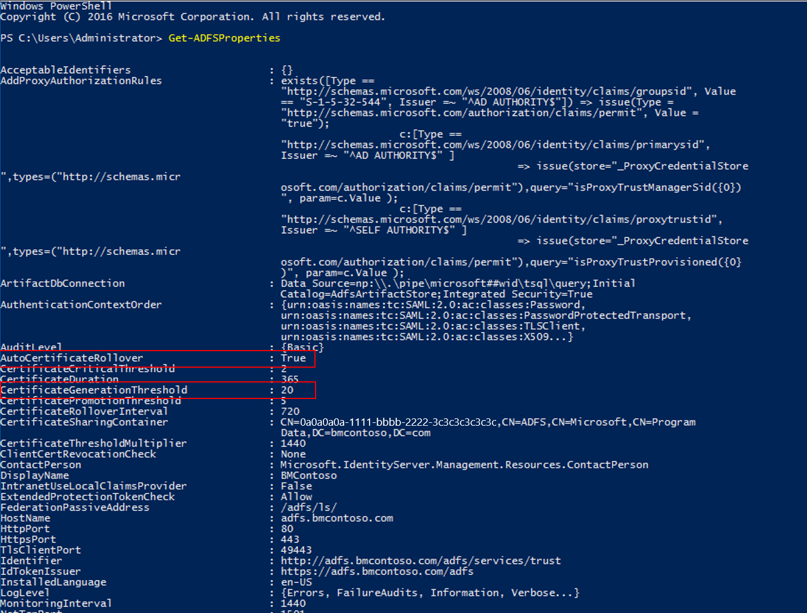
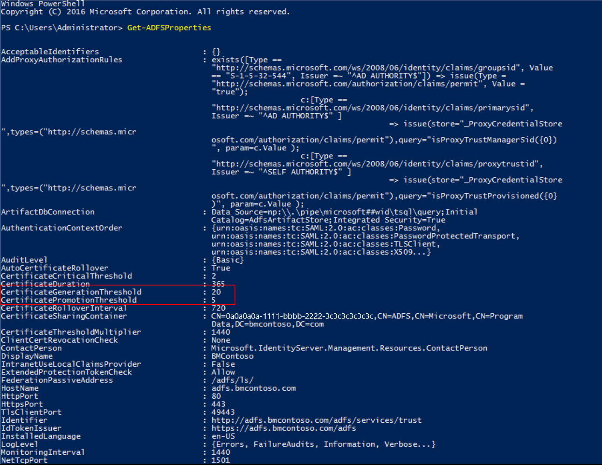
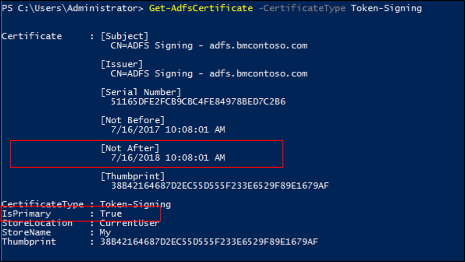
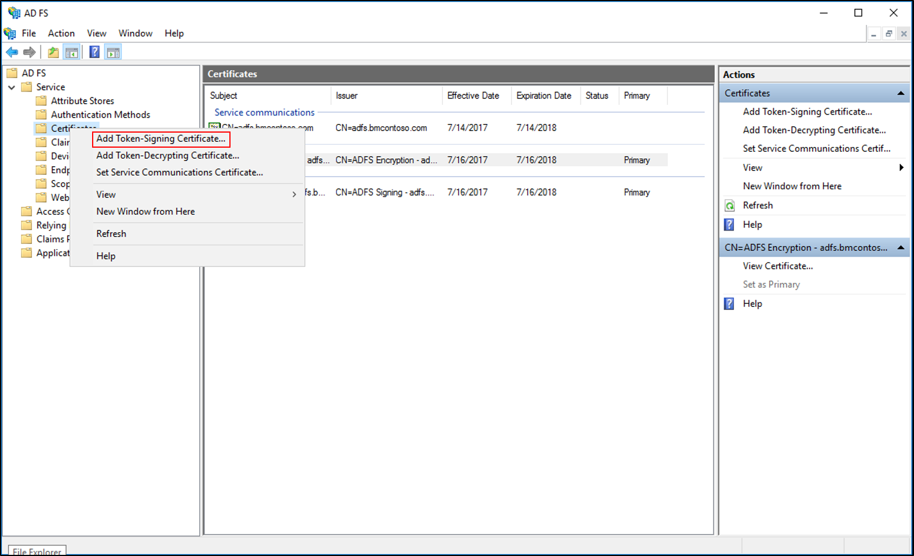
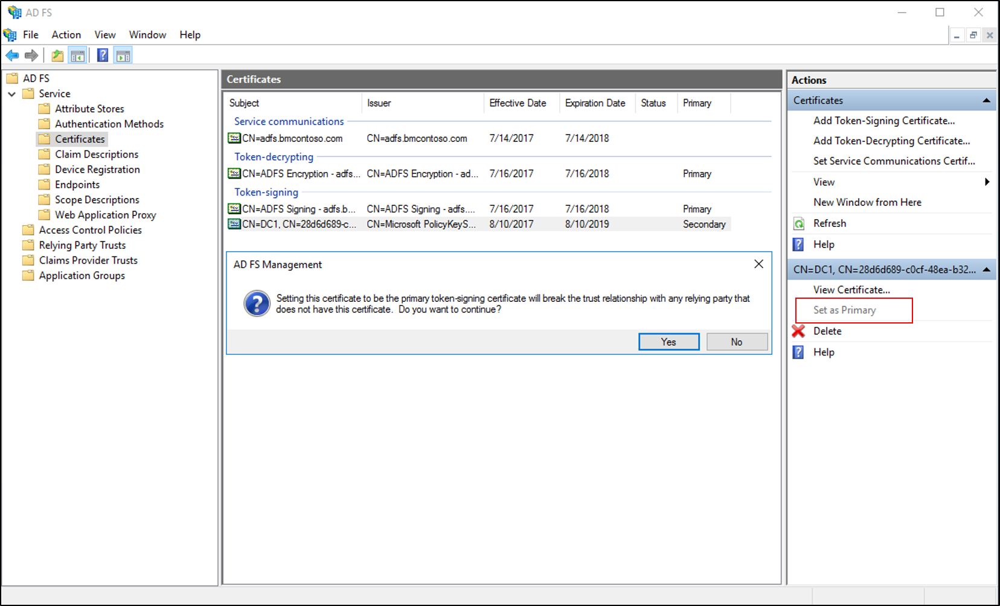

# Obtain and Configure TS and TD Certificates for AD FS

This topic describes tasks and procedures that you can perform to ensure that your AD FS token signing and token decryption certificates are up to date.

Token signing certificates are standard X509 certificates that are used to securely sign all tokens that the federation server issues. Token decryption certificates are standard X509 certificates that are used to decrypt any incoming tokens. They are also published in federation metadata.

For additional information see [Certificate Requirements](../design/ad-fs-requirements.md#BKMK_1)

## Determine whether AD FS renews the certificates automatically
By default, AD FS is configured to generate token signing and token decryption certificates automatically, both at the initial configuration time and when the certificates are approaching their expiration date.

You can run the following Windows PowerShell command: `Get-AdfsProperties`.
  
  
  
The AutoCertificateRollover property describes whether AD FS is configured to renew token signing and token decrypting certificates automatically.

If AutoCertificateRollover is set to TRUE, the AD FS certificates will be renewed and configured in AD FS automatically. Once the new certificate is configured, in order to avoid an outage, you must ensure that each federation partner (represented in your AD FS farm by either relying party trusts or claims provider trusts) is updated with this new certificate.
    
If AD FS is not configured to renew token signing and token decrypting certificates automatically (if AutoCertificateRollover is set to False), AD FS will not automatically generate or start using new token signing or token decrypting certificates. You will have to perform these tasks manually.
    
If AD FS is configured to renew token signing and token decrypting certificates automatically (AutoCertificateRollover is set to TRUE), you can determine when they will be renewed:

CertificateGenerationThreshold describes how many days in advance of the certificate's Not After date a new certificate will be generated.

CertificatePromotionThreshold determines how many days after the new certificate is generated that it will be promoted to be the primary certificate (in other words, AD FS will start using it to sign tokens it issues and decrypt tokens from identity providers).

  
If AD FS is configured to renew token signing and token decrypting certificates automatically (AutoCertificateRollover is set to TRUE), you can determine when they will be renewed:

 - **CertificateGenerationThreshold** describes how many days in advance of the certificate's Not After date a new certificate will be generated.
 - **CertificatePromotionThreshold** determines how many days after the new certificate is generated that it will be promoted to be the primary certificate (in other words, AD FS will start using it to sign tokens it issues and decrypt tokens from identity providers).

## Determine when the current certificates expire
You can use the following procedure to identify the primary token signing and token decrypting certificates and to determine when the current certificates expire.

You can run the following Windows PowerShell command:  `Get-AdfsCertificate –CertificateType token-signing` (or  `Get-AdfsCertificate –CertificateType token-decrypting `). Or you can examine the current certificates in the MMC: Service->Certificates.

The certificate for which the **IsPrimary** value is set to **True** is the certificate that AD FS is currently using.

The date shown for the **Not After** is the date by which a new primary token signing or decrypting certificate must be configured.

To ensure service continuity, all federation partners (represented in your AD FS farm by either relying party trusts or claims provider trusts) must consume the new token signing and token decryption certificates prior to this expiration. We recommend that you begin planning for this process at least 60 days in advance.

## Generating a new self-signed certificate manually prior to the end of the grace period
You can use the following steps to generate a new self-signed certificate manually prior to the end of the grace period.

1. Ensure that you are logged on to the primary AD FS server.
2. Open Windows PowerShell and run the following command: `Add-PSSnapin "microsoft.adfs.powershell"`
3. Optionally, you can check the current signing certificates in AD FS. To do so, run the following command: `Get-ADFSCertificate –CertificateType token-signing`. Look at the command output to see the Not After dates of any certificates listed.
4. To generate a new certificate, execute the following command to renew and update the certificates on the AD FS server: `Update-ADFSCertificate –CertificateType token-signing`.
5. Verify the update by running the following command again: `Get-ADFSCertificate –CertificateType token-signing`
6. Two certificates should be listed now, one of which has a **Not After** date of approximately one year in the future and for which the **IsPrimary** value is **False**.

>[!IMPORTANT]
>To avoid a service outage, update the certificate information on Azure AD by running the steps in the How to update Azure AD with a valid token-signing certificate.

## If you're not using self-signed certificates…
If you are not using the default automatically generated, self-signed token signing and token decryption certificates, you must renew and configure these certificates manually.

First, you must obtain a new certificate from your certificate authority and import it into the local machine personal certificate store on each federation server. For instructions, see the [Import a Certificate](https://technet.microsoft.com/library/cc754489.aspx) article.

Then you must configure this certificate as the secondary AD FS token signing or decryption certificate. (You configure it as a secondary certificate to allow your federation partners enough time to consume this new certificate before you promote it to the primary certificate).

### To configure a new certificate as a secondary certificate
1. Open PowerShell and run the following: `Set-ADFSProperties -AutoCertificateRollover $false`
2. Once you have imported the certificate. Open the **AD FS Management** console.
3. Expand **Service** and then select **Certificates**.
4. In the Actions pane, click **Add Token-Signing Certificate**.
 
5. Select the new certificate from the list of displayed certificates, and then click OK.
6.  Open PowerShell and run the following: `Set-ADFSProperties -AutoCertificateRollover $true`

>[!WARNING]
>Ensure the new certificate has a private key associated with it and that the AD FS service account is granted Read permissions to the private key. Verify this on each federation server. To do so, in the Certificates snap-in, right-click the new certificate, click All Tasks, and then click Manage Private Keys.

Once you've allowed enough time for your federation partners to consume your new certificate (either they pull your federation metadata or you send them the public key of your new certificate), you must promote the secondary certificate to primary certificate.

### To promote the new certificate from secondary to primary

1. Open the **AD FS Management** console.
2. Expand **Service** and then select **Certificates**.
3. Click the secondary token signing certificate.
4. In the **Actions** pane, click **Set As Primary**. Click Yes at the confirmation prompt.
 

## Updating federation partners

### Partners who can consume Federation Metadata
If you have renewed and configure a new token signing or token decryption certificate, you must make sure that the all your federation partners (resource organization or account organization partners that are represented in your AD FS by relying party trusts and claims provider trusts) have picked up the new certificates.

### Partners who can NOT consume Federation Metadata
If your federation partners cannot consume your federation metadata, you must manually send them the public key of your new token-signing / token-decrypting certificate. Send your new certificate public key (.cer file or .p7b if you wish to include the entire chain) to all of your resource organization or account organization partners (represented in your AD FS by relying party trusts and claims provider trusts). Have the partners implement changes on their side to trust the new certificates.

### Promote to primary (if AutoCertificateRollover is False)
If **AutoCertificateRollover** is set to **False**, AD FS will not automatically generate or start using new token signing or token decrypting certificates. You will have to perform these tasks manually.
After allowing a sufficient period of time for all of your federation partners to consume the new secondary certificate, promote this secondary certificate to primary (in the MMC snap-in, click the secondary token signing certificate and in the Actions pane, click **Set As Primary**.)

## Updating Azure AD
AD FS provides single sign-on access to Microsoft cloud services such as Office 365 by authenticating users via their existing AD DS credentials.  For additional information on using certificates see [Renew federation certificates for Office 365 and Azure AD](https://docs.microsoft.com/azure/active-directory/connect/active-directory-aadconnect-o365-certs).