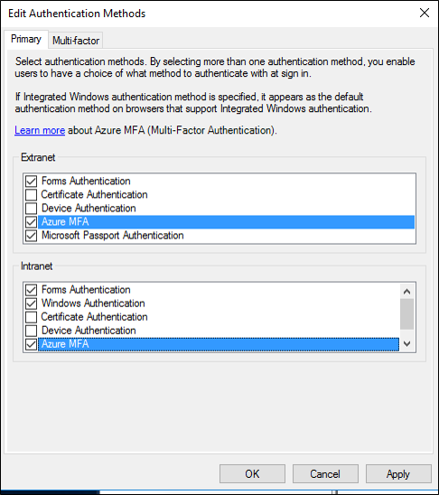

# Configure Azure MFA as authentication provider with AD FS

If your organization is federated with Azure AD, you can use Azure Multi-Factor Authentication to secure AD FS resources, both on-premises and in the cloud. Azure MFA enables you to eliminate passwords and provide a more secure way to authenticate.  Starting with Windows Server 2016, you can now configure Azure MFA for primary authentication or use it as an additional authentication provider. 
  
Unlike with AD FS in Windows Server 2012 R2, the AD FS 2016 Azure MFA adapter integrates directly with Azure AD and does not require an on premises Azure MFA server.   The Azure MFA adapter is built in to Windows Server 2016, and there is no need for additional installation.


## Registering users for Azure MFA with AD FS

AD FS does not support inline &#34;proof up&#34;, or registration of Azure MFA security verification information such as phone number or mobile app. This means users must get proofed up by visiting [https://account.activedirectory.windowsazure.com/Proofup.aspx](https://account.activedirectory.windowsazure.com/Proofup.aspx) prior to using Azure MFA to authenticate to AD FS applications. 
When a user who has not yet proofed up in Azure AD tries to authenticate with Azure MFA at AD FS, they will get an AD FS error.  As an AD FS administrator, you can customize this error experience to guide the user to the proofup page instead.  You can do this using onload.js customization to detect the error message string within the AD FS page and show a new message to guide the users to visit [https://aka.ms/mfasetup](https://aka.ms/mfasetup), then re-attempt authentication. For detailed guidance see the "Customize the AD FS web page to guide users to register MFA verification methods" below in this article.

>[!NOTE]
> Previously, users were required to authenticate with MFA for registration (visiting [https://account.activedirectory.windowsazure.com/Proofup.aspx](https://account.activedirectory.windowsazure.com/Proofup.aspx), for example via the shortcut [https://aka.ms/mfasetup](https://aka.ms/mfasetup)).  Now, an AD FS user who has not yet registered MFA verification information can access Azure AD&#34;s proofup page via the shortcut [https://aka.ms/mfasetup](https://aka.ms/mfasetup) using only primary authentication (such as Windows Integrated Authentication or username and password via the AD FS web pages).  If the user has no verification methods configured, Azure AD will perform inline registration in which the user sees the message &#34;Your admin has required that you set up this account for additional security verification&#34;, and the user can then select to &#34;Set it up now&#34;.
> Users who already have at least one MFA verification method configured will still be prompted to provide MFA when visiting the proofup page.

## Recommended deployment topologies

### Azure MFA as Primary Authentication

There are a couple of great reasons to use Azure MFA as Primary Authentication with AD FS:

 - To avoid passwords for sign-in to Azure AD, Office 365 and other AD FS apps
 - To protect password based sign-in by requiring an additional factor such as verification code prior to the password

If you wish to use Azure MFA as a primary authentication method in AD FS to achieve these benefits, you probably also want to keep the ability to use Azure AD conditional access including &#34;true MFA&#34; by prompting for additional factors in AD FS.

You can now do this by configuring the Azure AD domain setting to do MFA on premises (setting &#34;SupportsMfa&#34; to $True).  In this configuration, AD FS can be prompted by Azure AD to perform additional authentication or &#34;true MFA&#34; for conditional access scenarios that require it.  

As described above, any AD FS user who has not yet registered (configured MFA verification information) should be prompted via a customized AD FS error page to visit [https://aka.ms/mfasetup](https://aka.ms/mfasetup) to configure verification information, then re-attempt AD FS login.  
Because Azure MFA as primary is considered a single factor, after initial configuration users will need to provide an additional factor to manage or update their verification information in Azure AD, or to access other resources that require MFA.

>[!NOTE]
> With ADFS 2019, you are required to make a modification to the anchor claim type for the Active Directory Claims Provider trust and modify this from the windowsaccountname to UPN. Execute the PowerShell cmdlet provided below. This has no impact on the internal functioning of the AD FS farm. You may notice a few users may be re-prompted for credentials once this change is made. After logging in again, end users will see no difference. 

```powershell
Set-AdfsClaimsProviderTrust -AnchorClaimType "http://schemas.xmlsoap.org/ws/2005/05/identity/claims/upn" -TargetName "Active Directory"
```

### Azure MFA as Additional authentication to Office 365

Previously, if you wished to have Azure MFA as an additional authentication method in AD FS for Office 365 or other relying parties, the best option was to configure Azure AD to do compound MFA, in which primary authentication is performed on premises in AD FS and MFA is triggered by Azure AD. 
Now, you can use Azure MFA as additional authentication in AD FS when the domain SupportsMfa setting is set to $True.  

As described above, any AD FS user who has not yet registered (configured MFA verification information) should be prompted via a customized AD FS error page to visit [https://aka.ms/mfasetup](https://aka.ms/mfasetup) to configure verification information, then re-attempt AD FS login.  

## Pre-Requisites

The following pre-requisites are required when using Azure MFA for authentication with AD FS:  
  
- An [Azure subscription with Azure Active Directory](https://azure.microsoft.com/pricing/free-trial/).  
- [Azure Multi-Factor Authentication](https://azure.microsoft.com/documentation/articles/multi-factor-authentication/) 


> [!NOTE]
> Azure AD and Azure MFA are included in Azure AD Premium and the Enterprise Mobility Suite (EMS).  If you have either of these you do not need individual subscriptions.

- A Windows Server 2016 AD FS on-premises environment.  
   - The server needs to be able to communicate with the following URLs over port 443.
      - https://adnotifications.windowsazure.com
      - https://login.microsoftonline.com
- Your on-premises environment is [federated with Azure AD.](https://azure.microsoft.com/documentation/articles/active-directory-aadconnect-get-started-custom/#configuring-federation-with-ad-fs)  
- [Windows Azure Active Directory Module for Windows PowerShell](https://docs.microsoft.com/powershell/module/Azuread/?view=azureadps-2.0).  
- Global administrator permissions on your instance of Azure AD to configure it using Azure AD PowerShell.  
- Enterprise administrator credentials to configure the AD FS farm for Azure MFA.

## Configure the AD FS Servers

In order to complete configuration for Azure MFA for AD FS, you need to configure each AD FS server using the steps described. 

>[!NOTE]
>Ensure that these steps are performed on **all** AD FS servers in the farm. If you have multiple AD FS servers in your farm, you can perform the necessary configuration remotely using Azure AD PowerShell.  

### Step 1: Generate a certificate for Azure MFA on each AD FS server using the `New-AdfsAzureMfaTenantCertificate` cmdlet

The first thing you need to do is generate a certificate for Azure MFA to use.  This can be done using PowerShell.  The certificate generated can be found in the local machines certificate store, and it is marked with a subject name containing the TenantID for your Azure AD directory.

  

Note that TenantID is the name of your directory in Azure AD.  Use the following PowerShell cmdlet to generate the new certificate.  
    `$certbase64 = New-AdfsAzureMfaTenantCertificate -TenantID <tenantID>`  

  
  
### Step 2: Add the new credentials to the Azure Multi-Factor Auth Client Service Principal

In order to enable the AD FS servers to communicate with the Azure Multi-Factor Auth Client, you need to add the credentials to the Service Principal for the Azure Multi-Factor Auth Client. The certificates generated using the `New-AdfsAzureMFaTenantCertificate` cmdlet will serve as these credentials. Do the following using PowerShell to add the new credentials to the Azure Multi-Factor Auth Client Service Principal.  

> [!NOTE]
> In order to complete this step you need to connect to your instance of Azure AD with PowerShell using `Connect-MsolService`.  These steps assume you have already connected via PowerShell.  For information see [`Connect-MsolService`.](https://msdn.microsoft.com/library/dn194123.aspx)  

**Set the certificate as the new credential against the Azure Multi-Factor Auth Client**  

`New-MsolServicePrincipalCredential -AppPrincipalId 981f26a1-7f43-403b-a875-f8b09b8cd720 -Type asymmetric -Usage verify -Value $certBase64`

> [!IMPORTANT]
> This command needs to be run on all of the AD FS servers in your farm.  Azure AD MFA will fail on servers that have not have the certificate set as the new credential against the Azure Multi-Factor Auth Client.

> [!NOTE]  
> 981f26a1-7f43-403b-a875-f8b09b8cd720 is the GUID for Azure Multi-Factor Auth Client.  
  
## Configure the AD FS Farm  
  
Once you have completed the previous section on each AD FS server, set the Azure tenant information using the [Set-AdfsAzureMfaTenant](https://docs.microsoft.com/powershell/module/adfs/export-adfsauthenticationproviderconfigurationdata) cmdlet. This cmdlet needs to be executed only once for an AD FS farm.

Open a PowerShell prompt and enter your own *tenantId* with the [Set-AdfsAzureMfaTenant](https://docs.microsoft.com/powershell/module/adfs/export-adfsauthenticationproviderconfigurationdata) cmdlet. For customers that use Microsoft Azure Government cloud, add the `-Environment USGov` parameter:

> [!NOTE]
> You need to restart the AD FS service on each server in the farm before these changes take affect. For minimal impact, take each AD FS server out of the NLB rotation one at a time and wait for all connections to drain.

```powershell
Set-AdfsAzureMfaTenant -TenantId <tenant ID> -ClientId 981f26a1-7f43-403b-a875-f8b09b8cd720
```


Windows Server without the latest service pack doesn't support the `-Environment` parameter for the [Set-AdfsAzureMfaTenant](https://docs.microsoft.com/powershell/module/adfs/export-adfsauthenticationproviderconfigurationdata) cmdlet. If you use Azure Government cloud and the previous steps failed to configure your Azure tenant due to the missing `-Environment` parameter, complete the following steps to manually create the registry entries. Skip these steps if the previous cmdlet correctly registered your tenant information or you aren't in the Azure Government cloud:

1. Open **Registry Editor** on the AD FS server.
1. Navigate to `HKEY_LOCAL_MACHINE\SOFTWARE\Microsoft\ADFS`. Create the following registry key values:

    | Registry key       | Value |
    |--------------------|-----------------------------------|
    | SasUrl             | https://adnotifications.windowsazure.us/StrongAuthenticationService.svc/Connector |
    | StsUrl             | https://login.microsoftonline.us |
    | ResourceUri        | https://adnotifications.windowsazure.us/StrongAuthenticationService.svc/Connector |

1. Restart the AD FS service on each server in the farm before these changes take affect. For minimal impact, take each AD FS server out of the NLB rotation one at a time and wait for all connections to drain.

After this, you will see that Azure MFA is available as a primary authentication method for intranet and extranet use.

  

## Renew and Manage AD FS Azure MFA Certificates

The following guidance takes you through how to manage the Azure MFA certificates on your AD FS servers.
By default, when you configure AD FS with Azure MFA, the certificates generated via the `New-AdfsAzureMfaTenantCertificate` PowerShell cmdlet are valid for 2 years.  To determine how close to expiration your certificates are, and then to renew and install new certificates, use the following procedure.

### Assess AD FS Azure MFA certificate expiration date

On each AD FS server, in the local computer My store, there will be a self signed certificate with &#34;OU=Microsoft AD FS Azure MFA&#34; in the Issuer and Subject.  This is the Azure MFA certificate.  Check the validity period of this certificate on each AD FS server to determine the expiration date.  

### Create new AD FS Azure MFA Certificate on each AD FS server

If the validity period of your certificates is nearing its end, start the renewal process by generating a new Azure MFA certificate on each AD FS server. In a PowerShell command window, generate a new certificate on each AD FS server using the following cmdlet:

> [!CAUTION]
> If your certificate has already expired, don't add the `-Renew $true` parameter to the following command. In this scenario, the existing expired certificate is replaced with a new one instead of being left in place and an additional certificate created.

```
PS C:\> $newcert = New-AdfsAzureMfaTenantCertificate -TenantId <tenant id such as contoso.onmicrosoft.com> -Renew $true
```

If the certificate hasn't already expired, a new certificate that is valid from 2 days in the future to 2 days + 2 years is generated. AD FS and Azure MFA operations aren't affected by this cmdlet or the new certificate. (Note: the 2 day delay is intentional and provides time to execute the steps below to configure the new certificate in the tenant before AD FS starts using it for Azure MFA.)

### Configure each new AD FS Azure MFA certificate in the Azure AD tenant

Using the Azure AD PowerShell module, for each new certificate (on each AD FS server), update your Azure AD tenant settings as follows (Note: you must first connect to the tenant using `Connect-MsolService` to run the following commands).

```
PS C:/> New-MsolServicePrincipalCredential -AppPrincipalId 981f26a1-7f43-403b-a875-f8b09b8cd720 -Type Asymmetric -Usage Verify -Value $newcert
```

If your previous certificate had already expired, restart the AD FS service to pick up the new certificate. You don't need to restart the AD FS service if you renewed a certificate before it expired.

### Verify that the new certificate(s) will be used for Azure MFA

Once the new certificate(s) become valid, AD FS will pick them up and start using each respective certificate for Azure MFA within a few hours to a day.  Once this occurs, on each server you will see an event logged in the AD FS Admin event log with the following information:

```
Log Name:      AD FS/Admin
Source:        AD FS
Date:          2/27/2018 7:33:31 PM
Event ID:      547
Task Category: None
Level:         Information
Keywords:      AD FS
User:          DOMAIN\adfssvc
Computer:      ADFS.domain.contoso.com
Description:
The tenant certificate for Azure MFA has been renewed.  

TenantId: contoso.onmicrosoft.com.
Old thumbprint: 7CC103D60967318A11D8C51C289EF85214D9FC63.
Old expiration date: 9/15/2019 9:43:17 PM.
New thumbprint: 8110D7415744C9D4D5A4A6309499F7B48B5F3CCF.
New expiration date: 2/27/2020 2:16:07 AM.
```

## Customize the AD FS web page to guide users to register MFA verification methods

Use the following examples to customize your AD FS web pages for users who have not yet proofed up (configured MFA verification information).

### Find the error

First, there are a couple of different error messages AD FS will return in the case in which the user lacks verification information.
If you are using Azure MFA as primary authentication, the un-proofed user will see an AD FS error page containing the following messages:
```
    <div id="errorArea">
        <div id="openingMessage" class="groupMargin bigText">
            An error occurred
        </div>
        <div id="errorMessage" class="groupMargin">
            Authentication attempt failed. Select a different sign in option or close the web browser and sign in again. Contact your administrator for more information.
        </div>
```
When Azure AD as additional authentication is being attempted, the un-proofed user will see an AD FS error page containing the following messages:
```
<div id='mfaGreetingDescription' class='groupMargin'>For security reasons, we require additional information to verify your account (mahesh@jenfield.net)</div>
    <div id="errorArea">
        <div id="openingMessage" class="groupMargin bigText">
            An error occurred
        </div>
        <div id="errorMessage" class="groupMargin">
            The selected authentication method is not available for &#39;username@contoso.com&#39;. Choose another authentication method or contact your system administrator for details.
        </div>
```

### Catch the error and update the page text

To catch the error and show the user custom guidance simply append the javascript to the end of the onload.js file that is part of the AD FS web theme.  This allows you to do the  following:
 - search for the identifying error string(s)
 - provide custom web content.  

> [!NOTE]
> For guidance in general on how to customize the onload.js file, see the article [Advanced Customization of AD FS Sign-in Pages](advanced-customization-of-ad-fs-sign-in-pages.md).

Here is a simple example, you may want to extend:

1. Open Windows PowerShell on your primary AD FS server and create a new AD FS Web Theme by running the following command:
    
    ``` PowerShell
        New-AdfsWebTheme –Name ProofUp –SourceName default
    ``` 
2. Next, create the folder and export the default AD FS Web Theme:

    ``` PowerShell
       New-Item -Path 'c:\Theme' -ItemType Directory;Export-AdfsWebTheme –Name default –DirectoryPath c:\Theme
    ```
3. Open the C:\Theme\script\onload.js file in a text editor
4. Append the following code to the end of the onload.js file
    
    ``` JavaScript
    //Custom Code
    //Customize MFA exception
    //Begin

    var domain_hint = "<YOUR_DOMAIN_NAME_HERE>";
    var mfaSecondFactorErr = "The selected authentication method is not available for";
    var mfaProofupMessage = "You will be automatically redirected in 5 seconds to set up your account for additional security verification. Once you have completed the setup, please return to the application you are attempting to access.<br><br>If you are not redirected automatically, please click <a href='{0}'>here</a>."
    var authArea = document.getElementById("authArea");
    if (authArea) {
        var errorMessage = document.getElementById("errorMessage");
        if (errorMessage) {
            if (errorMessage.innerHTML.indexOf(mfaSecondFactorErr) >= 0) {

                //Hide the error message
                var openingMessage = document.getElementById("openingMessage");
                if (openingMessage) {
                    openingMessage.style.display = 'none'
                }
                var errorDetailsLink = document.getElementById("errorDetailsLink");
                if (errorDetailsLink) {
                    errorDetailsLink.style.display = 'none'
                }

                //Provide a message and redirect to Azure AD MFA Registration Url
                var mfaRegisterUrl = "https://account.activedirectory.windowsazure.com/proofup.aspx?proofup=1&whr=" + domain_hint;
                errorMessage.innerHTML = "<br>" + mfaProofupMessage.replace("{0}", mfaRegisterUrl);
                window.setTimeout(function () { window.location.href = mfaRegisterUrl; }, 5000);
            }
        }
    }

    //End Customize MFA Exception
    //End Custom Code
    ```
    > [!IMPORTANT]
    > You need to change "<YOUR_DOMAIN_NAME_HERE>"; to use your domain name. For example:
    > `var domain_hint = "contoso.com";`
    
5. Save the onload.js file
6. Import the onload.js file into your custom theme by typing the following Windows PowerShell command:
    
    ``` PowerShell
    Set-AdfsWebTheme -TargetName ProofUp -AdditionalFileResource @{Uri='/adfs/portal/script/onload.js';path="c:\theme\script\onload.js"}
    ```
7. Finally, apply the custom AD FS Web Theme by typing the following Windows PowerShell command:
    
    ``` PowerShell
    Set-AdfsWebConfig -ActiveThemeName "ProofUp"
    ```

## Next steps

[Manage TLS/SSL Protocols and Cipher Suites used by AD FS and Azure MFA](manage-ssl-protocols-in-ad-fs.md)
