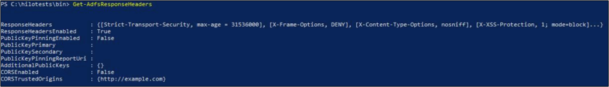
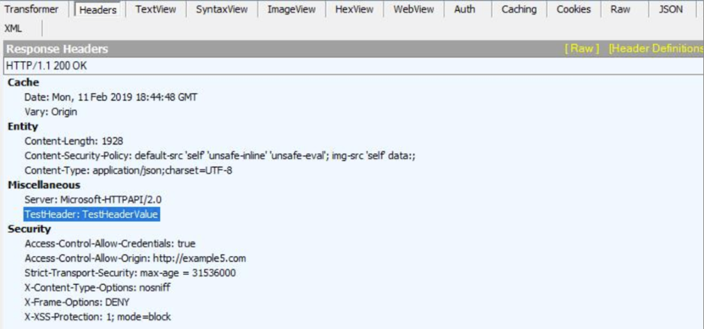

# Customize HTTP security response headers with AD FS 2019 
 
To protect against common security vulnerabilities and provide administrators the ability to take advantage of the latest advancements in browser-based protection mechanisms, AD FS 2019 added the functionality to customize the HTTP security response headers sent by AD FS. This is accomplished through the introduction of two new cmdlets: `Get-AdfsResponseHeaders` and `Set-AdfsResponseHeaders`.  

>[!NOTE]
>The functionality to customize the HTTP security response headers (except CORS Headers) using cmdlets: `Get-AdfsResponseHeaders` and `Set-AdfsResponseHeaders` was backported to AD FS 2016. You can add the functionality to your AD FS 2016 by installing [KB4493473](https://support.microsoft.com/en-us/help/4493473/windows-10-update-kb4493473) and [KB4507459](https://support.microsoft.com/en-us/help/4507459/windows-10-update-kb4507459). 

In this document we will discuss commonly used security response headers to demonstrate how to customize headers sent by AD FS 2019.   
 
>[!NOTE]
>The document assumes that AD FS 2019 has been installed.  

 
Before we discuss headers, let’s look into a few scenarios creating the need for admins to customize security headers 
 
## Scenarios 
1. Administrator has enabled [**HTTP Strict-Transport-Security (HSTS)**](#http-strict-transport-security-hsts) (forces all connections over HTTPS encryption) to protect the users who might access the web app using HTTP from a public wifi access point that might be hacked. She would like to further strengthen security by enabling HSTS for subdomains.  
2. Administrator has configured the [**X-Frame-Options**](#x-frame-options) response header (prevents rendering any web page in an iFrame) to protect the web pages from being clickjacked. However, she needs to customize the header value due to a new business requirement to display data (in iFrame) from an application with a different origin (domain).
3. Administrator has enabled [**X-XSS-Protection**](#x-xss-protection) (prevents cross scripting attacks) to sanitize and block the page if browser detects cross scripting attacks. However, she needs to customize header to allow the page to load once sanitized.  
4. Administrator needs to enable [**Cross Origin Resource Sharing (CORS)**](#cross-origin-resource-sharing-cors-headers) and set the origin (domain) on AD FS to allow a Single Page Application to access a web API with another domain.  
5. Administrator has enabled [**Content Security Policy (CSP)**](#content-security-policy-csp) header to prevent cross site scripting and data injection attacks by disallowing any cross-domain requests. However, due to a new business requirement she needs to customize the header to allow web page to load images from any origin and restrict media to trusted providers.  

 
## HTTP Security Response Headers 
The response headers are included in the outgoing HTTP response sent by AD FS to a web browser. The headers can be listed using the `Get-AdfsResponseHeaders` cmdlet as shown below.  



The `ResponseHeaders` attribute in the above screenshot identifies the security headers that will be included by AD FS in every HTTP response. The response headers will be sent only if `ResponseHeadersEnabled` is set to `True` (default value). The value can be set to `False` to prevent AD FS including any of the security headers in the HTTP response. However this is not recommended.  To do this use the following:

```PowerShell
Set-AdfsResponseHeaders -EnableResponseHeaders $false
```
 
### HTTP Strict-Transport-Security (HSTS) 
HSTS is a web security policy mechanism which helps mitigate protocol downgrade attacks and cookie hijacking for services that have both HTTP and HTTPS endpoints. It allows web servers to declare that web browsers (or other complying user agents) should only interact with it using HTTPS and never via the HTTP protocol.  
 
All AD FS endpoints for web authentication traffic are opened exclusively over HTTPS. As a result, AD FS effectively mitigates the threats that HTTP Strict Transport Security policy mechanism provides (by default there is no downgrade to HTTP since there are no listeners in HTTP). The header can be customized by setting the following parameters 
 
- **max-age=&lt;expire-time&gt;** – The expiry time (in seconds) specifies how long the site should only be accessed using HTTPS. Default and recommended value is 31536000 seconds (1 year).  
- **includeSubDomains** – This is an optional parameter. If specified, the HSTS rule applies to all subdomains as well.  
 
#### HSTS Customization 
By default, the header is enabled and `max-age` set to 1 year; however, administrators can modify the `max-age` (lowering max-age value is not recommended) or enable HSTS for subdomains through the `Set-AdfsResponseHeaders` cmdlet.  
 
```PowerShell
Set-AdfsResponseHeaders -SetHeaderName "Strict-Transport-Security" -SetHeaderValue "max-age=<seconds>; includeSubDomains" 
``` 

Example: 

```PowerShell
Set-AdfsResponseHeaders -SetHeaderName "Strict-Transport-Security" -SetHeaderValue "max-age=31536000; includeSubDomains" 
 ```

By default, the header is included in the `ResponseHeaders` attribute; however, administrators can remove the header through the `Set-AdfsResponseHeaders` cmdlet.  
 
```PowerShell
Set-AdfsResponseHeaders -RemoveHeaders "Strict-Transport-Security" 
```

### X-Frame-Options 
AD FS by default does not allow external applications to use iFrames when performing interactive logins. This is done to prevent certain style of phishing attacks. Note that non-interactive logins can be performed via iFrame due to prior session level security that has been established.  
 
However, in certain rare cases you may trust a specific application that requires iFrame capable interactive AD FS login page. The ‘X-Frame-Options’ header is used for this purpose.  
 
This HTTP security response header is used to communicate to the browser whether it can render a page in a &lt;frame&gt;/&lt;iframe&gt;. The header can be set to one of the following values: 
 
- **deny** – The page in a frame will not be displayed. This is the default and recommended setting.  
- **sameorigin** – The page will only be displayed in the frame if the origin is the same as the origin of the web page. The option is not very useful unless all ancestors are also in the same origin.  
- **allow-from <specified origin>** - The page will only be displayed in the frame if the origin (eg, https://www.".com) matches the specific origin in the header. 

#### X-Frame-Options Customization  
By default, header will be set to deny; however, admins can modify the value through the `Set-AdfsResponseHeaders` cmdlet.  
```PowerShell
Set-AdfsResponseHeaders -SetHeaderName "X-Frame-Options" -SetHeaderValue "<deny/sameorigin/allow-from<specified origin>>" 
 ```

Example: 

```PowerShell
Set-AdfsResponseHeaders -SetHeaderName "X-Frame-Options" -SetHeaderValue "allow-from https://www.example.com" 
 ```

By default, the header is included in the `ResponseHeaders` attribute; however, administrators can remove the header through the `Set-AdfsResponseHeaders` cmdlet.  

```PowerShell
Set-AdfsResponseHeaders -RemoveHeaders "X-Frame-Options" 
```

### X-XSS-Protection 
This HTTP security response header is used to stop web pages from loading when cross-site scripting (XSS) attacks are detected by browsers. This is referred as XSS filtering. The header can be set to one of the following values 
 
- **0** – Disables XSS filtering. Not recommended.  
- **1** – Enables XSS filtering. If XSS attack is detected, browser will sanitize the page.   
- **1; mode=block** – Enables XSS filtering. If XSS attack is detected, browser will prevent rendering of the page. This is the default and recommended setting.  

#### X-XSS-Protection Customization 
By default, the header will be set to 1; mode=block; however, administrators can modify the value through the `Set-AdfsResponseHeaders` cmdlet.  

```PowerShell
Set-AdfsResponseHeaders -SetHeaderName "X-XSS-Protection" -SetHeaderValue "<0/1/1; mode=block/1; report=<reporting-uri>>" 
``` 

Example: 

```PowerShell
Set-AdfsResponseHeaders -SetHeaderName "X-XSS-Protection" -SetHeaderValue "1" 
 ```

By default, the header is included in the `ResponseHeaders` attribute; however, admins can remove the header through the `Set-AdfsResponseHeaders` cmdlet. 

```PowerShell
Set-AdfsResponseHeaders -RemoveHeaders "X-XSS-Protection" 
```

### Cross Origin Resource Sharing (CORS) headers 
Web browser security prevents a web page from making cross-origin requests initiated from within scripts. However, sometimes you might want to access resources in other origins (domains). CORS is a W3C standard that allows a server to relax the same-origin policy. Using CORS, a server can explicitly allow some cross-origin requests while rejecting others.  
 
To better understand CORS request, let’s walkthrough a scenario where a single page application (SPA) needs to call a web API with a different domain. Further, let’s consider that both SPA and API are configured on ADFS 2019 and AD FS has CORS enabled i.e. AD FS can identify CORS headers in the HTTP request, validate header values, and include appropriate CORS headers in the response (details on how to enable and configure CORS on AD FS 2019 in CORS Customization section below). Sample flow: 

1. User accesses SPA through client browser and is redirected to AD FS auth endpoint for authentication. Since SPA is configured for implicit grant flow, request returns an Access + ID token to the browser after successful authentication.  
2. After user authentication, the front-end JavaScript included in SPA makes a request to access the web API. The request is redirected to AD FS with following headers
    - Options – describes the communication options for the target resource 
    - Origin – includes the origin of the web API
    - Access-Control-Request-Method – identifies the HTTP method (eg, DELETE) to be used when actual request is made 
    - Access-Control-Request-Headers - identifies the HTTP headers to be used when actual request is made 
    
   >[!NOTE]
   >CORS request resembles a standard HTTP request, however, the presence of an origin header signals the incoming request is CORS related. 
3. AD FS verifies that the web API origin included in the header is listed in the trusted origins configured in AD FS (details on how to modify trusted origins in CORS Customization section below). AD FS then responds with following headers.  
    - Access-Control-Allow-Origin – value same as in the Origin header 
    - Access-Control-Allow-Method – value same as in the Access-Control-Request-Method header 
    - Access-Control-Allow-Headers - value same as in the Access-Control-Request-Headers header 
4. Browser sends the actual request including the following headers 
    - HTTP method (eg, DELETE) 
    - Origin – includes the origin of the web API 
    - All headers included in the Access-Control-Allow-Headers response header 
5. Once verified, AD FS approves the request by including the web API domain (origin) in the Access-Control-Allow-Origin response header.  
6. The inclusion of the Access-Control-Allow-Origin header will allow the browser to go ahead with calling the requested API.

#### CORS customization 
By default, CORS functionality will not be enabled; however, admins can enable the functionality through the Set-AdfsResponseHeaders cmdlet.  

```PowerShell 
Set-AdfsResponseHeaders -EnableCORS $true 
 ```

One enabled, admins will be able to enumerate a list of trusted origins using the same cmdlet. For instance, the following command would allow CORS requests from the origins **https&#58;//example1.com** and **https&#58;//example1.com**. 
 
```PowerShell
Set-AdfsResponseHeaders -CORSTrustedOrigins https://example1.com,https://example2.com 
 ```

> [!NOTE]
> Admins can allow CORS requests from any origin by including "*" in the list of trusted origins, although this approach is not recommended due to security vulnerabilities and a warning message is provided if they choose to. 

### Content Security Policy (CSP) 
This HTTP security response header is used to prevent cross-site scripting, clickjacking and other data injection attacks by preventing browsers from inadvertently executing malicious content. Browsers that don’t support CSP simply ignores the CSP response headers.  
 
#### CSP Customization 
Customization of CSP header involves modifying the security policy that defines the resources browser is allowed to load for the web page. The default security policy is  
 
`Content-Security-Policy: default-src ‘self’ ‘unsafe-inline’ ‘’unsafe-eval’; img-src ‘self’ data:;` 
 
The **default-src** directive is used to modify [-src directives](https://developer.mozilla.org/docs/Web/HTTP/Headers/Content-Security-Policy/default-src) without listing each directive explicitly. For instance, in the example below the policy 1 is same as the policy 2.  

Policy 1 
```PowerShell
Set-AdfsResponseHeaders -SetHeaderName "Content-Security-Policy" -SetHeaderValue "default-src 'self'" 
```
 
Policy 2
```PowerShell 
Set-AdfsResponseHeaders -SetHeaderName "Content-Security-Policy" -SetHeaderValue "script-src ‘self’; img-src ‘self’; font-src 'self';  
frame-src 'self'; manifest-src 'self'; media-src 'self';" 
```

If a directive is explicitly listed, the specified value overrides the value given for default-src. In the example below, the img-src will take the value as ‘*’ (allowing images to be loaded from any origin) while other -src directives will take the value as ‘self’ (restricting to same origin as the web page).  

```PowerShell
Set-AdfsResponseHeaders -SetHeaderName "Content-Security-Policy" -SetHeaderValue "default-src ‘self’; img-src *" 
```
Following sources can be defined for the default-src policy 
 
- ‘self’ – specifying this restricts the origin of the content to load to the origin of the web page 
- ‘unsafe-inline’ – specifying this in the policy allows the use of inline JavaScript and CSS 
- ‘unsafe-eval’ – specifying this in the policy allows the use of text to JavaScript mechanisms like eval 
- ‘none’ – specifying this restricts the content from any origin to load 
- data: - specifying data: URIs allows content creators to embed small files inline in documents. Usage not recommended.  
 
>[!NOTE]
>AD FS uses JavaScript in the authentication process and therefore enables JavaScript by including ‘unsafe-inline’ and ‘unsafe-eval’ sources in default policy.  

### Custom Headers 
In addition to the above listed security response headers (HSTS, CSP, X-Frame-Options, X-XSS-Protection and CORS), AD FS 2019 provides the ability to Set new headers.  
 
Example: To set a new header "TestHeader" with value as "TestHeaderValue" 

```PowerShell
Set-AdfsResponseHeaders -SetHeaderName "TestHeader" -SetHeaderValue "TestHeaderValue" 
 ```

Once set, the new header is sent in the AD FS response (fiddler snippet below).  
 


## Web browswer compatibility
Use the following table and links to determine which web browsers are compatible with each of the security response headers.

|HTTP Security Response Headers|Browser Compatibility|
|-----|-----|
|HTTP Strict-Transport-Security (HSTS)|[HSTS browser compatibility](https://developer.mozilla.org/docs/Web/HTTP/Headers/Strict-Transport-Security#Browser_compatibility)|
|X-Frame-Options|[X-Frame-Options browser compatibility](https://developer.mozilla.org/docs/Web/HTTP/Headers/X-Frame-Options#Browser_compatibility)| 
|X-XSS-Protection|[X-XSS-Protection browser compatibility](https://developer.mozilla.org/en-US/docs/Web/HTTP/Headers/X-XSS-Protection#Browser_compatibility)| 
|Cross Origin Resource Sharing (CORS)|[CORS browser compatibility](https://developer.mozilla.org/docs/Web/HTTP/CORS#Browser_compatibility) 
|Content Security Policy (CSP)|[CSP browser compatibility](https://developer.mozilla.org/docs/Web/HTTP/CSP#Browser_compatibility) 

## Next

- [Use AD FS Help troublehshooting guides](https://aka.ms/adfshelp/troubleshooting )
- [AD FS Troubleshooting](../../ad-fs/troubleshooting/ad-fs-tshoot-overview.md)
