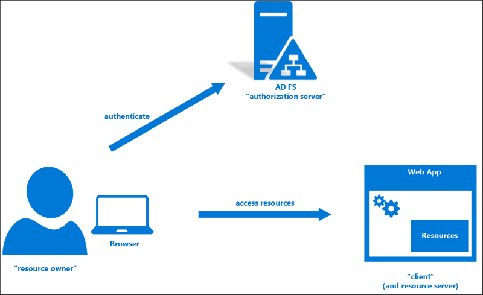
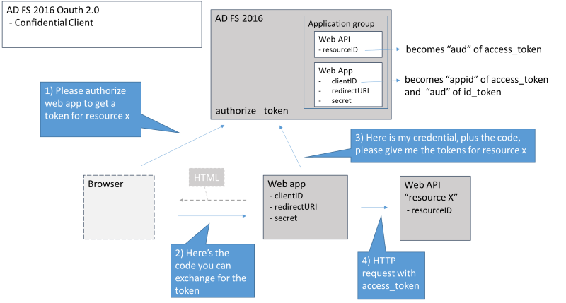
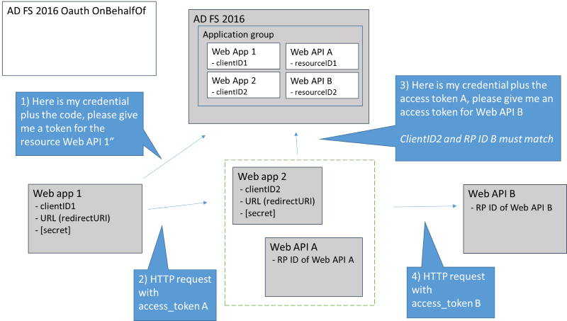

# AD FS Scenarios for Developers

AD FS in Windows Server 2016 [AD FS 2016] enables you to add industry standard OpenID Connect and OAuth 2.0 based authentication and authorization to applications you are developing, and have those applications authenticate users directly against AD FS.    
  
AD FS 2016 also supports the WS-Federation, WS-Trust, and SAML protocols and profiles we have supported in previous versions.  If you are interested in developer guidance for these protocols, see the article here.  This article will focus on how to use and benefit from the newer protocol support.  
  
## Why Modern Authentication  
While you can continue using AD FS for sign on with WS-Federation, WS-Trust, and SAML protocols just as you have before, with the newer protocols, you get the following benefits:  
  
* **Simplicity and consistency**  
    * Use the same set of APIs and patterns to enable sign on for:   
        *   multiple types of applications (server, desktop, mobile, browser)  
        *   multiple platforms (android, iOS, Windows)  
        *   applications inside the corporate network or hosted in the cloud  
    * Use the same set of libraries you can already use to authenticate users against Azure AD  
* **Flexibility**  
    * In addition to standard user authorization, enable more complex scenarios such as:      
        * ? 3-legged sign on flows in which a user authorizes one web application or service to access resources that reside with another web app or service.    
        * ? Server-to-server flows in which a mid-tier service accesses a back end API  
        * ? JavaScript based single-page applications (SPA)  
* **Industry support**  
    * OAuth 2.0 and OpenID Connect enjoy wide utilization across the industry, so knowledge of these patterns will help you enable authentication and authorization outside of an Active Directory environment as well  
  
## How it works: The Basics  
You can add AD FS modern authentication to your application using the same set of tools and libraries you can already use to authenticate users against Azure AD.   
  
In AD FS scenarios of course, it is AD FS and not Azure AD that serves as the identity provider and authorization server.  Otherwise the concepts are exactly the same: users provide their credentials and obtain tokens, either directly or via an intermediary, for access to resources.  
  
The most basic scenario consists of a user or "resource owner", interacting with a browser to access a web application:  
  
  
  
The web application is called a "client" because it initiates the request to the authorization server (AD FS) for an access token to the resource.  The resource may be hosted by the web app itself or may be accessible as a web API somewhere on the network or internet.   The user or "resource owner" authorizes the client web app to receive that access token by providing credentials to the authorization server.    
  
## How it works: components  
OAuth 2.0 and OpenID Connect scenarios in AD FS make use of the same set of tools and libraries you use when Azure AD is the identity provider.  These components are:  
* Active Directory Authentication Library (ADAL):  client libraries that facilitate collecting user credentials, creating and submitting token requests and retrieving the resulting tokens.    
* OWIN (Open Web Interface for .NET) middleware: While OWIN is a community based project, Microsoft has created a set of server side libraries that for protecting web applications and web APIs with OpenID Connect and OAuth 2.0  
  
The roles of these components are shown in the diagram below:  
  
  
  
## Modeling these scenarios in AD FS 2016  
  
### Application Groups  
To represent these scenarios in AD FS policy, we have introduced a new concept called Application Groups.  An application group can contain any number and combination of the following fundamental types of application:  
  
  
  
Application Group / Application Type  |Description  |Role    
---------|---------|---------  
Native application     |  Sometimes called a public client, this is intended to be a client app that runs on a pc or device and with which the user interacts.       | Requests tokens from the authorization server (AD FS) for user access to resources.  Sends HTTP requests to protected resources, using the tokens as HTTP headers.        
Server application     |   A web application that runs on a server and is generally accessible to users via a browser.  Because it is capable of maintaining its own client 'secret' or credential, it is sometimes called a confidential client.      | Requests tokens from the authorization server (AD FS) for user access to resources.  Sends HTTP requests to protected resources, using the tokens as HTTP headers.               
Web API     |  The end resource the user is accessing. Think of these as the new representation of "relying parties".| Consumes tokens obtained by clients  
  
### Differences from AD FS 2012 R2  
Application groups combine trust and authorization elements that AD FS 2012 R2 exposed separately, as relying parties, clients, and application permissions.  
  
The following tables compares the methods by which corresponding application trust objects are created in AD FS 2012 R2 vs AD FS 2016:  
  
AD FS in Windows Server 2012 R2|In PowerShell|AD FS Management  
---------|---------|---------  
Add native client|Add-AdfsClient|NA  
Add server application as client|Add-AdfsClient|NA  
Add Web API / resource|Add-AdfsRelyingPartyTrust|Create Relying Party Trust  
  
AD FS 2016|In PowerShell|AD FS Management  
---------|---------|---------  
Add native client|Add-AdfsNativeClientApplication|Add Native Application to Application Group  
Add server application as client|Add-AdfsServerApplication|Add Server Application to Application Group  
Add Web API / resource|Add-AdfsWebApiApplication|Add Web API Application to Application Group  
  
### Application Permissions and Consent  
By default, the clients in an application group are allowed to access the resources in the same group.  The administrator does not have to configure specific application permissions.  Application groups also allow administrators to specify the scopes allowed, such as openid or user_impersonation.  The scenario descriptions below specify exactly which scopes are required for which scenario.  
  
Because AD FS uses a model of administrator consent, users are not prompted for consent when accessing resources.  By configuring the application group, the administrator in effect provides consent on behalf of all application users.  
  
## Supported Scenarios  
The following section describes the scenarios we support in more detail.  
  
### Tokens used  
These scenarios make use of three token types:  
  
* **id_token:** A JWT token used to represent the identity of the user. The 'aud' or audience claim of the id_token matches the client ID of the native or server application.  
* **access_token:** A JWT token used in Oauth and OpenID connect scenarios and intended to be consumed by the resource.  The 'aud' or audience claim of this token must match the identifier of the resource or Web API.  
* **refresh_token:** This token is submitted in place of collecting user credentials to provide a single sign on experience.  This token is both issued and consumed by AD FS, and is not readable by clients or resources.    
  
### Native client to Web API  
This scenario enables the user of a native client application to call an AD FS 2016 protected Web API.  
* The native client application uses ADAL to send authorization and token requests to AD FS, prompting for credentials from the user as necessary, then sends the resulting token as an HTTP header on the request to the Web API  
* [This part is for demonstration purposes only] The web API reads the claims from the ClaimsPrincipal object that results from the access token sent by the client, and sends them back to the client.  
  
  
  
1.  The native client application initiates the flow with a call to the ADAL library.  This triggers a browser based HTTP GET to the AD FS authorize endpoint:  
  
**Authorization request:**  
GET <https://fs.contoso.com/adfs/oauth2/authorize?>  
  
Parameter|Value  
---------|---------  
response_type|"code"  
resource|RP ID (Identifier) of Web API in application group  
client_id|client Id of the native application in the application group  
redirect_uri|Redirect URI of native application in application group  
  
**Authorization request response:**  
If the user has not signed in before, the user is prompted for credentials.    
AD FS responds by returning an authorization code as the "code" parameter in the query component of the redirect_uri.  For example: HTTP/1.1 302 Found Location: **<http://redirect_uri:80/?code=&lt;code&gt>;.**  
  
2. The native client then sends the code, along with the following parameters, to the AD FS token endpoint:  
  
**Token Request:**  
POST https://fs.contoso.com/adfs/oauth2/token  
  
Parameter|Value  
---------|---------  
grant_type|"authorization_code" 
code|authorization code from 1  
resource|RP ID (Identifier) of Web API in application group  
client_id|client Id of the native application in the application group  
redirect_uri|Redirect URI of native application in application group  
  
**Token request response:**  
AD FS responds with an HTTP 200 with the access_token, refresh_token, and id_token in the body.  
  
3. The native application then sends the access_token part of the above response as the Authorization header in the HTTP request to the web API.  
  
### Single sign on behavior  
Subsequent client requests within 1 hour (by default) the access_token will still be valid in the cache, and a new request will not trigger any traffic to AD FS.  The access_token will automatically be fetched from the cache by ADAL.  
  
After the access token expires, ADAL will automatically send a refresh token based request to the AD FS token endpoint (skipping the authorization request automatically).  
**Refresh token request:**  
POST https://fs.contoso.com/adfs/oauth2/token
   

Parameter|Value|
---------|---------
grant_type|"refresh_token"|
resource|RP ID (Identifier) of Web API in application group|
client_id|client Id of the native application in the application group
refresh_token|the refresh token issued by AD FS in response to the initial token request

  
  
**Refresh token request response:**  
If the refresh token is within <SSO_period>, the request will result in a new access token. The user is not prompted for credentials.  For more information on SSO settings see [AD FS Single Sign On Settings](../../ad-fs/operations/AD-FS-2016-Single-Sign-On-Settings.md)  
  
If the refresh token has expired, the request results in an HTTP 401 with error "invalid_grant" and "error_description" "MSIS9615: The refresh token received in refresh_token parameter has expired". In this case, ADAL automatically submits a new authorization request that looks just like #1 above.    
  
### Web Browser to Web App   
In this scenario, a user with a browser needs to access resources hosted by a web application.    
There are two scenarios that accomplish this.  
  
#### Oauth confidential client  
This scenario is similar to the above in that there is an authorization request, followed by a code for token exchange.  The web app (modeled as a Server Application in AD FS) initiates the authorization request via the browser and exchanges the code for the token (by connecting directly to AD FS)  
  
  
  
1. The Web App initiates an authorization request via the browser, which sends an HTTP GET to the AD FS authorize endpoint  
   **Authorization request**:  
   GET <https://fs.contoso.com/adfs/oauth2/authorize?>  
  
Parameter|Value  
---------|---------  
response_type|"code"  
resource|RP ID (Identifier) of Web API in application group  
client_id|Client Id of the native application in the application group  
redirect_uri|Redirect URI of web app (server application) in application group  
  
Authorization request response:  
If the user has not signed in before, the user is prompted for credentials.  
AD FS responds by returning an authorization code as the "code" parameter in the query component of the redirect_uri, for example: HTTP/1.1 302 Found Location: <https://webapp.contoso.com/?code=&lt;code&gt>;.  
  
2. As a result of the above 302, the browser initiates an HTTP GET to the web app, for example: GET <http://redirect_uri:80/?code=&lt;code&gt>;.   
  
3. At this point the web app, having received the code, initiates a request to the AD FS token endpoint, sending the following  
   **Token request:**  
   POST https://fs.contoso.com/adfs/oauth2/token  
  
Parameter|Value  
---------|---------  
grant_type|"authorization_code"  
code|authorization code from 2 above  
resource|RP ID (Identifier) of Web API in application group  
client_id|Client Id of the web app (server application) in the application group  
redirect_uri|Redirect URI of web app (server application) in application group  
client_secret|Secret of the web app (server application) in the application group. **Note: The client's credential does not need to be a client_secret.  AD FS supports the ability to use certificates or Windows Integrated Authentication as well.**  
  
**Token request response:**  
AD FS responds with an HTTP 200 with the access_token, refresh_token, and id_token in the body.  
claims  
4. The web application then either consumes the access_token part of the above response (in the case in which the web app itself hosts the resource), or otherwise sends it as the Authorization header in the HTTP request to the web API.  
  
#### Single sign on behavior  
While the access token will still be valid for 1 hour (by default) in the client's cache, you may think that the second request will work as in the native client scenario above - that a new request will not trigger any traffic to AD FS as the access token will automatically be fetched from the cache by ADAL.  However, it is possible that the web app can send distinct authorization and token requests, the former via distinct URL link, as in our sample.  
  
In this case, it is the AD FS browser SSO cookie that enables AD FS to issue a new authorization code without prompting the user for credentials. The web app then calls to AD FS to exchange the new authorization code for a new access token.  The user is not prompted for credentials.  
  
Otherwise, if the web app is smart enough to know if the user is already authenticated, the authorize request can be skipped and either:  
* the cached access token, if not expired, is retrieved and used, or   
* a request token based request can be sent to the AD FS token endpoint, as described below  
  
**Refresh token request:**  
POST https://fs.contoso.com/adfs/oauth2/token
   
Parameter|Value  
---------|---------  
grant_type|"refresh_token"  
resource|RP ID (Identifier) of Web API in application group  
client_id|Client Id of the web app (server application) in the application group  
refresh_token|Refresh token issued by AD FS in response to the initial token request  
client_secret|Secret of the web app (server application) in the application group  
  
**Refresh token request response:**  
If the refresh token is within <SSO_period>, the request will result in a new access token. The user is not prompted for credentials. For more information on SSO settings see [AD FS Single Sign On Settings](../../ad-fs/operations/AD-FS-2016-Single-Sign-On-Settings.md)   
  
If the refresh token has expired, the request results in an HTTP 401 with error "invalid_grant" and "error_description" "MSIS9615: The refresh token received in refresh_token parameter has expired". In this case, ADAL automatically submits a new authorization request that looks just like #1 above.    
  
#### OpenID Connect: Hybrid flow  
This scenario is similar to the above in that there is an authorization request initiated by the web app via browser redirect, and a code for token exchange from the web app to AD FS.  The difference in this scenario is that AD FS issues an id_token as part of the initial authorization request response.  
  
  
  
1.  The Web App initiates an authorization request via the browser, which sends an HTTP GET to the AD FS authorize endpoint  
  
**Authorization request:**  
GET <https://fs.contoso.com/adfs/oauth2/authorize?>  
  
Parameter|Value  
---------|---------  
response_type|"code+id_token"  
response_mode|"form_post"  
resource|RP ID (Identifier) of Web API in application group  
client_id|Client Id of the web app (server application) in the application group  
redirect_uri|Redirect URI of web app (server application) in the application group  
  
**Authorization request response:**  
If the user has not signed in before, the user is prompted for credentials.  
AD FS responds with an HTTP 200 and form containing the below as hidden elements:  
* code: the authorization code  
* id_token: a JWT token containing claims describing the user authentication  
* The form automatically posts to the redirect_uri of the web app, sending the code and the id_token to the web app.  
  
3. At this point the web app, having received the code, initiates a request to the AD FS token endpoint, sending the following  
  
**Token request:**  
POST https://fs.contoso.com/adfs/oauth2/token
  
  
  
Parameter|Value  
---------|---------  
grant_type|"authorization_code"  
code|authorization code from above  
resource|RP ID (Identifier) of Web API in application group  
client_id|Client Id of the web app (server application) in the application group  
redirect_uri|Redirect URI of web app (server application) in application group  
client_secret|Secret of the web app (server application) in the application group  
  
**Token request response:**  
AD FS responds with an HTTP 200 with the access_token, refresh_token, and id_token in the body.  
  
4. The web application then either consumes the access_token part of the above response (in the case in which the web app itself hosts the resource), or otherwise sends it as the Authorization header in the HTTP request to the web API.  
  
#### Single Sign on behavior  
The single sign on behavior is the same as for the Oauth 2.0 confidential client flow above.  
  
### On Behalf Of  
In this scenario, a web app uses the original access token from a user to request and obtain another access token for another Web API, which the web app will then access as the end user.  This is called an "on behalf of" flow.  
  
  
  
Steps 1 and 2 work just like steps 3 and 4 in the previous flow.  
In Step 3, the key requirement is that the client_id parameter, the client ID of the Web app 2, must match the RP ID of Web API A.  In other words, the audience of the access token being exchanged for the new token must match the client ID of the entity requesting the new token.  

## Related content  
See [AD FS Development](../AD-FS-Development.md) for the complete list of walk-through articles, which provide step-by-step instructions on using the related flows. 
