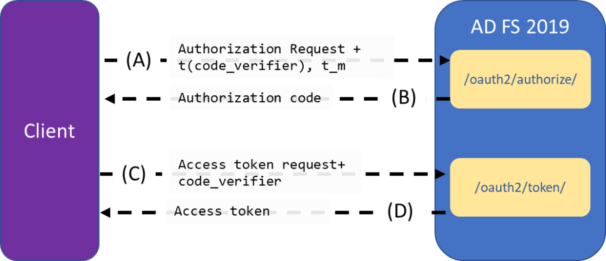
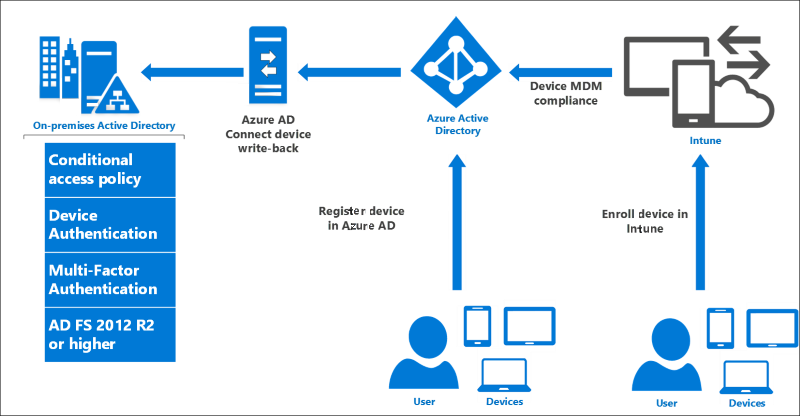

# What's new in Active Directory Federation Services

## What's new in Active Directory Federation Services for Windows Server 2019

### Protected Logins
The following is a brief summary of updates to protected logins available in AD FS 2019:
- **External Auth Providers as Primary** - Customers can now use 3rd party authentication products as the first factor and not expose passwords as the first factor. In the cases where an external auth provider can prove 2 factors it can claim MFA. 
- **Password Authentication as additional Authentication** - Customers have a fully supported inbox option to use password only for the additional factor after a password less option is used as the first factor. This improves the customer experience from ADFS 2016 where customers had to download a github adapter which is supported as is. 
- **Pluggable Risk Assessment Module** - Customers can now build their own plug in modules to block certain types of requests during pre-authentication stage. This makes it easier for customers to use cloud intelligence such as Identity protection to block logins for risky users or risky transactions.  For more information see [ Build Plug-ins with AD FS 2019 Risk Assessment Model](../../ad-fs/development/ad-fs-risk-assessment-model.md) 
- **ESL improvements** - Improves on the ESL QFE in 2016 by adding the following capabilities
    - Enables customers to be in audit mode while being protected by 'classic' extranet lockout functionality available since ADFS 2012R2. Currently 2016 customers would have no protection while in audit mode. 
    - Enables independent lockout threshold for familiar locations. This makes it possible for multiple instances of apps running with a common service account to roll over passwords with the least amount of impact. 

### Additional security improvements
The following additional security improvements are available in AD FS 2019:
- **Remote PSH using SmartCard Login** - Customers can now use smartcards to remote connect to ADFS via PSH and use that to manage all PSH functions include multi-node PSH cmdlets.
- **HTTP Header customization** - Customers can now customize HTTP headers emitted during ADFS responses. This includes the following headers
     - HSTS: This conveys that ADFS endpoints can only be used on HTTPS endpoints for a compliant browser to enforce
     - x-frame-options: Allows ADFS admins to allow specific relying parties to embed iFrames for ADFS interactive login pages. This should be used with care and only on HTTPS hosts. 
     - Future header: Additional future headers can be configured as well. 

For more information see [Customize HTTP security response headers with AD FS 2019](../../ad-fs/operations/customize-http-security-headers-ad-fs.md) 

### Authentication/Policy capabilities
The following authentication/policy capabilities are in AD FS 2019:
- **Specify auth method for additional auth per RP** - Customers can now use claims rules to decide which additional authentication provider to invoke for additional authentication provider. This is useful for 2 use cases
    - Customers are transitioning from one additional authentication provider to another. This way as they onboard users to a newer authentication provider they can use groups to control which additional authentication provider is called.
    - Customers have needs for a specific additional authentication provider (e.g. certificate) for certain applications. 
- **Restrict TLS based device auth only to applications that require it** - Customers can now restrict client TLS based device authentications to only applications performing device based conditional access. This prevents any unwanted prompts for device authentication (or failures if the client application cannot handle) for applications that do not require TLS based device authentication.
- **MFA freshness support**	- AD FS now supports the ability to re-do 2nd factor credential based on the freshness of the 2nd factor credential. This allows customers to do an initial transaction with 2 factors and only prompt for the 2nd factor on a periodic basis. This is only available to applications that can provide an additional parameter in the request and is not a configurable setting in ADFS. This parameter is supported by Azure AD when "Remember my MFA for X days" is configured and the 'supportsMFA' flag is set to true on the federated domain trust settings in Azure AD. 

### Sign-in SSO improvements
The following sign-in SSO improvements have been made in AD FS 2019:

- [Paginated UX with Centered Theme](../operations/AD-FS-paginated-sign-in.md) - ADFS now has moved to a paginated UX flow that allows ADFS to validate and provide a more smoother sign-in experience. ADFS now uses a centered UI (instead of the right side of the screen). You may require newer logo and background images to align with this experience. This also mirrors functionality offered in Azure AD.
- **Bug fix: Persistent SSO state for Win10 devices when doing PRT auth**	This addresses an issue where MFA state was not persisted when using PRT authentication for Windows 10 devices. The result of the issue was that end users would get prompted for 2nd factor credential (MFA) frequently. The fix also makes the experience consistent when device auth is successfully performed via client TLS and via PRT mechanism. 

### Suppport for building modern line-of-business apps
The following support for building modern LOB apps has been added to AD FS 2019:

 - **Oauth Device flow/profile** - AD FS now supports the OAuth device flow profile to perform logins on devices that do not have a UI surface area to support rich login experiences. This allows the user to complete the login experience on a different device. This functionality is required for Azure CLI experience in Azure Stack and can be used in other cases. 
 - **Removal of 'Resource' parameter** - AD FS has now removed the requirement to specify a resource parameter which is in line with current Oauth specifications. Clients can now provide the Relying Party trust identifier as the scope parameter in addition to permissions requested. 
 - **CORS headers in AD FS responses** - Customers can now build Single Page Applications that allow client side JS libraries to validate the signature of the id_token by querying for the signing keys from the OIDC discovery document on AD FS. 
 - **PKCE support**	- AD FS adds PKCE support to provide a secure auth code flow within OAuth. This adds an additional layer of security to this flow to prevent hijacking the code and replaying it from a different client. 
 - **Bug fix: Send x5t and kid claim** - This is a minor bug fix. AD FS now additionally sends the 'kid' claim to denote the key id hint for verifying the signature. Previously AD FS only sent this as 'x5t' claim.

### Supportability improvements
The following supportability improvements are not part of AD FS 2019:
- **Send error details to AD FS admins** - Allows admins to configure end users to send debug logs relating to a failure in end user authentication to be stored as a zipped filed for easy consumption. Admins can also configure an SMTP connection to automail the zipped file to a triage email account or to auto create a ticket based on the email. 

### Deployment updates
The following deployment updates are now included in AD FS 2019:
- **Farm Behavior Level 2019** - As with AD FS 2016, there is a new Farm Behavior Level version that is required to enable new functionality discussed above. This allows going from:
    - 2012 R2-> 2019
    - 2016 -> 2019	 

### SAML updates
The following SAML update is in AD FS 2019:
- **Bug fix: Fix bugs in aggregated federation** - There have been numerous bug fixes around aggregated federation support (e.g. InCommon). The fixes have been around the following: 
  - Improved scaling for large # of entities in the aggregated federation metadata doc. Previously, this would fail with "ADMIN0017" error. 
  - Query using 'ScopeGroupID' parameter via Get-AdfsRelyingPartyTrustsGroup PSH cmdlet. 
  - Handling error conditions around duplicate entityID

### Azure AD style resource specification in scope parameter 
Previously, AD FS required the desired resource and scope to be in a separate parameter in any authentication request. For example, a typical oauth request would look like below: 
7
**https:&#47;&#47;fs.contoso.com/adfs/oauth2/authorize? response_type=code&client_id=claimsxrayclient&resource=urn:microsoft: adfs:claimsxray&scope=oauth&redirect_uri=https:&#47;&#47;adfshelp.microsoft.com/ 
ClaimsXray/TokenResponse&prompt=login**
 
With AD FS on Server 2019, you can now pass the resource value embedded in the scope parameter. This is consistent with how one can do authentication against Azure AD also. 

The scope parameter can now be organized as a space separated list where each entry is structure as resource/scope. For example  

**< create a valid sample request>**
> [!NOTE]
> Only one resource can be specified in the authentication request. If more than one resource is included in the request, AD FS will return an error and authentication will not succeed. 

### Proof Key for Code Exchange (PKCE) support for oAuth 
OAuth public clients using the Authorization Code Grant are susceptible to the authorization code interception attack.  The attack is well described in RFC 7636. To mitigate this attack, AD FS in Server 2019 supports Proof Key for Code Exchange (PKCE) for OAuth Authorization Code Grant flow. 
 
To leverage the PKCE support, This specification adds additional parameters to the OAuth 2.0 Authorization and Access Token Requests.

A. The client creates and records a secret named the "code_verifier" and derives a transformed version "t(code_verifier)" (referred to as the "code_challenge"), which is sent in the OAuth 2.0       Authorization Request along with the transformation method "t_m". 

B. The Authorization Endpoint responds as usual but records "t(code_verifier)" and the transformation method. 

C. The client then sends the authorization code in the Access Token Request as usual but includes the "code_verifier" secret generated at (A). 

D. The AD FS transforms "code_verifier" and compares it to "t(code_verifier)" from (B).  Access is denied if they are not equal. 

#### FAQ 
**Q.** Can I pass resource value as part of the scope value like how requests are done against Azure AD? 
 **A.** With AD FS on Server 2019, you can now pass the resource value embedded in the scope parameter. The scope parameter can now be organized as a space separated list where each entry is structure as resource/scope. For example  
**< create a valid sample request>**

**Q.** Does AD FS support PKCE extension?
 **A.** AD FS in Server 2019 supports Proof Key for Code Exchange (PKCE) for OAuth Authorization Code Grant flow 

## What's new in Active Directory Federation Services for Windows Server 2016   
If you are looking for information on earlier versions of AD FS, see the following articles:  
 [ADFS in Windows Server 2012 or 2012 R2](https://technet.microsoft.com/library/hh831502.aspx) and [AD FS 2.0](https://technet.microsoft.com/library/adfs2.aspx)  

 Active Directory Federation Services provides access control and single sign on across a wide variety of applications including Office 365, cloud based SaaS applications, and applications on the corporate network.  
* For the IT organization, it enables you to provide sign on and access control to both modern and legacy applications, on premises and in the cloud, based on the same set of credentials and policies.    
* For the user, it provides seamless sign on using the same, familiar account credentials.  
* For the developer, it provides an easy way to authenticate users whose identities live in the organizational directory so that you can focus your efforts on your application, not authentication or identity.  

This article describes what is new in AD FS in Windows Server 2016 (AD FS 2016).  

## Eliminate Passwords from the Extranet  
AD FS 2016 enables three new options for sign on without passwords, enabling organizations to avoid risk of network compromise from phished, leaked or stolen passwords. 

### Sign in with Azure Multi-factor Authentication
AD FS 2016 builds upon the multi-factor authentication (MFA) capabilities of AD FS in Windows Server 2012 R2 by allowing sign on using only an Azure MFA code, without first entering a username and password.

* With Azure MFA as the primary authentication method, the user is prompted for their username and the OTP code from the Azure Authenticator app.  
* With Azure MFA as the secondary or additional authentication method, the user provides primary authentication credentials (using Windows Integrated Authentication, username and password, smart card, or user or device certificate), then sees a prompt for text, voice, or OTP based Azure MFA login.  
* With the new built-in Azure MFA adapter, setup and configuration for Azure MFA with AD FS has never been simpler.
* Organizations can take advantage of Azure MFA without the need for an on premises Azure MFA server.
* Azure MFA can be configured for intranet or extranet, or as part of any access control policy.

For more information about Azure MFA with AD FS
*  [Configure AD FS 2016 and Azure MFA](https://docs.microsoft.com/windows-server/identity/ad-fs/operations/configure-ad-fs-and-azure-mfa)  

### Password-less Access from Compliant Devices
AD FS 2016 builds on previous device registration capabilities to enable sign on and access control based the device compliance status. Users can sign on using the device credential, and compliance is re-evaluated when device attributes change, so that you can always ensure policies are being enforced.  This enables policies such as

* Enable Access only from devices that are managed and/or compliant  
* Enable Extranet Access only from devices that are managed and/or compliant  
* Require multi-factor authentication for computers that are not managed or not compliant  

AD FS provides the on premises component of conditional access policies in a hybrid scenario. When you register devices with Azure AD for conditional access to cloud resources, the device identity can be used for AD FS policies as well.

  

 For more information about using device based conditional access in the cloud   
 *  [Azure Active Directory Conditional Access](https://azure.microsoft.com/documentation/articles/active-directory-conditional-access/)

For more information about using device based conditional access with AD FS
*  [Planning for Device Based Conditional Access with AD FS](../../ad-fs/deployment/Plan-Device-based-Conditional-Access-on-Premises.md)  
* [Access Control Policies in AD FS](../../ad-fs/operations/Access-Control-Policies-in-AD-FS.md)  

### Sign in with Windows Hello for Business   
Windows 10 devices introduce Windows Hello and Windows Hello for Business, replacing user passwords with strong device-bound user credentials protected by a user's gesture (a PIN, a biometric gesture like fingerprint, or facial recognition). AD FS 2016 supports these new Windows 10 capabilities so that users can sign in to AD FS applications from the intranet or the extranet without the need to provide a password.

For more information about using Microsoft Windows Hello for Business in your organization
*  [Enable Windows Hello for Business in your organization](https://azure.microsoft.com/documentation/articles/active-directory-azureadjoin-passport-deployment/)

## Secure Access to Applications

### Modern Authentication
AD FS 2016 supports the latest modern protocols that provide a better user experience for Windows 10 as well as the latest iOS and Android devices and apps.  

For more information see [AD FS Scenarios for Developers](../../ad-fs/overview/AD-FS-Scenarios-for-Developers.md)  

### Configure access control policies without having to know claim rules language  
Previously, AD FS administrators had to configure policies using the AD FS claim rule language, making it difficult to configure and maintain policies. With access control policies, administrators can use built in templates to apply common policies such as
* Permit intranet access only
* Permit everyone and require MFA from Extranet
* Permit everyone and require MFA from a specific group

The templates are easy to customize using a wizard driven process to add exceptions or additional policy rules and can be applied to one or many applications for consistent policy enforcement.

For more information see [Access control policies in AD FS.](../../ad-fs/operations/Access-Control-Policies-in-AD-FS.md)  

### Enable sign on with non-AD LDAP directories  
Many organizations have a combination of Active Directory and third-party directories. With the addition of AD FS support for authenticating users stored in LDAP v3-compliant directories, AD FS can now be used for:
* Users in third party, LDAP v3 compliant directories
* Users in Active Directory forests to which an Active Directory two-way trust is not configured
* Users in Active Directory Lightweight Directory Services (AD LDS)

For more information see [Configure AD FS to authenticate users stored in LDAP directories.](../../ad-fs/operations/Configure-AD-FS-to-authenticate-users-stored-in-LDAP-directories.md)  

## Better Sign-in experience
### Customize sign in experience for AD FS applications  
We heard from you that the ability to customize the logon experience for each application would be a great usability improvement, especially for organizations who provide sign on for applications that represent multiple different companies or brands.  

Previously, AD FS in Windows Server 2012 R2 provided a common sign on experience for all relying party applications, with the ability to customize a subset of text based content per application. With Windows Server 2016, you can customize not only the messages, but images, logo and web theme per application. Additionally, you can create new, custom web themes and apply these per relying party.  

For more information see [AD FS user sign-in customization.](../../ad-fs/operations/AD-FS-user-sign-in-customization.md)  

## Manageability and Operational Enhancements  
The following section describes the improved operational scenarios that are introduced with Active Directory Federation Services in Windows Server 2016.  

### Streamlined auditing for easier administrative management  
In AD FS for Windows Server 2012 R2 there were numerous audit events generated for a single request and the relevant information about a log-in or token issuance activity is either absent (in some versions of AD FS) or spread across multiple audit events. By default the AD FS audit events are turned off due to their verbose nature.  
With the release of AD FS 2016, auditing has become more streamlined and less verbose.  

For more information see [Auditing enhancements to AD FS in Windows Server 2016.](../../ad-fs/technical-reference/auditing-enhancements-to-ad-fs-in-windows-server.md)  

### Improved interoperability with SAML 2.0 for participation in confederations  
AD FS 2016 contains additional SAML protocol support, including support for importing trusts based on metadata that contains multiple entities. This enables you to configure AD FS to participate in confederations such as InCommon Federation and other implementations conforming to the eGov 2.0 standard.  

For more information see [Improved interoperability with SAML 2.0.](../../ad-fs/operations/Improved-interoperability-with-SAML-2.0.md)  

### Simplified password management for federated O365 users  
You can configure Active Directory Federation Services (AD FS) to send password expiry claims to the relying party trusts (applications) that are protected by AD FS. How these claims are used depends on the application. For example, with Office 365 as your relying party, updates have been implemented to Exchange and Outlook to notify federated users of their soon-to-be-expired passwords.  

For more information see [Configure AD FS to send password expiry claims.](../../ad-fs/operations/Configure-AD-FS-to-Send-Password-Expiry-Claims.md)  

### Moving from AD FS in Windows Server 2012 R2 to AD FS in Windows Server 2016 is easier  
Previously, migrating to a new version of AD FS required exporting configuration from the old farm and importing to a brand new, parallel farm.  

Now, moving from AD FS on Windows Server 2012 R2 to AD FS on Windows Server 2016 has become much easier. Simply add a new Windows Server 2016 server to a Windows Server 2012 R2 farm, and the farm will act at the Windows Server 2012 R2 farm behavior level, so it looks and behaves just like a Windows Server 2012 R2 farm.  

Then, add new Windows Server 2016 servers to the farm, verify the functionality and remove the older servers from the load balancer. Once all farm nodes are running Windows Server 2016, you are ready to upgrade the farm behavior level to 2016 and begin using the new features.  

For more information see [Upgrading to AD FS in Windows Server 2016.](../../ad-fs/deployment/Upgrading-to-AD-FS-in-Windows-Server-2016.md)  
