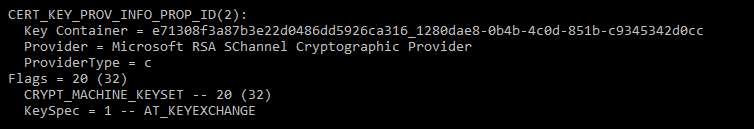

# AD FS and certificate KeySpec property Information
Key Specification (“KeySpec”) is a property associated with a certificate and key. It specifies whether a private key associated with a certificate can be used for signing, encryption, or both.   

An incorrect KeySpec value can cause AD FS and Web Application Proxy errors such as:

- Failure to establish a SSL/TLS connection to AD FS or the Web Application Proxy, with no AD FS events logged (though SChannel 36888 and 36874 events may be logged)
- Failure to login at the AD FS or WAP forms based authentication page, with no error message shown on the page.

You may see the following in the event log:

    Log Name:      AD FS Tracing/Debug
    Source:        AD FS Tracing
    Date:          2/12/2015 9:03:08 AM
    Event ID:      67
    Task Category: None
    Level:         Error
    Keywords:      ADFSProtocol
    User:          S-1-5-21-3723329422-3858836549-556620232-1580884
    Computer:      ADFS1.contoso.com
    Description:
    Ignore corrupted SSO cookie.

## What causes the problem
The KeySpec property identifies how a key generated or retrieved by Microsoft CryptoAPI (CAPI), from a Microsoft legacy Cryptographic Storage Provider (CSP), can be used.

A KeySpec value of **1**, or **AT_KEYEXCHANGE**, can be used for signing and encryption.  A value of **2**, or **AT_SIGNATURE**, is only used for signing.

The most common KeySpec mis-configuration is using a value of 2 for a certificate other than the token signing certificate.  

For certificates whose keys were generated using Cryptography Next Generation (CNG) providers, there is no concept of key specification, and the KeySpec value will always be zero.

See how to check for a valid KeySpec value below. 

### Example
An example of a legacy CSP is the Microsoft Enhanced Cryptographic Provider. 

Microsoft RSA CSP key blob format includes an algorithm identifier, either **CALG_RSA_KEYX** or **CALG_RSA_SIGN**, respectively, to service requests for either <strong>AT_KEYEXCHANGE **or **AT_SIGNATURE</strong> keys.

The RSA key algorithm identifiers map to KeySpec values as follows

| Provider supported algorithm| Key Specification value for CAPI calls |
| --- | --- |
|CALG_RSA_KEYX : RSA key that can be used for signing and decryption| AT_KEYEXCHANGE (or KeySpec=1)|
CALG_RSA_SIGN : RSA signature only key |AT_SIGNATURE (or KeySpec=2)|

## KeySpec values and associated meanings
The following are the meanings of the various KeySpec values:

|Keyspec value|Means|Recommended AD FS use|
| --- | --- | --- |
|0|The certificate is a CNG cert|SSL certificate only|
|1|For a legacy CAPI (non-CNG) cert, the key can be used for signing and decryption|    SSL, token signing, token decrypting, service communication certificates|
|2|For a legacy CAPI (non-CNG) cert, the key can be used only for signing|not recommended|

## How to check the KeySpec value for your certificates / keys
To see a certificates value you can use the **certutil** command line tool.  

The following is an example: **certutil –v –store my**.  This will dump the certificate information to the screen.

Under CERT_KEY_PROV_INFO_PROP_ID look for two things:

1. **ProviderType:** this denotes whether the certificate uses a legacy Cryptographic Storage Provider (CSP) or a Key Storage Provider based on newer Certificate Next Generation (CNG) APIs.  Any non-zero value indicates a legacy provider.
2. **KeySpec:** The following are valid KeySpec values for an AD FS certificate:

   Legacy CSP provider (ProviderType not equal to 0):

   |AD FS Certificate Purpose|Valid KeySpec Values|
   | --- | --- |
   |Service Communication|1|
   |Token Decrypting|1|
   |Token Signing|1 and 2|
   |SSL|1|

   CNG provider (ProviderType = 0):

   |AD FS Certificate Purpose|Valid KeySpec Values|
   | --- | --- |   
   |SSL|0|

## How to change the keyspec for your certificate to a supported value
Changing the KeySpec value does not require the certificate to be re-generated or re-issued by the Certificate Authority.  The KeySpec can be changed by re-importing the complete certificate and private key from a PFX file into the certificate store using the steps below:

1. First, check and record the private key permissions on the existing certificate so that they can be re-configured if necessary after the re-import.
2. Export the certificate including private key to a PFX file.
3. Perform the following steps for each AD FS and WAP server
    1. Delete the certificate (from the AD FS / WAP server)
    2. Open an elevated PowerShell command prompt and import the PFX file on each AD FS and WAP server using the cmdlet syntax below, specifying the AT_KEYEXCHANGE value (which works for all AD FS certificate purposes):
        1. C:\>certutil –importpfx certfile.pfx AT_KEYEXCHANGE
        2. Enter PFX password
    3. Once the above completes, do the following
        1. check the private key permissions
        2. restart the adfs or wap service

