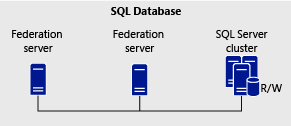

# The Role of the AD FS Configuration Database
The AD FS configuration database stores all the configuration data that represents a single instance of Active Directory Federation Services \(AD FS\) \(that is, the Federation Service\). The AD FS configuration database defines the set of parameters that a Federation Service requires to identify partners, certificates, attribute stores, claims, and various data about these associated entities. You can store this configuration data in either a Microsoft SQL Server® database or the Windows Internal Database \(WID\) feature that is included with Windows Server® 2008, Windows Server 2008 R2 and Windows Server® 2012.  
  
> [!NOTE]  
> The entire contents of the AD FS configuration database can be stored either in an instance of WID or in an instance of the SQL database, but not both. This means that you cannot have some federation servers using WID and others using a SQL Server database for the same instance of the AD FS configuration database.  
  
You can use the following information in this topic along with the content provided in [AD FS Deployment Topology Considerations](https://technet.microsoft.com/library/gg982489.aspx) to learn about the advantages and disadvantages of choosing either WID or SQL Server to store the AD FS configuration database:  
  
WID uses a relational data store and does not have its own management user interface \(UI\). Instead, administrators can modify the contents of the AD FS configuration database by using either the AD FS Management snap\-in, Fsconfig.exe, or Windows PowerShell™ cmdlets.  
  
## Using WID to store the AD FS configuration database  
You can create the AD FS configuration database using WID as the store by using either the Fsconfig.exe command\-line tool or the AD FS Federation Server Configuration Wizard. When you use either of these tools, you can choose any of the following options to create your federation server topology. Each of these options uses WID for storing the AD FS configuration database:  
  
-   Create a stand\-alone federation server  
  
-   Create the first federation server in a federation server farm  
  
-   Add a federation server to a federation server farm  
  
If you select the stand\-alone option, WID is used to store a single instance of the AD FS configuration database. This instance cannot be shared across multiple federation servers. It is meant for test lab environments only. For more information about the stand\-alone federation server option or how to set one up, see [Stand-Alone Federation Server Using WID](https://technet.microsoft.com/library/gg982486.aspx) or [Create a Stand-Alone Federation Server](https://technet.microsoft.com/library/ee913579.aspx).  
  
If you select the first federation server in a federation server farm option, WID is configured for scalability that will permit additional federation servers to be added to the farm at a later time. For more information about deploying a WID farm or how to set one up, see [Federation Server Farm Using WID](https://technet.microsoft.com/library/gg982492.aspx) or [Create the First Federation Server in a Federation Server Farm](https://technet.microsoft.com/library/dd807070.aspx)  
  
If you select the add a federation server option, WID is configured to replicate configuration database changes to the new federation server at set intervals. For more information about adding a federation server to a WID farm, see [Federation Server Farm Using WID](https://technet.microsoft.com/library/gg982492.aspx) or [Add a Federation Server to a Federation Server Farm](https://technet.microsoft.com/library/ee913575.aspx).  
  
> [!NOTE]  
> When you deploy a federation server farm using WID, some features of AD FS may not be available. To have access to the full feature set when you configure your server farm, consider using Microsoft SQL Server to store the AD FS configuration database instead. For more information, see [AD FS Deployment Topology Considerations](https://technet.microsoft.com/library/gg982489(v=ws.11).aspx).  
  
### How a WID federation server farm works  
This section describes important concepts that describe how the WID federation server farm replicates data between a primary federation server and secondary federation servers. .  
  
#### Primary federation server  
A primary federation server is a computer running Windows Server 2008, Windows Server 2008 R2 or Windows Server® 2012 that has been configured in the federation server role with the AD FS Federation Server Configuration Wizard and that has a read/write copy of the AD FS configuration database. The primary federation server is always created when you use the AD FS Federation Server Configuration Wizard and select the option to create a new Federation Service and make that computer the first federation server in the farm. All other federation servers in this farm, also known as secondary federation servers, must synchronize changes that are made on the primary federation server to a copy of the AD FS configuration database that is stored locally.  
  
#### Secondary federation servers  
Secondary federation servers store a copy of the AD FS configuration database from the primary federation server, but these copies are read\-only. Secondary federation servers connect to and synchronize the data with the primary federation server in the farm by polling it at regular intervals to check whether data has changed. The secondary federation servers exist to provide fault tolerance for the primary federation server while acting to load\-balance access requests that are made in different sites throughout your network environment.  
  
> [!NOTE]  
> If a primary federation server crashes and is offline, all secondary federation servers continue to process requests as normal. However, no new changes can be made to the Federation Service until the primary federation server has been brought back online. You can also nominate a secondary federation server to become the primary federation server by using Windows PowerShell. For more information, see the [AD FS Administration with Windows PowerShell](https://go.microsoft.com/fwlink/?LinkID=179634).  
  
#### How the AD FS configuration database is synchronized  
Because of the important role that the AD FS configuration database plays, it is made available on all the federation servers in the network to provide fault tolerance and load\-balancing capabilities when processing requests \(when network load\-balancers are used\). However, for secondary federation servers to serve in this capacity, the AD FS configuration database that is stored on the primary federation server must be synchronized.  
  
When you add a federation server to the farm, the new computer that will become a secondary federation server connects to the primary federation server to replicate the copy of the AD FS configuration database. From this point forward, the new federation server continues to pull updates from the primary federation server on a regular basis, as shown in the following illustration.  
  
  
  
Each secondary federation server polls the primary federation server every five minutes for changes. You can adjust this default five\-minute value or force an immediate synchronization anytime by using a Windows PowerShell cmdlet. For more information about how to do this, see [AD FS Administration with Windows PowerShell](https://go.microsoft.com/fwlink/?LinkID=179634).  
  
The WID synchronization process also supports incremental transfers for more efficient transfers of intermediate changes. The incremental transfer process requires substantially less traffic on a network, and transfers are completed much faster.  
  
> [!NOTE]  
> The migration of an AD FS configuration database from WID to an instance of SQL Server is supported. For more information about how to do this, see [AD FS: Migrate Your AD FS Configuration Database to SQL Server](https://go.microsoft.com/fwlink/?LinkId=192232) on the TechNet Wiki site.  
  
## Using SQL Server to store the AD FS configuration database  
You can create the AD FS configuration database using a single SQL Server database instance as the store by using the Fsconfig.exe command\-line tool. Using a SQL Server database as the AD FS configuration database provides the following benefits over WID:  
  
-   Administrators can leverage the high availability features of SQL Server  
  
-   It provides additional performance increases for high traffic.  
  
-   It provides feature support of SAML artifact resolution and SAML/WS\-Federation token replay detection \(described below\).  
  
The term “primary federation server” does not apply when the AD FS configuration database is stored in a SQL database instance because all federation servers can equally read and write to the AD FS configuration database that is using the same clustered SQL Server instance, as shown in the following illustration.  
  
  
  
You can use SQL Server to configure two or more servers to work together as a server cluster to ensure that AD FS is made highly available to service incoming client requests. High availability provides a scale\-out architecture in which you can increase server capacity by adding additional servers. Single points of failure are mitigated by automatic cluster failover.  
  
You can achieve high availability by using the network load\-balancing and failover services that SQL clustering technologies provide. For more information about how to configure SQL Server for high availability, see [High Availability Solutions Overview](https://go.microsoft.com/fwlink/?LinkId=179853).  
  
### SAML artifact resolution  
Security Assertion Markup Language \(SAML\) artifact resolution is an endpoint based on the part of the SAML 2.0 protocol that describes how a relying party can retrieve a token directly from a claims provider. In the first stage of the resolution process, a browser client contacts a resource federation server and provides it with an artifact. In the second stage, resource federation servers send the artifact to a SAML artifact endpoint URL that is hosted somewhere in an account partner organization in order to resolve the artifact message. In the final stage, the account federation server issues the token to the federation server on behalf of the browser client.  
  
> [!NOTE]  
> If you are an administrator in an account partner organization, make sure to assign or bind an SSL certificate, which chains to a root certificate of a member of the Windows Root Certificate Program, to the federation passive Web site in IIS \(<ComputerName>\\Sites\\Default Web Site\\adfs\\ls\) on all the account federation servers in the farm. This is important to prevent resource federation servers from having to manually add the SSL certificate to the Local Computers Trusted People certificate store or from being unable to resolve the artifact that is published in your organization.  
  
### SAML/WS - Federation token replay detection  
The term *token replay* refers to the act by which a browser client in an account partner organization attempts to send the same token it received from an account federation server multiple times to authenticate to a resource federation server.  This act occurs when a user clicks the **Back** button of their browser in an effort to resubmit the authentication page.  
  
AD FS provides a feature referred to as *token replay detection* by which multiple token requests using the same token can be detected and then discarded. When this feature is enabled, token replay detection protects the integrity of authentication requests in both the WS\-Federation passive profile and the SAML WebSSO profile by making sure that the same token is never used more than once. This feature should be enabled in situations where security is a very high concern such as when using kiosks.  
  
In the kiosk example, a user can log off of all Web sites and later a malicious user can attempt to use the browser history in order to resubmit the federated authentication page that was loaded by the previous user. This feature mitigates this concern by storing additional information about each successful authentication made by an account partner organization in order to detect subsequent replays of the token and prevent multiple authentication attempts from succeeding.  
  

