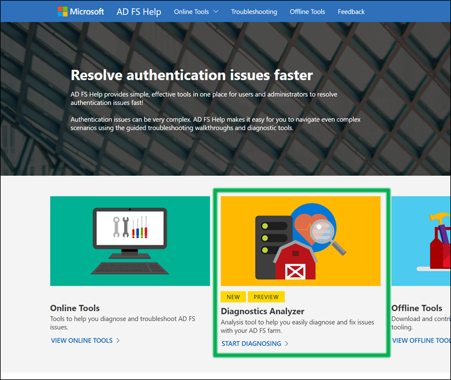
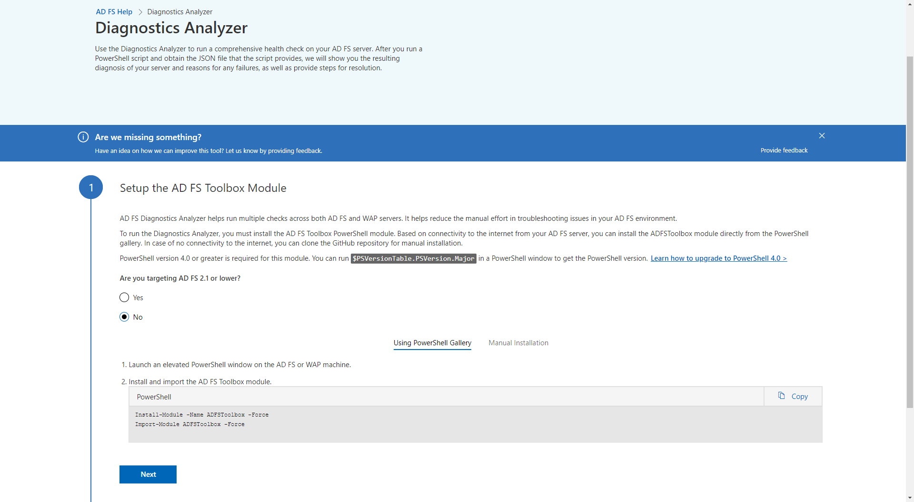
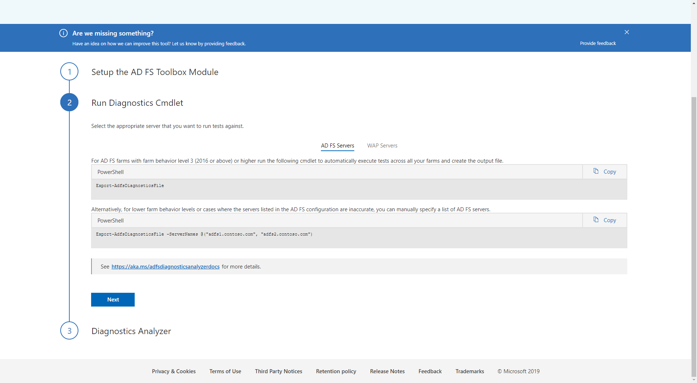
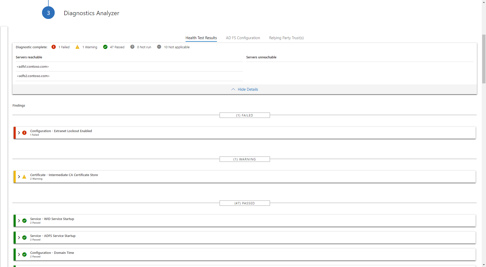

# AD FS Help Diagnostics Analyzer

AD FS has numerous settings that support the wide variety of functionality it provides for authentication and application development. During troubleshooting, it is recommended to ensure that all of the AD FS settings are correctly configured. Doing a manual check of these settings can sometimes be time consuming. AD FS Help Diagnostics Analyzer can help perform the basic checks using the ADFSToolbox PowerShell module. After performing the checks, AD FS Help provides the [Diagnostics Analyzer](https://aka.ms/adfsdiagnosticsanalyzer) to help you easily visualize the results and offer remediation steps.

The complete operation takes 3 simple steps:

1. Setup the ADFSToolbox module on the primary AD FS server or WAP server
2. Execute the diagnostics and upload the file to AD FS Help
3. View diagnostics analysis and resolve any issues

Go to [AD FS Help Diagnostics Analyzer (https://aka.ms/adfsdiagnosticsanalyzer)](https://aka.ms/adfsdiagnosticsanalyzer) to start troubleshooting.



## Step 1: Setup the ADFSToolbox module on AD FS server

To run the [Diagnostics Analyzer](https://aka.ms/adfsdiagnosticsanalyzer), you must install the ADFSToolbox PowerShell module. If the AD FS server has connectivity to the internet, you can install the ADFSToolbox module directly from the PowerShell gallery. In case of no connectivity to the internet, you can manually install it. 

[!WARNING]
If you are using AD FS 2.1 or lower, you must install version 1.0.13 of ADFSToolbox. ADFSToolbox no longer supports AD FS 2.1 or lower on the latest versions.



### Setup using PowerShell gallery

If the AD FS server has internet connectivity, it is recommended to install the ADFSToolbox module directly from the PowerShell gallery using the PowerShell commands given below.

   ```powershell
    Install-Module -Name ADFSToolbox -force
    Import-Module ADFSToolbox -force
   ```

### Setup manually

The ADFSToolbox module must be manually copied over to the AD FS or WAP servers. Follow the instructions below.

1. Launch an elevated PowerShell window on a machine that has internet access.
2. Install the AD FS Toolbox module.

    ```powershell
    Install-Module -Name ADFSToolbox -Force
    ```
3. Copy the ADFSToolbox folder located `%SYSTEMDRIVE%\Program Files\WindowsPowerShell\Modules\` on your local machine to the same location on your AD FS or WAP machine.

4. Launch an elevated PowerShell window on your AD FS machine and run the following cmdlet to import the module.

    ```powershell
    Import-Module ADFSToolbox -Force
    ```

## Step 2: Execute the diagnostics cmdlet



A single command can be used to conveniently execute the diagnostics tests across all the AD FS servers in the farm. The PowerShell module will use remote PS sessions to execute the diagnostics tests across different servers in the farm.

```powershell
    Export-AdfsDiagnosticsFile [-ServerNames <list of servers>]
```

In a Server 2016 or above AD FS farm, the command will read the list of AD FS servers from AD FS configuration. The diagnostics tests are then attempted against each server in the list. If the list of AD FS servers is not available (example 2012R2), then the tests are run against the local machine. To specify a list of servers against which the tests are to be executed, use the **ServerNames** argument to provide a list of servers. An example is provided below

```powershell
    Export-AdfsDiagnosticsFile -ServerNames @("adfs1.contoso.com", "adfs2.contoso.com")
```

The result is a JSON file which is created in the same directory where the command was run. The name of the file is AdfsDiagnosticsFile-\<timestamp\>. An example file name is AdfsDiagnosticsFile-07312019-184201.json.

## Step 3: Upload the diagnostics file

In step 3 on [https://aka.ms/adfsdiagnosticsanalyzer](https://aka.ms/adfsdiagnosticsanalyzer) use the file browser to select the result file to upload.

Click on **Upload** to finish the upload.

By signing in with a Microsoft account, your diagnostics results can be saved for a later viewing point and can be sent to Microsoft support. If at any point you open a support case, Microsoft will be able to view the Diagnostic Analyzer results and help troubleshoot your issue faster.


## Step 4: View diagnostics analysis and resolve any issues

There are five sections of the test results:

1. Failed: This section contains list of tests that failed. Each result comprises of:
2. Warning: This section contains a list of tests that have resulted in a warning. These issues will not likely result in any issues around authentication on a broader scale but should be addressed at the earliest.
3. Passed: This section contains the list of tests that passed and have no action item for the user.
4. Not run: This section contains the list of tests that could not be run due to missing information.
5. Not applicable: This section contains the list of tests that were not executed because they were not applicable for the particular server on which the command was executing.


Each test result is displayed with details that describe the test and the resolution the steps:

1. Test Name: Name of the test that was executed
2. Description: A description of the test.
3. Details: Description of the overall operation that was performed during the test
4. Resolution steps: The suggested steps to resolve the issue highlighted by the test


## Next

- [Use AD FS Help troublehshooting guides](https://aka.ms/adfshelp/troubleshooting )
- [AD FS Troubleshooting](ad-fs-tshoot-overview.md)
