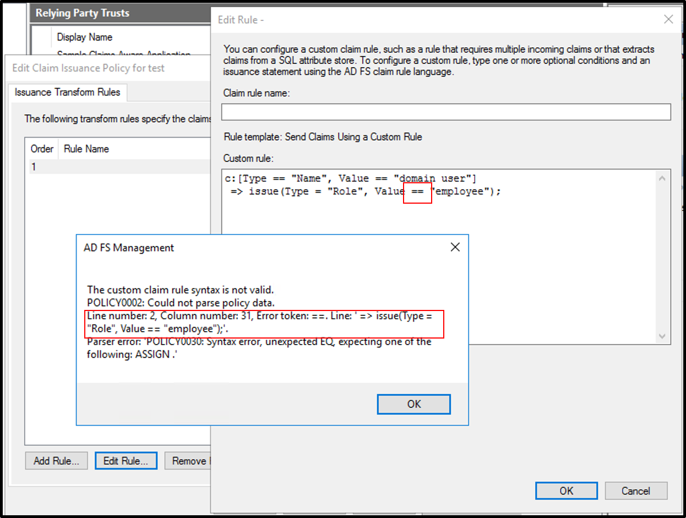
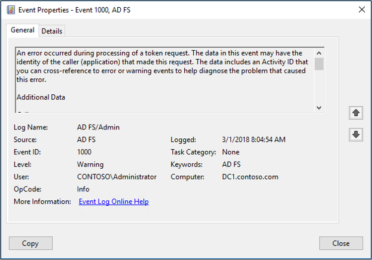
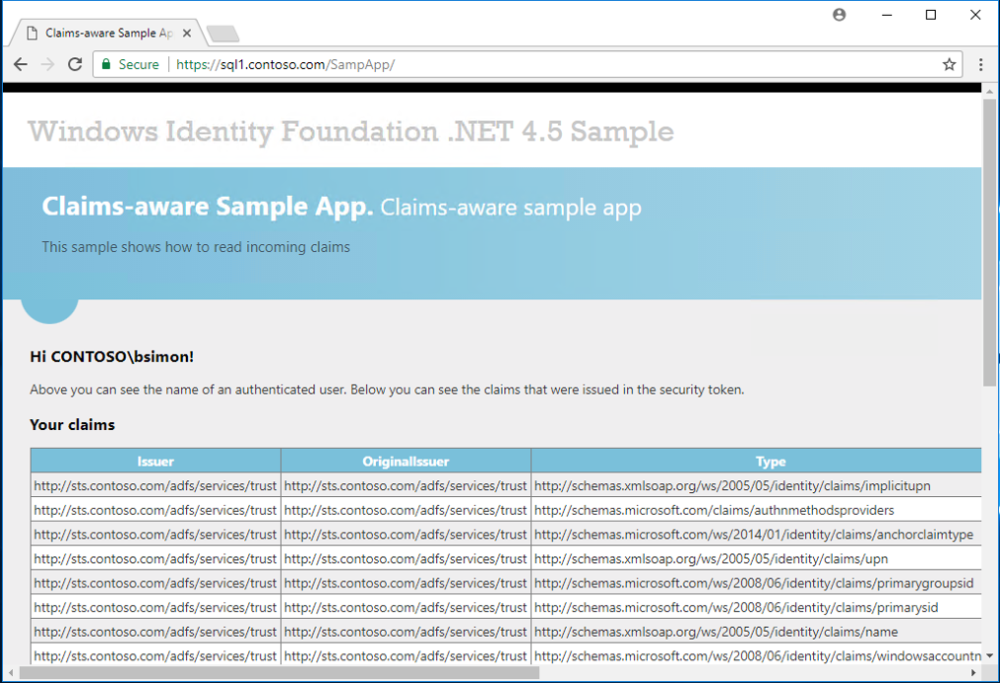
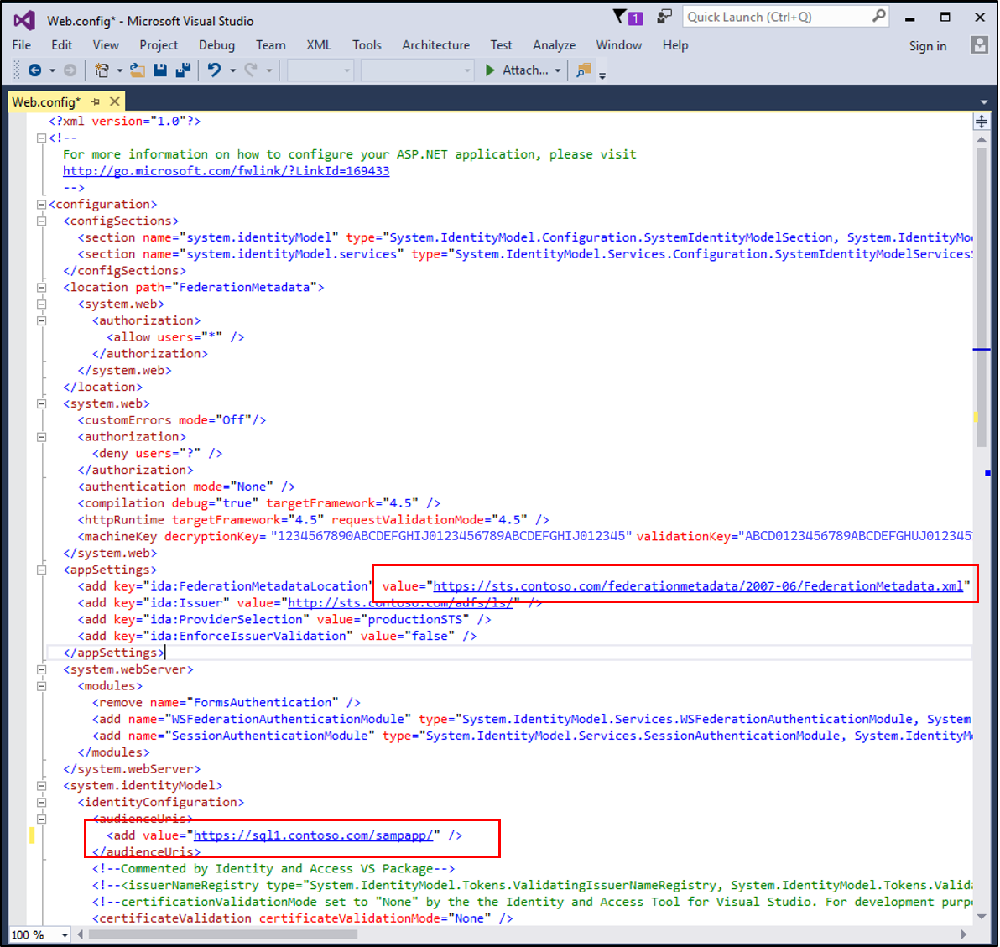

# AD FS Troubleshooting - Claims Rules Syntax
A claim is a statement that one subject makes about itself or another subject.  Claims are issued by a relying party, and they are given one or more values and then packaged in security tokens that are issued by the AD FS server.  This article deals with the claims syntax and creation.  For information on claims issuance see [AD FS Troubleshooting - Claims Issuance](ad-fs-tshoot-claims-issuance.md).

>[!NOTE]  
>You can use [ClaimsXRay](https://adfshelp.microsoft.com/ClaimsXray/TokenRequest) on the [ADFS Help](https://adfshelp.microsoft.com) site to assist in troubleshooting claims issues.   

## How claim rules are processed
Claim rules are processed through the [claims pipeline](../../ad-fs/technical-reference/The-Role-of-the-Claims-Pipeline.md) using the [claims engine](../../ad-fs/technical-reference/The-Role-of-the-Claims-Engine.md). The claims engine is a logical component of the Federation Service that examines the set of incoming claims presented by a user, and will then, depending on the logic in each rule, produce an output set of claims.

## How to create a claim rule
Claim rules are created separately for each federated trust relationship within the Federation Service and are not shared across multiple trusts. You can either create a rule from a [claim rule template](../../ad-fs/technical-reference/determine-the-type-of-claim-rule-template-to-use.md), start from scratch by authoring the rule using the [claim rule language](../../ad-fs/technical-reference/when-to-use-a-custom-claim-rule.md) or use Windows PowerShell to customize a rule.

## Understanding the components of the claim rule language
The claim rule language consists of the following components, separated by the “ =>” operator:

- A condition -  Used to check input claims and determine whether the issuance statement of the rule should be executed.  It represents a logical expression that must be evaluated to true to execute the rule body part.

- An issuance statement

Example:

```c:[type == "Name", value == "domain user"] => issue(type = "Role", value = "employee");``` 

The following claim has the following:
- condition - `c:[type == "Name", value == "domain user"] ` - evaluates the input claim of whether the windows account name is a domain user
- issuance - `issue(type = "Role", value = "employee")` - if the condition is true, adds a new claim to the input claim with the role of employee.

For more information on claims and the syntax see [The Role of the Claims Rule Language](../../ad-fs/technical-reference/the-role-of-the-claim-rule-language.md).

## Claims rule editor
Syntax checking is performed by the claims rule editor once you have completed the claim and click **OK**.  So if you have the incorrect syntax then the editor will let you know.



## Event logs
When looking trying to troubleshoot a claim using the logs the best approach is to look for claims output.  You can look for 1000 and 1001 events in the event log.



## Creating a sample application
You can also create a sample application the echoes your claims.  For example you can use a sample application and create a relying party that has the same claim you are trying to troubleshoot and see if the app has any issues with that claim.



A good sample web app is available here.  This app is a simple web app that echoes back the claims that it receives from the relying party.  In order to use this you need to edit the web.config app by:
- changing https://app1.contoso.com/sampapp to the URL the you will be using for hosting the sampapp
- changing all instances of sts.contoso.com to point you AD FS federation server
- Replacing the thumbprint with your thumbprint



The following [blog article](https://blogs.technet.microsoft.com/tangent_thoughts/2015/02/20/install-and-configure-a-simple-net-4-5-sample-federated-application-samapp/) has excellent, in-depth instructions, for setting this up.

## Next Steps

- [AD FS Troubleshooting](ad-fs-tshoot-overview.md)