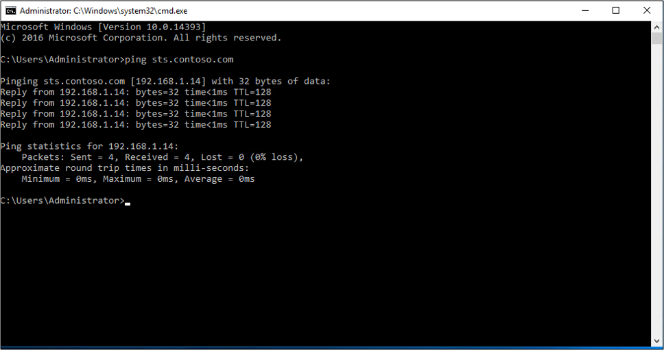
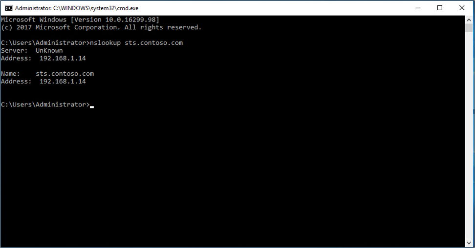
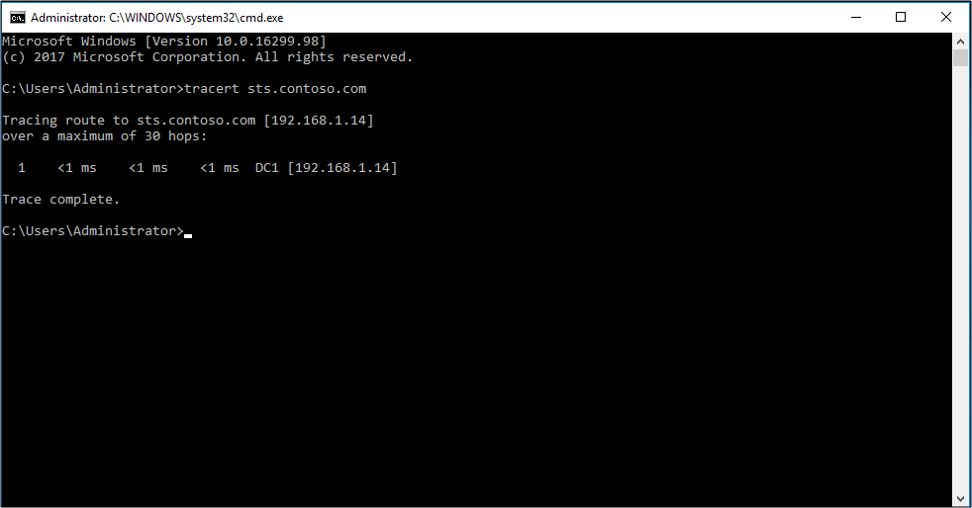

# AD FS Troubleshooting - DNS 
One of the first things to check, if AD FS is not working or responding, is DNS name resolution.  These are basic tests to determine if the AD FS servers or WAP servers are being found on your network.  For internal users, these tests should resolve to the AD FS servers (STS).    For external users, these tests should resolve to the WAP servers.

The remainder of this document will show how to do some quick name resolution checks using command-line tools.

## Ping test
Verifies IP-level connectivity to another TCP/IP computer by sending Internet Control Message Protocol (ICMP) Echo Request messages. The receipt of corresponding Echo Reply messages are displayed, along with round-trip times.  For more information, see [Ping](https://technet.microsoft.com/library/ff961503.aspx).

>[!NOTE]
>Be aware that some organizations block this port on their servers and you may get a **Request timed out** response.

### To use a PING test
1.  Open a command prompt
2. Enter PING <name of adfs server>
    a. Example:  PING sts.contoso.com
3. You should see a reply from the server

## NSLookup
Displays information that you can use to diagnose Domain Name System (DNS) infrastructure.  For more information, see [NSLookup](https://technet.microsoft.com/library/cc725991.aspx).

### To use a NSLookup
1.  Open a command prompt
2. Enter PING <name of adfs server>
    a. Example:  nslookup sts.contoso.com
3. You should see the dns information for the server

## Tracert
Determines the path taken to a destination by sending Internet Control Message Protocol (ICMP) Echo Request or ICMPv6 messages to the destination with incrementally increasing Time to Live (TTL) field values.   For more information, see [Tracert](https://technet.microsoft.com/library/ff961507.aspx).

### To use Tracert
1.  Open a command prompt
2. Enter tracert <name of adfs server>
    a. Example:  tracert sts.contoso.com
3. You should see the destination path used to reach the server

## Next Steps

- [AD FS Troubleshooting](ad-fs-tshoot-overview.md)