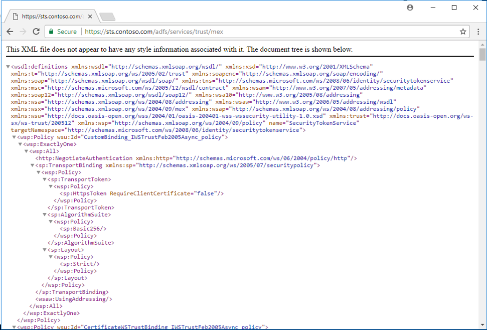

# AD FS Troubleshooting - AD FS metadata endpoints
Endpoints provide access to the federation server functionality of AD FS, such as publishing federation metadata.  To verify that the AD FS server is responding to web requests, we can check the various endpoints.

## Federation metadata test
Passive federation refers to scenarios where your browser is re-directed to the AD FS sign-in page.  By testing the metadata endpoint we can determine if the AD FS server is responding to web requests in these passive scenarios.  Use the following procedure to test the endpoint.

1.  Using a web browser, navigate to your AD FS Federation metadata endpoint.  For example:  https://sts.contoso.com/FederationMetadata/2007-06/FederationMetadata.xml
2. The xml file should download locally to your machine.
3. Open it and verify that it contains information similar to the infomration below:

## WS-MEX test (Active test)
WS-MetaDataExchange is a web services protocol and is part of the WS-Federation roadmap.  It uses a SOAP message to request metadata.  By testing the endpoint we can determine if the AD FS server is responding to web requests for WS-MetaDataExchange.  Use the following procedure to test the endpoint.
1.  Using a web browser, navigate to your AD FS Federation metadata endpoint.  For example:  https://sts.contoso.com/adfs/services/trust/mex
2. The xml file should be displayed in the browser automatically.  It should look like the image below:

## Next Steps

- [AD FS Troubleshooting](ad-fs-tshoot-overview.md)