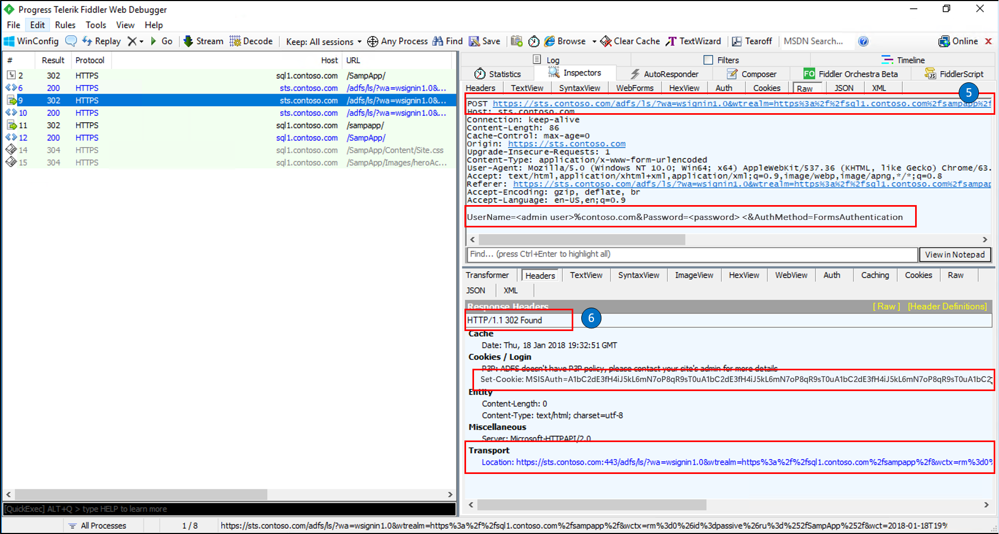

# AD FS Troubleshooting - Fiddler - WS-Federation

## Step 1 and 2
This is the beginning of our trace.  In this frame we see the following:

Request:

- HTTP GET to our relying party (http://sql1.contoso.com/SampApp)

Response:

- The Response is a HTTP 302 (Redirect).  The Transport data in the Response header shows where to redirect to (https://sts.contoso.com/adfs/ls)
- The redirect URL contains wa=wsignin 1.0 which tells us that our RP application has built a WS-Federation sign-in request for us and sent this to the AD FS's /adfs/ls/ endpoint.  This is known as Redirect binding.

## Step 3 and 4

Request:

- HTTP GET to our AD FS server(sts.contoso.com)

Response:

- The Response is a prompt for credentials.  This indicates that we are using forms authnetication
- By clicking on the WebView of the Response you can see the credentials prompt.

## Step 5 and 6

Request:

- HTTP POST with our username and password.  
- We present our credentials.  By looking at the Raw data in the request we can see the credentials

Response:

- The response is Found and the MSIAuth encrypted cookie is created and returned.  This is used to validate the SAML assertion produced by our client.  This is also known as the "authentication cookie" and will only be present when AD FS is the Idp.

## Step 7 and 8

Request:

- Now that we have authenticated we do another HTTP GET to the AD FS server and present our authentication token

Response:

- The response is an HTTP OK which means that AD FS has authenticated the user based on the credentials provided
- Also, we set 3 cookies back to the client
	- MSISAuthenticated contains a base64-encoded timestamp value for when the client was authenticated.
	- MSISLoopDetectionCookie is used by the AD FS infinite loop detection mechanism to stop clients who have ended up in an infinite redirection loop to the Federation Server. The cookie data is a timestamp that is base64 encoded.
	- MSISSignout is used to keep track of the IdP and all RPs visited for the SSO session. This cookie is utilized when a WS-Federation sign-out is invoked. You can see the contents of this cookie using a base64 decoder.
	
## Step 9 and 10

Request:

- HTTP POST

Response:

- The response is a Found

## Step 11 and 12

Request:

- HTTP GET

Response:

- The response is OK

## Next Steps

- [AD FS Troubleshooting](ad-fs-tshoot-overview.md)