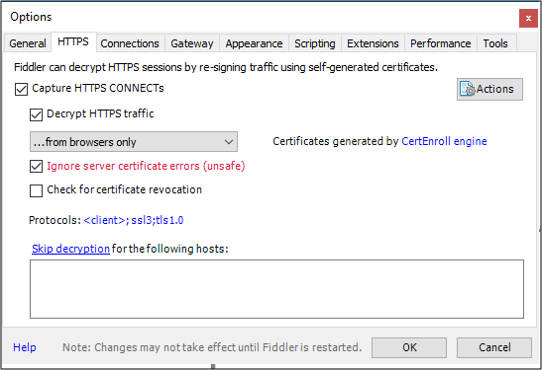

# AD FS Troubleshooting - Fiddler
Fiddler is a tool that can be used to capture HTTP/HTTPS web traffic.  This tool can be used to assist in troubleshooting the claim issuance process.  By looking at the traffic we can get a better understanding of where the interaction is breaking down.  This document will describe how to install and setup Fiddler to capture AD FS traffic.  For an example fiddler trace using WS-Federation see [AD FS Troubleshooting - Fiddler - WS-Federation](ad-fs-tshoot-fiddler-ws-fed.md)

## Download and install Fiddler
You can download Fiddler [here](https://www.telerik.com/download/fiddler).  Once you have downloaded it go ahead and install it.

## Configure Fiddler to capture AD FS traffic
In order to capture AD FS traffic, we need to configure Fiddler to decrypt SSL traffic. 

### Configure the Fiddler SSL certificate
 Use the following procedure to setup Fiddler to decrypt SSL traffic.

1.  Open Fiddler
2.  At the top, under **Tools**, select **Fiddler Options**.
3.  Click on the HTTPS tab.
4.  Place a check in **Decrypt HTTPS traffic** and select **from browsers only** from the drop-down.
5.  Place a check in **Ignore server certificate errors**.
6.  Click **OK**.

## Next Steps

- [AD FS Troubleshooting](ad-fs-tshoot-overview.md)