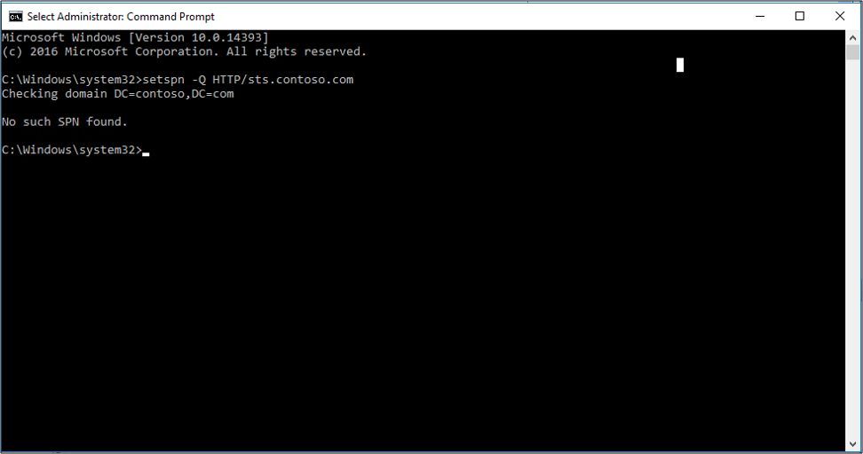
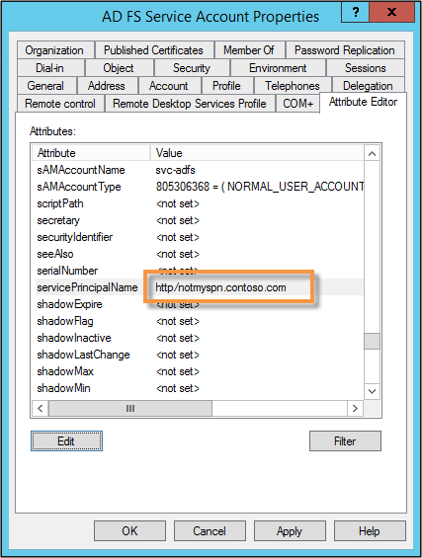
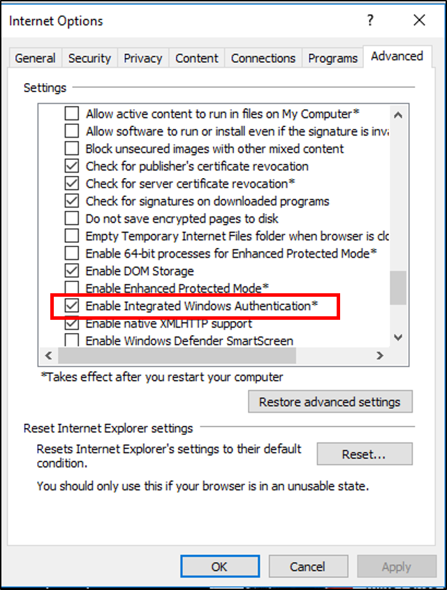
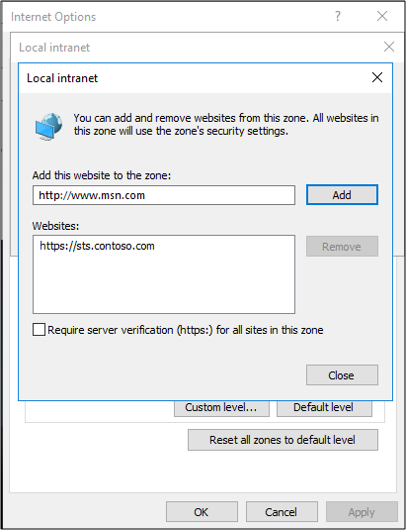

# AD FS Troubleshooting - Integrated Windows Authentication
Integrated Windows authentication enables users to log in with their Windows credentials and experience single-sign on (SSO), using Kerberos or NTLM.

## Reason integrated windows authentication fails
There are three main reason why integrated windows authentication will fail. They are:
	- Service Principal Name(SPN) misconfiguration
	- Channel Binding Token
	- Internet Explorer configuration

## SPN misconfiguration
A service principal name (SPN) is a unique identifier of a service instance. SPNs are used by Kerberos authentication to associate a service instance with a service logon account. This allows a client application to request that the service authenticate an account even if the client does not have the account name.

An example of an how an SPN is used with AD FS is as follows:
1. A web browser queries Active Directory to determine which service account is running sts.contoso.com
2. Active Directory tells the browser that it's the AD FS service account.
3. The browser will get a Kerberos ticket for the AD FS service account.

If the AD FS service account has a misconfigured or the wrong SPN then this can cause issues.  Looking at network traces, you may see errors such as KRB Error: KRB5KDC_ERR_S_PRINCIPAL_UNKNOWN.

Using network traces (such as Wireshark) you can determine what SPN the browser is trying to resolve and then using the command line tool, setspn - Q <spn>, you can do a lookup on that SPN.  It may not be found or it may be assigned to another account other than the AD FS service account.

You can verify the SPN by looking at the properties of the AD FS service account.

## Channel Binding Token
Currently, when a client application authenticates itself to the server using Kerberos, Digest, or NTLM using HTTPS, a Transport Level Security (TLS) channel is first established and authentication takes place using this channel. 

The Channel Binding Token is a property of the TLS-secured outer channel, and is used to bind the outer channel to a conversation over the client-authenticated inner channel.

If there is a "man-in-the-middle" attack occurring and they are de-crypting and re-encrypting the SSL traffic, then the key will not match.  AD FS will determine that there is something sitting in the middle between the web browse r and itself.  This will cause the Kerberos authentication to fail and the user will be prompted with a 401 dialog instead of an SSO experience.

This can be cause by:
 - anything sitting in between the browser and AD FS
 - Fiddler
 - Reverse proxies performing SSL bridging

By default, AD FS has this set to "allow".  You can change this setting using the PowerShell cmdlt `Set-ADFSProperties -ExtendProtectionTokenCheck`

For more information on this see [Best Practices for Secure Planning and Deployment of AD FS](../../ad-fs/design/best-practices-for-secure-planning-and-deployment-of-ad-fs.md).

## Internet Explorer configuration
By default, Internet explorer will be have the following way:

1. Internet explorer will receive a 401 response from AD FS with the word NEGOTIATE in the header.
2. This tells the web browser to get a Kerberos or NTLM ticket to send back to AD FS.
3. By default IE will try to do this (SPNEGO) without user interaction if the word NEGOTIATE is in the header.  It will only work for intranet sites.

There are 2 main things that can prevent this from happeing.
   - Enable Integrated Windows Authentication is not checked in the properties of IE.  This located under Internet Options -> Advanced -> Security.
   
   
   
   - Security zones are not configured properly
       - FQDNs are not in the intranet zone
       - AD FS URL is not in the intranet zone.

      
## Next Steps

- [AD FS Troubleshooting](ad-fs-tshoot-overview.md)
