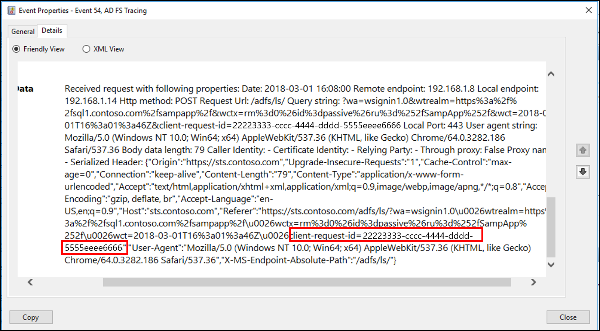

# AD FS Troubleshooting - Events and Logging
AD FS provides two primary logs that can be used in troubleshooting.  They are:

- the Admin Log
- the Trace Log  
 
Each of these logs will be explained below.

## Admin Log
The Admin log provides high level information on issues that are occurring and is enabled by default.

### To view the admin log
1.  Open Event Viewer
2.  Expand **Applications and Services Log**.
3.  Expand **AD FS**.
4.  Click on **Admin**.

  

## Trace Log
The Trace log is where detailed messages are logged, and will be the most useful log when troubleshooting. Since a lot of trace log information can be generated in a short amount of time, which can impact system performance, the trace logs are disabled by default. 

### To enable and view the trace log
1.  Open Event Viewer
2.  Right-click on **Applications and Services Log** and select view and click on **Show Analytic and Debug Logs**.  This will show additional nodes on the left.
  
3.  Expand AD FS Tracing
4.  Right-click on Debug and select **Enable Log**.
  


## Event auditing information for AD FS on Windows Server 2016  
By default, AD FS in Windows Server 2016 has a basic level of auditing enabled.  With basic auditing, administrators will see 5 or less events for a single request.  This marks a significant decrease in the number of events administrators have to look at, in order to see a single request.   The auditing level can be raised or lowered using the PowerShell cmdlt:  

```PowerShell
Set-AdfsProperties -AuditLevel 
```

The table below explains the available auditing levels.  

|Audit Level|PowerShell syntax|Description|  
|----- | ----- | ----- |
|None|Set-AdfsProperties -AuditLevel None|Auditing is disabled and no events will be logged.|  
|Basic (Default)|Set-AdfsProperties -AuditLevel Basic|No more than 5 events will be logged for a single request|  
|Verbose|Set-AdfsProperties -AuditLevel Verbose|All events will be logged.  This will log a significant amount of information per request.|  
  
To view the current auditing level, you can use the PowerShell cmdlt:  Get-AdfsProperties.  
  
  
  
The auditing level can be raised or lowered using the PowerShell cmdlt:  Set-AdfsProperties -AuditLevel.  
  
  
  
## Types of Events  
AD FS events can be of different types, based on the different types of requests processed by AD FS. Each type of event has specific data associated with it.  The type of events can be differentiated between login requests (i.e. token requests) versus system requests (server-server calls including fetching configuration information).    

The table below describes the basic types of events.  
  
|Event Type|Event ID|Description| 
|----- | ----- | ----- | 
|Fresh Credential Validation Success|1202|A request where fresh credentials are validated successfully by the Federation Service. This includes WS-Trust, WS-Federation, SAML-P (first leg to generate SSO) and OAuth Authorize Endpoints.|  
|Fresh Credential Validation Error|1203|A request where fresh credential validation failed on the Federation Service. This includes WS-Trust, WS-Fed, SAML-P (first leg to generate SSO) and OAuth Authorize Endpoints.|  
|Application Token Success|1200|A request where a security token is issued successfully by the Federation Service. For WS-Federation, SAML-P this is logged when the request is processed with the SSO artifact. (such as the SSO cookie).|  
|Application Token Failure|1201|A request where  security token issuance failed on the Federation Service. For WS-Federation, SAML-P this is logged when the request was processed with the SSO artifact. (such as the SSO cookie).|  
|Password Change Request Success|1204|A transaction where the password change request was successfully processed by the Federation Service.|  
|Password Change Request Error|1205|A transaction where the password change request failed to be processed by the Federation Service.| 
|Sign Out Success|1206|Describes a successful sign-out request.|  
|Sign Out Failure|1207|Describes a failed sign-out request.|  

## Security Auditing
Security auditing of the AD FS service account can sometimes assist in tracking down issues with password updates, request/response logging, request contect headers and device registration results.  Auditing of the AD FS service account is disabled by default.

### To enable security auditing
1. Click Start, point to **Programs**, point to **Administrative Tools**, and then click **Local Security Policy**.
2. Navigate to the **Security Settings\Local Policies\User Rights Management** folder, and then double-click **Generate security audits**.
3. On the **Local Security Setting** tab, verify that the AD FS service account is listed. If it is not present, click Add User or Group and add it to the list, and then click OK.
4. Open a command prompt with elevated privileges and run the following command to enable auditing
   auditpol.exe /set /subcategory:"Application Generated" /failure:enable /success:enable
5. Close **Local Security Policy**, and then open the AD FS Management snap-in.
 
To open the AD FS Management snap-in, click Start, point to Programs, point to Administrative Tools, and then click AD FS Management.
 
6. In the Actions pane, click Edit Federation Service Properties
7. In the Federation Service Properties dialog box, click the Events tab.
8. Select the **Success audits** and **Failure audits** check boxes.
9. Click OK.

  
 
>[!NOTE]
>The above instructions are used only when AD FS is on a stand-alone member server.  If AD FS is running on a domain controller, instead of the Local Security Policy, use the **Default Domain Controller Policy** located in **Group Policy Management/Forest/Domains/Domain Controllers**.  Click edit and navigate to **Computer Configuration\Policies\Windows Settings\Security Settings\Local Policies\User Rights Management**

## Windows Communication Foundation and Windows Identity Foundation messages
In addition to trace logging, sometimes you may need to view Windows Communication Foundation (WCF) and Windows Identity Foundation (WIF) messages in order to troubleshoot an issue. This can be done by modifying the **Microsoft.IdentityServer.ServiceHost.Exe.Config** file on the AD FS server. 

This file is located in **<%system root%>\Windows\ADFS** and is in XML format. The relevant portions of the file are shown below: 
```
<!-- To enable WIF tracing, change the switchValue below to desired trace level - Verbose, Information, Warning, Error, Critical -->

<source name="Microsoft.IdentityModel" switchValue="Off"> … </source>

<!-- To enable WCF tracing, change the switchValue below to desired trace level - Verbose, Information, Warning, Error, Critical -->

<source name="System.ServiceModel" switchValue="Off" > … </source>
```


After you apply these changes, save the configuration, and restart the AD FS service. After you enable these traces by setting the appropriate switches, they will appear in the AD FS trace log in the Windows Event Viewer.

## Correlating Events
One of the hardest things to troubleshoot is access issues that generate a lot of error or debug events.

To help with this, AD FS correlates all events that are recorded to the Event Viewer, in both the admin and the debug logs, which correspond to a particular request by using a unique Globally Unique Identifier (GUID) called the Activity ID. This ID is generated when the token issuance request is initially presented to the web application (for applications using the passive requestor profile) or requests sent directly to the claims provider (for applications using WS-Trust). 


This activity ID remains the same for the entire duration of the request, and is logged as part of every event recorded in the Event Viewer for that request. This means:
 - that filtering or searching the Event Viewer using this activity ID can help keep track of all related events that correspond to the token request
 - the same activity ID is logged across different machines which allows you to troubleshooting a user request across multiple machines such as the Federation Server proxy (FSP)
 - the activity ID will also appear in the user's browser if the AD FS request fails in any way, thus allowing the user to communicate this ID to help desk or IT Support.



To aid in the troubleshooting process, AD FS also logs the caller ID event whenever the token-issuance process fails on an AD FS server. This event contains the claim type and value of one of the following claim types, assuming that this information was passed to the Federation Service as part of a token request:
- https://schemas.microsoft.com/ws/2008/06/identity/claims/windowsaccountnameh
- http://schemas.xmlsoap.org/ws/2005/05/identity/claims/nameidentifier
- http://schemas.xmlsoap.org/ws/2005/05/identity/claims/upnh
- https://schemas.microsoft.com/ws/2008/06/identity/claims/upn
- http://schemas.xmlsoap.org/claims/UPN
- http://schemas.xmlsoap.org/ws/2005/05/identity/claims/emailaddressh
- https://schemas.microsoft.com/ws/2008/06/identity/claims/emailaddress 
- http://schemas.xmlsoap.org/claims/EmailAddress
- http://schemas.xmlsoap.org/ws/2005/05/identity/claims/name
- https://schemas.microsoft.com/ws/2008/06/identity/claims/name
- http://schemas.xmlsoap.org/ws/2005/05/identity/claims/privatepersonalidentifier 

The caller ID event also logs the activity ID to allow you to use that activity ID to filter or search the event logs for a particular request.


## Next Steps

- [AD FS Troubleshooting](ad-fs-tshoot-overview.md)
