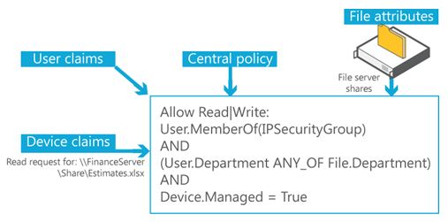

# Scenario: Central Access Policy

>Applies To: Windows Server 2016, Windows Server 2012 R2, Windows Server 2012

Central access policies for files enable organizations to centrally deploy and manage authorization policies that include conditional expressions that use user groups, user claims, device claims, and resource properties. (Claims are assertions about the attributes of the object with which they are associated). For example, to access high-business-impact (HBI) data, a user must be a full-time employee, obtain access from a managed device, and log on with a smart card. These policies are defined and hosted in Active Directory Domain Services (AD DS).  
  
Organizational access policies are driven by compliance and business regulatory requirements. For example, if an organization has a business requirement to restrict access to personally identifiable information (PII) in files to only the file owner and members of the human resources (HR) department who are allowed to view PII information, this policy applies to PII files wherever they are located on file servers across the organization. In this example, you need to be able to:  
  
-   Identify and mark the files that contain PII.  
  
-   Identify the group of HR members who are allowed to view PII information.  
  
-   Create a central access policy that applies to all files that contain PII wherever they are located on file servers across the organization.  
  
The initiative to deploy and enforce an authorization policy can come for many reasons and apply to multiple levels of the organization. The following are some example policy types:  
  
-   **Organization-wide authorization policy.** Most commonly initiated from the information security office, this authorization policy is driven by compliance or a high-level organization requirements, and it is relevant across the organization. For example, HBI files are accessible to only full-time employees.  
  
-   **Departmental authorization policy.** Each department in an organization has some special data-handling requirements that they want to enforce. For example, the finance department might want to limit access to finance servers to the finance employees.  
  
-   **Specific data-management policy.** This policy usually relates to compliance and business requirements, and it is targeted at protecting the correct access to the information that is being managed. For example, financial institutions might implement information walls so that analysts do not access brokerage information and brokers do not access analysis information.  
  
-   **Need-to-know policy.** This authorization policy type is typically used in conjunction with the previous policy types. For example, vendors should be able to access and edit only files that pertain to a project they are working on.  
  
Real-life environments also teach us that every authorization policy needs to have exceptions so that organizations can quickly react when important business needs arise. For example, executives who cannot find their smart cards and need quick access to HBI information can call the Help Desk to get a temporary exception to access that information.  
  
Central access policies act as security umbrellas that an organization applies across its servers. These policies enhance (but do not replace) the local access policies or discretionary access control lists (DACL) that are applied to files and folders. For example, if a DACL on a file allows access to a specific user, but a central policy that is applied to the file restricts access to the same user, the user cannot obtain access to the file. If the central access policy allows access, but the DACL does not allow access, the user cannot obtain access to the file.  
  
A central access policy rule has the following logical parts:  
  
-   **Applicability.** A condition that defines which data the policy applies to, such as Resource.BusinessImpact=High.  
  
-   **Access conditions.** A list of one or more access control entries (ACEs) that define who can access the data, such as Allow | Full Control | User.EmployeeType=FTE.  
  
-   **Exceptions.** An additional list of one or more ACEs that define an exception for the policy, such as MemberOf(HBIExceptionGroup).  
  
The following two figures show the workflow in central access and audit policies.  
  
  
  
**Figure 1** Central access and audit policy concepts  
  
  
  
**Figure 2** Central access policy workflow  
  
The central authorization policy combines the following components:  
  
-   A list of centrally defined access rules that target specific types of information, such as HBI or PII.  
  
-   A centrally defined policy that contains a list of rules.  
  
-   A policy identifier that is assigned to each file on the file servers to point to a specific central access policy that should be applied during the access authorization.  
  
The following figure demonstrates how you can combine policies into policy lists to centrally control access to files.  
  
  
  
**Figure 3** Combining policies  
  
## In this scenario  
The following guidance is available to you for central access policies:  
  
-   [Plan a Central Access Policy deployment](assetId:///0311a76d-d66c-4ddb-ade6-af586a2ad82f)  
  
-   [Deploy a Central Access Policy &#40;Demonstration Steps&#41;](Deploy-a-Central-Access-Policy--Demonstration-Steps-.md)  
  
-   [Dynamic Access Control: Scenario Overview](Dynamic-Access-Control--Scenario-Overview.md)  
  
## Roles and features included in this scenario  
The following table lists the roles and features that are part of this scenario and describes how they support it.  
  
|Role/feature|How it supports this scenario|  
|-----------------|---------------------------------|  
|Active Directory Domain Services role|AD DS in  Windows Server 2012  introduces a claims-based authorization platform that enables the creation of user claims and device claims, compound identity, (user plus device claims), new central access policy (CAP) models, and the use of file-classification information in authorization decisions.|  
|File and Storage Services Server role|File and Storage Services provides technologies that help you set up and manage one or more file servers that provide central locations on your network where you can store files and share them with users. If your network users need access to the same files and applications, or if centralized backup and file management are important to your organization, you should set up one or more computers as a file server by adding the File and Storage Services role and the appropriate role services to the computers.|  
|Windows client computer|Users can access files and folders on the network through the client computer.|  
  

