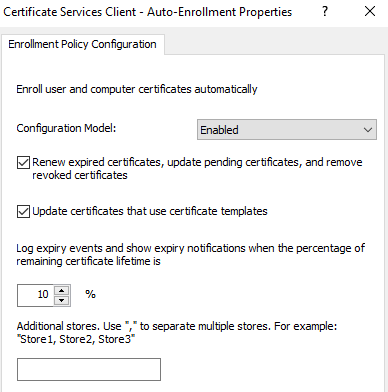

# Configuring Certificate Enrollment Web Service for certificate key-based renewal on a custom port

> Authors: Jitesh Thakur, Meera Mohideen, Technical Advisors with the Windows Group.
Ankit Tyagi Support Engineer with the Windows Group

## Summary

This article provides step-by-step instructions to implement the Certificate Enrollment Policy Web Service (CEP) and Certificate Enrollment Web Service (CES) on a custom port other than 443 for certificate key-based renewal to take advantage of the automatic renewal feature of CEP and CES.

This article also explains how CEP and CES works and provides setup guidelines.

> [!Note]
> The workflow that's included in this article applies to a specific scenario. The same workflow may not work for a different situation. However, the principles remain the same.
>
> Disclaimer: This setup is created for a specific requirement in which you do not want to use port 443 for the default HTTPS communication for CEP and CES servers. Although this setup is possible, it has limited supportability. Customer Services and Support can best assist you if you follow this guide carefully using minimal deviation from the provided web server configuration.

## Scenario

For this example, the instructions are based on an environment that uses the following configuration:

- A Contoso.com forest that has an Active Directory Certificate Services (AD CS) public key infrastructure (PKI).

- Two CEP/CES instances that are configured on one server that’s running under a service account. One instance uses username and password for initial enrollment. The other uses certificate-based authentication for key-based renewal in renewal only mode.

- A user has a workgroup or non-domain-joined computer for which he will be enrolling the computer certificate by using username and password credentials.

- The connection from the user to CEP and CES over HTTPS occurs on a custom port such as 49999. (This port is selected from a dynamic port range and is not used as a static port by any other service.)

- When the certificate lifetime is nearing its end, the computer uses certificate-based CES key-based renewal to renew the certificate over the same channel.


## Configuration instructions

### Overview 

1. Configure the template for key-based renewal.

2. As a prerequisite, configure a CEP and CES server for username and password authentication.   
   In this environment, we refer to the instance as "CEPCES01".

3.	Configure another CEP and CES instance by using PowerShell for certificate-based authentication on the same server. The CES instance will use a service account.

    In this environment, we refer to the instance as “CEPCES02”. The service account that’s used is ”cepcessvc”.

4.	Configure client-side settings.

### Configuration

This section provides the steps to configure the initial enrollment.

> [!Note]
> You can also configure any user service account, MSA, or GMSA for CES to work.

As a prerequisite, you must configure CEP and CES on a server by using username and password authentication.

#### Configure the template for key-based renewal

You can duplicate an existing computer template, and configure the following settings of the template:

1. On the Subject Name tab of the certificate template, make sure that the **Supply in the Request** and **Use subject information from existing certificates for autoenrollment renewal requests** options are selected.
    

2. Switch to the **Issuance Requirements** tab, and then select the **CA certificate manager approval** check box.
    

3. Assign the **Read** and **Enroll** permission to the **cepcessvc** service account for this template.

4. Publish the new template on the CA.

> [!Note]
> Make sure the compatibility settings on the template is set to **Windows Server 2012 R2** as there is a known issue in which the templates are not visible if the compatibility is set to Windows Server 2016 or later version. For more informaiton, see [Cannot select Windows Server 2016 CA-compatible certificate templates from Windows Server 2016 or later-based CAs or CEP servers
](https://support.microsoft.com/en-in/help/4508802/cannot-select-certificate-templates-in-windows-server-2016).


#### Configure the CEPCES01 instance

##### Step 1: Install the instance

To install the CEPCES01 instance, use either of the following methods.

**Method 1**

See the following articles for step-by-step guidance to enable CEP and CES for username and password authentication:

[Certificate Enrollment Policy Web Service Guidance](https://docs.microsoft.com/previous-versions/windows/it-pro/windows-server-2012-r2-and-2012/hh831625(v=ws.11))

[Certificate Enrollment Web Service Guidance](https://docs.microsoft.com/previous-versions/windows/it-pro/windows-server-2012-r2-and-2012/hh831822(v=ws.11)#configure-a-ca-for-the-certificate-enrollment-web-service)

> [!Note]
> Make sure that you do not select the “Enable Key-Based Renewal” option if you configure both CEP and CES instances of username and password authentication.

**Method 2**

You can use the following PowerShell cmdlets to install the CEP and CES instances:

```PowerShell
Import-Module ServerManager
Add-WindowsFeature Adcs-Enroll-Web-Pol
Add-WindowsFeature Adcs-Enroll-Web-Svc
```

```PowerShell
Install-AdcsEnrollmentPolicyWebService -AuthenticationType Username -SSLCertThumbprint "sslCertThumbPrint"
```

This command installs the Certificate Enrollment Policy Web Service (CEP) by specifying that a username and password is used for authentication. 

> [!Note]
> In this command, \<**SSLCertThumbPrint**\> is the thumbprint of the certificate that will be used to bind IIS.

```PowerShell
Install-AdcsEnrollmentWebService -ApplicationPoolIdentity -CAConfig "CA1.contoso.com\contoso-CA1-CA" -SSLCertThumbprint "sslCertThumbPrint" -AuthenticationType Username
```

This command installs the Certificate Enrollment Web Service (CES) to use the certification authority for a computer name of **CA1.contoso.com** and a CA common name of **contoso-CA1-CA**. The identity of the CES is specified as the default application pool identity. The authentication type is **username**. SSLCertThumbPrint is the thumbprint of the certificate that will be used to bind IIS.

##### Step 2 Check the Internet Information Services (IIS) Manager console

After a successful installation, you expect to see the following display in the Internet Information Services (IIS) Manager console.
 

Under **Default Web Site**, select **ADPolicyProvider_CEP_UsernamePassword**, and then open **Application Settings**. Note the **ID** and the **URI**.

You can add a **Friendly Name** for management.

#### Configure the CEPCES02 instance

##### Step 1: Install the CEP and CES for key-based renewal on the same server. 

Run the following command in PowerShell:

```PowerShell
Install-AdcsEnrollmentPolicyWebService -AuthenticationType Certificate -SSLCertThumbprint "sslCertThumbPrint" -KeyBasedRenewal
```

This command installs the Certificate Enrollment Policy Web Service (CEP) and specifies that a certificate is used for authentication. 

> [!Note]
> In this command, \<SSLCertThumbPrint\> is the thumbprint of the certificate that will be used to bind IIS. 

Key-based renewal lets certificate clients renew their certificates by using the key of their existing certificate for authentication. When in key-based renewal mode, the service will return only certificate templates that are set for key-based renewal.

```PowerShell
Install-AdcsEnrollmentWebService -CAConfig "CA1.contoso.com\contoso-CA1-CA" -SSLCertThumbprint "sslCertThumbPrint" -AuthenticationType Certificate -ServiceAccountName "Contoso\cepcessvc" -ServiceAccountPassword (read-host "Set user password" -assecurestring) -RenewalOnly -AllowKeyBasedRenewal
```

This command installs the Certificate Enrollment Web Service (CES) to use the certification authority for a computer name of **CA1.contoso.com** and a CA common name of **contoso-CA1-CA**. 

In this command, the identity of the Certificate Enrollment Web Service is specified as the **cepcessvc** service account. The authentication type is **certificate**. **SSLCertThumbPrint** is the thumbprint of the certificate that will be used to bind IIS.

The **RenewalOnly** cmdlet lets CES run in renewal only mode. The **AllowKeyBasedRenewal** cmdlet also specifies that the CES will accept key based renewal requests for the enrollment server. These are valid client certificates for authentication that do not directly map to a security principal.

> [!Note]
> The service account must be part of **IISUsers** group on the server.

##### Step 2 Check the IIS Manager console

After a successful installation, you expect to see the following display in the IIS Manager console.
 

Select **KeyBasedRenewal_ADPolicyProvider_CEP_Certificate** under **Default Web Site** and open **Application Settings**. Take a note of the **ID** and the **URI**. You can add a **Friendly Name** for management.

> [!Note]
> If the instance is installed on a new server double check the ID to make sure that the ID is the same one that was generated in the CEPCES01 instance. You can copy and paste the value directly if it is different.

#### Complete Certificate Enrollment Web Services configuration

To be able to enroll the certificate on behalf of the functionality of CEP and CES, you have to configure the workgroup’s computer account in Active Directory and then configure constrained delegation on the service account.

##### Step 1: Create a computer account of the workgroup computer in Active Directory

This account will be used for authentication towards key-based renewal and the “Publish to Active Directory” option on the certificate template.

> [!Note]
> You do not have to domain join the client machine. This account comes into picture while doing certificate based authentication in KBR for dsmapper service.

 
 
##### Step 2: Configure the service account for Constrained Delegation (S4U2Self)

Run the following PowerShell command to enable constrained delegation (S4U2Self or any authentication protocol):

```PowerShell
Get-ADUser -Identity cepcessvc | Set-ADAccountControl -TrustedToAuthForDelegation $True
Set-ADUser -Identity cepcessvc -Add @{'msDS-AllowedToDelegateTo'=@('HOST/CA1.contoso.com','RPCSS/CA1.contoso.com')}
```

> [!Note]
> In this command, \<cepcessvc\> is the service account, and <CA1.contoso.com >is the Certification Authority.

> [!Important]
> We are not enabling the RENEWALONBEHALOF flag on the CA in this configuration because we are using constrained delegation to do the same job for us. This lets us to avoid adding the permission for the service account to the CA’s security.

##### Step 3: Configure a custom port on the IIS web server

1. In the IIS Manager console, select Default Web Site.

2. In the action pane, select Edit Site Binding. 

3. Change the default port setting from 443 to your custom port. The example screenshot shows a port setting of 49999.
    

##### Step 4: Edit the CA enrollment services Object on Active Directory

1. On a domain controller, open adsiedit.msc.

2. [Connect to the Configuration partition](https://docs.microsoft.com/previous-versions/windows/it-pro/windows-server-2003/ff730188(v=ws.10)), and navigate to your CA enrollment services object:
   
   CN=ENTCA,CN=Enrollment Services,CN=Public Key Services,CN=Services,CN=Configuration,DC=contoso,DC=com

3. Right click and edit the CA Object. Change the **msPKI-Enrollment-Servers** attribute by using the custom port with your CEP and CES server URIs that were found in the application settings. For example:

   ```
   140https://cepces.contoso.com:49999/ENTCA_CES_UsernamePassword/service.svc/CES0   
   181https://cepces.contoso.com:49999/ENTCA_CES_Certificate/service.svc/CES1
   ```
   
    

#### Configure the client computer

On the client computer, set up the Enrollment policies and Auto-Enrollment policy. To do this, follow these steps:

1. Select **Start** > **Run**, and then enter **gpedit.msc**.

2. Go to **Computer Configuration** > **Windows Settings** > **Security Settings**, and then click **Public Key Policies**.

3. Enable the **Certificate Services Client - Auto-Enrollment policy** to match the settings in the following screenshot.
   
 
4. Enable **Certificate Services Client - Certificate Enrollment Policy**.

   a. Click **Add** to add enrollment policy and enter the CEP URI with **UsernamePassword** that we edited in ADSI.
   
   b. For **Authentication type**, select **Username/password**.
   
   c. Set a priority of **10**, and  then validate the policy server.
      

   > [!Note]
   > Make sure that the port number is added to the URI and is allowed on the firewall.

5. Enroll the first certificate for the computer through certlm.msc.
   

   Select the KBR template and enroll the certificate.
   

6. Open **gpedit.msc** again. Edit the **Certificate Services Client – Certificate Enrollment Policy**, and then add the key-based renewal enrollment policy:

   a. Click **Add**, enter the CEP URI with **Certificate** that we edited in ADSI. 
   
   b. Set a priority of **1**, and then validate the policy server. You will be prompted to authenticate and choose the certificate we enrolled initially.

    

> [!Note]
> Make sure that the priority value of the key-based renewal enrollment policy is lower than the priority of the Username Password enrollment policy priority. The first preference is given to the lowest priority.

## Testing the setup

To make sure that Auto-Renewal is working, verify that manual renewal works by renewing the certificate with the same key using mmc. Also, you should be prompted to select a certificate while renewing. You can choose the certificate we enrolled earlier. The prompt is expected.

Open the computer personal certificate store, and add the “archived certificates” view. To do this, add the local computer account snap-in to mmc.exe, highlight **Certificates (Local Computer)** by clicking on it, click **view** from the **action tab** at the right or the top of mmc, click **view options**, select **Archived certificates**, and then click **OK**.

### Method 1 

Run the following command:

```PowerShell
certreq -machine -q -enroll -cert <thumbprint> renew
```


### Method 2

Advance the time and date on the client machine into the renewal time of the certificate template.

For example, the certificate template has a 2-day validity setting and an 8-hour renewal setting configured. The example certificate was issued at 4:00 A.M. on 18th day of the month, expires at 4:00 A.M. on the 20th. The Auto-Enrollment engine is triggered on restart and at every 8-hour interval (approximately).

Therefore, if you advance the time to 8:10 P.M. on the 19th since our renewal window was set to 8-hour on the template, running Certutil -pulse (to trigger the AE engine) enrolls the certificate for you.


 
After the test finishes, revert the time setting to the original value, and then restart the client computer.

> [!Note]
> The previous screenshot is an example to demonstrate that the Auto-Enrollment engine works as expected because the CA date is still set to the 18th. Therefore, it continues to issue certificates. In a real-life situation, this large amount of renewals will not occur.

## References

[Test Lab Guide: Demonstrating Certificate Key-Based Renewal](https://docs.microsoft.com/previous-versions/windows/it-pro/windows-server-2012-r2-and-2012/jj590165(v%3Dws.11))

[Certificate Enrollment Web Services](https://techcommunity.microsoft.com/t5/Ask-the-Directory-Services-Team/Certificate-Enrollment-Web-Services/ba-p/397385)

[Install-AdcsEnrollmentPolicyWebService](https://docs.microsoft.com/powershell/module/adcsdeployment/install-adcsenrollmentpolicywebservice?view=win10-ps)

[Install-AdcsEnrollmentWebService](https://docs.microsoft.com/powershell/module/adcsdeployment/install-adcsenrollmentwebservice?view=win10-ps)

See also

[Windows Server Security Forum](https://aka.ms/adcsforum)

[Active Directory Certificate Services (AD CS) Public Key Infrastructure (PKI) Frequently Asked Questions (FAQ)](https://aka.ms/adcsfaq)

[Windows PKI Documentation Reference and Library](https://social.technet.microsoft.com/wiki/contents/articles/987.windows-pki-documentation-reference-and-library.aspx)

[Windows PKI Blog](https://blogs.technet.com/b/pki/)

[How to configure Kerberos Constrained Delegation (S4U2Proxy or Kerberos Only) on a custom service account for Web Enrollment proxy pages](https://support.microsoft.com/help/4494313/configuring-web-enrollment-proxy-for-s4u2proxy-constrained-delegation)