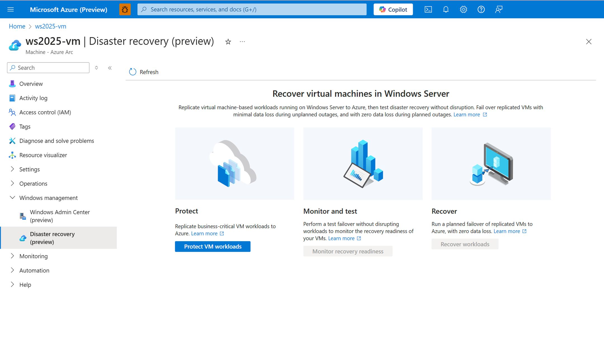
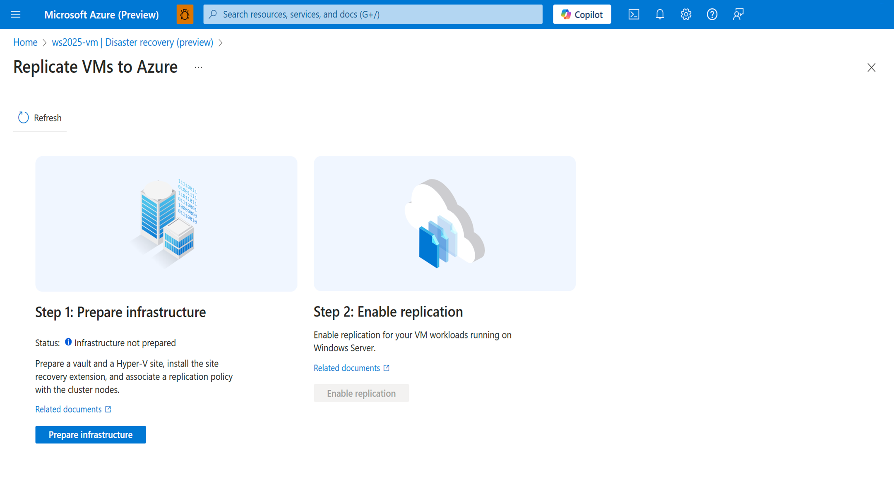
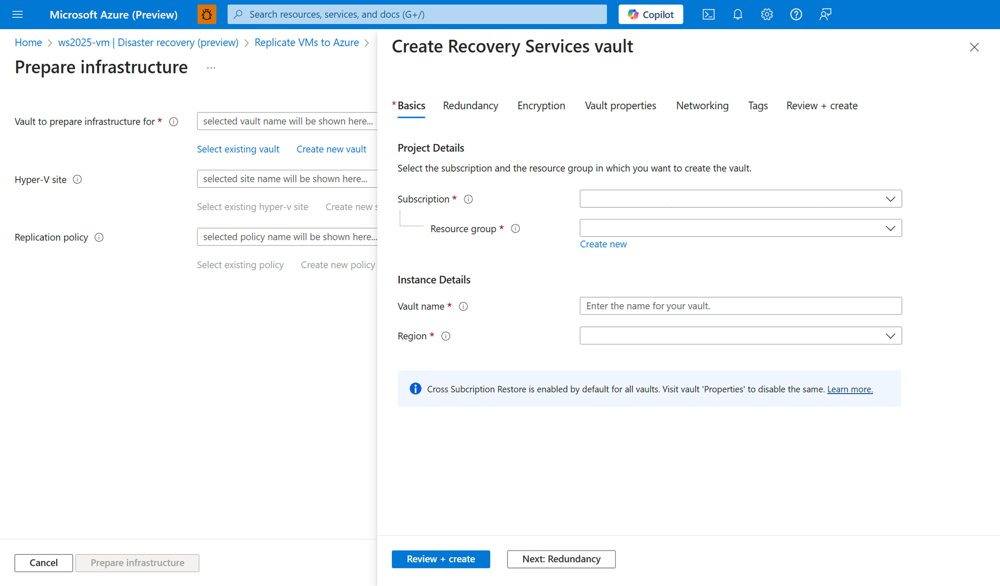
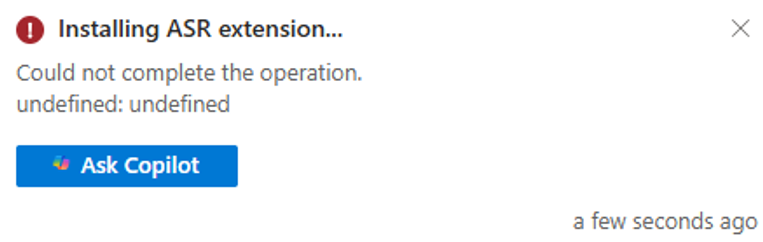

# Configure Azure Site Recovery for Arc-enabled Windows servers

The Azure Site Recovery configuration tool is designed to manage and coordinate the replication, failover, and failback processes for on-premises and Azure virtual machines (VM) running on Arc-enabled Windows Server operating system (OS). During this public preview, the tool is only compatible with Hyper-V enabled machines, ensuring that your on-premises workloads remain operational during outages by replicating them to Azure as a secondary location.

With this feature, you don't need to manually install the Azure Site Recovery agent or link it to the Recovery Service Vault, Hyper-V site, or replication policy as this tool takes care of these tasks.

By default, an Azure storage account isn't included in this experience. To proceed, you must either create a new Azure storage account or use an existing one from your Azure subscription. Both options result in additional costs.

> [!NOTE]
>
> - The Azure Site Recovery configuration tool handles security by running all checks locally on your server. The results are only uploaded to your designated Azure storage account, ensuring that everything happens within the context of your account.
>
> - The Azure Site Recovery configuration tool has to be installed on every server you desire to run it on.

## Prerequisites

- Your device must be running an Arc-enabled on-premises Windows Server 2016 or later operating system with a minimum of 4 GB of memory.
- Azure Arc must be installed and configured on your device.
- You must use [Windows Server Pay-as-you-go](../../get-started/windows-server-pay-as-you-go.md) or [Software Assurance](/azure/azure-arc/servers/windows-server-management-overview) license types.
- The Windows Server **Hyper-V** role must be installed. To learn more, see [Install or Uninstall Roles, Role Services, or Features](/windows-server/administration/server-manager/install-or-uninstall-roles-role-services-or-features).

  *Alternatively*, users can run the following command in an elevated PowerShell window:

  ```powershell
  Enable-WindowsOptionalFeature -Online -FeatureName Microsoft-Hyper-V -All
  ```

### Configure Azure Site Recovery

To configure Azure Site Recovery, the Azure Site Recovery agent needs to be installed on your device. To prepare the infrastructure, creating or using a vault, a Hyper-V site, and a replication policy is required. Once these items are in place, the Azure Site Recovery agent is installed and associates the replication policy with the cluster node. To set disaster recovery in your environment, perform the following steps:

1. Navigate to the [Azure portal](https://portal.azure.com/), then select your Windows server Arc-enabled device.
  
   > [!NOTE]
   > During the public preview phase, be aware that this functionality can only be accessed in the public cloud.

1. Navigate to a Windows Server 2016 or later Arc-enabled Windows Server resource. This VM should be the Hyper-V host.
1. In the left pane, navigate to **Windows management**, then select **Azure Site Recovery configuration (preview)**.

   [ ](../media/azure-arc/azure-arc-azure-site-recovery-tool.png#lightbox)

1. Select **Protect VM workloads** to access the **Replicate VMs to Azure** page.
1. Under **Step 1: Prepare infrastructure**, select **Prepare infrastructure**.

   [ ](../media/azure-arc/azure-arc-azure-site-recovery-tool-replicate-vms-to-azure.png#lightbox)

1. On the **Prepare infrastructure** page, the following needs to created unless they already exist:

   - A vault for the infrastructure.
   - A Hyper-V site.
   - A replication policy.

   If they already exist, select **Prepare infrastructure**. If they don't exist, create each one and select **Review + create**. Once all three are generated, select **Prepare infrastructure**.

   [ ](../media/azure-arc/azure-arc-azure-site-recovery-tool-prepare-infrastructure.png#lightbox)

1. Once infrastructure preparations are complete, and the Azure Site Recovery extension is successfully installed on the node, the **Status: Infrastructure prepared successfully** pop-up notification is displayed.
1. Lastly, select **Enable replication**.

> [!NOTE]
> Preparing and installing the infrastructure agent can take up to 7 minutes. You can refresh the status by selecting the **Refresh** button on this page. Refreshing will navigate you back to the **Replicate VMs to Azure** page.

## Known issues

As the Azure Site Recovery configuration tool is in preview, users might experience technical issues during the deployment process. To mitigate certain issue's, perform the following actions:

- **Issue**: You encounter the error:

  [ ](../media/azure-arc/azure-arc-azure-site-recovery-tool-asr-error.png#lightbox)

- **Solution**: No action needed as this error is transient. Navigate to **Windows management > Azure Site Recovery configuration (preview) > Protect VM workloads** and check the status of your infrastructure under **Step 1: Prepare infrastructure**.

- **Issue**: You encounter the following PowerShell error:

  ```error
  Extension failed to install. Extension returned non-zero exit code for Install: 1. Extension error output: std error: C:\Packages\Plugins\Microsoft.SiteRecovery.Dra.Windows\1.0.0.6\script\InstallAsr.ps1 : Hyper-V is not installed.
    + CategoryInfo          : NotSpecified: (:) [Write-Error], WriteErrorException
    + FullyQualifiedErrorId : Microsoft.PowerShell.Commands.WriteErrorException,InstallAsr.ps1

  Extension Error: C:\Packages\Plugins\Microsoft.SiteRecovery.Dra.Windows\1.0.0.6\script\InstallAsr.ps1 : Hyper-V is not installed.
    + CategoryInfo          : NotSpecified: (:) [Write-Error], WriteErrorException
    + FullyQualifiedErrorId : Microsoft.PowerShell.Commands.WriteErrorException,InstallAsr.ps1
  ```

- **Solution**: This error indicates that Hyper-V might not be installed on your VM. Run the following PowerShell command with admin rights:

  ```powershell
  Enable-WindowsOptionalFeature -Online -FeatureName Microsoft-Hyper-V -All
  ```

## Submit tooling feedback

To report app feedback for disaster recovery or if other issues are encountered, let us know via the Feedback Hub by performing the following actions:

1. Run the following PowerShell command as admin on your device to collect error logs in `.zip` format:

   ```powershell
   azcmagent logs -o "C:\AzureArc\azcmagent-logs.zip"
   ```

1. Open the [Feedback Hub](https://aka.ms/feedbackhub) on your device.

1. Under **Summarize your feedback**, type **Azure Arc disaster recovery (preview)**.

1. Under **Explain in more detail (optional)**, provide us:

   1. The Windows Server OS and edition you're managing.

   1. Detailed instructions on how to reproduce the error encountered.

1. Under **Choose a category**, select **Problem**, select **Windows Server** from the drop-down list, select **Management** from the secondary drop-down list, then select **OK**.

1. Under **Find similar feedback**, see if other users submitted a similar issue. Then select **Next**.

1. Under **Add more details** and **Which of the following best describes your problem?**, select the most appropriate option per your case.

1. Under **Attachments (optional)**, provide us:

   1. A screenshot of the issue.

   1. Attach the **azcmagent-logs.zip** file.

1. Lastly, select **Submit** to submit your feedback for review.

## See also

- [Configure Best Practices Assessment for Arc-enabled Windows servers](best-practices-assessment-for-windows-server.md)

- [Configure Remote Support for Arc-enabled Windows servers](remote-support-for-windows-server.md)

