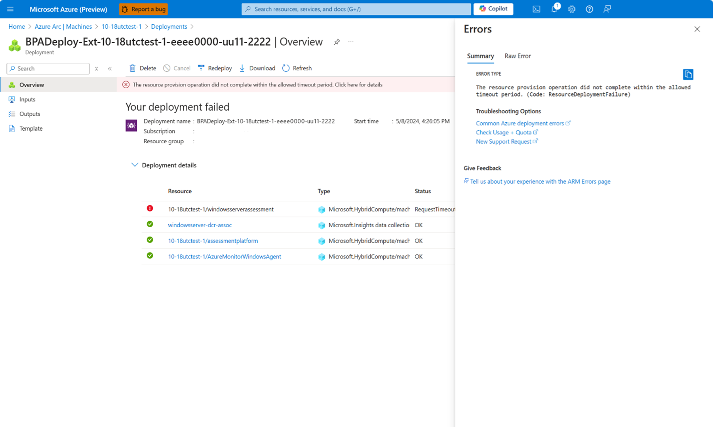
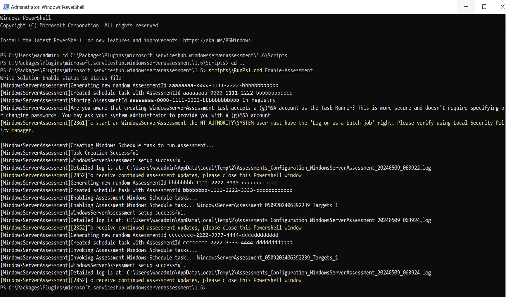

# Configure Best Practices Assessment for Arc-enabled Windows servers

The Best Practices Assessment tool continually scans your Windows Server to evaluate its configurations against Windows best practices. These assessments can be scheduled to run automatically or initiated manually as needed. The assessment evaluates several aspects of the Server environment, including server baselines, server security, Hyper-V, failover clusters, and Internet Information Services (IIS). It also collects and analyzes server data to generate a list of issues that require remediation guidance and best practices for improving the performance of your server infrastructure, including deploying applications, software updates, and operating systems.

The Best Practices Assessment tool installs the following three extensions on your device:

- **Assessment Platform** - Deploys the Best Practices Assessment platform onto your machine. This extension serves as the platform for future development as new best practices assessment scenarios are introduced.

- **Windows Server Assessment** - Contains all the necessary information about the validation checks that need to be run on your device to provide you with the recommendations you see in the Azure portal. Once the assessment is complete, the results are saved to a local log file.

- **Azure Monitor Agent (AMA)** - Collects and uploads the log file to your log analytics workspace in the cloud, providing you with all the information in the Azure portal. Workbooks are used to visualize the results and provide you with an easier reading experience.

> [!NOTE]
>
> - Best Practices Assessment tool handles security by running all checks locally on your server. The results are only uploaded to your designated Azure storage account, ensuring that everything happens within the context of your account.
>
> - The Best Practices Assessment tool has to be installed on every server you desire to run it on.
>
> - Installing the required extensions on an Arc server via PowerShell isn't currently supported.

## Prerequisites

- Your device must be running an Arc-enabled on-premises Windows Server 2016 or later operating system with a minimum of 4 GB of memory.
- If you’re new to Azure Arc, your device must be onboarded. To learn more, see [Quickstart: Connect hybrid machines with Azure Arc-enabled servers](/azure/azure-arc/servers/learn/quick-enable-hybrid-vm).
- You must use [Windows Server Pay-as-you-go](../../get-started/windows-server-pay-as-you-go.md) or [Software Assurance](/azure/azure-arc/servers/windows-server-management-overview) license types.

### Deploy Best Practices Assessment

To deploy Best Practices Assessment, perform the following steps:

1. Navigate to the [Azure portal](https://portal.azure.com/), then select your Windows server Arc-enabled device.
  
   > [!NOTE]
   > During the public preview phase, be aware that this functionality can only be accessed in the public cloud.

1. Navigate to a Windows Server 2016 or later Arc-enabled Windows Server resource. This virtual machine (VM) should be the Hyper-V host.
1. In the left pane, navigate to **Windows management**, then select **Best Practices Assessment (preview)**.

   [ ](../media/azure-arc/azure-arc-best-practices-assessment-tool.png#lightbox)

1. Select **Get Started** to access the **Best practices assessment configuration**.
1. Provide the **Resource group** and **Log Analytics Workspace** where results of the assessment are saved and then select **Set up**. Reminder that charges apply for the data that is stored in your log analytics workspace.

   [ ](../media/azure-arc/azure-arc-best-practices-assessment-configuration.png#lightbox)

   > [!NOTE]
   > Installation times vary and might take up to 15 minutes. You can refresh the status by selecting the **Refresh** button on this page.

1. Once deployment is complete, select **Go to resource**, select **Best Practices Assessment (preview)**, and then select **Run assessment** at the top of the page.

Running the assessment for the first time takes upward to 4 hours for the assessment to run and provide results.

   [ ](../media/azure-arc/azure-arc-best-practices-assessment-recommendation.png#lightbox)

Throughout the duration of the public preview, we're providing updates to enhance the experience. To update **Best Practices Assessment (preview)**, follow these steps:

1. Navigate to your resource.
1. In the left pane, expand **Settings** and select **Extensions**.
1. Select the **Update** button for any of the three available extensions:

   - `AzureMonitorWindowsAgent`
   - `assessmentplatform`
   - `windowsserverassessment`

   [ ](../media/azure-arc/azure-arc-best-practices-assessment-update-extensions.png#lightbox)

## Troubleshoot deployment

In the event where your deployment fails, the **Your deployment failed** notification is displayed.

[ ](../media/azure-arc/azure-arc-best-practices-assessment-error.png#lightbox)

If this error occurs, your extension needs to be reenabled. To correct this issue, follow these troubleshooting steps:

1. Navigate to your resource.
1. In the left pane, expand **Settings** and select **Extensions**.
1. In the **Name** column, where **windowsserverassessment** is displayed, follow this line to locate your version number under the **Version** row.
1. Remote into your server device and run the following command as admin:

   ```powershell
   cd C:\Packages\Plugics\microsoft.serviceshub.windowsserverassessment\<VersionNumber>

   scripts\\RunPs1.cmd Enable-Assessment
   ```

   Users should expect the following output when running this script:

   [ ](../media/azure-arc/azure-arc-best-practices-assessment-powershell-script.png#lightbox)

1. Once the script is complete, go to your Azure portal. Open your resource, select **Best Practices Assessment (preview)**, and then select **Run assessment**.

## Submit tooling feedback

To report app feedback for the best practices assessment tool or if other issues are encountered, let us know via the Feedback Hub. To learn more, see [Submit tooling feedback](azure-site-recovery-for-windows-server.md#submit-tooling-feedback). Under **Summarize your feedback**, type **Azure Arc BPA (preview)** and proceed with the remaining steps.

## See also

- [Configure Azure Site Recovery for Arc-enabled Windows servers](azure-site-recovery-for-windows-server.md)

- [Configure Remote Support for Arc-enabled Windows servers](remote-support-for-windows-server.md)

