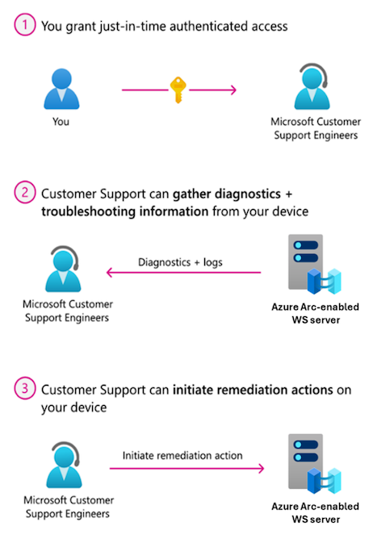
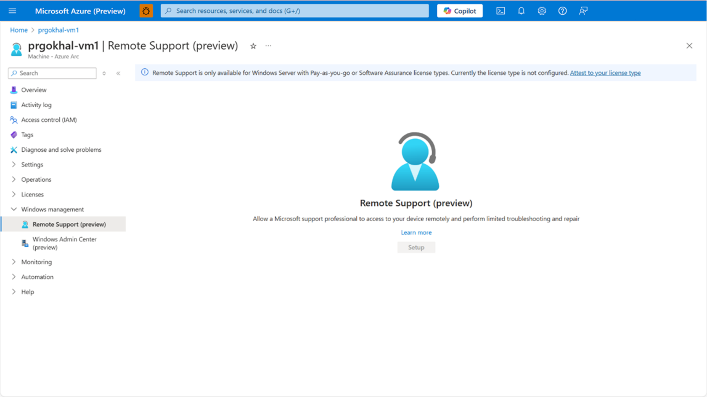
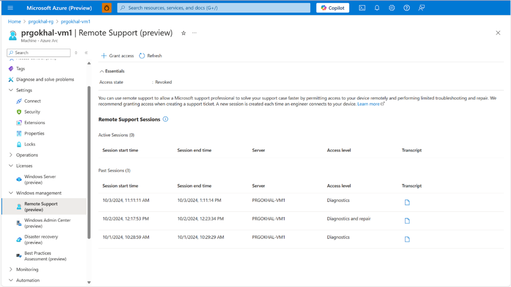
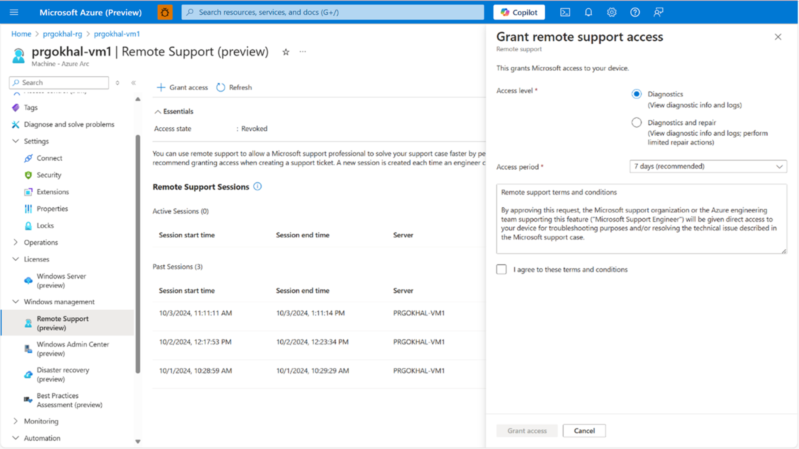
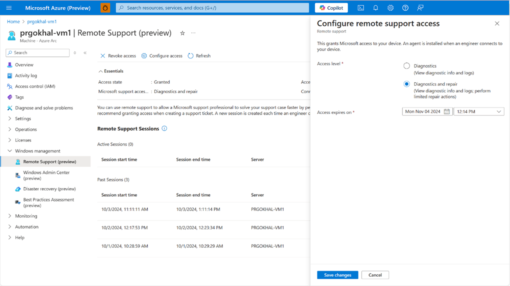
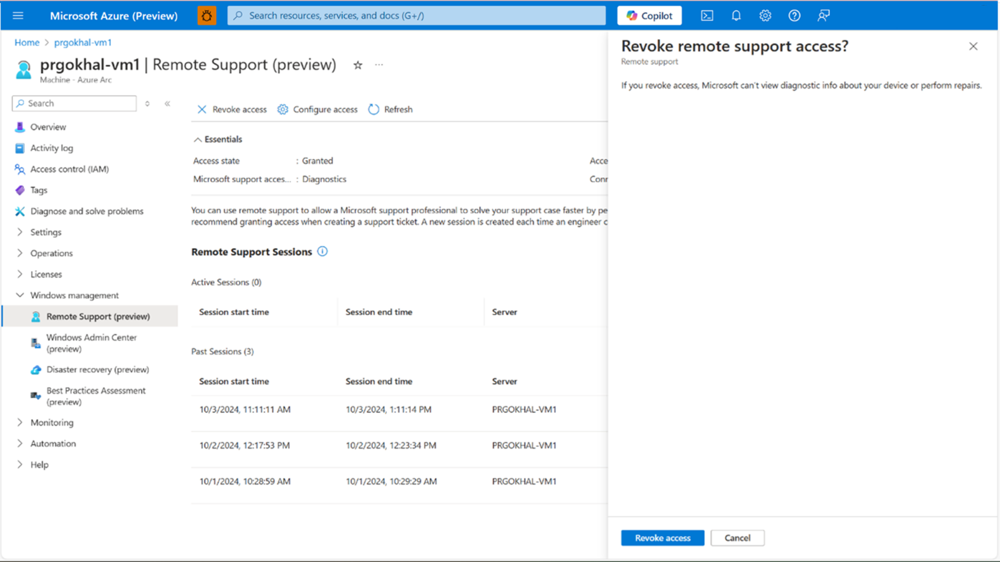

# Configure Remote Support for Arc-enabled Windows servers

By enabling Remote Support (preview), you allow a Microsoft Support professional to resolve your issue faster by accessing your device remotely for troubleshooting. You have complete control over the level of access that Microsoft support professionals have, the duration of access, and your consent is required to access your device. Microsoft support can only access your device after you submitted a support request. To learn how to create a request, see [Create an Azure support request](/azure/azure-portal/supportability/how-to-create-azure-support-request).

Once remote support is activated, Microsoft Support gains temporary access to your device. Access is made through a secure, audited, and compliant channel that uses HTTPS over port 443 with TLS 1.2 encrypted traffic. The actions Microsoft support professionals can perform are limited to what you allow, using [Just Enough Administration](/powershell/scripting/security/remoting/jea/overview) (JEA). This process involves authenticated access between you and Microsoft support for diagnostics, troubleshooting, and remediation actions.

To streamline setup and improve support issue resolution, the remote support Arc extension can preinstall the remote support agent on all cluster nodes and configure scheduled tasks for JEA. The JEA workflow is as follows:

<p align="center">
</p>

## Prerequisites

- Your device must be running an Arc-enabled on-premises Windows Server 2016 or later operating system with a minimum of 4 GB of memory.
- If you’re new to Azure Arc, your device must be onboarded. To learn more, see [Quickstart: Connect hybrid machines with Azure Arc-enabled servers](/azure/azure-arc/servers/learn/quick-enable-hybrid-vm).
- You must use [Windows Server Pay-as-you-go](../../get-started/windows-server-pay-as-you-go.md) or [Software Assurance](/azure/azure-arc/servers/windows-server-management-overview) license types.

### Configure remote support

To configure remote support, perform the following steps:

1. Navigate to the [Azure portal](https://portal.azure.com/), then select your Windows server Arc-enabled device. This virtual machine (VM) should be the Hyper-V host.
1. In the left pane, navigate to **Windows management**, then select **Remote Support (preview)**.
1. On the **Remote Support (preview)** screen, select **Setup**.

   [ ](../media/azure-arc/azure-arc-remote-support.png#lightbox)

1. Once the setup completes, the **Remote Support Sessions** screen is displayed.

   [ ](../media/azure-arc/azure-arc-remote-support-sessions.png#lightnox)

1. To grant access for a remote support session, select **+ Grant access** at the top of the page.
1. Specify the **Access level** and **Access period** for your session.

   [ ](../media/azure-arc/azure-arc-remote-support-grant-remote-support-access.png#lightbox)

1. Read the terms and conditions before selecting the **I agree to these terms and conditions** checkbox, then select **Grant access**.

## Configure remote support access

Users can also edit the level of access and duration at any time. To make these changes post-configuration, follow these steps:

1. In the left pane, navigate to **Windows management**, then select **Remote Support (preview)**.
1. Select **Configure access** at the top of the page.

   [ ](../media/azure-arc/azure-arc-remote-support-configure-remote-support-access.png#lightbox)

1. Once modifications are made, select **Save changes**.

## Revoke remote support access

If remote support access is no longer needed, users can elect to revoke access at any time. To revoke access, follow these steps:

1. In the left pane, navigate to **Windows management**, then select **Remote Support (preview)**.
1. Select **Revoke access** at the top of the page, then select **Revoke access** on the **Revoke remote support access?** screen.

   [ ](../media/azure-arc/azure-arc-remote-support-revoke-remote-support-access.png#lightbox)

## Remote support terms and conditions

The following terms and conditions outline how data is handled during remote support sessions. Read them carefully before granting access.

```
By approving this request, the Microsoft support organization or the Azure engineering team
supporting this feature ("Microsoft Support Engineer") will be given direct access to your device
for troubleshooting purposes and/or resolving the technical issue described in the Microsoft
support case.

During a remote support session, a Microsoft Support Engineer may need to collect logs. By enabling
remote support, you have agreed to a diagnostics log collection by a Microsoft Support Engineer to
address a support case. You also acknowledge and consent to the upload and retention of those logs
in an Azure storage account managed and controlled by Microsoft. These logs may be accessed by
Microsoft in the context of a support case and to improve the health of Windows Server.

The data will be used only to troubleshoot failures that are subject to a support ticket, and will
not be used for marketing, advertising, or any other commercial purposes without your consent. The
data may be retained for up to ninety (90) days and will be handled following our standard privacy
practices.

Any data previously collected with your consent will not be affected by the revocation of your
permission.
```

For more information about how Microsoft processes personal data, including what data is processed and for what purposes, see the [Microsoft Privacy Statement](https://www.microsoft.com/privacy/privacystatement).

## See also

- [Configure Azure Site Recovery for Arc-enabled Windows servers](azure-site-recovery-for-windows-server.md)

- [Configure Best Practices Assessment for Arc-enabled Windows servers](best-practices-assessment-for-windows-server.md)

