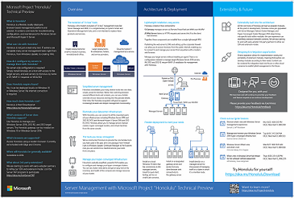

# Windows Admin Center

Welcome to **Windows Admin Center**!  

**Windows Admin Center** is an evolution of Windows Server in-box management tools; it’s a single pane of glass, consolidating all aspects of local and remote server management. As a locally deployed, browser-based management experience, an Internet connection and Azure aren’t required.  **Windows Admin Center** supports scenarios where customers need full control of all aspects of their deployment, including private networks which aren’t Internet-connected.

> ## **Project Honolulu** is now **Windows Admin Center**! View our [launch page here](windows-admin-center.md).

<table>
    <tr></tr>
    <tr>
        <td style="vertical-align: top;">
            <h2>Understand</h2>
            <ul>
            <li>Get Started 
            <li><a href="understand/what-is.md">What is <b>Windows Admin Center</b>?</a>
            <li><a href="understand/capabilities.md">Capabilities</a>
            <li><a href="understand/faq.md">FAQ</a>
            <li><a href="understand/case-studies.md">Case studies</a>
            <li><a href="understand/related-management.md">Related management products</a>
            <li><a href="understand/videos.md">Videos</a>
            </ul>
        </td>
        <td style="vertical-align: top;">
            <h2>Plan</h2>
            <ul>
            <li><a href="plan/installation-options.md">What type of installation is right for you?</a>
            <li><a href="plan/user-access-options.md">User access options</a>
            <li><a href="plan/securing.md">Securing your environment</a>
            <li><a href="plan/making-accessible.md">Making accessible from anywhere</a>
            <li><a href="plan/high-availability.md">Redundancy with High Availability</a>
            <li><a href="plan/azure-integration.md">What Azure integration options are there?</a>
             
            </ul>
        </td>
    </tr>
    <tr>
        <td style="vertical-align: top;">
            <h2>Deploy</h2>
            <ul>
            <li><a href="deploy/pre-installation.md">Pre-installation tasks</a>
            <li><a href="deploy/install.md">Install <b>Windows Admin Center</b></a>
            <li><a href="deploy/high-availability.md">High Availability</a>
         </ul>
        </td>
        <td style="vertical-align: top;">
            <h2>Configure</h2>
            <ul>
            <li><a href="configure/user-access-control.md">User Access Control and Permissions</a>
            <li><a href="configure/logging.md">Logging</a>
            <li><a href="configure/extensions.md">Extensions</a>
            <li><a href="configure/azure-integration.md">Configuring Azure integration</a>
            </ul>
        </td>
    </tr>
    <tr>
        <td style="vertical-align: top;">
            <h2>Use</h2>
            <ul>
            <li><a href="use/launch.md">Launch <b>Windows Admin Center</b></a>
            <li><a href="use/manage-servers.md">Manage servers</a>
            <li><a href="use/manage-hyper-converged.md">Manage Hyper-Converged Infrastructure</a>
            <li><a href="use/manage_failover-clusters.md">Manage Failover Clusters</a>
            <li><a href="use/troubleshooting.md">Common troubleshooting steps</a>
            <li><a href="use/known-issues.md">Known issues</a>
            </ul>
        </td>
        <td style="vertical-align: top;">
            <h2>Extend</h2>
            <ul>
            <li><a href="extend/how-sdk-works.md">How Extensibility and SDK works</a>
            <li><a href="extend/use-sdk.md">Download and Install SDK</a>
            </ul>
        </td>
    </tr>

</table>

# Get Started

[Content goes here.]

# Videos

[Video content here.]

[TODO:legacy-content-begin]

## Download the Project Honolulu Ignite poster

[TODO:legacy-content-end]

# Latest features

[Latest features list here.]
- Feature 1
- Feature 2 
- Feature 3

# Links

[Team blog, twitter, insiders, etc.]