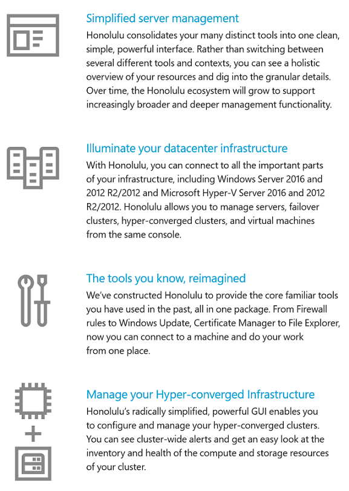

# What is Windows Admin Center?

<b>Windows Admin Center</b> is a locally deployed, browser-based, management tool set that enables on-premises administration of Windows Servers with no Azure or cloud dependency. Windows Admin Center gives IT Admins full control over all aspects of their Server infrastructure, and is particularly useful for management on private networks that are not connected to the Internet.

Windows Admin Center is the modern evolution of "in-box" management tools, like Server Manager and MMC. It is complementary to System Center and Operations Management Suite, and is not intended to replace these products and services.

## How does Windows Admin Center work?

Windows Admin Center runs in a web browser, and manages Windows Server 2016, Windows Server 2012 R2, and Windows Server 2012 nodes through the <b>Windows Admin Center gateway</b> that can be installed on Windows Server 2016 or Windows 10. The gateway manages servers via Remote PowerShell and WMI over WinRM.  The gateway is included with Windows Admin Center in a single lightweight .msi package that you can download from this link: [https://aka.ms/HonoluluDownload](https://aka.ms/HonoluluDownload)

Publishing the gateway web server to DNS, and configuring any corresponding corporate firewalls to make the web server visible, can allow you to access Windows Admin Center from the public internet, enabling you to connect to, and manage, your servers from anywhere with Microsoft Edge or Google Chrome (note, compatibility with other modern browsers has not been evaluated at this time).

## What does Windows Admin Center do?

